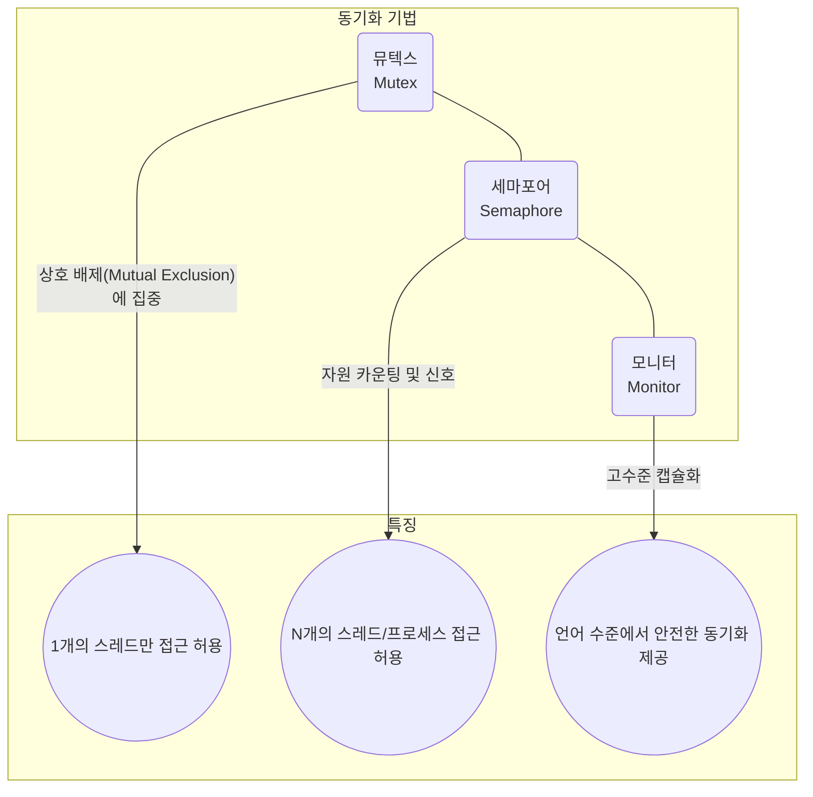

# 동시성 & 동기화 (뮤텍스, 세마포어, 모니터, Python GIL)

## 1. 핵심 개념 (Core Concept)

\*\*동시성(Concurrency)\*\*은 여러 작업을 동시에 실행하는 것처럼 보이게 하는 논리적인 개념으로, 싱글 코어에서도 여러 스레드를 번갈아 실행하며 달성할 수 있습니다. 이러한 동시성 환경에서 여러 스레드나 프로세스가 공유 자원(Shared Resource)에 동시에 접근하여 발생하는 \*\*경쟁 상태(Race Condition)\*\*와 같은 문제를 해결하고, 작업의 순서를 제어하여 데이터의 일관성을 보장하는 과정을 \*\*동기화(Synchronization)\*\*라고 합니다.

______________________________________________________________________

## 2. 상세 설명 (Detailed Explanation)

### 2.1 동기화 기법: 뮤텍스, 세마포어, 모니터

운영체제는 여러 동기화 도구를 제공하여 안전한 동시성 프로그래밍을 지원합니다.



#### 가. 뮤텍스 (Mutex)

뮤텍스(Mutual Exclusion)는 이름 그대로 **상호 배제**를 위한 동기화 기법입니다. 오직 하나의 스레드만이 공유 자원에 접근할 수 있도록 `lock`과 `unlock` 연산을 사용합니다.

- **작동 원리**: 임계 구역(Critical Section)에 들어가기 전에 스레드는 `lock`을 획득해야 합니다. 만약 다른 스레드가 이미 `lock`을 가지고 있다면, 해당 스레드가 `unlock`할 때까지 대기해야 합니다. 중요한 특징은 **`lock`을 획득한 스레드만이 `unlock`할 수 있다**는 점입니다.
- **소유권**: `lock`을 획득한 스레드가 소유권을 가집니다.

#### 나. 세마포어 (Semaphore)

세마포어는 지정된 개수만큼의 스레드/프로세스가 공유 자원에 접근할 수 있도록 허용하는 카운팅 기반의 동기화 기법입니다.

- **작동 원리**: 세마포어는 정수 값을 가지는 카운터와 두 개의 원자적 연산 `wait()`(P 연산)와 `signal()`(V 연산)으로 구성됩니다.
  - `wait()`: 스레드가 임계 구역에 진입할 때 호출. 세마포어 카운터를 1 감소시킵니다. 만약 카운터가 0 이하면, 0보다 커질 때까지 대기합니다.
  - `signal()`: 스레드가 임계 구역에서 나올 때 호출. 세마포어 카운터를 1 증가시키고, 대기 중인 스레드가 있다면 깨웁니다.
- **종류**:
  - **바이너리 세마포어 (Binary Semaphore)**: 카운터 값이 0과 1만 가질 수 있어 뮤텍스와 유사하게 동작합니다. 하지만 뮤텍스와 달리 `lock`을 획득한 스레드가 아니어도 `unlock`(signal)이 가능합니다.
  - **카운팅 세마포어 (Counting Semaphore)**: 여러 개의 값을 가질 수 있어, 여러 스레드가 동시에 자원에 접근해야 하는 상황(예: 데이터베이스 커넥션 풀)에 유용합니다.

#### 다. 모니터 (Monitor)

모니터는 뮤텍스와 세마포어의 단점을 보완하기 위해 등장한 고수준 동기화 추상화 기법입니다. 프로그래밍 언어 차원에서 제공되어 개발자가 더 쉽고 안전하게 동기화를 구현할 수 있도록 돕습니다.

- **작동 원리**: 공유 자원과 해당 자원에 대한 연산(프로시저)들을 하나의 객체로 캡슐화하고, 모니터 내의 코드에는 한 번에 하나의 스레드만 진입할 수 있도록 보장합니다.
- **조건 변수 (Condition Variables)**: 모니터는 `wait()`, `signal()` (또는 `notify()`), `broadcast()` (또는 `notifyAll()`) 같은 조건 변수를 제공하여, 특정 조건이 만족될 때까지 스레드를 대기시키거나, 대기 중인 스레드를 깨우는 등 복잡한 동기화 시나리오를 쉽게 구현할 수 있습니다. Java의 `synchronized` 키워드와 `wait()`, `notify()`가 대표적인 예입니다.

### 2.2 동기화 기법 비교

| 구분               | 뮤텍스 (Mutex)                            | 세마포어 (Semaphore)               | 모니터 (Monitor)                     |
| :----------------- | :---------------------------------------- | :--------------------------------- | :----------------------------------- |
| **핵심**           | 상호 배제 (Locking)                       | 자원 카운팅 (Signaling)            | 캡슐화 및 조건 변수                  |
| **동기화 대상 수** | 1개                                       | 1개 이상 (카운터 값 만큼)          | 1개 (모니터 내부)                    |
| **소유권**         | **있음** (Lock 획득한 스레드만 해제 가능) | **없음** (다른 스레드가 해제 가능) | 내부적으로 처리 (소유권 개념 없음)   |
| **구현 수준**      | OS 또는 라이브러리                        | OS 또는 라이브러리                 | 로그래밍 언어                        |
| **주요 사용처**    | 임계 구역 보호                            | 자원 풀 관리, 생산자-소비자 문제   | 스레드 간 안전한 데이터 공유 및 협력 |

### 2.3 Python의 GIL (Global Interpreter Lock)

파이썬(CPython)의 \*\*전역 인터프리터 락(GIL)\*\*은 한 번에 단 하나의 스레드만이 파이썬 바이트코드를 실행할 수 있도록 제한하는 뮤텍스입니다. 이는 CPython의 메모리 관리가 스레드로부터 안전(thread-safe)하지 않기 때문에, 여러 스레드가 동시에 파이썬 객체에 접근하여 발생할 수 있는 문제를 원천적으로 방지하기 위해 도입되었습니다.

- **동작 방식**: 파이썬의 멀티스레딩은 시분할 방식으로 동작합니다. 한 스레드가 일정 시간 동안 실행되거나 I/O 작업(네트워크 통신, 파일 입출력 등)으로 대기 상태에 들어가면 GIL을 해제하고, 다른 스레드가 GIL을 획득하여 실행되는 방식입니다.
- **영향**:
  - **CPU-Bound 작업**: 계산 집약적인 작업에서는 여러 스레드를 사용해도 GIL 때문에 병렬 실행이 불가능하여 성능 향상을 기대하기 어렵습니다.
  - **I/O-Bound 작업**: I/O 대기 시간에 GIL을 해제하므로, 다른 스레드가 그 시간에 작업을 수행할 수 있어 멀티스레딩의 효과를 볼 수 있습니다.
- **우회 방법**: 진정한 병렬 처리를 위해서는 멀티스레딩 대신 \*\*멀티프로세싱(`multiprocessing`)\*\*을 사용해야 합니다.

______________________________________________________________________

## 3. 예시 (Example)

### 코드 예시 (Python)

#### 뮤텍스 (`Lock`) 예시

```python
import threading

# 공유 자원
shared_resource = 0
# 뮤텍스 생성
lock = threading.Lock()

def increment():
    global shared_resource
    for _ in range(1_000_000):
        lock.acquire()  # Lock 획득
        try:
            shared_resource += 1
        finally:
            lock.release() # Lock 해제

threads = [threading.Thread(target=increment) for _ in range(2)]
for t in threads:
    t.start()
for t in threads:
    t.join()

print(f"Shared resource value: {shared_resource}") # 예상 결과: 2000000
```

#### 세마포어 (`Semaphore`) 예시

```python
import threading
import time

# 최대 3개의 스레드만 동시에 접근 허용
semaphore = threading.Semaphore(3)

def access_resource(thread_id):
    print(f"Thread {thread_id} is trying to access the resource.")
    with semaphore: # 세마포어 획득 (wait)
        print(f"Thread {thread_id} has acquired the semaphore.")
        time.sleep(2)
        print(f"Thread {thread_id} is releasing the semaphore.")
    # `with` 블록을 나가면서 자동으로 세마포어 해제 (signal)

threads = [threading.Thread(target=access_resource, args=(i,)) for i in range(5)]
for t in threads:
    t.start()
for t in threads:
    t.join()
```

### 사용 사례 (Use Case)

- **뮤텍스**: 은행 계좌 입출금과 같이 단 하나의 실행 단위만 허용되어야 하는 작업에서 데이터의 무결성을 보장하기 위해 사용됩니다.
- **세마포어**: 웹 서버가 동시에 처리할 수 있는 요청의 수를 제한하거나, 데이터베이스 커넥션 풀에서 사용 가능한 커넥션 수를 제어하는 데 사용됩니다.
- **모니터**: Java에서 `synchronized` 블록을 사용하여 스레드-세이프한 컬렉션을 만들거나, 스레드 간의 작업 흐름을 조율할 때 사용됩니다.

______________________________________________________________________

## 4. 예상 면접 질문 (Potential Interview Questions)

- **Q. 뮤텍스와 세마포어의 가장 큰 차이점은 무엇인가요?**

  - **A.** 가장 큰 차이점은 **동기화 대상의 수**와 **소유권**입니다. 뮤텍스는 오직 하나의 스레드만 동기화하며, `lock`을 획득한 스레드만이 `unlock`할 수 있는 소유권 개념이 있습니다. 반면 세마포어는 여러 스레드를 동기화할 수 있으며, `wait()`으로 자원을 획득한 스레드가 아니어도 `signal()`을 통해 자원을 해제할 수 있는 소유권 개념이 없습니다.

- **Q. Python의 GIL은 왜 존재하며, 멀티스레딩이 항상 성능 향상으로 이어지지 않는 이유는 무엇인가요?**

  - **A.** GIL은 CPython의 스레드-세이프하지 않은 메모리 관리를 보호하기 위해 도입된 뮤텍스입니다. 이로 인해 한 번에 하나의 스레드만 파이썬 바이트코드를 실행할 수 있습니다. 따라서, 계산 위주의 CPU-Bound 작업에서는 여러 스레드를 생성해도 동시에 실행되지 못하고 오히려 스레드 간 문맥 교환 비용으로 성능이 저하될 수 있습니다. 반면, I/O-Bound 작업에서는 I/O 대기 동안 다른 스레드가 실행될 수 있어 성능 향상을 기대할 수 있습니다.

- **Q. 바이너리 세마포어와 뮤텍스는 거의 동일해 보이는데, 어떤 차이가 있나요?**

  - **A.** 둘 다 하나의 접근만 허용한다는 점에서 비슷하지만, 핵심적인 차이는 **소유권**에 있습니다. 뮤텍스는 `lock`을 건 스레드만이 `unlock`할 수 있습니다. 하지만 바이너리 세마포어는 `wait()` 호출로 자원을 점유한 스레드가 아니더라도 다른 스레드가 `signal()`을 호출하여 자원을 해제하는 것이 가능합니다. 이 특성 때문에 뮤텍스는 상호 배제에, 세마포어는 실행 순서 제어와 같은 신호(Signaling) 메커니즘에 더 적합합니다.

______________________________________________________________________

## 5. 더 읽어보기 (Further Reading)

- [Python `threading` — Thread-based parallelism (Official Docs)](https://docs.python.org/3/library/threading.html)
- [Operating Systems: Three Easy Pieces (Concurrency Chapters)](https://pages.cs.wisc.edu/~remzi/OSTEP/)
- [Real Python: What Is the Python Global Interpreter Lock (GIL)?](https://realpython.com/python-gil/)
