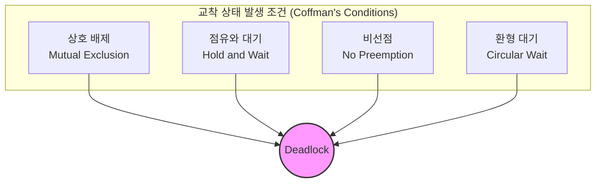

# 교착 상태 (Coffman 조건, 예방·회피·복구)

## 1. 핵심 개념 (Core Concept)

**교착 상태(Deadlock)**란 두 개 이상의 프로세스(또는 스레드)가 각자 점유한 자원을 놓지 않으면서, 서로 상대방이 점유한 자원을 무한정 기다리는 상태를 의미합니다. 이로 인해 관련된 모든 프로세스의 진행이 멈추게 되어 시스템 전체에 심각한 문제를 유발할 수 있습니다. 교착 상태는 특정 조건들이 동시에 만족될 때 발생하며, 이를 해결하기 위한 다양한 전략이 존재합니다.

---

## 2. 상세 설명 (Detailed Explanation)

### 2.1 교착 상태의 4가지 발생 조건 (Coffman's Conditions)

교착 상태는 아래의 네 가지 조건이 **모두** 충족될 때 발생할 수 있습니다. 이 중 하나라도 만족되지 않으면 교착 상태는 발생하지 않습니다.



1.  **상호 배제 (Mutual Exclusion)**: 한 번에 하나의 프로세스만 자원을 사용할 수 있습니다. 즉, 자원은 공유될 수 없습니다.
2.  **점유와 대기 (Hold and Wait)**: 프로세스가 최소한 하나의 자원을 점유한 상태에서, 다른 프로세스가 점유한 자원을 추가로 요청하며 대기합니다.
3.  **비선점 (No Preemption)**: 한 프로세스에 할당된 자원은 사용이 끝날 때까지 강제로 빼앗을 수 없습니다. 자원을 점유한 프로세스가 스스로 해제해야만 다른 프로세스가 사용할 수 있습니다.
4.  **환형 대기 (Circular Wait)**: 프로세스들이 원형으로 서로의 자원을 기다리는 상태입니다. 예를 들어, P1은 P2의 자원을, P2는 P3의 자원을, P3는 P1의 자원을 기다리는 형태의 대기 사슬이 형성됩니다.

### 2.2 교착 상태 해결 방법

교착 상태를 다루는 방법은 크게 **예방**, **회피**, **탐   및 회복**의 세 가지로 나눌 수 있으며, 대부분의 현대 OS가 채택하는 **무시** 전략도 있습니다.

| 전략 | 설명 | 장점 | 단점 |
| :--- | :--- | :--- | :--- |
| **예방 (Prevention)** | 4가지 발생 조건 중 하나를 제거하여 교착 상태를 원천적으로 차단 | 교착 상태 발생 가능성 없음 | 자원 효율성 저하, 시스템 성능 감소, 구현의 어려움 |
| **회피 (Avoidance)** | 자원 할당 시 시스템이 항상 **안전 상태(Safe State)**를 유지하도록 하여 교착 상태를 피함 | 예방보다 덜 제약적, 자원 효율성 높음 | 최대 자원 요구량 등 사전 정보 필요, 계산 오버헤드 큼 |
| **탐지 및 회복 (Detection & Recovery)** | 교착 상태 발생을 허용하되, 주기적으로 탐지하여 해결 | 자원 효율성 높고, 실용적 | 탐지 알고리즘의 오버헤드, 회복 과정이 복잡하고 비용이 큼 |
| **무시 (Ignorance)** | 교착 상태가 드물게 발생한다고 가정하고 특별한 조치를 취하지 않음 | 오버헤드 없음 | 교착 상태 발생 시 시스템 재부팅 등 수동 개입 필요 |

#### 가. 교착 상태 예방 (Prevention)

*   **상호 배제 부정**: 모든 자원을 공유 가능하게 만들지만, 프린터처럼 본질적으로 공유 불가능한 자원이 있어 현실적으로 어렵습니다.
*   **점유와 대기 부정**: 프로세스 시작 시 모든 자원을 할당하거나, 자원이 없을 때만 요청하게 합니다. 자원 활용률이 떨어지고 기아(Starvation) 상태를 유발할 수 있습니다.
*   **비선점 부정**: 다른 프로세스의 자원을 강제로 빼앗을 수 있게 합니다. 상태를 저장하고 복원하는 과정이 복잡합니다.
*   **환형 대기 부정**: 모든 자원에 고유 번호를 부여하고, 번호 순서대로만 자원을 요청하도록 강제합니다. 자원 할당의 유연성을 해치고 비효율적일 수 있습니다.

#### 나. 교착 상태 회피 (Avoidance)

가장 대표적인 알고리즘은 **은행원 알고리즘(Banker's Algorithm)**입니다.
프로세스가 자원을 요청할 때, 시스템은 해당 요청을 수락했을 경우에도 시스템이 **안전 상태(Safe State)**로 남아있을지 계산합니다. 안전 상태란, 모든 프로세스가 정상적으로 종료될 수 있는 실행 순서(Safe Sequence)가 존재하는 상태를 의미합니다. 요청 후에도 안전 상태가 보장되면 자원을 할당하고, 그렇지 않으면(불안전 상태가 되면) 요청을 거부하고 프로세스를 대기시킵니다.

#### 다. 교착 상태 탐지 및 회복 (Detection & Recovery)

*   **탐지**: 자원 할당 그래프(Resource Allocation Graph)를 사용하여 사이클이 있는지 주기적으로 검사합니다. 사이클의 존재가 곧 교착 상태를 의미합니다.
*   **회복**: 교착 상태가 탐지되면 시스템을 정상 상태로 되돌립니다.
    *   **프로세스 종료**: 교착 상태에 연관된 프로세스를 하나 또는 전부 종료합니다.
    *   **자원 선점**: 교착 상태 프로세스로부터 자원을 강제로 빼앗아 다른 프로세스에 할당합니다. 이때, 어떤 프로세스를 희생(victim)시킬지 결정하는 비용이 발생하며, 프로세스를 이전 상태로 되돌리는(rollback) 작업이 필요할 수 있습니다.

---

## 3. 예시 (Example)

### 교착 상태 시나리오 (철학자들의 만찬 문제)

5명의 철학자가 원형 식탁에 앉아 있고, 각 철학자의 양옆에는 포크가 하나씩 놓여 있습니다. 식사를 하려면 양쪽의 포크를 모두 집어야 합니다.

1.  모든 철학자가 동시에 왼쪽 포크를 집습니다. (**점유와 대기**)
2.  이제 모든 철학자는 오른쪽 포크를 집으려고 하지만, 이미 옆 철학자가 집어간 상태입니다.
3.  아무도 자신의 포크를 내려놓지 않고, 영원히 오른쪽 포크를 기다리게 됩니다. (**환형 대기**)

```python
import threading
import time

# 5개의 포크 (자원)
forks = [threading.Lock() for _ in range(5)]

def philosopher(id):
    left_fork = forks[id]
    right_fork = forks[(id + 1) % 5]

    while True:
        print(f"Philosopher {id} is thinking.")
        time.sleep(1)

        print(f"Philosopher {id} is hungry and tries to pick up forks.")
        
        # 교착 상태 발생 가능 지점
        left_fork.acquire()
        print(f"Philosopher {id} picked up left fork.")
        time.sleep(0.1) # 다른 스레드가 실행될 기회를 주기 위함
        
        right_fork.acquire()
        print(f"Philosopher {id} picked up right fork and is eating.")
        time.sleep(2)

        # 식사 끝, 포크 내려놓기
        left_fork.release()
        right_fork.release()
        print(f"Philosopher {id} finished eating and put down forks.")

# 5명의 철학자 스레드 생성
threads = [threading.Thread(target=philosopher, args=(i,)) for i in range(5)]

# 교착 상태 해결을 위해 이 코드는 실행하지 않음 (무한 루프)
# for t in threads:
#     t.start()
```
*위 코드는 모든 철학자가 왼쪽 포크를 먼저 집도록 설계되어 높은 확률로 교착 상태에 빠집니다.*

---

## 4. 예상 면접 질문 (Potential Interview Questions)

*   **Q. 교착 상태의 4가   발생 조건은 무엇이며, 이들이 어떻게 상호작용하여 교착 상태를 유발하는지 설명해주세요.**
    *   **A.** 교착 상태는 상호 배제, 점유와 대기, 비선점, 환형 대기의 네 가지 조건이 모두 충족될 때 발생합니다. 예를 들어, 두 프로세스 P1, P2와 두 자원 R1, R2가 있을 때, (상호 배제) R1과 R2는 한 번에 하나만 사용 가능합니다. P1이 R1을, P2가 R2를 각각 점유한 상태에서 (점유와 대기), P1은 R2를, P2는 R1을 추가로 요청합니다. 이때 (비선점) 서로의 자원을 뺏을 수 없으므로, P1은 P2를, P2는 P1을 기다리는 (환형 대기) 상태가 되어 교착 상태에 빠집니다.

*   **Q. 교착 상태 예방(Prevention)과 회피(Avoidance)의 차이점은 무엇인가요?**
    *   **A.** 예방은 교착 상태의 4가지 조건 중 하나를 시스템 설계 단계에서부터 원천적으로 제거하여 교착 상태가 절대 발생하지 않도록 하는 소극적이고 정적인 방법입니다. 반면, 회피는 교착 상태가 발생할 가능성을 인정하고, 자원 할당 시마다 시스템이 안전 상태를 유지하는지 동적으로 검사하여 교착 상태를 피해가는 좀 더 유연한 방법입니다.

*   **Q. 대부분의 현대 운영체제(Linux, Windows 등)는 교착 상태를 어떻게 처리하나요?**
    *   **A.** 대부분의 현대 OS는 '타조 알고리즘'이라고도 불리는 **무시(Ignorance)** 전략을 사용합니다. 교착 상태 예방이나 회피에 드는 성능 오버헤드가 교착 상태가 실제로 발생하여 생기는 손실보다 크다고 보기 때문입니다. 교착 상태는 드물게 발생한다고 가정하며, 만약 발생하면 시스템을 재부팅하는 방식으로 해결하는 것을 사용자의 몫으로 남겨둡니다.

---

## 5. 더 읽어보기 (Further Reading)

*   [Silberschatz, Galvin, Gagne, "Operating System Concepts" (The "Dinosaur Book")](https://www.os-book.com/OS10/)
*   [은행원 알고리즘 (위키백과)](https://ko.wikipedia.org/wiki/%EC%9D%80%ED%96%89%EC%9B%90_%EC%95%8C%EA%B3%A0%EB%A6%AC%EC%A6%98)
*   [철학자들의 만찬 문제 (위키백과)](https://ko.wikipedia.org/wiki/%EC%B2%A0%ED%95%99%EC%9E%90%EB%93%A4%EC%9D%98_%EB%A7%8C%EC%B0%AC_%EB%AC%B8%EC%A0%9C)