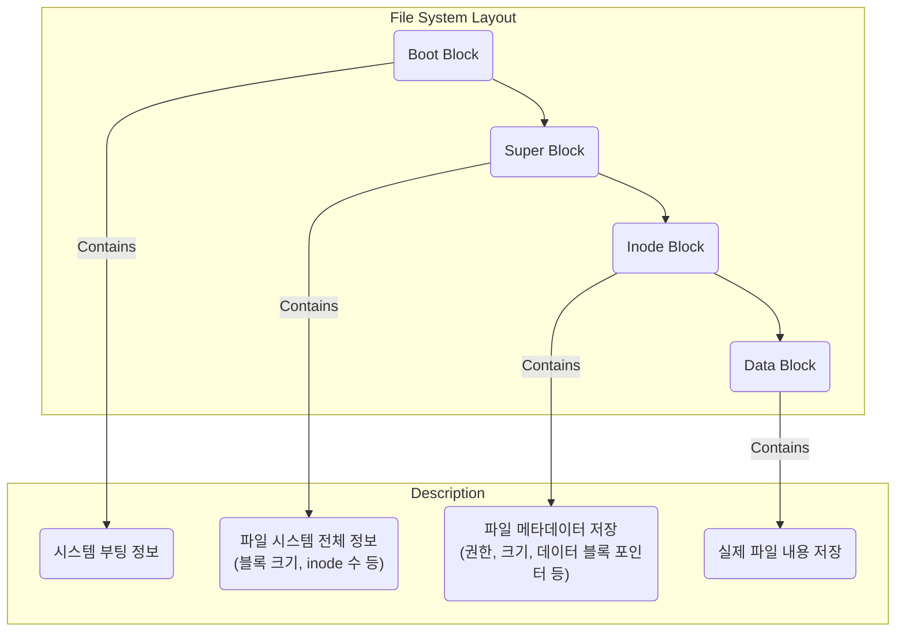

# 파일 시스템 & I/O (버퍼 캐시, 저널링)

## 1. 핵심 개념 (Core Concept)

\*\*파일 시스템(File System)\*\*은 운영체제가 저장 장치(HDD, SSD 등)에 있는 데이터를 관리하고 쉽게 접근할 수 있도록 하는 체계입니다. 사용자는 파일 시스템을 통해 파일을 생성, 조회, 수정, 삭제할 수 있습니다. \*\*버퍼 캐시(Buffer Cache)\*\*와 \*\*저널링(Journaling)\*\*은 각각 I/O 성능 향상과 시스템 안정성 확보를 위해 파일 시스템에서 사용되는 핵심 기술입니다.

______________________________________________________________________

## 2. 상세 설명 (Detailed Explanation)

### 2.1 파일 시스템 (File System)

파일 시스템은 물리적인 저장 장치의 데이터 블록들을 파일과 디렉터리라는 논리적인 단위로 구조화하여 관리합니다.

#### 주요 구성 요소 (UNIX 기반)

- **슈퍼 블록 (Super Block)**: 파일 시스템의 전체 상태 정보를 담고 있는 매우 중요한 영역입니다. 블록의 크기, 개수, inode 목록의 위치 등 파일 시스템을 유지하기 위한 핵심 정보를 가집니다.
- **아이노드 (Inode)**: `Index Node`의 약자로, 각 파일이나 디렉터리에 대한 모든 메타데이터를 저장합니다. 파일의 권한, 소유자, 크기, 생성 시간, 그리고 **실제 데이터가 저장된 데이터 블록의 주소**를 가리키는 포인터를 포함합니다.
- **데이터 블록 (Data Block)**: 파일의 실제 내용(데이터)이 저장되는 공간입니다.

사용자가 `/path/to/file.txt` 파일을 열 때, 파일 시스템    경로를 따라가며 각 디렉터리의 inode를 읽고, 최종적으로 `file.txt`의 inode를 찾아 데이터 블록에 접근합니다.

### 2.2 버퍼 캐시 (Buffer Cache)

버퍼 캐시는 디스크 I/O 성능을 향상시키기 위해 사용되는 메모리(RAM) 영역입니다. 디스크 접근은 메모리 접근보다 매우 느리기 때문에, 자주 사용되는 데이터를 메모리에 캐싱하여 I/O 속도를 높이는 원리입니다.

#### 동작 원리

- **읽기 (Read)**:

  1. 프로세스가 파일 읽기를 요청하면, OS는 먼저 데이터가 버퍼 캐시에 있는지 확인합니다.
  1. **Cache Hit**: 데이터가 캐시에 있으면, 디스크에 접근하지 않고 즉시 메모리에서 데이터를 읽어 프로세스에 전달합니다.
  1. **Cache Miss**: 데이터가 캐시에 없으면, 디스크에서 해당 데이터를 읽어와 버퍼 캐시에 저장한 후, 프로세스에 전달합니다. 다음에 동일한 데이터를 요청할 때는 캐시에서 빠르게 읽을 수 있습니다.

- **쓰기 (Write) - 지연 쓰기 (Delayed Write)**:

  1. 프로세스가 파일 쓰기를 요청하면, OS는 데이터를 디스크에 즉시 쓰지 않고 버퍼 캐시에만 기록한 후 쓰기 작업이 완료된 것처럼 응답합니다.
  1. 이후, OS는 버퍼 캐시의 변   된 내용(Dirty Page)을 모아서 주기적으로 또는 특정 조건(예: `sync` 명령어 호출, 시스템 종료)이 만족될 때 한 번에 디스크에 씁니다. 이를 통해 쓰기 작업의 횟수를 줄여 성능을 크게 향상시킵니다.

### 2.3 저널링 (Journaling)

저널링 파일 시스템(JFS)은 시스템 충돌이나 정전과 같은 예기치 않은 상황에서 파일 시스템의 \*\*무결성(Integrity)\*\*을 보장하고 빠른 복구를 지원하는 기술입니다.

#### 동작 원리

파일 시스템의 메타데이터나 데이터를 변경하기 전에, 변경 내용에 대한 로그를 \*\*저널(Journal)\*\*이라는 별도의 로그 영역에 먼저 기록합니다.

1. **저널링 (Journaling)**: "파일 A를 생성하고, 데이터 블록 X, Y에 쓸 것이다"와 같은 트랜잭션 내용을 저널에 기록합니다.
1. **체크포인팅/커밋 (Checkpointing/Commit)**: 저널 기록이 완료되면, 저널의 내용을 바탕으로 실제 파일 시스템의 메타데이터(inode)와 데이터 블록을 변경합니다.
1. **복구 (Recovery)**: 만약 2번 단계 도중 시스템이 다운되면, 재부팅 시 파일 시스템은 전체를 검사할 필요 없이 저널만 확인합니다. 저널에 기록은 되었지만 실제 반영은 되지 않은 트랜잭션을 찾아 \*\*재실행(redo)\*\*하거나 \*\*취소(undo)\*\*하여 파일 시스템을 빠르고 일관된 상태로 복구할 수 있습니다.

대표적인 저널링 파일 시스템으로는 Linux의 **ext3, ext4**, Windows의 **NTFS**, macOS의 **APFS** 등이 있습니다.

______________________________________________________________________

## 3. 예시 (Example)

### 파일 저장 과정 시나리오

`hello.txt` 파일에 "world"라는 내용을 저장하는 과정은 다음과 같습니다.

1. **저널 기록**: 저널링 파일 시스템은 먼저 저널에 다음과 같은 내용을 기록합니다.
   - "새로운 inode를 할당할 것"
   - "데이터 블록 하나를 할당할 것"
   - "할당된 데이터 블록에 'world'라고 쓸 것"
   - "디렉터리 엔트리에 'hello.txt'와 inode 번호를 추가할 것"
1. **실제 쓰기 (Commit)**: 저널 기록이 성공적으로 끝나면, 파일 시스템은 저널의 내용을 바탕으로 실제 inode 테이블과 데이터 블록을 수정합니다.
1. **시스템 다운**: 만약 2번 과정 중간에 전원이 나갔다고 가정해봅시다.
1. **복구**: 시스템이 재부팅되면, 파일 시스템은 저널을 확인합니다. 아직 완료되지 않은 트랜잭션이 있음을 발견하고, 해당 트랜잭션을 다시 실행하거나(redo) 롤백하여 파일 시스템의 일관성을 유지합니다. 저널링이 없다면, 파일은 생성되었지만 데이터는 없거나, 디렉터리 엔트리는 있지만 inode는 없는 등 파일 시스템이 깨진 상태로 남을 수 있습니다.

______________________________________________________________________

## 4. 예상 면접 질문 (Potential Interview Questions)

- **Q. 버퍼 캐시는 왜 사용하며, 특히 쓰기 작업에서 어떻게 성능을 향상시키나요?**

  - **A.** 버퍼 캐시는 물리적인 디스크와 CPU 사이의 속도 차이를 완화하기 위해 사용됩니다. 디스크 I/O는 매우 느린 작업이므로, 자주 접근하는 데이터를 메모리에 캐싱하여 성능을 높입니다. 특히 쓰기 작업에서는 '지연 쓰기(Delayed Write)' 방식을 사용하는데, 데이터를 디스크에 바로 쓰지 않고 메모리 버퍼에만 기록한 뒤 나중에 한꺼번에 디스크에 반영합니다. 이를 통해 디스크 쓰기 횟수를 크게 줄여 시스템 전반의 응답성과 성능을 향상시킵니다.

- **Q. 저널링 파일 시스템의 가장 큰 장점은 무엇이며, 어떤 원리로 동작하나요?**

  - **A.** 가장 큰 장점은 예기치 않은 시스템 다운 시 **빠른 복구**와 **데이터 무결성 보장**입니다. 저널링은 파일 시스템을 변경하기 전에, 수행할 작업의 내용을 '저널'이라는 로그에 먼저 기록합니다. 만약 작업 도중 시스템이 멈추면, 재부팅 시 전체 파일 시스템을 검사하는 대신 이 저널 로그만 보고 작업을 완료하거나(redo) 취소(undo)하여 파일 시스템을 신속하게 일관된 상태로 복구할 수 있습니다.

- **Q. 파일을 삭제했는데도 디스크 용량이 바로 늘어나지 않는 경험을 해본 적 있나요? 어떤 이유일까요?**

  - **A.** 이는 파일 시스템의 지연 쓰기(Delayed Write)와 관련이 있을 수 있습니다. 파일을 삭제하는 작업 역시 파일의 메타데이터(inode 정보, 디렉터리 엔트리 등)를 변경하는 쓰기 작업입니다. 이 변경 사항이 버퍼 캐시에만 반영되고 아직 실제 디스크에 기록되지 않았을 수 있습니다. OS가 내부 스케줄에 따라 캐시의 내용을 디스크에 반영(flush)하고 나면 비로소 디스크 용량이 업데이트될 것입니다. `sync` 명령어를 사용하면 캐시의 내용을 강제로 디스크에 쓰게 할 수 있습니다.

______________________________________________________________________

## 5. 더 읽어보기 (Further Reading)

- [File systems (MDN Web Docs)](https://developer.mozilla.org/en-US/docs/Glossary/File_system)
- [Journaling file system (Wikipedia)](https://en.wikipedia.org/wiki/Journaling_file_system)
- [Anatomy of a Linux File System (The Linux Documentation Project)](https://tldp.org/LDP/sag/html/filesystems.html)
