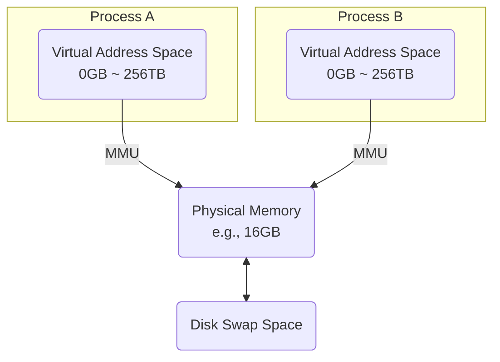

# 메모리 관리 (가상 메모리, 페이징, 세그멘테이션, 가비지 컬렉션)

## 1. 핵심 개념 (Core Concept)

\*\*메모리 관리(Memory Management)\*\*는 운영체제가 한정된 물리 메모리(RAM)를 여러 프로세스가 효율적이고 안전하게 나누어 사용할 수 있도록 관리하는 핵심 기능입니다. \*\*가상 메모리(Virtual Memory)\*\*는 물리 메모리보다 큰 프로그램을 실행할 수 있게 하고 프로세스를 격리하는 기술이며, \*\*페이징(Paging)\*\*과 \*\*세그멘테이션(Segmentation)\*\*은 가상 메모리를 구현하는 대표적인 방법입니다. \*\*가비지 컬렉션(Garbage Collection)\*\*은 프로그래밍 언어 차원에서 더 이상 사용되지 않는 메모리를 자동으로 해제하여 메모리 누수를 방지하는 기술입니다.

______________________________________________________________________

## 2. 상세 설명 (Detailed Explanation)

### 2.1 가상 메모리 (Virtual Memory)

가상 메모리는 실제 물리 메모리 크기의 제약에서 벗어나, 각 프로세스에게 거대한 크기의 연속된 메모리 공간이 있는 것처럼 보이게 하는 기술입니다.

- **동작 원리**: 프로그램 실행 시, 필요한 부분만 물리 메모리에 적재하고 나머지는 디스크의 \*\*스왑 공간(Swap Space)\*\*에 저장합니다. CPU가 사용하는 논리적인 주소인 \*\*가상 주소(Virtual Address)\*\*를 \*\*MMU(Memory Management Unit)\*\*라는 하드웨어 장치가 실제 \*\*물리 주소(Physical Address)\*\*로 변환해줍니다.
- **장점**:
  - 물리 메모리보다 큰 프로그램 실행 가능
  - 프로세스별 독립적인 주소 공간 제공으로 메모리 보호
  - 메모리 사용 효율성 증대

### 2.2 페이징 (Paging)

페이징은 가상 메모리를 구현하는 가장 보편적인 방법으로, 메모리를 고정된 크기의 블록으로 나누어 관리합니다.

- **페이지(Page)**: 가상 주소 공간을 나누는 고정 크기 블록
- **프레임(Frame)**: 물리 메모리를 나누는 고정 크기 블록 (페이지와 크기 동일)
- **페이지 테이블(Page Table)**: 가상 페이지와 물리 프레임 간의 매핑 정보를 저장하는 테이블. 각 프로세스는 자신만의 페이지 테이블을 가집니다.

#### 페이지 폴트 (Page Fault)

CPU가 접근하려는 페이지가 물리 메모리에 없는 경우 발생하는 인터럽트입니다.

1. **Trap 발생**: MMU가 페이지 테이블에 해당 페이지가 없음을 확인하고 OS에 알림.
1. **페이지 로드**: OS는 디스크의 스왑 공간에서 해당 페이지를 찾아 빈 프레임에 적재.
1. **프레임 부족 시**: 빈 프레임이 없으면 **페이지 교체 알고리즘**(FIFO, LRU, LFU 등)을 사용해 기존 페이지 중 하나를 디스크로 내보내고(Swap-out) 새 페이지를 적재.
1. **테이블 갱신**: 페이지 테이블을 새로운 매핑 정보로 업데이트.
1. **작업 재개**: 중단되었던 명령을 다시 실행.

### 2.3 세그멘테이션 (Segmentation)

세그멘테이션은   모리를 의미 있는 논리적 단위인 \*\*세그먼트(Segment)\*\*로 나누어 관리하는 기법입니다.

- **논리적 단위**: 코드(Code), 데이터(Data), 스택(Stack), 힙(Heap) 등 기능적으로 의미 있는 단위로 분할.
- **가변 크기**: 각 세그먼트의 크기는 고정되어 있지 않습니다.
- **장점**: 세그먼트 단위로 공유나 보호 설정을 하기가 용이합니다.
- **단점**: 크기가 다른 세그먼트들이 메모리에 할당되고 해제되는 과정에서 중간에 사용하지 못하는 작은 메모리 공간들, 즉 \*\*외부 단편화(External Fragmentation)\*\*가 발생할 수 있습니다.

| 구분          | 페이징 (Paging)           | 세그멘테이션 (Segmentation) |
| :------------ | :------------------------ | :-------------------------- |
| **분할 단위** | 고정 크기의 **페이지**    | 논리적 단위의 **세그먼트**  |
| **크기**      | 모두 동일                 | 가변적                      |
| **단편화**    | **내부 단편화** 발생 가능 | **외부 단편화** 발생        |
| **주소 변환** | 페이지 테이블 사용        | 세그먼트 테이블 사용        |
| **공유/보호** | 상대적으로 복잡           | 간단하고 직관적             |

### 2.4 가비지 컬렉션 (Garbage Collection, GC)

GC는 프로그램이 동적으로 할당한 메모리(Heap) 영역 중 더 이상 사용되지 않는 객체(Garbage)를 자동으로 찾아내어 해제하는   모리 관리 기법입니다. Java, C#, Python 등에서 사용되며, 개발자가 수동으로 메모리를 관리하는 부담(`free()`, `delete`)을 줄여줍니다.

#### 대표적인 알고리즘

- **참조 카운팅 (Reference Counting)**: 각 객체마다 자신을 참조하는 변수의 수를 셉니다. 이 카운트가 0이 되면 쓰레기로 간주하고 해제합니다. (단점: 순환 참조 문제 발생 가능)
- **Mark-and-Sweep**:
  1. **Mark (표시)**: Root(전역 변수, 스택 등)에서부터 시작하여, 참조를 통해 도달 가능한 모든 객체를 표시합니다.
  1. **Sweep (수거)**: 표시되지 않은 객체들, 즉 도달 불가능한 객체들을 쓰레기로 간주하고 메모리에서 제거합니다.

Java의 JVM은 힙을 Young Generation과 Old Generation으로 나누고, 각 영역의 특성에 맞는 GC 전략(Minor GC, Major GC)을 사용하여 효율을 높입니다.

______________________________________________________________________

## 3. 예시 (Example)

### 가상 주소 변환 시나리오 (페이징)

1. CPU가 가상 주소 `0x12345678`에 접근을 요청합니다.
1. MMU는 이 주소를 가상 페이지 번호(VPN)와 오프셋(Offset)으로 분리합니다. (예: VPN = `0x12345`, Offset = `0x678`)
1. MMU는 현재 프로세스의 페이지 테이블에서 VPN `0x12345`에 해당하는 항목을 찾습니다.
1. 페이지 테이블에 해당 VPN이 물리 프레임 번호(PFN) `0xABC`에 매핑되어 있다고 기록되어 있습니다.
1. MMU는 PFN과 오프셋을 결합하여 최종 물리 주소 `0xABC678`을 생성합니다.
1. 이 물리 주소를 통해 실제 메모리에 접근합니다.
1. 만약 3번 단계에서 페이지 테이블에 해당 VPN에 대한 유효한 매핑이 없다면(Valid bit = 0), 페이지 폴트가 발생합니다.

______________________________________________________________________

## 4. 예상 면접 질문 (Potential Interview Questions)

- **Q. 페이징과 세그멘테이션의 가장 큰 차이점은 무엇이며, 각각 어떤 단편화 문제가 발생하나요?**

  - **A.** 가장 큰 차이점은 메모리를 분할하는 단위입니다. 페이징은 고정된 크기의 '페이지'로 분할하는 반면, 세그멘테이션은 '코드', '데이터'와 같은 논리적 단위의 '세그먼트'로 분할합니다. 이로 인해 페이징에서는 프로세스가 페이지 크기보다 작게 메모리를 사용할 경우 남는 공간이 발생하는 **내부 단편화**가 생길 수 있습니다. 반면, 세그멘테이션에서는 크기가 다른 세그먼트들이 할당/해제되면서 메모리 중간중간에 작은 빈 공간들이 생기는 **외부 단편화** 문제가 발생합니다.

- **Q. 페이지 폴트는 언제 발생하며, 운영체제는 이를 어떻게 처리하나요?**

  - **A.** 페이지 폴트는 CPU가 접근하려는 페이지가 물리 메모리에 존재하지 않을 때 발생합니다. 처리 과정은 다음과 같습니다: 1) OS에 Trap이 발생하여 제어권이 넘어갑니다. 2) OS는 해당 페이지가 디스크의 어디에 있는지 찾습니다. 3) 물리 메모리의 빈 프레임에 해당 페이지를 로드합니다. 만약 빈 프레임이 없다면, 페이지 교체 알고리즘을 통해 기존 페이지를 디스크로 내보내고 공간을 확보합니다. 4) 페이지 테이블을 갱신하고, 중단되었던 명령을 다시 실행합니다.

- **Q. 가비지 컬렉션(GC)이 필요한 이유는 무엇이며, 개발자가 GC에 대해 알아야 하는 이유는 무엇인가요?**

  - **A.** GC는 개발자가 동적으로 할당된 메모리를 수동으로 해제하는 과정에서 발생할 수 있는 메모리 누수(Memory Leak)나 이중 해제(Double Free)와 같은 오류를 방지하고 개발 생산성을 높이기 위해 필요합니다. 개발자는 GC의 기본 동작 원리를 이해해야 합니다. 왜냐하면 GC가 동작하는 동안에는 애플리케이션이 일시적으로 멈추는 'Stop-the-world' 현상이 발생할 수 있으며, 이는 성능에 영향을 줄 수 있기 때문입니다. 따라서 GC 튜닝을 통해 애플리케이션의 응답 시간을 최적화하거나, 메모리 사용 패턴을 효율적으로 설계하여 GC 부담을 줄이는 노력이 필요할 수 있습니다.

______________________________________________________________________

## 5. 더 읽어보기 (Further Reading)

- [Operating Systems: Three Easy Pieces (Memory Management Chapters)](https://pages.cs.wisc.edu/~remzi/OSTEP/)
- [Virtual memory (Wikipedia)](https://en.wikipedia.org/wiki/Virtual_memory)
- [Garbage collection (computer science) (Wikipedia)](<https://en.wikipedia.org/wiki/Garbage_collection_(computer_science)>)
