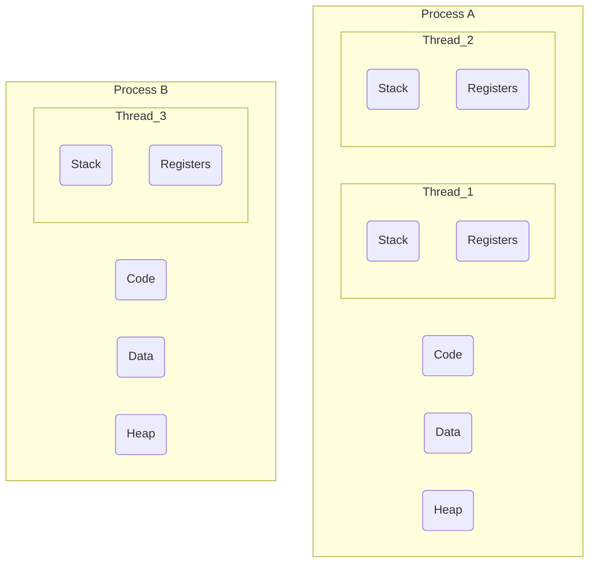
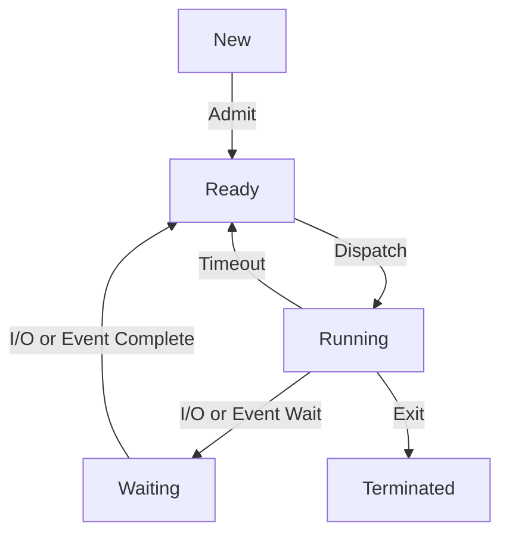
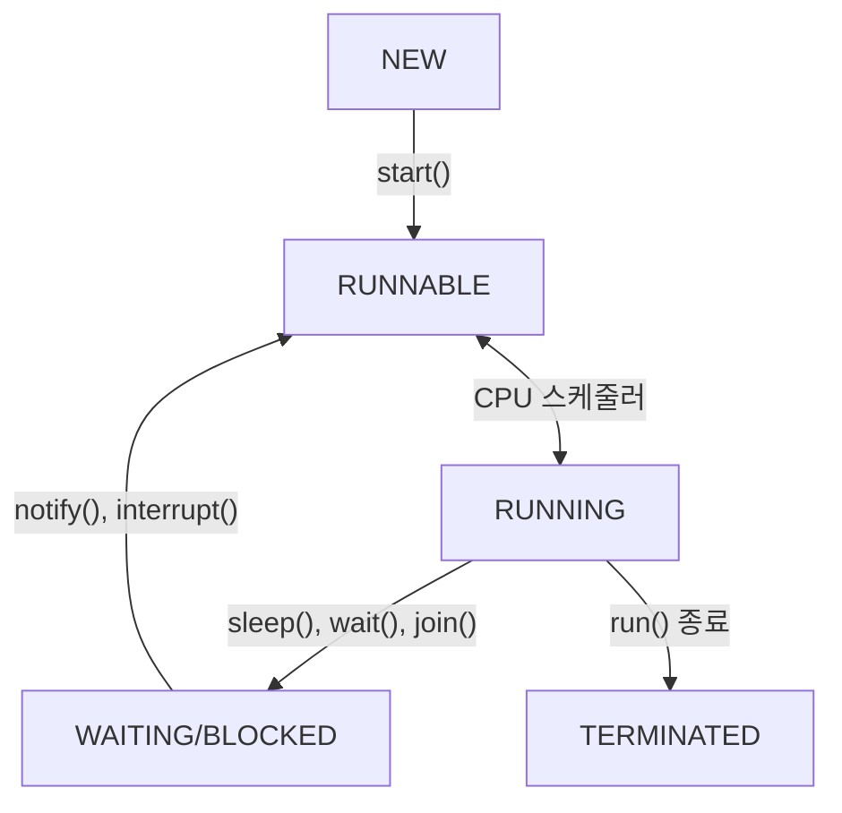

# 프로세스 vs 스레드 (생명주기, 컨텍스트 스위칭)

## 1. 핵심 개념 (Core Concept)

**프로세스(Process)**는 실행 중인 프로그램을 의미하며, 운영체제로부터 자원을 할당받는 **작업의 단위**입니다. 각 프로세스는 독립된 메모리 공간(Code, Data, Heap, Stack)을 가집니다. **스레드(Thread)**는 프로세스 내에서 실행되는 **실행 흐름의 단위**로, 프로세스가 할당받은 자원을 공유하며 동작합니다. 즉, 스레드는 한 프로세스 내에서 다른 스레드와 Code, Data, Heap 영역을 공유하고, 자신만의 Stack과 레지스터를 가집니다.

> **비유**: 프로세스가 '요리사'라면, 스레드는 요리사가 동시에 여러 작업을 하기 위해 사용하는 '여러 개의 손'에 비유할 수 있습니다.

---

## 2. 상세 설명 (Detailed Explanation)

### 2.1 프로세스와 스레드의 차이

| 구분 | 프로세스 (Process) | 스레드 (Thread) |
| :--- | :--- | :--- |
| **정의** | 자원 할당의 단위, 실행 중인 프로그램 | 실행 흐름의 단위, 프로세스 내의 '일꾼' |
| **메모리** | **독립적인 메모리 공간** 할당 | **Stack 영역만 독립적**, 나머지(Code, Data, Heap)는 공유 |
| **자원 공유** | IPC(Inter-Process Communication) 통신 필요 | 같은 프로세스 내 스레드 간 **자원 공유 용이** |
| **독립성** | 한 프로세스의 오류가 다른 프로세스에 영향 없음 (**높은 안정성**) | 한 스레  의 오류가 전체 프로세스에 영향 가능 (**낮은 안정성**) |
| **컨텍스트 스위칭 비용** | **큼** (많은 정보 저장/복원, 캐시 초기화) | **적음** (Stack 포인터 등 최소 정보만 변경) |

**멀티 프로세스 vs 멀티 스레드**
*   **멀티 프로세싱**: 여러 개의 독립적인 프로세스를 동시에 실행. 안정성이 높지만, 생성 비용이 크고 프로세스 간 통신(IPC)이 복잡함.
*   **멀티 스레딩**: 하나의 프로세스 내에서 여러 스레드를 동시에 실행. 자원 공유가 쉬워 효율적이지만, 동기화(Synchronization) 문제에 신경 써야 함.

### 2.2 생명주기 (Lifecycle)

#### 프로세스 생명주기

*   **New (생성)**: 프로세스가 생성되는 단계.
*   **Ready (준비)**: CPU를 할당받기를 기다리는 상태.
*   **Running (실행)**: CPU를 할당받아 명령어를 실행하는 상태.
*   **Waiting (대기)**: I/O 작업이나 특정 이벤트가 완료되기를 기다리는 상태.
*   **Terminated (종료)**: 프로세스 실행이 완료되고 자원이 해제된 상태.

#### 스레드 생명주기 (Java 기준)

*   **NEW**: 스레드 객체가 생성되었지만 아직 `start()`가 호출되지 않은 상태.
*   **RUNNABLE**: `start()`가 호출되어 실행 가능한 상태. CPU 스케줄러의 선택을 기다림.
*   **RUNNING**: CPU를 점유하여 코드를 실행하는 상태.
*   **WAITING/BLOCKED**: `wait()`, `sleep()` 등으로 인해 실행이 일시 중단된 상태.
*   **TERMINATED**: `run()` 메서드 실행이 완료되어 소멸된 상태.

### 2.3 컨텍스트 스위칭 (Context Switching)

**컨텍스트 스위칭**이란 CPU가 현재 실행 중인 작업(프로세스/스레드)의 상태(Context)를 저장하고, 다음 작업의 상태를 불러와 실행을 전환하는 과정입니다.

*   **Context**: CPU 레지스터 값, 프로그램 카운터(PC), 프로세스 상태, 스택 포인터 등 특정 시점의 작업 상태를 나타내는 모든 정보.
*   **과정**:
    1.  현재 작업의 Context를 해당 작업의 PCB(Process Control Block) 또는 TCB(Thread Control Block)에 저장.
    2.  다음 작업의 Context를 PCB/TCB에서 불러옴.
    3.  불러온 Context를 CPU 레지스터에 적재하여 실행 재개.
*   **오버헤드**: 컨텍스트 스위칭이 일어나는 동안 CPU는 실제 작업을 처리하지 못하므로 **오버헤드(Overhead)**가 발생합니다. 스레드 간 스위칭은 공유하는 메모리가 많아 프로세스 간 스위칭보다 오버헤드가 훨씬 적습니다.

---

## 3. 예시 (Example)

### 웹 브라우저 시나리오

*   **프로세스**: 웹 브라우저(Chrome, Safari 등)를 실행하면 하나의 프로세스가 생성됩니다.
*   **스레드**:
    *   **UI 렌더링 스레드**: 웹 페이지의 내용을 화면에 그립니다.
    *   **네트워크 스레드**: 서버로부터 HTML, 이미지, 동영상 등을 다운로드합니다.
    *   **자바스크립트 엔진 스레드**: 웹 페이지의 동적인 기능을 처리합니다.
    *   **사용자 입력 스레드**: 마우스 클릭, 키보드 입력 등을 처리합니다.

만약 웹 브라우저가 싱글 스레드로 동작한다면, 대용량 이미지를 다운로드하는 동안 화면이 멈추고(UI 렌더링 불가) 아무런 조작도 할 수 없게 될 것입니다. 멀티 스레딩 덕분에 여러 작업을 동시에 처리하여 사용자에게 쾌적한 경험을 제공할 수 있습니다.

---

## 4. 예상 면접 질문 (Potential Interview Questions)

*   **Q. 프로세스와 스레드의 가장 큰 차이점은 무엇인가요?**
    *   **A.** 가장 큰 차이점은 **자원 공유 방식**과 **독립성**입니다. 프로세스는 각자 독립적인 메모리 공간을 할당받아 자원을 공유하지 않지만, 스레드는 같은 프로세스 내의 다른 스레드들과 Code, Data, Heap 영역을 공유합니다. 이로 인해 스레드는 자원 공유가 용이하고 컨텍스트 스위칭 비용이 적다는 장점이 있지만, 하나의 스레드에 문제가 생기면 프로세스 전체에 영향을 줄 수 있다는 단점이 있습니다.

*   **Q. 컨텍스트 스위칭이란 무엇이며, 왜 스레드 간의 컨텍스트 스위칭이 프로세스보다 비용이 적게 드나요?**
    *   **A.** 컨텍스트 스위칭은 CPU가 한 작업에서 다른 작업으로 전환하는 과정을 말합니다. 이때 현재 작업의 상태를 저장하고 다음 작업의 상태를 불러오는 비용이 발생합니다. 스레드는 같은 프로세스 내에서 메모리의 대부분(Code, Data, Heap)을 공유하므로, 컨텍스트 스위칭 시 변경해야 할 정보가 스택 포인터 등으로 비교적 적습니다. 반면, 프로세스는 완전히 독립적인 메모리 공간을 가지므로, 전환 시 더 많은 상태 정보를 저장하고 복원해야 하며, 캐시 메모리를 초기화하는 등의 추가 작업이 필요하여 비용이 훨씬 큽니다.

*   **Q. 멀티 프로세스 대신 멀티 스레드를 사용하는 이유는 무엇인가요?**
    *   **A.** 주된 이유는 **자원의 효율성**과 **빠른 응답성** 때문입니다. 멀티 스레드는 스레드 생성 및 컨텍스트 스위칭에 드는 비용이 적고, 메모리 공간을 공유하므로 데이터 교환이 간단하여 시스템 자원을 더 효율적으로 사용할 수 있습니다. 이로 인해 사용자의 요청에 더 빠르게 응답하고, 여러 작업을 동시에 처리하는 것처럼 보여 응용 프로그램의 성능과 응답성을 높일 수 있습니다.

---

## 5. 더 읽어보기 (Further Reading)

*   [Process vs. Thread: What's the Difference? (Guru99)](https://www.guru99.com/difference-between-process-and-thread.html)
*   [Operating Systems: Three Easy Pieces (Concurrency Chapters)](https://pages.cs.wisc.edu/~remzi/OSTEP/)
*   [Process Lifecycle (GeeksforGeeks)](https://www.geeksforgeeks.org/process-lifecycle-in-operating-systems/)