# 스케줄링 알고리즘 (FCFS, SJF, 라운드로빈, MLFQ)

## 1. 핵심 개념 (Core Concept)

**CPU 스케줄링**은 운영체제가 여러 프로세스가 CPU를 효율적으로 나누어 사용할 수 있도록, 준비 큐(Ready Queue)에 있는 프로세스 중 어떤 프로세스에게 CPU를 할당할지 결정하는 정책입니다. 스케줄링의 목표는 시스템의 처리율(Throughput)과 효율성을 높이고, 특정 프로세스가 불공평하게 기다리는 상황을 방지하며, 사용자에게 빠른 응답 시간을 제공하는 것입니다. 이 글에서는 대표적인 스케줄링 알고리즘들의 특징과 장단점을 비교 분석합니다.

______________________________________________________________________

## 2. 상세 설명 (Detailed Explanation)

### 2.1 스케줄링 알고리즘 종류 및 비교

| 알고리즘        | 스케줄링 방식   | 핵심 아이디어                           | 장점                                           | 단점                                             |
| :-------------- | :-------------- | :-------------------------------------- | :--------------------------------------------- | :----------------------------------------------- |
| **FCFS**        | 비선점형        | 도착 순서대로 처리                      | 구현 간단, 공평함                              | **호위 효과(Convoy Effect)**, 평균 대기 시간 김  |
| **SJF**         | 비선점형/선점형 | 실행 시간이 가장 짧은 작업부터 처리     | **평균 대기 시간 최소화**                      | **기아 현상(Starvation)**, 실행 시간 예측 어려움 |
| **라운드 로빈** | 선점형          | 모든 프로세스에 동일한 시간 할당량 부여 | **응답 시간 빠름**, 기아 현상 없음             | 잦은 **컨텍스트 스위칭 오버헤드**                |
| **MLFQ**        | 선점형          | 동적 우선순위 부여 (피드백 기반)        | **응답 시간과 반환 시간을 모두 고려** (유연함) | 설계 복잡, 튜닝 어려움                           |

______________________________________________________________________

### 2.2 알고리즘 상세

#### 가. FCFS (First-Come, First-Served)

가장 간단한 스케줄링 알고리즘으로, 준비 큐에 도착한 순서대로 CPU를 할당하는 **비선점형** 방식입니다.

- **단점 (호위 효과)**: 실행 시간이 긴 프로세스가 먼저 도착하면, 뒤따르는 짧은 프로세스들이 하염없이 기다려야 해서 시스템 전체의 평균 대기 시간이 길어지는 문제가 발생합니다.

#### 나. SJF (Shortest-Job-First)

준비 큐에 있는 프로세스 중에서 CPU 실행 시간이 가장 짧은 프로세스에게 CPU를 할당합니다. 평균 대기 시간을 최   화하는 최적의 알고리즘입니다.

- **종류**:
  - **비선점형 SJF**: 일단 CPU를 할당받으면 해당 프로세스가 끝날 때까지 실행됩니다.
  - **선점형 SJF (SRTF, Shortest Remaining Time First)**: 현재 실행 중인 프로세스의 남은 시간보다 더 짧은 실행 시간을 가진 새로운 프로세스가 도착하면, CPU를 빼앗아 새 프로세스에게 할당합니다.
- **단점**:
  - **기아 현상(Starvation)**: 실행 시간이 긴 프로세스는 계속해서 짧은 프로세스에게 밀려 영원히 CPU를 할당받지 못할 수 있습니다.
  - **실행 시간 예측의 어려움**: 실제 환경에서는 각 프로세스의 정확한 실행 시간을 미리 알기 어렵습니다.

#### 다. 라운드 로빈 (Round Robin, RR)

각 프로세스에 동일한 크기의 \*\*시간 할당량(Time Quantum)\*\*을 부여하여, 할당된 시간만큼만 실행하고 다음 프로세스로 넘어가는 **선점형** 방식입니다. 시분할 시스템을 위해 설계되었습니다.

- **장점**: 모든 프로세스가 공평하게 CPU 시간을 할당받아 기아 현상이 없으며, 응답 시간이 짧아 대화형 시스템에 적합합니다.
- **단점**: 시간 할당량의 크기가 매우 중요합니다. 너무 크면 FCFS처럼 동작하고, 너무 작으   잦은 컨텍스트 스위칭으로 인한 오버헤드가 커져 성능이 저하됩니다.

#### 라. 다단계 피드백 큐 (Multi-Level Feedback Queue, MLFQ)

현대 운영체제에서 가장 보편적으로 사용되는 스케줄링 기법 중 하나로, 여러 개의 큐를 두고 각 큐마다 다른 우선순위를 부여합니다.

- **동작 원리**:
  1. 새로운 프로세스는 가장 높은 우선순위 큐에 들어갑니다.
  1. 각 큐는 보통 라운드 로빈 방식으로 동작하며, 우선순위가 높을수록 시간 할당량은 작습니다.
  1. 프로세스가 할당된 시간을 모두 사용하면 우선순위가 한 단계 낮은 큐로 강등됩니다. (CPU-bound 프로세스의 우선순위를 낮춤)
  1. I/O 작업 등으로 시간 할당량을 다 채우지 않고 CPU를 반납하면 우선순위를 유지하거나 높여줍니다. (I/O-bound 프로세스의 우선순위를 높여 응답성 향상)
- **기아 현상 방지**: 특정 주기로 모든 프로세스의 우선순위를 최상위로 높여주는 **에이징(Aging)** 또는 **부스팅(Boosting)** 기법을 사용합니다.
- **장점**: SJF의 장점(짧은 작업 우선 처리)과 라운드 로빈의 장점(빠른 응답 시간)을 결합하여, 프로세스의 특성에 따라 유연하게 스케줄링할 수 있습니다.

______________________________________________________________________

## 3. 예시 (Example)

### 스케줄링 시나리오

| 프로세스 | 도착 시간 | 실행 시간 |
| :------- | :-------- | :-------- |
| P1       | 0         | 10        |
| P2       | 1         | 3         |
| P3       | 2         | 5         |

- **FCFS**: `P1 (0-10) -> P2 (10-13) -> P3 (13-18)`
  - 평균 대기 시간: `((10-0) + (13-1) + (18-2)) / 3 = (10 + 12 + 16) / 3 = 12.67` (오류: P1 대기시간 0, P2 대기시간 9, P3 대기시간 11) -> `(0 + 9 + 11) / 3 = 6.67`
- **비선점형 SJF**: `P1 (0-10) -> P2 (10-13) -> P3 (13-18)` (P1 실행 중 P2, P3 도착)
  - 평균 대기 시간: FCFS와 동일
- **선점형 SJF (SRTF)**: `P1 (0-1) -> P2 (1-4) -> P3 (4-9) -> P1 (9-18)`
  - P1 실행(남은 시간 9) -> P2 도착(실행 시간 3) -> P2 실행 -> P3 도착(실행 시간 5) -> P2 계속 실행 -> P2 종료 -> P3 실행(남은 시간 5) -> P3 종료 -> P1 실행
  - 평균 대기 시간: `((9-1)-0) + (1-1) + (4-2)) / 3 = (8 + 0 + 2) / 3 = 3.33`

```mermaid
gantt
    title SRTF 스케줄링 예시
    dateFormat  X
    axisFormat %S

    section P1
    P1_part1 : 0, 1
    P1_part2 : 9, 18
    section P2
    P2_run : 1, 4
    section P3
    P3_run : 4, 9
```

______________________________________________________________________

## 4. 예상 면접 질문 (Potential Interview Questions)

- **Q. SJF 알고리즘이 평균 대기 시간을 최소화함에도 불구하고 실제 운영체제에서 잘 사용되지 않는 이유는 무엇인가요?**

  - **A.** 두 가지 주요 이유가 있습니다. 첫째, 각 프로세스의 정확한 실행 시간을 미리 알 수 없다는 **실행 시간 예측의 어려움**이 있습니다. 둘째, 실행 시간이 긴 프로세스가 계속해서 새로운 짧은 프로세스들에게 밀려 무한정 기다리게 되는 \*\*기아 현상(Starvation)\*\*이 발생할 수 있기 때문입니다.

- **Q. 라운드 로빈 스케줄링에서 시간 할당량(Time Quantum)의 크기는 왜 중요한가요?**

  - **A.** 시간 할당량의 크기는 시스템 성능과 응답성에 직접적인 영향을 미칩니다. 시간 할당량이 너무 크면, 모든 프로세스가 할당된 시간을 다 쓰기 전에 끝나버려 사실상 FCFS처럼 동작하게 되어 응답성이 떨어집니다. 반대로 너무 작으면, 컨텍스트 스위칭이 너무 자주 발생하여 그로 인한 오버헤드가 커져 시스템 전체의 처리율이 감소합니다. 따라서 적절한 크기의 시간 할당량을 설정하는 것이 매우 중요합니다.

- **Q. MLFQ(다단계 피드백 큐)는 어떻게 대화형 작업과 CPU 집중 작업의 요구를 모두 만족시키나요?**

  - **A.** MLFQ는 우선순위가 다른 여러 개의 큐를 사용하여 이를 해결합니다. 대화형 작업(I/O-bound)처럼 CPU를 짧게 사용하고 I/O를 기다리는 프로세스는 높은 우선순위 큐에 머무르며 빠른 응답을 보장받습니다. 반면, CPU 집중 작업(CPU-bound)처럼 할당된 시간을 다 사용하는 프로세스는 점차 낮은 우선순위 큐로 강등되어, 대화형 작업의 응답성을 방해하지 않도록 합니다. 이처럼 프로세스의 행동 패턴을 피드백 삼아 동적으로 우선순위를 조정함으로써 두 종류의 작업 요구를 모두 만족시킵니다.

______________________________________________________________________

## 5. 더 읽어보기 (Further Reading)

- [Operating Systems: Three Easy Pieces (Scheduling Chapter)](https://pages.cs.wisc.edu/~remzi/OSTEP/)
- [CPU Scheduling in Operating Systems (GeeksforGeeks)](https://www.geeksforgeeks.org/cpu-scheduling-in-operating-systems/)
- [Scheduling (operating systems) (Wikipedia)](<https://en.wikipedia.org/wiki/Scheduling_(computing)>)
