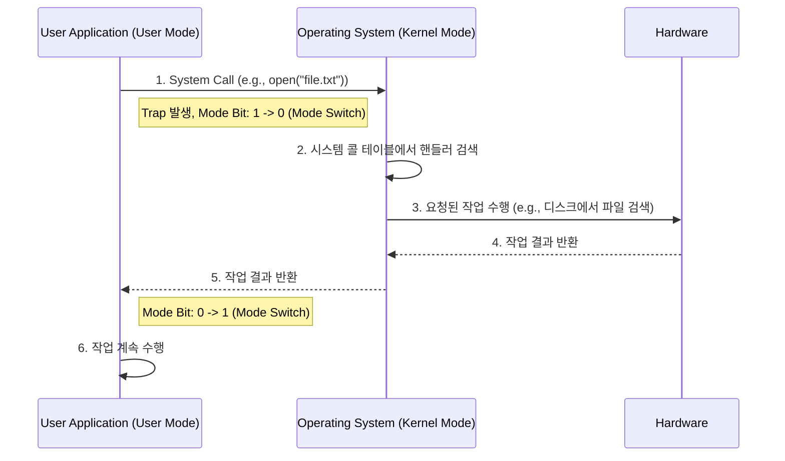

# 시스템 콜 & 커널/유저 모드

## 1. 핵심 개념 (Core Concept)

운영체제는 시스템의 안정성과 보안을 위해 CPU의 작동 모드를 \*\*커널 모드(Kernel Mode)\*\*와 \*\*유저 모드(User Mode)\*\*로 분리하여 관리합니다. \*\*시스템 콜(System Call)\*\*은 유저 모드에서 실행되는 응용 프로그램이 파일 입출력, 네트워크 통신 등 커널 모드의 권한이 필요한 기능을 요청하기 위한 공식적인 인터페이스(창구)입니다. 즉, 시스템 콜은 유저 모드와 커널 모드 사이의 다리 역할을 수행하는 핵심 메커니즘입니다.

______________________________________________________________________

## 2. 상세 설명 (Detailed Explanation)

### 2.1 커널 모드 vs 유저 모드

CPU는 현재 실행 중인 코드가 시스템에 얼마나 큰 영향을 미칠 수 있는지에 따라 권한 수준을 나누며, 이는 보통 CPU의 \*\*모드 비트(Mode Bit)\*\*로 구분됩니다. (예: 0은 커널 모드, 1은 유저 모드)

| 구분          | 유저 모드 (User Mode)                             | 커널 모드 (Kernel Mode)                      |
| :------------ | :------------------------------------------------ | :------------------------------------------- |
| **실행 주체** | 응용 프로그램 (웹 브라우저, 게임 등)              | 운영체제 커널                                |
| **접근 권한** | 하드웨어/메모리 등 중요 자원 **직접 접근 불가**   | 시스템의 **모든 자원 접근 가능**             |
| **역할**      | 일반적인 연산 수행                                | 프로세스 관리, 메모리 관리 등 핵심 기능 수행 |
| **안정성**    | 한 프로그램의 오류가 시스템 전체에 영향 주지 않음 | 커널 코드의 오류는 시스템 전체에 치명적      |

이처럼 두 가지 모드를 두는 가장 큰 이유는 \*\*시스템 보호(System Protection)\*\*입니다. 악의적이거나 잘못 작성된 사용자 프로그램이 시스템 전체를 망가뜨리는 것을 방지하기 위함입니다.

### 2.2 시스템 콜 (System Call)

유저 모드의 프로그램이 파일 생성, 화면 출력, 프로세스 생성과 같이 커널의 도움이 필요한 작업을 하려면 시스템 콜을 통해 요청해야 합니다.

#### 시스템 콜 동작 과정

1. **호출**: 유저 모드의 애플리케이션이 라이브러리 함수(e.g., `fopen`)를 통해 시스템 콜을 호출합니다.
1. **트랩(Trap) 발생**: 시스템 콜이 호출되면 CPU에 의도적인 인터럽트인 트랩이 발생하고, CPU 제어권이 OS로 넘어갑니다. 동시에 CPU의 모드 비트가 유저 모드에서 커널 모드로 변경됩니다.
1. **핸들러 실행**: OS는 **시스템 콜 테이블**을 참조하여 해당 시스템 콜 번호에 맞는 서비스 루틴(핸들러)을 찾아 실행합니다.
1. **커널 작업 수행**: 커널은 요청받은 작업(파일 열기, 메모리 할당 등)을 수행합니다.
1. **복귀**: 작업이 완료되면, CPU 모드 비트를 다시 유저 모드로 변경하고, 제어권을 애플리케이션으로 돌려주며 작업 결과를 반환합니다.

### 2.3 시스템 콜의 종류

시스템 콜은 기능에 따라 다음과 같이 분류할 수 있습니다.

- **프로세스 제어**: `fork()`(프로세스 생성), `exit()`(종료), `wait()`(대기)
- **파일 조작**: `open()`, `read()`, `write()`, `close()`
- **장치 관리**: `ioctl()`(장치 제어), `mmap()`(메모리 매핑)
- **정보 유지**: `getpid()`(프로세스 ID 얻기), `time()`(시간 조회)
- **통신**: `pipe()`(파이프 생성), `socket()`(소켓 생성)

______________________________________________________________________

## 3. 예시 (Example)

### "Hello, World!" 출력 과정

C언어에서 `printf("Hello, World!");` 코드가 실행되는 내부 과정은 다음과 같습니다.

1. **유저 모드**: `printf` 함수는 C 표준 라이브러리(libc)에 포함된 함수로, 유저 모드에서 실행됩니다.
1. `printf` 함수는 내부적으로 "Hello, World!" 문자열을 화면에 출력하기 위해 커널의 도움이 필요하다는 것을 알고, `write`라는 **시스템 콜**을 호출합니다.
1. **모드 전환**: `write` 시스템 콜이 호출되면서 트랩이 발생하고, CPU는 커널 모드로 전환됩니다.
1. **커널 모드**: 커널은 `write` 시스템 콜 핸들러를 실행하여, 화면(표준 출력)을 제어하는 장치 드라이버를 통해 "Hello, World!" 문자열을 실제로 모니터에 표시합니다.
1. **모드 전환**: 커널의 작업이 끝나면 다시 유저 모드로 전환되고, 프로그램은 다음 코드를 계속 실행합니다.

우리는 단지 `printf` 한 줄을 작성했을 뿐이지만, 내부적으로는 이처럼 유저 모드와 커널 모드를 오가는 복잡한 과정이 숨어있습니다.

______________________________________________________________________

## 4. 예상 면접 질문 (Potential Interview Questions)

- **Q. 운영체제에서 커널 모드와 유저 모드를 분리하는 이유는 무엇인가요?**

  - **A.** 가장 중요한 이유는 **시스템 자원을 보호**하고 **시스템의 안정성을 확보**하기 위함입니다. 만약 모든 프로그램이 하드웨어나 메모리에 직접 접근할 수 있는 커널 모드로 실행된다면, 하나의 잘못된 프로그램이 전체 시스템을 다운시키거나 다른 프로세스의 데이터를 손상시킬 수 있습니다. 유저 모드에서는 제한된 권한만 부여하고, 중요한 작업은 반드시 운영체제(커널)를 통해서만 수행하도록 강제함으로써 시스템을 안전하게 유지할 수 있습니다.

- **Q. 시스템 콜이란 무엇이며, 왜 필요한가요?**

  - **A.** 시스템 콜은 유저 모드에서 실행되는 응용 프로그램이 운영체제 커널의 기능을 사용하기 위한 공식적인 통로(인터페이스)입니다. 응용 프로그램은 파일 시스템, 네트워크, 프로세스 관리 등 시스템의 중요 자원에 직접 접근할 권한이 없으므로, 이러한 작업이 필요할 때 시스템 콜을 통해 커널에 서비스를 요청해야 합니다. 즉, 시스템 콜은 보호된 커널 영역의 기능을 안전하게 사용할 수 있도록 해주는 다리 역할을 하기 때문에 필수적입니다.

- **Q. 시스템 콜이 호출될 때 발생하는 전체적인 흐름을 설명해주세요.**

  - **A.** 1) 유저 모드의 프로그램이 시스템 콜을 호출합니다. 2) CPU에 트랩(소프트웨어 인터럽트)이 발생하여 커널 모드로 전환됩니다. 3) 커널은 시스템 콜 테이블에서 요청에 맞는 핸들러를 찾아 실행합니다. 4) 핸들러가 요청된 작업을 완료하면, 다시 유저 모드로 전환하여 프로그램에 결과를 반환하고 실행을 계속합니다.

______________________________________________________________________

## 5. 더 읽어보기 (Further Reading)

- [System call (Wikipedia)](https://en.wikipedia.org/wiki/System_call)
- [Protection Ring (Wikipedia)](https://en.wikipedia.org/wiki/Protection_ring)
- [Operating Systems: Three Easy Pieces (CPU Virtualization Chapters)](https://pages.cs.wisc.edu/~remzi/OSTEP/)
