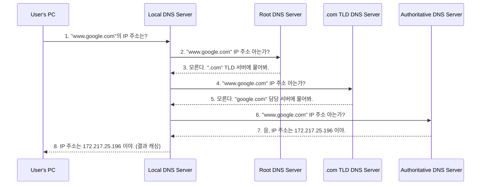

# DNS, 로드 밸런싱, CDN 기본

## 1. 핵심 개념 (Core Concept)

**DNS, 로드 밸런싱, CDN**은 현대 웹 서비스를 빠르고 안정적으로 제공하기 위한 필수 기술 3요소입니다. **DNS(Domain Name System)**는 사람이 읽기 쉬운 도메인 이름을 컴퓨터가 이해하는 IP 주소로 변환하는 '인터넷 전화번호부' 역할을 합니다. **로드 밸런싱(Load Balancing)**은 여러 서버에 트래픽을 균등하게 분산하여 서비스의 과부하를 막고 가용성을 높입니다. **CDN(Content Delivery Network)**은 사용자와 지리적으로 가까운 서버에서 콘텐츠를 전송하여 웹 로딩 속도를 획기적으로 단축시키는 기술입니다.

---

## 2. 상세 설명 (Detailed Explanation)

### 2.1 DNS (Domain Name System)

DNS는 `www.google.com`과 같은 도메인 이름을 `172.217.25.196`과 같은 실제 서버의 IP 주소로 변환해주는 분산 데이  베이스 시스템입니다.

#### 동작 원리 (Recursive Query)

1.  **사용자 요청**: 브라우저에 도메인 입력 시, PC는 설정된 **Local DNS** 서버(통신사가 제공하는 DNS 서버 등)에 IP 주소를 요청합니다.
2.  **재귀적 질의**: Local DNS 서버에 캐시된 정보가 없으면, **Root DNS** 서버부터 시작하여 계층적으로 IP 주소를 질의합니다.
3.  **Root -> TLD -> Authoritative**: Root 서버는 `.com`을 관리하는 **TLD(Top-Level Domain) DNS** 서버 주소를 알려주고, TLD 서버는 `google.com`을 관리하는 **Authoritative DNS** 서버 주소를 알려줍니다.
4.  **IP 주소 획득**: 최종적으로 Authoritative DNS 서버로부터 실제 IP 주소를 받아 사용자에게 전달합니다.

### 2.2 로드 밸런싱 (Load Balancing)

로드 밸런싱은 여러 대의 서버(Server Farm)에 들어오는 트래픽(부하)을 효율적으로 분산시키는 기술입니다. 이를 통해 서버 한 대에 과부하가 걸리는 것을 방지하고, 일부 서버에 장애가 발생하더라도 서비스 중단 없이 안정성을 유지할 수 있습니다.

#### 주요 알고리즘

*   **라운드 로빈 (Round Robin)**: 요청을 서버에 순서대로 번갈아 가며 배정하는 가장 간단한 방식입니다.
*   **최소 연결 (Least Connection)**: 현재 처리 중인 연결(세션) 수가 가장 적은 서버에 요청을 보냅니다.
*   **IP 해시 (IP Hash)**: 클라이언트의 IP 주소를 해싱하여 특정 서버로만 요청을 보냅니다. 사용자가 항상 같은 서버에 접속해야 하는 '세션 유지(Session Persistence)'가 필요할 때 유용합니다.
*   **가중 라운드 로빈 (Weighted Round Robin)**: 서버의 처리 성능에 따라 가중치를 부여하여, 성능이 좋은 서버에 더 많은 트래픽을 할당합니다.

로드 밸런서는 주기적으로 서버의 상태를 확인(**Health Check**)하여, 응답이 없는 비정상 서버는 트래픽 분산 대상에서 일시적으로 제외합니다.

### 2.3 CDN (Content Delivery Network)

CDN은 이미지, 동영상, CSS, JS 파일과 같은 정적 콘텐츠를 사용자와 물리적으로 가장 가까운 곳에 위치한 **캐시 서버(Edge Server)**에서 전송하여 웹 페이지 로딩 속도를 높이는 기술입니다.

#### 동작 원리

1.  **콘텐츠 캐싱**: 원본 서버(Origin Server)의 콘텐츠를 전 세계 주요 거점에 분산된 CDN 캐시 서버에 미리 복사해 둡니다.
2.  **사용자 요청**: 사용자가 웹 콘텐츠를 요청하면, DNS는 사용자와 가장 가까운 CDN 캐시 서버의 IP 주소로 안내합니다.
3.  **빠른 전송**:
    *   **Cache Hit**: 요청한 콘텐츠가 캐시 서버에 있으면, 원본 서버까지 가지 않고 즉시 사용자에게 전송합니다.
    *   **Cache Miss**: 콘텐츠가 캐시 서버에 없으면, 원본 서버로부터 콘텐츠를 가져와 사용자에게 전달하고 다음 요청을 위해 캐시 서버에 저장합니다.

이를 통해 사용자는 물리적 거리에 따른 네트워크 지연(Latency)을 최소화하고, 원본 서버의 트래픽 부담을 크게 줄일 수 있습니다.

---

## 3. 예시 (Example)

### 온라인 쇼핑몰 서비스 흐름

1.  사용자가 브라우저에 `www.shop.com`을 입력합니다.
2.  **DNS**가 `www.shop.com`의 IP 주소를 찾는데, 이 주소는 쇼핑몰의 **로드 밸런서** IP입니다.
3.  사용자의 요청은 로드 밸런서로 전달됩니다.
4.  **로드 밸런서**는 현재 가장 부하가 적은 웹 서버(예: 서버 3번)를 선택하여 요청을 전달합니다.
5.  웹 서버 3번은 HTML 문서를 사용자에게 보냅니다.
6.  사용자 브라우저는 HTML을 해석하다가 이미지 파일(`logo.png`)을 발견하고, 이 파일의 주소(`cdn.shop.com/logo.png`)로 다시 요청을 보냅니다.
7.  **CDN**을 위한 DNS는 사용자와 가장 가까운 **캐시 서버(Edge Server)**의 IP를 알려줍니다.
8.  사용자는 캐시 서버로부터 `logo.png` 파일을 매우 빠르게 다운로드받습니다.

---

## 4. 예상 면접 질문 (Potential Interview Questions)

*   **Q. 사용자가 브라우저에 도메인 이름을 입력했을 때부터 웹 페이지가 표시되기까지의 과정을 DNS, 로드 밸런서, CDN을 포함하여 설명해주세요.**
    *   **A.** 1) 사용자가 도메인 입력 시, DNS 조회를 통해 해당 도메인에 연결된 로드 밸런서의 IP 주소를 얻습니다. 2) 브라우저는 이 IP 주소로 HTTP 요청을 보내고, 로드 밸런서는 이 요청을 받아 여러 웹 서버 중 하나로 전달합니다. 3) 선택된 웹 서버는 동적인 HTML 문서를 응답으로 보냅니다. 4) 브라우저는 HTML을 렌더링하다가 이미지나 CSS 같은 정적 콘텐츠를 발견하면, 해당 콘텐츠의 CDN URL로 다시 요청을 보냅니다. 5) CDN은 사용자와 가장 가까운 캐시 서버에서 해당 콘텐츠를 빠르게 전송하여 최종적으로 웹 페이지가 완성됩니다.

*   **Q. 로드 밸런서의 Health Check 기능은 왜 중요한가요?**
    *   **A.** Health Check는 로드 밸런서가 트래픽을 분산시킬 서버들의 상태를 주기적으로 검사하는 기능입니다. 만약 특정 서버가 장애로 인해 정상적인 응답을 할 수 없는 상태가 되면, Health Check를 통해 이를 감지하고 해당 서버를 트래픽 분산 대상에서 즉시 제외합니다. 이를 통해 사용자의 요청이 실패하는 것을 방지하고, 서비스의 전체적인 가용성과 안정성을 보장할 수 있기 때문에 매우 중요합니다.

*   **Q. CDN을 사용하면 어떤 이점이 있나요?**
    *   **A.** 가장 큰 이점은 **웹 로딩 속도 향상**입니다. 사용자와 물리적으로 가까운 캐시 서버에서 콘텐츠를 전송하여 네트워크 지연을 최소화합니다. 또한, 원본 서버로 향하는 트래픽을 CDN이 대신 처리해주므로 **원본 서버의 부하를 줄여** 서버 비용을 절감하고 안정성을 높일 수 있습니다. 부가적으로 DDoS 공격 방어 등 **보안 강화** 효과도 얻을 수 있습니다.

---

## 5. 더 읽어보기 (Further Reading)

*   [How DNS works (Cloudflare)](https://www.cloudflare.com/learning/dns/what-is-dns/)
*   [What is Load Balancing? (AWS)](https://aws.amazon.com/what-is/load-balancing/)
*   [What is a CDN? (Cloudflare)](https://www.cloudflare.com/learning/cdn/what-is-a-cdn/)