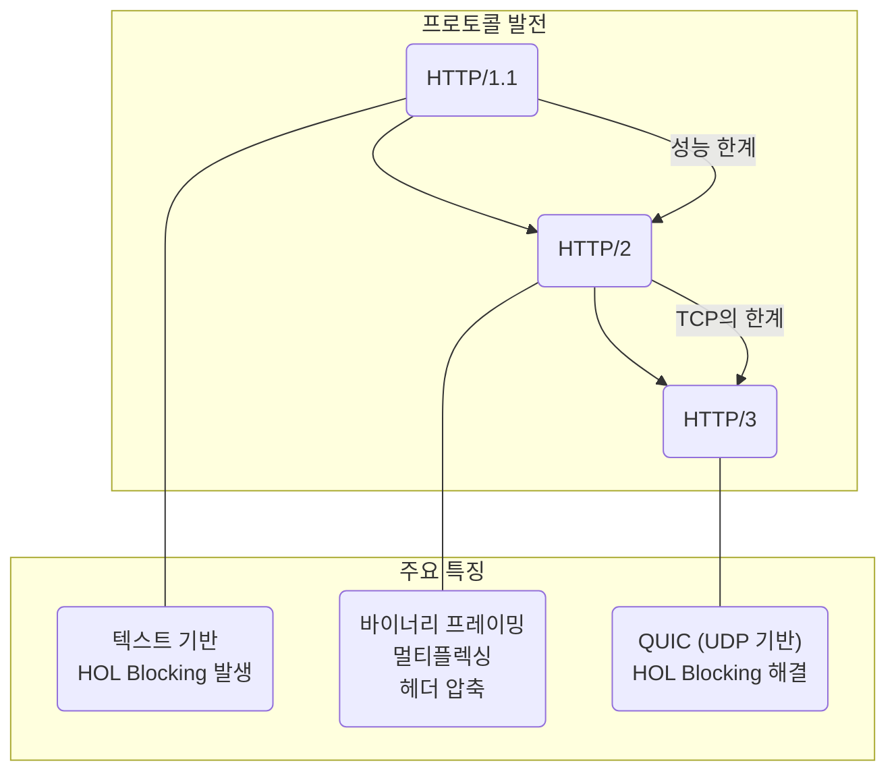

# HTTP/1.1, HTTP/2, HTTP/3 & gRPC

## 1. 핵심 개념 (Core Concept)

\*\*HTTP(HyperText Transfer Protocol)\*\*는 웹에서 클라이언트와 서버 간의 통신을 위한 핵심 프로토콜입니다. **HTTP/1.1**은 가장 기본적인 형태로, 텍스트 기반의 요청-응답 모델입니다. **HTTP/2**는 성능 개선을 위해 멀티플렉싱, 헤더 압축 등을 도입했으며, **HTTP/3**는 TCP 대신 QUIC 프로토콜을 사용하여 네트워크 지연을 획기적으로 개선했습니다. **gRPC**는 HTTP/2를 기반으로 하는 고성능 원격 프로시저 호출(RPC) 프레임워크로, 특히 마이크로서비스 환경에서 효율적인 통신을 위해 사용됩니다.

______________________________________________________________________

## 2. 상세 설명 (Detailed Explanation)

### 2.1 HTTP 버전별 발전 과정

#### 가. HTTP/1.1 (1997년)

- **특징**:
  - **텍스트 기반**: 사람이 읽을 수 있는 텍스트 형식으로 통신합니다.
  - **연결 재사용 (Keep-Alive)**: 한 번 맺은 TCP 연결을 여러 요청에 재사용합니다.
  - **파이프라이닝 (Pipelining)**: 하나의 커넥션에서 여러 요청을 순차적으로 보내지만, 응답은 요청 순서대로 받아야 합니다.
- **한계**:
  - **HOL (Head-of-Line) Blocking**: 하나의 요청 처리가 지연되면 후속 요청들도 모두 대기해야 하는 심각한 성능 저하 문제가 있습니다.
  - **무거운 헤더**: 매 요청마다 중복된 헤더 정보를 압축 없이 전송하여 오버헤드가 큽니다.

#### 나. HTTP/2 (2015년)

HTTP/1.1의 성능 한계를 극복하기 위해 많은 개선이 이루어졌습니다.

- **주요 개선점**:
  - **멀티플렉싱 (Multiplexing)**: 하나의 TCP 연결에서 여러 요   과 응답을 **동시에, 순서에 상관없이** 주고받을 수 있습니다. 이를 통해 HTTP/1.1의 HOL Blocking 문제를 해결했습니다.
  - **바이너리 프레이밍 (Binary Framing)**: 모든 메시지를 바이너리 형식의 프레임으로 나누어 전송하여 파싱 효율과 속도를 높였습니다.
  - **헤더 압축 (HPACK)**: 중복된 헤더 정보를 제거하는 HPACK 압축 방식을 사용하여 전송량을 크게 줄였습니다.
  - **서버 푸시 (Server Push)**: 클라이언트가 요청하지 않은 리소스(e.g., CSS, JS)도 서버가 미리 보내주어 로딩 속도를 개선할 수 있습니다.
- **남아있는 한계**:
  - **TCP 기반의 HOL Blocking**: TCP 프로토콜 자체의 한계로, 패킷 손실이 발생하면 TCP 레벨에서 HOL Blocking이 발생할 수 있습니다.

#### 다. HTTP/3 (2022년)

TCP의 한계를 극복하기 위해 UDP 기반의 **QUIC(Quick UDP Internet Connections)** 프로토콜을 도입했습니다.

- **주요 개선점**:
  - **QUIC 프로토콜**: UDP를 기반으로 하여 TCP의 3-way handshake와 같은 연결 설정 과정을 최적화하고(0-RTT 또는 1-RTT), 신뢰성 있는 전송을 보장합니다.
  - **독립적인 스트림**: 각 스트림이 독립적이므로, 한 스트림에서 패킷 손실이 발생해도 다른 스트림에 영향을 주지 않아 TCP의 HOL Blocking 문제를 근본적으로 해결했습니다.
  - **향상된 혼잡 제어**: 더 정교한 혼잡 제어 메커니즘을 가지고 있습니다.

### 2.2 gRPC (Google Remote Procedure Call)

gRPC는 마이크로서비스 아키텍처(MSA) 환경에서 서비스 간의 효율적인 통신을 위해 구글이 개발한 고성능 RPC 프레임워크입니다.

- **핵심 특징**:
  - **HTTP/2 기반**: HTTP/2의 멀티플렉싱, 양방향 스트리밍 등의 장점을 모두 활용합니다.
  - **프로토콜 버퍼 (Protocol Buffers, Protobuf)**: 데이터를 바이너리 형식으로 직렬화하여 JSON이나 XML보다 작고 빠른 데이터 교환이 가능합니다.
  - **엄격한 명세**: `.proto` 파일을 통해 서비스 인터페이스와 데이터 모델을 명확하게 정의해야 합니다. 이를 통해 타입 안정성을 확보하고, 다양한 언어의 클라이언트/서버 코드를 자동으로 생성할 수 있습니다.

### 2.3 비교 요약

| 구분              | HTTP/1.1    | HTTP/2          | HTTP/3                     | gRPC                    |
| :---------------- | :---------- | :-------------- | :------------------------- | :---------------------- |
| **기반 프로토콜** | TCP         | TCP             | **UDP (QUIC)**             | HTTP/2 (TCP)            |
| **데이터 형식**   | 텍스트      | 바이너리        | 바이너리                   | **바이너리 (Protobuf)** |
| **HOL Blocking**  | 발생 (심각) | 완화 (TCP 레벨) | **해결**                   | 완화 (TCP 레벨)         |
| **헤더 처리**     | 압축 없음   | HPACK 압축      | QPACK 압축                 | HPACK 압축              |
| **주요 사용처**   | 레거시 웹   | 현대적인 웹     | 차세대 웹, 불안정 네트워크 | **마이크로서비스(MSA)** |

______________________________________________________________________

## 3. 예시 (Example)

### 웹 페이지 로딩 시나리오

하나의 웹 페이지를 로딩하기 위해 HTML, CSS, JS, 이미지 3개가 필요하다고 가정해봅시다.

- **HTTP/1.1**: 6개의 요청을 순차적으로 보내거나, 여러 개의 TCP 연결을 생성하여 병렬로 요청합니다. HOL Blocking으로 인해 이미지 하나가 느려지면 뒤따르는 JS 파일 로딩이 지연될 수 있습니다.
- **HTTP/2**: 단 하나의 TCP 연결 위에서 6개의 리소스를 동시에 요청하고 응답받습니다. CSS나 JS처럼 중요한 리소스에 우선순위를 부여하여 먼저 받을 수 있습니다.
- **HTTP/3**: HTTP/2와 유사하게 동작하지만, 모바일 환경처럼 네트워크가 불안정하여 이미지 하나의 패킷이 유실되더라도, 다른 CSS나 JS 스트림은 영향을 받지 않고 계속 다운로드됩니다.
- **gRPC**: 이 시나리오는 웹 브라우저와 서버 간의 통신이므로 gRPC보다는 HTTP/2나 HTTP/3가 더 적합합니다. gRPC는 웹 서버와 API 서버, 또는 여러 백엔드 서비스 간의 내부 통신에 사용될 때 더 큰 장점을 보입니다.

______________________________________________________________________

## 4. 예상 면접 질문 (Potential Interview Questions)

- **Q. HTTP/2는 HTTP/1.1의 어떤 문제를 해결했으며, 그 핵심 기술은 무엇인가요?**

  - **A.** HTTP/2는 HTTP/1.1의 가장 큰 문제였던 **HOL(Head-of-Line) Blocking**을 해결했습니다. 이를 위해 **멀티플렉싱(Multiplexing)** 기술을 도입하여, 하나의 TCP 연결에서 여러 요청과 응답을 순서에 상관없이 동시에 처리할 수 있게 했습니다. 또한, \*\*헤더 압축(HPACK)\*\*으로 불필요한 헤더 전송량을 줄이고, **바이너리 프로토콜**을 사용하여 전송 효율을 높여 전반적인 웹 성능을 크게 향상시켰습니다.

- **Q. HTTP/2가 있음에도 HTTP/3가 등장한 이유는 무엇인가요?**

  - **A.** HTTP/2는 애플리케이션 레벨의 HOL Blocking은 해결했지만, 여전히 **TCP 프로토콜 자체의 HOL Blocking**이라는 한계를 가지고 있었습니다. TCP는 패킷 순서를 엄격하게 보장하므로, 하나의 패킷이 유실되면 복구될 때까지 후속 패킷들이 모두 대기해야 합니다. HTTP/3는 이 문제를 근본적으로 해결하기 위해 TCP 대신 UDP 기반의 **QUIC 프로토콜**을 도입했습니다. QUIC은 각 스트림을 독립적으로 처리하므로 한 스트림의 패킷 손실이 다른 스트림에 영향을 주지 않습니다.

- **Q. gRPC는 어떤 상황에서 사용하는 것이 가장 효과적인가요?**

  - **A.** gRPC는 **마이크로서비스 아키텍처(MSA)** 환경에서 내부 서비스 간의 통신에 사용될 때 가장 효과적입니다. 프로토콜 버퍼를 사용한 효율적인 바이너리 직렬화와 HTTP/2의 고성능 통신을 통해 서비스 간의 지연 시간을 최소화할 수 있습니다. 또한, `.proto` 파일을 통해 API 명세를 명확히 하고 다양한 언어의 코드를 자동으로 생성해주므로, 여러 언어로 구성된 복잡한 시스템에서 개발 생산성과 안정성을 크게 높일 수 있습니다.

______________________________________________________________________

## 5. 더 읽어보기 (Further Reading)

- [HTTP/2 소개 (Google for Developers)](https://developers.google.com/web/fundamentals/performance/http2?hl=ko)
- [HTTP/3: the past, the present, and the future (Cloudflare Blog)](https://blog.cloudflare.com/http3-the-past-the-present-and-the-future/)
- [Introduction to gRPC](https://grpc.io/docs/what-is-grpc/introduction/)
