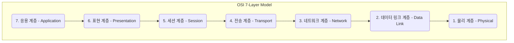
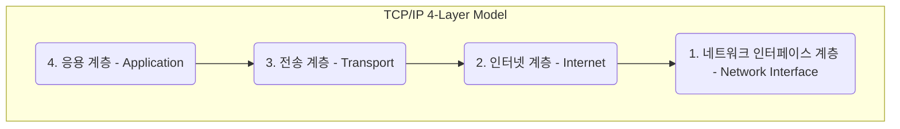
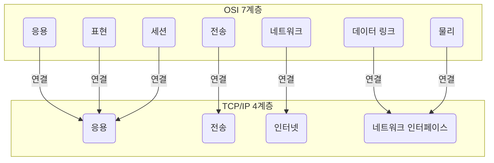

# OSI 7계층 vs TCP/IP 4계층

## 1. 핵심 개념 (Core Concept)

**OSI 7계층 모델**과 **TCP/IP 4계층 모델**은 컴퓨터 네트워크 통신 과정을 계층별로 나누어 설명하는 모델입니다. **OSI 모델**은 국제표준화기구(ISO)가 제정한 **이론적인 참조 모델**로, 통신의 모든 과정을 7개의 상세한 단계로 나누어 표준화된 지침을 제공합니다. 반면, **TCP/IP 모델**은 현재 인터넷에서 실제로 사용되는 프로토콜의 모음으로, OSI 모델보다 더 단순화된 4개의 계층으로 구성된 **실용적인 모델**입니다.

---

## 2. 상세 설명 (Detailed Explanation)

### 2.1 모델별 계층 구조

#### OSI 7계층 모델 (이론적 표준)

OSI 모델은 네트워크 통신을 7개의 추상적인 계층으로 나누어, 각 계층이 특정 기능을 수행하도록 정의합니다.

*   **7. 응용 계층 (Application)**: 사용자와 직접 상호작용. (HTTP, FTP, SMTP)
*   **6. 표현 계층 (Presentation)**: 데이터의 형식(Format) 변환, 암호화, 압축. (JPEG, MPEG)
*   **5. 세션 계층 (Session)**: 장치 간의 통신 세션 설정, 관리, 종료.
*   **4. 전송 계층 (Transport)**: 종단 간(End-to-End) 데이터 전송의 신뢰성 보장, 흐름 제어. (TCP, UDP)
*   **3. 네트워크 계층 (Network)**: 데이터 패킷의 경로 설정(라우팅), 논리적 주소(IP) 관리. (IP, ICMP)
*   **2. 데이터 링크 계층 (Data Link)**: 동일 네트워크 내에서 데이터 프레임 전송, 물리적 주소(MAC) 사용. (Ethernet)
*   **1. 물리 계층 (Physical)**: 데이터를 전기적 신호로 변환하여 물리적 매체로 전송. (케이블, 허브)

#### TCP/IP 4계층 모델 (실용적 표준)

TCP/IP 모델은 실용성에 중점을 두어 OSI 모델의 여러 계층을 하나로 통합한 형태입니다.

*   **4. 응용 계층 (Application)**: OSI 5, 6, 7계층의 기능을 포함. (HTTP, FTP, DNS)
*   **3. 전송 계층 (Transport)**: OSI 4계층과 동일. (TCP, UDP)
*   **2. 인터넷 계층 (Internet)**: OSI 3계층과 동일. (IP)
*   **1. 네트워크 인터페이스 계층 (Network Interface)**: OSI 1, 2계층의 기능을 포함. (Ethernet, Wi-Fi)

### 2.2 두 모델의 비교

| 구분 | OSI 7계층 모델 | TCP/IP 4계층 모델 |
| :--- | :--- | :--- |
| **목적** | 네트워크 통신의 **표준화**를 위한 개념적 모델 | 인터넷 통신의 **실용성**에 중점을 둔 프로토콜 모음 |
| **계층 수** | 7개 계층 | 4개 계층 |
| **구현** | 실제 구현 사례가 거의 없는 **이론적 모델** | 현재 인터넷의 **사실상 표준(De facto standard)** |
| **접근 방식** | 기능별로 명확히 구분된 수직적 접근 | 프로토콜 중심의 실용적 접근 |
| **연결성** | 전송 계층에서 연결 지향만 고려 | 전송 계층에서 **연결 지향(TCP)과 비연결 지  (UDP) 모두 제공** |

**계층 매핑 관계**

---

## 3. 예시 (Example)

### 이메일 전송 과정

사용자가 이메일 클라이언트에서 '보내기' 버튼을 누르면 데이터는 다음과 같은 과정을 거쳐 전송됩니다.

1.  **응용 계층 (OSI 7, TCP/IP 4)**: 이메일 데이터가 SMTP 프로토콜에 맞게 포맷됩니다.
2.  **표현/세션 계층 (OSI 6, 5)**: 필요한 경우 문자 인코딩(ASCII, UTF-8) 변환 및 통신 세션이 설정됩니다. (TCP/IP에서는 응용 계층에 포함)
3.  **전송 계층 (OSI 4, TCP/IP 3)**: 데이터가 TCP 세그먼트로 분할되고, 포트 번호(SMTP: 25)가 추가되어 신뢰성 있는 전송을 준비합니다.
4.  **네트워크 계층 (OSI 3, TCP/IP 2)**: TCP 세그먼트에 수신자 서버의 IP 주소    포함된 IP 헤더가 붙어 IP 패킷이 됩니다.
5.  **데이터 링크/물리 계층 (OSI 2, 1, TCP/IP 1)**: IP 패킷이 이더넷 프레임으로 캡슐화되고, MAC 주소를 통해 다음 라우터로 전달되며, 최종적으로 전기 신호로 변환되어 케이블을 통해 전송됩니다.

수신 측에서는 이 과정을 역순으로 거쳐(디캡슐레이션) 원본 이메일 데이터를 복원합니다.

---

## 4. 예상 면접 질문 (Potential Interview Questions)

*   **Q. OSI 7계층 모델과 TCP/IP 4계층 모델의 가장 큰 차이점은 무엇인가요?**
    *   **A.** 가장 큰 차이점은 **목적**과 **실용성**에 있습니다. OSI 7계층은 네트워크 통신을 이해하고 표준화하기 위한 **이론적인 참조 모델**인 반면, TCP/IP 4계층은 현재 인터넷에서 실제로 사용되는 프로토콜들을 설명하는 **실용적인 모델**입니다. 이로 인해 OSI는 7개의 상세한 계층으로, TCP/IP는 4개의 통합된 계층으로 구성되어 있습니다.

*   **Q. OSI 7계층 모델을 배우는 이유는 무엇인가요? 실제로는 TCP/IP 모델을 사용하는데 말이죠.**
    *   **A.** OSI 7계층 모델은 네트워크 통신의 전체 흐름을 기능별로 매우 명확하게 나누어 설명해주기 때문에, 교육적인 목적으로 매우 유용합니다. 각 계층의 역할과 책임을 명확히 이해하면 네트워크에서 문제가 발생했을 때 원인을 파악하고 해결하는 **트러블슈팅(Troubleshooting)** 능력을 기르는 데 큰 도움이 됩니다. 즉, 네트워크의 동작 원리를 깊이 있게 이해하기 위한 '교과서'나 '지도'와 같은 역할을 합니다.

*   **Q. TCP/IP의 4개 계층을 설명하고, 각 계층에 속하는 프로토콜의 예를 하나씩 들어보세요.**
    *   **A.**
        *   **4계층(응용):** 사용자와 직접 상호작용하는 프로토콜. 예: **HTTP**
        *   **3계층(전송):** 데이터 전송의 신뢰성을 담당. 예: **TCP**
        *   **2계층(인터넷):** 데이터의 목적지까지 경로를 설정. 예: **IP**
        *   **1계층(네트워크 인터페이스):** 물리적인 네트워크를 통해 데이터를 전송. 예: **Ethernet**

---

## 5. 더 읽어보기 (Further Reading)

*   [OSI model (Wikipedia)](https://en.wikipedia.org/wiki/OSI_model)
*   [Internet protocol suite (TCP/IP) (Wikipedia)](https://en.wikipedia.org/wiki/Internet_protocol_suite)
*   [The TCP/IP Guide](http.www.tcpipguide.com/free/t_TCPIPArchitectureandtheTCPIPModel.htm)