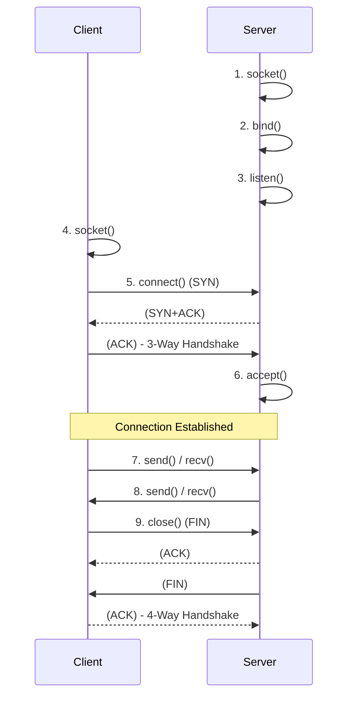

# 소켓 프로그래밍 (Python socket 예시)

## 1. 핵심 개념 (Core Concept)

**소켓(Socket)**은 네트워크 상에서 동작하는 프로그램 간 양방향 통신의 종착점(Endpoint)입니다. 즉, 소켓은 운영체제가 제공하는 소프트웨어적인 장치로, 개발자가 복잡한 네트워크 프로토콜(TCP/IP)을 직접 다루지 않고도 원격지의 애플리케이션과 데이터를 교환할 수 있도록 해주는 **통신을 위한 창구** 역할을 합니다. 소켓 프로그래밍은 이러한 소켓을 생성하고 설정하여 네트워크 통신을 구현하는 것을 의미합니다.

---

## 2. 상세 설명 (Detailed Explanation)

소켓은 사용하는 전송 계층 프로토콜에 따라 크게 **TCP 소켓**과 **UDP 소켓**으로 나뉩니다.

### 2.1 TCP 소켓 (연결 지향형)

TCP(Transmission Control Protocol)는 **연결 지향형** 프로토콜로, 데이터를 전송하기 전에    드시 상대방과 연결(Connection)을 수립하는 과정을 거칩니다. 신뢰성 있는 데이터 전송을 보장합니다.

#### TCP 통신 과정


1.  **서버**: `socket()`으로 소켓을 생성하고, `bind()`로 특정 IP 주소와 포트 번호를 할당합니다. `listen()`으로 클라이언트의 요청을 기다리는 상태로 전환합니다.
2.  **클라이언트**: `socket()`으로 소켓을 생성하고, `connect()`를 사용하여 서버에 연결을 요청합니다. (이때 3-Way Handshake 발생)
3.  **서버**: `accept()`를 통해 클라이언트의 연결 요청을 수락하고, 실제 통신을 위한 새로운 소켓을 생성하여 반환합니다.
4.  **데이터 송수신**: 연결이 수립된 후, `send()`와 `recv()`를 통해 양방향으로 데이터를 주고받습니다.
5.  **연결 종료**: `close()`를 호출하여 연결을 종료합니다. (이때 4-Way Handshake 발생)

*   **특징**: 신뢰성이 높지만(데이터 순서 보장, 유실 시 재전송), 연결 설정 과정 때문에 UDP보다 속도가 느립니다.
*   **사용처**: 파일 전송, 이메일, 웹 통신 등 데이터의 정확성이 중요한 서비스.

### 2.2 UDP 소켓 (비연결형)

UDP(User Datagram Protocol)는 **비연결형** 프로토콜로, 사전에 연결을 설정하는 과정 없이 데이터를 '데이터그램'이라는 독립적인 패킷 단위로 전송합니다.

#### UDP 통신 과정
1.  **서버**: `socket()`으로 소켓을 생성하고, `bind()`로 특정 포트에서 데이터를 수신할 준비를 합니다.
2.  **클라이언트**: `socket()`으로 소켓을 생성합니다.
3.  **데이터 송수신**:
    *   클라이언트는 `sendto()`를 사용하여 목적지 주소(IP, 포트)를 명시하여 데이터를 바로 전송합니다.
    *   서버는 `recvfrom()`을 통해 데이터를 수신하고, 동시에 데이터를 보낸 클  이언트의 주소 정보도 얻습니다.
4.  **연결 종료**: 별도의 연결 종료 절차가 없습니다.

*   **특징**: 속도가 빠르지만, 데이터의 순서가 보장되지 않고 전송 중 데이터가 유실될 수 있습니다.
*   **사용처**: 실시간 스트리밍, 온라인 게임, DNS 등 속도가 중요한 서비스.

---

## 3. 예시 (Example)

### Python `socket` 모듈 예시
클라이언트가 메시지를 보내면 서버가 대문자로 변환하여 돌려주는 간단한 에코(Echo) 서버/클라이언트입니다.

#### TCP 서버 (`server_tcp.py`)
```python
import socket

# 서버 설정 (AF_INET: IPv4, SOCK_STREAM: TCP)
server_socket = socket.socket(socket.AF_INET, socket.SOCK_STREAM)
server_socket.bind(('127.0.0.1', 9999))
server_socket.listen()
print("TCP 서버가 연결을 기다립니다...")

# 클라이언트 연결 수락
client_socket, addr = server_socket.accept()
print(f"{addr}에서 클라이언트가 연결되었습니다.")

try:
    while True:
        data = client_socket.recv(1024)
        if not data:
            break
        print(f"수신: {data.decode()}")
        client_socket.sendall(data.upper()) # 데이터를 대문자로 변환하여 반송
finally:
    client_socket.close()
    server_socket.close()
```

#### TCP 클라이언트 (`client_tcp.py`)
```python
import socket

# 서버에 연결
client_socket = socket.socket(socket.AF_INET, socket.SOCK_STREAM)
client_socket.connect(('127.0.0.1', 9999))

try:
    message = input("보낼 메시지: ")
    client_socket.sendall(message.encode())
    
    data = client_socket.recv(1024)
    print(f"수신: {data.decode()}")
finally:
    client_socket.close()
```

---

## 4. 예상 면접 질문 (Potential Interview Questions)

*   **Q. TCP 소켓과 UDP 소켓의 가장 큰 차이점은 무엇이며, 각각 어떤 상황에 사용하는 것이 적합한가요?**
    *   **A.** 가장 큰 차이점은 **연결 설정 여부**와 그로 인한 **신뢰성**입니다. TCP 소켓은 통신 전에 반드시 1:1 연결을 맺고 데이터의 순서와 전송을 보장하므로 신뢰성이 높지만 속도가 느립니다. 따라서 파일 전송이나 웹 통신처럼 데이터의 정확성이 중요할 때 적합합니다. 반면, UDP 소켓은 연결 과정 없이 데이터를 빠르게 전송하는 데 중점을 두어 신뢰성은 낮지만 속도가 빠릅니다. 따라서 실시간 영상 스트리밍이나 온라인 게임처럼 약간의 데이터 손실이 있더라도 빠른 전송이 더 중요한 경우에 적합합니다.

*   **Q. TCP 서버에서 `listen()`과 `accept()` 함수의 역할은 각각 무엇인가요?**
    *   **A.** `listen()` 함수는 서버 소켓을 '연결 요청 대기 상태'로 전환시키는 역할을 합니다. 인자로 받는 숫자는 동시에 처리할 수 있는 연결 요청의 최대 대기 큐(Backlog) 크기를 의미합니다. `accept()` 함수는 실제로 클라이언트의 연결 요청이 들어왔을 때, 그 요청을 수락하고 클라이언트와 통신할 수 있는 **새로운 데이터 통신용 소켓**과 클라이언트의 주소 정보를 반환합니다. 즉, `listen()`은 문을 열어두는 것이고, `accept()`는 손님이 왔을 때 맞이하여 새로운 대화 채널을 만드는 것에 비유할 수 있습니다.

*   **Q. 블로킹 소켓(Blocking Socket)과 논블로킹 소켓(Non-blocking Socket)의 차이점은 무엇인가요?**
    *   **A.** 블로킹 소켓은 기본 동작 방식으로, `recv()`나 `accept()`와 같은 입출력 함수를 호출했을 때 해당 작업이 완료될 때까지 프로그램의 실행이 멈추고 대기합니다. 반면, 논블로킹 소켓은 입출력 함수 호출 시 즉시 반환되며, 데이터가 준비되지 않았을 경우 에러를 발생시킵니다. 논블로킹 소켓을 사용하면 하나의 스레드에서 여러 클라이언트의 입출력을 동시에 처리하는(I/O Multiplexing, 예: `select`, `epoll`) 고성능 서버를 구현할 수 있습니다.

---

## 5. 더 읽어보기 (Further Reading)

*   [Python `socket` — Low-level networking interface (Official Docs)](https://docs.python.org/3/library/socket.html)
*   [Socket Programming in Python (GeeksforGeeks)](https://www.geeksforgeeks.org/socket-programming-python/)
*   [Beej's Guide to Network Programming](https://beej.us/guide/bgnet/)