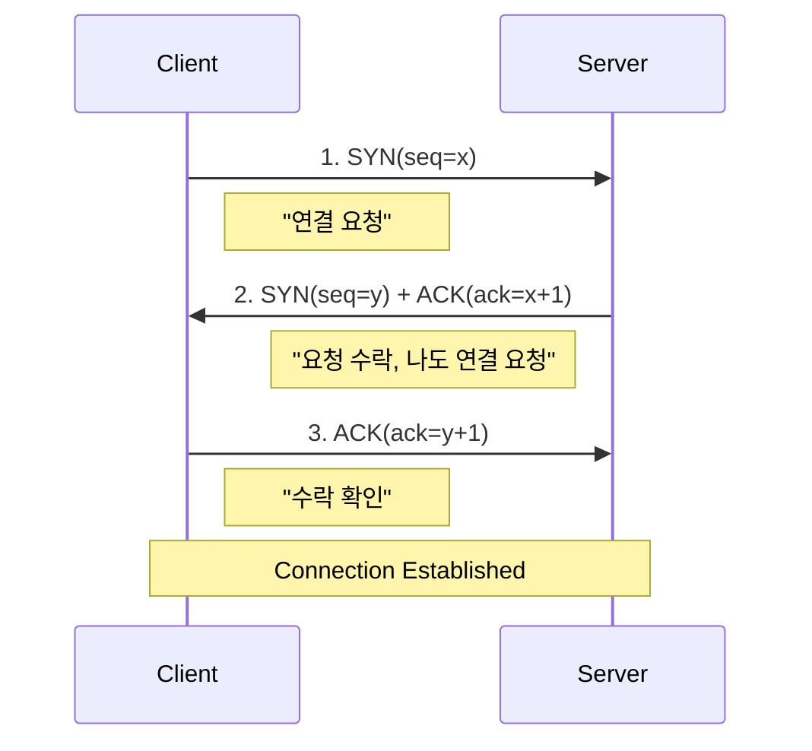
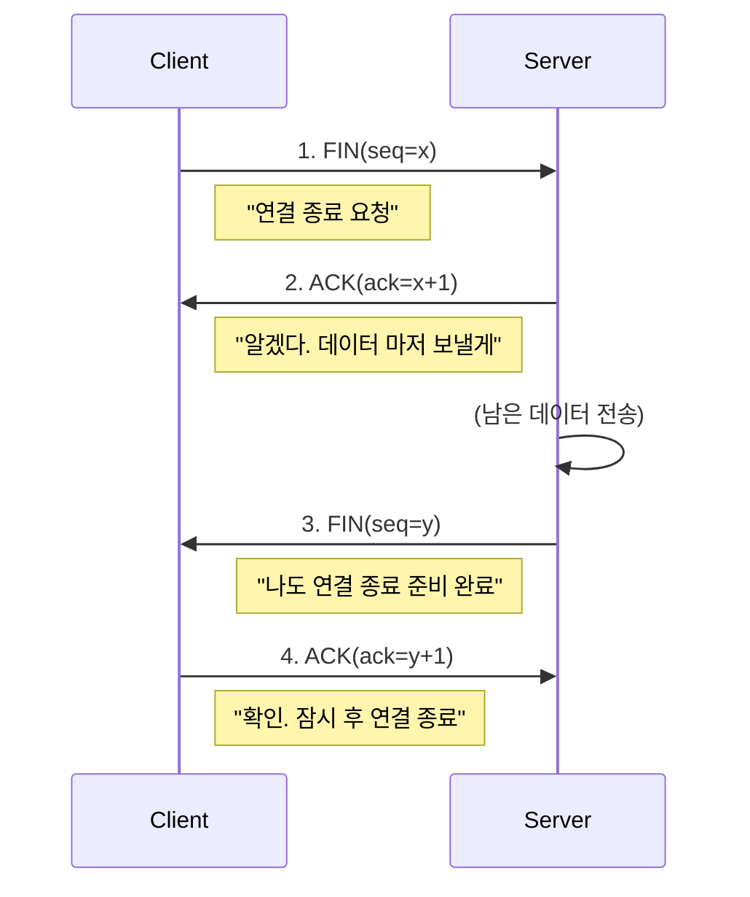

# TCP vs UDP, 3-Way Handshake, 혼잡 제어

## 1. 핵심 개념 (Core Concept)

\*\*TCP(Transmission Control Protocol)\*\*와 \*\*UDP(User Datagram Protocol)\*\*는 네트워크의 전송 계층(Transport Layer)에서 사용되는 핵심 프로토콜입니다. **TCP**는 신뢰성 있는 연결을 지향하며 데이터의 순서와 정확성을 보장하는 반면, **UDP**는 비연결형으로 속도를 우선시하여 데이터를 빠르게 전송하는 데 중점을 둡니다. TCP의 신뢰성은 **3-Way Handshake**로 대표되는 연결 설정 과정과, 네트워크 혼잡을 관리하는 **혼잡 제어(Congestion Control)** 메커니즘을 통해 확보됩니다.

______________________________________________________________________

## 2. 상세 설명 (Detailed Explanation)

### 2.1 TCP vs UDP 비교

| 특징            | TCP (Transmission Control Protocol)                                  | UDP (User Datagram Protocol)                                  |
| :-------------- | :------------------------------------------------------------------- | :------------------------------------------------------------ |
| **연결 방식**   | **연결 지향형 (Connection-oriented)**                                | **비연결 지향형 (Connectionless)**                            |
| **신뢰성**      | **높음** (데이터 순서 보장, 손실 시 재전송)                          | **낮음** (순서 보장 안됨, 재전송 없음)                        |
| **속도**        | 상대적으로 느림                                                      | **빠름**                                                      |
| **데이터 단위** | 세그먼트 (Segment)                                                   | 데이터그램 (Datagram)                                         |
| **제어 기능**   | **흐름 제어, 혼잡 제어 지원**                                        | 미지원                                                        |
| **주요 사용처** | 웹(HTTP), 이메일(SMTP), 파일 전송(FTP) 등 **신뢰성이 중요한 서비스** | 실시간 스트리밍, 온라인 게임, DNS 등 **속도가 중요한 서비스** |

### 2.2 TCP 연결 및 해제 과정

#### 가. 3-Way Handshake (연결 설정)

TCP는 데이터 전송에 앞서 클라이언트와 서버 간의 논리적인 연결을 수립하기 위해 3단계의 과정을 거칩니다. 이 과정을 통해 양측은 서로 통신할 준비가 되었음을 확인하고, 초기 시퀀스 번호(Sequence Number)를 교환합니다.

1. **\[SYN\]**: 클라이언트가 서버에 접속을 요청하는 `SYN` 패킷을 보냅니다.
1. **\[SYN+ACK\]**: 서버는 요청을 수락한다는 `ACK`와 함께, 자신도 통신을 시작하겠다는 `SYN` 패킷을 보냅니다.
1. **\[ACK\]**: 클라이언트는 서버의 응답을 확인했다는 `ACK` 패킷을 보냅니다.

#### 나. 4-Way Handshake (연결 해제)

TCP 연결을 종료할 때는 4단계 과정을 사용합니다. 이는 한쪽이 연결을 끊더라도 다른 쪽은 아직 보낼 데이터가 남아있을 수 있기 때문에, 양방향 통신을 각각 안전하게 종료하기 위함입니다.

### 2.3 TCP 혼잡 제어 (Congestion Control)

TCP 혼잡 제어는 네트워크 내의 혼잡을 감지하고, 데이터 전송 속도를 조절하여 네트워크의 오버플로우를 방지하는 중요한 메커니즘입니다. 송신 측은 \*\*혼잡 윈도우(Congestion Window, `cwnd`)\*\*라는 변수를 통해 한 번에 전송할 수 있는 데이터의 양을 동적으로 조절합니다.

#### 주요 알고리즘

- **느린 시작 (Slow Start)**: 연결 초기 단계에서 `cwnd`를 1부터 시작하여 매 RTT(Round Trip Time)마다 2배씩 지수적으로 증가시켜 네트워크의 수용량을 빠르게 탐색합니다.
- **혼잡 회피 (Congestion Avoidance) - AIMD**: `cwnd`가 특정 임계값(Threshold)을 넘어서면, 증가 속도를 늦춰 매 RTT마다 1씩 선형적으로 증가시킵니다. 혼잡(패킷 손실)이 감지되면 `cwnd`를 절반으로 줄입니다. (Additive Increase / Multiplicative Decrease)
- **빠른 재전송 (Fast Retransmit)**: 중간에 패킷이 손실되었을 때, 3개의 중복된 `ACK`를 수신하면 타임아웃을 기다리지 않고 즉시 해당 패킷을 재전송하여 불필요한 지연을 줄입니다.
- **빠른 회복 (Fast Recovery)**: 빠른 재전송 후, `cwnd`를 1로 줄이는 대신 절반으로 줄이고 선형적으로 증가시켜, 혼잡 상황에서 회복하는 속도를 개선합니다.

______________________________________________________________________

## 3. 예시 (Example)

### 사용 사례 시나리오

- **TCP**: 친구에게 중요한 계약서 파일을 이메일로 보낼 때. 파일의 내용이 단 한 글자도 빠지거    순서가 바뀌면 안 되므로, 신뢰성 높은 TCP가 사용됩니다.
- **UDP**: 친구와 실시간으로 온라인 축구 게임을 할 때. 약간의 화면 깨짐(패킷 손실)이 있더라도, 지연 없이 즉각적인 반응이 더 중요하므로 속도가 빠른 UDP가 사용됩니다.

______________________________________________________________________

## 4. 예상 면접 질문 (Potential Interview Questions)

- **Q. TCP와 UDP의 가장 큰 차이점은 무엇이며, 각각 어떤 서비스에 사용되나요?**

  - **A.** 가장 큰 차이점은 **신뢰성**과 **속도**입니다. TCP는 연결 설정, 데이터 순서 보장, 재전송 등을 통해 신뢰성 높은 통신을 제공하지만 상대적으로 느립니다. 따라서 웹(HTTP), 이메일(SMTP)처럼 데이터의 정확성이 중요한 서비스에 사용됩니다. 반면, UDP는 이러한 과정 없이 데이터를 빠르게 전송하는 데 집중하여 신뢰성은 낮지만 속도가 빠릅니다. 따라서 실시간 스트리밍이나 온라인 게임처럼 속도가 더 중요한 서비스에 사용됩니다.

- **Q. 3-Way Handshake는 왜 필요한가요? 2-Way로만 하면 안 되나요?**

  - **A.** 3-Way Handshake는 양쪽(클라이언트와 서버)이 서로의 초기 시퀀스 번호를 교환하고, 통신할 준비가 되었음을 확실히 확인하기 위해 필요합니다. 만약 2-Way로만 한다면, 서버는 클라이언트가 자신의 응답(SYN+ACK)을 잘 받았는지 확인할 방법이 없습니다. 과거에 보냈던 연결 요청이 네트워크 지연으로 인해 뒤늦게 서버에 도착하는 경우, 서버는 새로운 연결을 맺을 수 있지만 클라이언트는 이미 응답을 기다리지 않는 상태일 수 있어 불필요한 자원 낭비가 발생할 수 있습니다.

- **Q. TCP의 혼잡 제어는 왜 필요한가요?**

  - **A.** 네트워크는 여러 사용자가 공유하는 자원이므로, 한 송신자가 네트워크의 처리 용량을 초과하여 데이터를 보내면 네트워크 전체에 혼잡이 발생하여 패킷 손실이 증가하고 결국 모든 사용자의 통신 성능이 저하됩니다. TCP의 혼잡 제어는 이러한 상황을 방지하기 위해, 네트워크의 상태를 지속적으로 파악하고 데이터 전송률(혼잡 윈도우 크기)을 동적으로 조절하여 네트워크가 감당할 수 있는 수준으로 데이터를 전송함으로써 전체 네트워크의 안정성과 효율성을 유지하는 역할을 합니다.

______________________________________________________________________

## 5. 더 읽어보기 (Further Reading)

- [TCP (Transmission Control Protocol) (GeeksforGeeks)](https://www.geeksforgeeks.org/tcp-transmission-control-protocol/)
- [TCP Congestion Control (Wikipedia)](https://en.wikipedia.org/wiki/TCP_congestion_control)
- [An Overview of TCP (IBM)](https://www.ibm.com/docs/en/aix/7.2?topic=t-tcp-overview)
