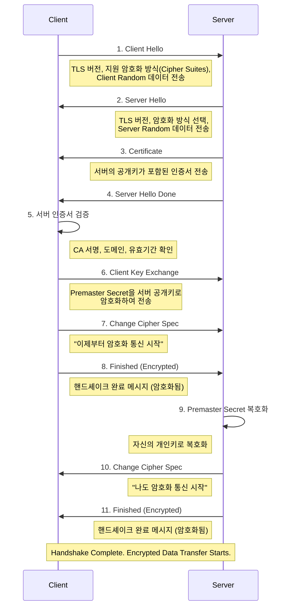

# TLS/SSL, 인증서 & HTTPS

## 1. 핵심 개념 (Core Concept)

**HTTPS(HyperText Transfer Protocol Secure)**는 표준 HTTP 프로토콜에 **TLS/SSL(Transport Layer Security/Secure Sockets Layer)**이라는 보안 계층을 추가하여 통신 내용을 암호화하는 방식입니다. **TLS/SSL**은 인터넷 통신의 **기밀성(Confidentiality)**, **무결성(Integrity)**, **인증(Authentication)**을 보장하는 암호화 프로토콜입니다. 이 과정에서 서버의 신원을 증명하고 암호화 통신에 필요한 공개키를 제공하는 **디지털 인증서(Digital Certificate)**가 핵심적인 역할을 수행합니다.

---

## 2. 상세 설명 (Detailed Explanation)

### 2.1 HTTPS의 암호화 방식

HTTPS는 **대칭키 암호화**와 **공개키(비대칭키) 암호화**를 함께 사용하는 **하이브리드 암호화** 방식을 사용합니다.

*   **공개키(비대칭키) 암호화**:
    *   **역할**: 실제 데이터를 암호화할 **대칭키(세션키)를 안전하게 교환**하는 데 사용됩니다.
    *   **특징**: 암호화와 복호화에 서로 다른 키(공개키, 개인키)를 사용합니다. 속도가 느리지만 키 교환에 안전합니다.
*   **대칭키 암호화**:
    *   **역할**: 교환된 대칭키를 사용하여 **실제 데이터를 암호화**하고 복호화합니다.
    *   **특징**: 암호화와 복호화에 동일한 키를 사용합니다. 속도가 매우 빠릅니다.

### 2.2 디지털 인증서 (Digital Certificate)

디지털 인증서는 온라인상의 '신분증'으로, 신뢰할 수 있는 제3자인 **인증 기관(CA, Certificate Authority)**이 발급합니다.

*   **주요 내용**:
    *   **주체(Subject)**: 인증서 소유자(웹사이트 도메인 등)의 정보
    *   **공개키(Public Key)**: 주체의 공개키
    *   **발급자(Issuer)**: 인증서를 발급한 CA의 정보
    *   **유효 기간(Validity)**: 인증서의 유효 시작일과 만료일
    *   **전자 서명(Digital Signature)**: 발급자인 CA가 자신의 개인키로 위 내용들을 암호화한 값. 이 서명을 통해 인증서의 위변조 여부를 검증할 수 있습니다.

### 2.3 TLS/SSL 핸드셰이크 (Handshake) 과정

TLS 핸드셰이크는 클라이언트와 서버가 보안 연결을 설정하기 위해 서로를 확인하고, 암호화 매개변수를 협상하며, 실제 데이터를 암호화할 **세션 키(대칭키)**를 생성 및 공유하는 과정입니다.

1.  **Client Hello**: 클라이언트가 서버에 지원 가능한 TLS 버전, 암호화 방식 목록, 랜덤 데이터를 전송합니다.
2.  **Server Hello & Certificate**: 서버는 클라이언트의 제안 중 하나를 선택하고, 자신의 정보와 함께 **공개키가 포함된 인증서**를 전송합니다.
3.  **클라이언트의 서버 인증 및 키 교환**:
    *   클라이언트는 내장된 CA 목록을 통해 서버의 **인증서를 검증**합니다.
    *   검증이 완료되면, 앞으로 사용할 **대칭키의 재료가 될 정보(Premaster Secret)를 생성**하여 서버의 **공개키로 암호화**한 뒤 서버에 전송합니다.
4.  **서버의 키 교환 및 핸드셰이크 완료**:
    *   서버는 자신의 **개인키**로 암호화된 Premaster Secret을 복호화합니다.
    *   이제 클라이언트와 서버 양쪽 모두 동일한 재료(Client Random, Server Random, Premaster Secret)를 갖게 되었으므로, 이를 조합하여 동일한 **세션 키(대칭키)**를 생성합니다.
    *   이후 모든 통신은 이 세션 키를 사용하여 암호화됩니다.

---

## 3. 예시 (Example)

### HTTPS 접속 시나리오

1.  **TCP 연결**: 사용자가 브라우저에 `https://www.google.com`을 입력하면, 먼저 TCP 3-Way Handshake를 통해 구글 서버와 연결을 맺습니다.
2.  **TLS 핸드셰이크 시작**:
    *   **Client -> Server**: "안녕, 나는 TLS 1.3까지 지원하고, 이런 암호화 방식을 쓸 수 있어. 내 랜덤 데이터는 A야."
    *   **Server -> Client**: "반가워, 그럼 TLS 1.3으로 하자. 암호화 방식은 이걸로 하고, 내 랜덤 데이터는 B야. 그리고 이게 내 신분증(인증서)이야."
3.  **인증 및 키 교환**:
    *   **Client**: (브라우저에 내장된 신뢰할 수 있는 CA 목록을 보고) "음, 이 인증서는 신뢰할 만한 기관이 발급했군. 유효기간도 괜찮고. 좋아, 믿을게."
    *   **Client -> Server**: (대칭키 재료 C를 구글의 공개키로 암호화해서) "이거 받아."
4.  **세션 키 생성 및 암호화 통신 시작**:
    *   서버는 자신의 개인키로 암호화된 재료 C를 복호화합니다.
    *   이제 클라이언트와 서버 모두 A, B, C라는 재료를 가지고 있으므로, 똑같은 **세션 키(대칭키)**를 만들어냅니다.
    *   이후 모든 데이터(HTTP 요청/응답)는 이 세션 키로 암호화되어 안전하게 통신합니다.

---

## 4. 예상 면접 질문 (Potential Interview Questions)

*   **Q. HTTPS는 대칭키와 공개키 암호화 방식을 모두 사용하는데, 그 이유는 무엇인가요?**
    *   **A.** 두 방식의 장점만을 취하기 위함입니다. 공개키 암호화 방식은 키를 안전하게 교환할 수 있다는 장점이 있지만, 연산량이 많아 속도가 매우 느립니다. 반면, 대칭키 암호화 방식은 속도가 매우 빠르지만, 사전에 양측이 안전하게 키를 공유해야 한다는 문제가 있습니다. 따라서, 속도가 느리지만 안전한 공개키 방식으로 실제 데이터를 암호화할 대칭키(세션키)를 교환하고, 그 후에는 속도가 빠른 대칭키 방식으로 통신하여 **보안성**과 **성능**을 모두 만족시키는 것입니다.

*   **Q. 클라이언트는 서버의 인증서가 진짜인지 어떻게 신뢰할 수 있나요?**
    *   **A.** 클라이언트(웹 브라우저)는 내부에 신뢰할 수 있는 **최상위 인증 기관(Root CA)의 목록**과 각 CA의 공개키를 미리 가지고 있습니다. 클라이언트는 서버로부터 받은 인증서를 발급한 CA가 이 목록에 있는지 확인하고, 해당 CA의 공개키를 사용하여 인증서의 전자 서명을 복호화합니다. 복호화된 값과 인증서의 내용을 비교하여 인증서가 위변조되지 않았음을 검증함으로써 신뢰성을 확보합니다.

*   **Q. TLS 핸드셰이크 과정의 핵심 목표는 무엇인가요?**
    *   **A.** 핵심 목표는 두 가지입니다. 첫째, 클라이언트가 접속하려는 서버가 진짜인지 **서버를 인증**하는 것입니다. 둘째, 앞으로 클라이언트와 서버가 주고받을 모든 데이터를 암호화하고 복호화하는 데 사용할 **하나의 동일한 대칭키(세션 키)를 안전하게 생성하고 공유**하는 것입니다.

---

## 5. 더 읽어보기 (Further Reading)

*   [How HTTPS Works (Cloudflare)](https://www.cloudflare.com/learning/ssl/how-does-ssl-work/)
*   [Transport Layer Security (TLS) (MDN Web Docs)](https://developer.mozilla.org/en-US/docs/Web/Security/Transport_Layer_Security)
*   [X.509 (Wikipedia)](https://en.wikipedia.org/wiki/X.509)