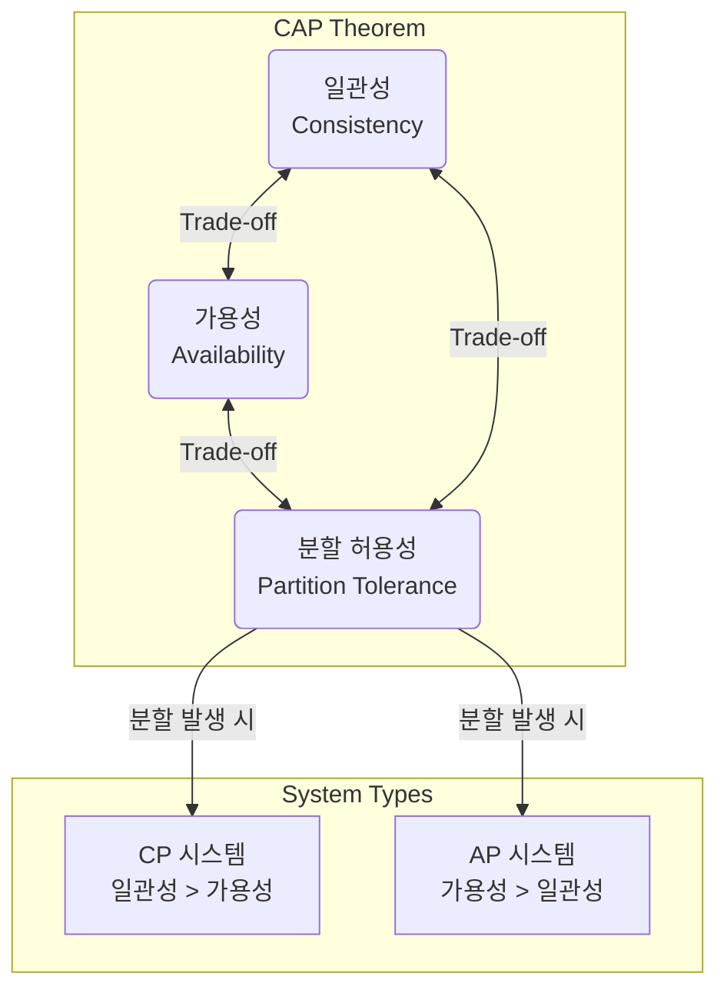

# ACID, CAP 정리 & BASE

## 1. 핵심 개념 (Core Concept)

**ACID, CAP, BASE**는 데이터베이스 시스템, 특히 분산 시스템에서 데이터의 **일관성, 가용성, 신뢰성**을 어떻게 보장할 것인지에 대한 핵심 원칙들입니다. **ACID**는 전통적인 관계형 데이터베이스(RDBMS)가 트랜잭션의 무결성을 보장하기 위한 4가지 속성을 정의합니다. **CAP 이론**은 분산 시스템이 동시에 만족시킬 수 없는 3가지 속성 간의 트레이드오프를 설명하며, **BASE**는 CAP 이론에 따라 가용성을 극대화하기 위해 일관성을 완화하는 NoSQL 시스템의 설계 철학을 나타냅니다.

---

## 2. 상세 설명 (Detailed Explanation)

### 2.1 ACID: 트랜잭션의 무결성을 위한 4가지 원칙

ACID는 주로 **관계형 데이터베이스(RDBMS)**에서 트랜잭션(Transaction)이 안전하게 수행되기 위해 갖춰야 할 4가   속성을 의미합니다. 데이터의 일관성과 신뢰성을 최우선으로 보장하는 데 중점을 둡니다.

*   **원자성 (Atomicity)**: 트랜잭션에 포함된 모든 작업이 **전부 성공하거나 전부 실패**해야 합니다 (All or Nothing). 예를 들어, 계좌 이체 시 송금과 입금 작업이 모두 완료되어야 하며, 하나라도 실패하면 모든 작업이 취소(Rollback)되어 원래 상태로 돌아갑니다.
*   **일관성 (Consistency)**: 트랜잭션이 성공적으로 완료되면 데이터베이스는 항상 **일관된 상태**를 유지해야 합니다. 즉, 데이터베이스에 정의된 무결성 제약 조건(예: 기본 키, 외래 키)을 항상 만족해야 합니다.
*   **고립성 (Isolation)**: 여러 트랜잭션이 동시에 실행될 때 서로의 작업에 영향을 주지 않고 **독립적으로 실행**되어야 합니다. 이를 통해 동시성 문제를 방지하며, 격리 수준(Isolation Level)에 따라 성능과 동시성 제어의 정도가 달라집니다.
*   **지속성 (Durability)**: 성공적으로 완료된 트랜잭션의 결과는 시스템에 장애가 발생하더라도 **영구적으로 저장**되어야 합니다. 이는 보통 로그(Log)나 비휘발성 메모리를 통해 보장됩니다.

### 2.2 CAP 이론: 분산 시스템의 트레이드오프

CAP 이론은 분산 데이터베이스 시스템이 동시에 만족시킬 수 없는 세 가지 속성을 정의하며, 이 중 **최대 두 가지만을 보장**할 수 있다는 것을 의미합니다.

*   **일관성 (Consistency)**: 모든 노드가 **동시에 같은 데이터**를 보여줘야 합니다. 어떤 노드에 데이터를 쓰면, 다른 모든 노드에서도 즉시 해당 데이터가 보여야 합니다.
*   **가용성 (Availability)**: 모든 요청은 **항상 성공 또는 실패 응답**을 받을 수 있어야 합니다. 즉, 일부 노드에 장애가 발생하더라도 시스템은 계속해서 작동해야 합니다.
*   **분할 허용성 (Partition Tolerance)**: 노드 간의 통신이 끊어지는 **네트워   분할** 상황에서도 시스템이 계속 동작해야 합니다.

현대의 분산 시스템은 네트워크 분할을 피할 수 없으므로 **분할 허용성(P)을 기본 전제**로 합니다. 따라서 분산 시스템 설계자는 **일관성(C)과 가용성(A) 사이에서 하나를 선택**해야 하는 트레이드오프에 직면하게 됩니다.

*   **CP (Consistency/Partition Tolerance)**: 가용성을 희생하고 데이터의 일관성을 우선시합니다. (예: MongoDB, Redis)
*   **AP (Availability/Partition Tolerance)**: 일관성을 희생하고 가용성을 우선시합니다. (예: Cassandra, DynamoDB)

### 2.3 BASE: 가용성을 위한 NoSQL의 철학

BASE는 주로 **NoSQL 데이터베이스**에서 사용되는 모델로, ACID의 엄격한 제약을 완화하여 가용성과 성능을 높이는 데 초점을 맞춥니다. 이는 CAP 이론에서 AP 시스템의 특성을 반영합니다.

*   **기본적인 가용성 (Basically Available - BA)**: 시스템의 일부에 장애가 발생하더라도 전체 시스템은 계속해서 사용 가능해야 합니다.
*   **소프트 상태 (Soft State)**: 외부의 정보가 없어도 노드의 상태가 변경될 수 있습니다. 즉, 데이터의 일관성은 시간이 지나면서 변할 수 있습니다.
*   **최종적 일관성 (Eventually Consistent - E)**: 데이터의 일관성이 즉시 보장되지는 않지만, 일정 시간이 지나면 **결국 모든 노드의 데이터가 일관된 상태**를 유지하게 됩니다.

---

## 3. 예시 (Example)

### 시나리오별 데이터베이스 선택

*   **은행 시스템 (ACID)**: 고객의 계좌 잔액은 단 1원이라도 틀리면 안 되므로, 트랜잭션의 원자성과 데이터의 강력한 일관성을 보장하는 **ACID** 기반의 RDBMS(예: MySQL, PostgreSQL)가 필수적입니다.
*   **전자상거래 상품 재고 관리 (CAP - CP)**: 사용자가 상품을 주문할 때 정확한 재고 확인이 중요합니다. 네트워크 분할 시, 일시적으로 주문이 불가능하더라도(가용성 저하), 재고 데이터가 틀리는 것(일관성 깨짐)을 막아야 하므로 **CP** 시스템을 선택할 수 있습니다.
*   **소셜 미디어 피드 (BASE)**: 친구의 새로운 게시물이 나에게 몇 초 늦게 보이는 것은 큰 문제가 되지 않습니다. 그보다 서비스가 멈추지 않고 항상 빠르게 반응하는 것(가용성)이 더 중요하므로, **BASE** 원칙을 따르는 NoSQL(예: Cassandra)이 적합합니다. 데이터는 잠시 불일치할 수 있지만 결국에는 모든 사용자에게 보이게 됩니다(최종적 일관성).

---

## 4. 예상 면접 질문 (Potential Interview Questions)

*   **Q. ACID 속성에 대해 각각 설명해주세요.**
    *   **A.** ACID는 트랜잭션의 신뢰성을 보장하는 네 가지 속성입니다. **원자성**은 트랜잭션이 모두 성공하거나 모두 실패하는 것을 보장하고, **일관성**은 트랜잭션 후에도 데이터베이스가 유효한 상태를 유지하는 것을 의미합니다. **고립성**은 여러 트랜잭션이 동시에 실행될 때 서로 영향을 주지 않도록 하며, **지속성**은 성공한 트랜잭션의 결과가 영구적으로 저장되는 것을 보장합니다.

*   **Q. CAP 이론에서 분산 시스템이 세 가지 속성을 동시에 만족시킬 수 없는 이유는 무엇인가요?**
    *   **A.** 네트워크 분할(P)이 발생한 상황을 가정해보겠습니다. 이때 시스템이 가용성(A)을 선택한다면, 분리된 노드에 쓰기 요청을 허용해야 하므로 다른 노드와의 데이터 일관성(C)이 깨지게 됩니다. 반대로 일관성(C)을 선택한다면, 데이터 불일치를 막기 위해 분리된 노드는 쓰기 요청에 응답할 수 없으므로 가용성(A)이 희생됩니다. 이처럼 네트워크 분할 상황에서는 일관성과 가용성이 양립할 수 없기 때문에, 세 가지를 동시에 만족시킬 수 없습니다.

*   **Q. NoSQL 데이터베이스가 최종적 일관성(Eventually Consistent) 모델을 채택하는 이유는 무엇인가요?**
    *   **A.** NoSQL 데이터베이스는 대규모 데이터와 높은 트래픽을 처리하기 위해 수평적 확장(Scale-out)과 고가용성을 최우선 목표로 설계되었습니다. CAP 이론에 따라, 네트워크 분할 상황에서도 높은 가용성을 유지하기 위해서는 데이터의 즉각적인 일관성을 어느 정도 포기해야 합니다. 따라서 실시간으로 모든 노드의 데이터가 일치하는 강력한 일관성 대신, 약간의 지연을 허용하더라도 결국에는 데이터가 일관된 상태에 도달하는 '최종적 일관성' 모델을 채택하여 시스템의 가용성과 성능을 극대화하는 것입니다.

---

## 5. 더 읽어보기 (Further Reading)

*   [ACID (Wikipedia)](https://en.wikipedia.org/wiki/ACID)
*   [CAP theorem (Wikipedia)](https://en.wikipedia.org/wiki/CAP_theorem)
*   [Brewer's CAP Theorem (Julian Browne)](https://www.julianbrowne.com/article/brewers-cap-theorem/)