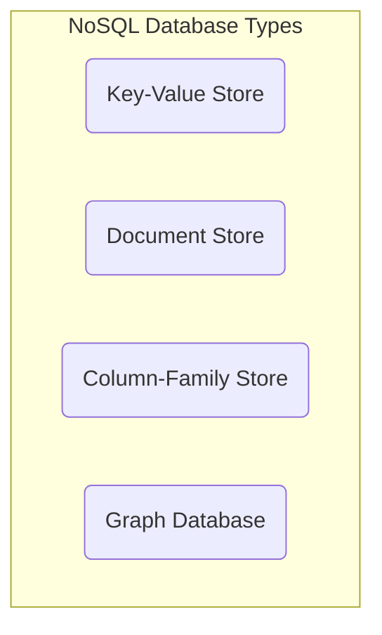

# 관계형 vs NoSQL (문서, 키-값, 그래프)

## 1. 핵심 개념 (Core Concept)

데이터베이스는 크게 **관계형 데이터베이스(RDBMS)**와 **NoSQL(Not Only SQL)** 데이터베이스로 나뉩니다. **RDBMS**는 정해진 스키마에 따라 데이터를 2차원 테이블 형태로 저장하며, 데이터의 일관성과 무결성을 중요시합니다. 반면, **NoSQL**은 정해진 스키마 없이 다양한 데이터 모델(문서, 키-값, 그래프 등)을 지원하여, 대용량 데이터의 유연한 처리와 수평적 확장에 강점을 가집니다.

---

## 2. 상세 설명 (Detailed Explanation)

### 2.1 관계형 데이터베이스 (RDBMS - Relational Database)

RDBMS는 데이터를 행(Row)과 열(Column)으로 구성된 테이블에 저장하며, SQL(Structured Query Language)을 사용하여 데이터를 관리합니다. 테이블 간의 관계(Relation)를 설정하여 여러 데이터를 연결하고 관리하는 데 용이합니다.

*   **주요 특징**:
    *   **엄격한 스키마**: 명확하게 정의된 스키마에 따라 데이터를 저장하여 데이터 무결성을 보장합니다.
    *   **데이터 무결성**: 데이터의 중복을 최소화하고 일관성을 유지하는 데 강점을 가집니다.
    *   **트랜잭션(ACID)**: 원자성(Atomicity), 일관성(Consistency), 고립성(Isolation), 지속성(Durability)을 보장하여 데이터의 안정적인 처리가 가능합니다.
    *   **Join 연산**: 여러 테이블을 연결하여 복잡한 쿼리를 처리할 수 있습니다.
*   **대표적인 RDBMS**: MySQL, Oracle, PostgreSQL, Microsoft SQL Server

### 2.2 NoSQL (Not Only SQL) 데이터베이스

NoSQL은 관계형 모델에 국한되지 않는 다양한 데이터 저장 기술을 의미합니다. 빅데이터의 등장으로 대용량의 비정형 데이터를 처리하기 위해 개발되었으며, 분산 저장을 통해 뛰어난 확장성을 제공합니다.

*   **주요 특징**:
    *   **유연한 스키마 (Schema-less)**: 스키마가 없어 다양한 형태의 데이터를 자유롭게 저장할 수 있습니다.
    *   **수평적 확장 (Scale-out)**: 여러 서버에 데이터를 분산 저장하여 시스템을 확장하기 용이합니다.
    *   **고성능**: 데이터 읽기 및 쓰기 속도가 빠릅니다.
    *   **다양한 데이터 모델**: 데이터 모델에 따라 여러 종류로 나   니다.

#### NoSQL 데이터베이스 종류

*   **문서(Document) 데이터베이스**:
    *   **구조**: JSON, XML과 유사한 문서(Document) 형태로 데이터를 저장합니다. 각 문서는 필드와 값의 쌍으로 구성되며, 계층적인 데이터 구조를 표현하는 데 용이합니다.
    *   **특징**: 스키마가 유연하고, 객체를 문서 형태로 바로 저장할 수 있어 개발이 편리합니다.
    *   **대표 DB**: **MongoDB**, CouchDB
*   **키-값(Key-Value) 데이터베이스**:
    *   **구조**: 가장 단순한 형태로, 고유한 키(Key)에 하나의 값(Value)을 연결하여 데이터를 저장합니다.
    *   **특징**: 구조가 단순하여 질의 속도가 매우 빠릅니다. 값(Value)에는 이미지, 비디오 등 모든 형태의 데이터를 저장할 수 있습니다.
    *   **대표 DB**: **Redis**, Amazon DynamoDB
*   **그래프(Graph) 데이터베이스**:
    *   **구조**: 데이터를 노드(Node)와 엣지(Edge), 속성(Property)으로 구성된 그래프 형태로 표현하고 저장합니다.
    *   **특징**: 데이터 간의 관계를 분석하고 탐색하는 데   적화되어 있습니다.
    *   **대표 DB**: **Neo4j**, Amazon Neptune

### 2.3 RDBMS vs NoSQL 비교

| 구분 | RDBMS (관계형) | NoSQL (비관계형) |
| :--- | :--- | :--- |
| **데이터 구조** | 정형 데이터, **엄격한 스키마** | 비정형/반정형 데이터, **유연한 스키마** |
| **확장성** | 주로 **수직적 확장** (Scale-up) | 주로 **수평적 확장** (Scale-out) |
| **일관성 모델** | 강한 일관성 (**ACID**) | 결과적 일관성 (**BASE**) |
| **쿼리 언어** | **SQL** 사용 | 다양한 API/쿼리 언어 사용 |
| **대표 사례** | MySQL, PostgreSQL | MongoDB, Redis, Neo4j |

---

## 3. 예시 (Example)

### 사용 사례별 데이터베이스 선택

*   **은행 시스템, 전자상거래 주문/결제**:
    *   **RDBMS**가 적합합니다. 데이터의 무결성과 트랜잭션의 정확성(ACID)이 매우 중요하기 때문입니다. 모든 데이터는 정해진 규칙에 따라 정확하게 기록되어야 합니다.
*   **소셜 미디어 피드, IoT 데이터 수집**:
    *   **NoSQL (문서 또는 키-값)**이 적합합니다. 수많은 사용자가 생성하는 비정형 데이터를 빠르게 쓰고 읽어야 하며, 대규모 트래픽을 감당하기 위한 수평적 확장이 필수적이기 때문입니다.
*   **추천 엔진, 사기 탐지 시스템**:
    *   **NoSQL (그래프)**가 적합합니다. 사용자와 상품, 또는 사용자 간의 복잡한 관계를 분석하여 'A 상품을 산 사람이 B 상품도 구매했다' 또는 'A와 B는 친구의 친구 관계다'와 같은 관계 기반의 데이터를 빠르게 탐색해야 하기 때문입니다.

---

## 4. 예상 면접 질문 (Potential Interview Questions)

*   **Q. RDBMS와 NoSQL의 가장 큰 차이점은 무엇인가요?**
    *   **A.** 가장 큰 차이점은 **데이터 구조의 유연성**과 **확장 방식**에 있습니다. RDBMS는 정해진 스키마에 따라 정형화된 데이터를 저장하며 주로 수직적으로 확장하는 반면, NoSQL은 스키마 없이 다양한 형태의 데이터를 저장할 수 있어 유연하고, 여러 서버에 데이터를 분산하는 수평적 확장에 강점을 가집니다.

*   **Q. 어떤 경우에 RDBMS 대신 NoSQL을 사용하는 것을 고려해야 할까요?**
    *   **A.** 데이터의 구조가 명확하지 않거나 자주 변경될 가능성이 있을 때, 처리해야 할 데이터의 양이 매우 많아 수평적 확장이 필요할 때, 그리고 데이터의 일관성보다 빠른 읽기/쓰기 성능과 가용성이 더 중요할 때 NoSQL을 고려하는 것이 좋습니다. 예를 들어, 빅데이터 처리, 실시간 웹 애플리케이션, IoT 데이터 수집 등이 좋은 예입니다.

*   **Q. 키-값 스토어인 Redis가 캐싱 솔루션으로 많이 사용되는 이유는 무엇인가요?**
    *   **A.** Redis는 모든 데이터를 메모리에 저장하는 **인메모리(In-memory) 데이터베이스**이기 때문입니다. 디스크에 접근하는 것보다 메모리에서 데이터를 읽는 것이 훨씬 빠르므로, 자주 접근하지만 잘 변하지 않는 데이터를 Redis에 캐싱해두면 데이터베이스의 부하를 크게 줄이고 애플리케이션의 응답 속도를 획기적으로 향상시킬 수 있습니다. 또한, 간단한 키-값 구조는 데이터를 저장하고 조회하는 속도를 극대화합니다.

---

## 5. 더 읽어보기 (Further Reading)

*   [Relational vs. NoSQL Databases (AWS)](https://aws.amazon.com/compare/the-difference-between-relational-and-non-relational-databases/)
*   [NoSQL Databases Explained (MongoDB)](https://www.mongodb.com/nosql-explained)
*   [What is a Graph Database? (Neo4j)](https://neo4j.com/developer/graph-database/)