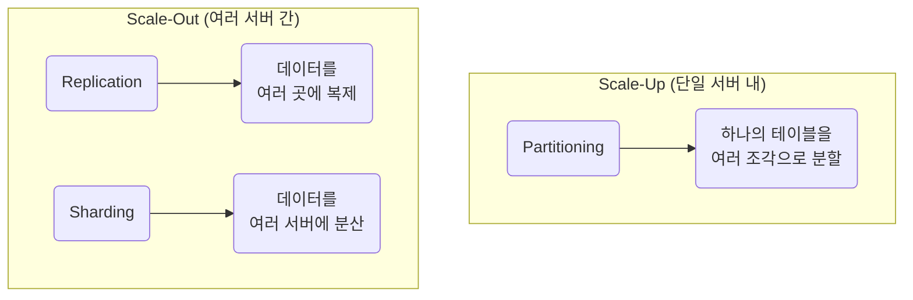

# 복제, 샤딩, 파티셔닝

## 1. 핵심 개념 (Core Concept)

**복제(Replication), 샤딩(Sharding), 파티셔닝(Partitioning)**은 대용량 데이터베이스 시스템의 **가용성, 확장성, 성능**을 향상시키기 위한 핵심 기술입니다. **복제**는 데이터를 여러 곳에 복사하여 데이터의 가용성을 높이고 읽기 부하를 분산합니다. **파티셔닝**은 하나의 서버 내에서 거대한 테이블을 논리적으로 분할하여 관리 용이성과 성능을 높이는 기술입니다. **샤딩**은 파티셔닝을 여러 서버로 확장한 개념으로, 데이터를 여러 서버에 분산 저장하여 시스템 전체의 처리 용량을 수평적으로 확장합니다.

---

## 2. 상세 설명 (Detailed Explanation)

### 2.1 복제 (Replication)

복제는 원본 데이터베이스(Master/Primary)의 데이터를 하나 이상의 다른 데이터베이스(Slave/Secondary)에 **중복 저장**하는 기술입니다.

*   **목적**: **고가용성(High Availability)** 확보 및 **읽기 성능 향상**.
*   **동작 방식**:
    *   **Master-Slave 구조**: 쓰기(Write) 작업은 마스터 서버에서만 수행되고, 변경된 내용은 슬레이브 서버로 전파됩니다. 읽기(Read) 작업은 여러 슬레이브 서버로 분산하여 마스터의 부하를 줄입니다.
    *   **장애 복구 (Failover)**: 마스터 서버에 장애 발생 시, 슬레이브 서버 중 하나를 새로운 마스터로 승격시켜 서비스 중단을 최소화합니다.
*   **장점**: 데이터 백업, 장애 복구 용이, 읽기 부하 분산.
*   **단점**: 쓰기 성능 확장에 한계, 비동기 복제 시 일시적인 데이터 불일치 가능성, 하드웨어 비용 증가.

### 2.2 파티셔닝 (Partitioning)

파티셔닝은 **하나의 데이터베이스 서버 내에서** 거대한 테이블이나 인덱스를 '파티션'이라는 더 작은 단위로 **물리적으로 분할**하는 기술입니다. 논리적으로는 여전히 하나의 테이블처럼 보입니다.

*   **목적**: **관리 용이성** 및 **조회 성능 향상**.
*   **동작 방식**: 특정 '파티션 키'를 기준으로 데이터를 분할합니다.
    *   **Range Partitioning**: 날   나 숫자처럼 연속적인 값의 범위를 기준으로 분할 (예: 월별 매출 데이터).
    *   **List Partitioning**: 특정 값 목록을 기준으로 분할 (예: 국가별 사용자 데이터).
    *   **Hash Partitioning**: 파티션 키의 해시 값을 기준으로 데이터를 균등하게 분할.
*   **장점**: 쿼리 시 필요한 파티션만 스캔하여 성능 향상, 파티션 단위 백업/복구 등 관리 효율 증대.
*   **단점**: 파티션 키 설정이 중요하며, 여러 파티션에 걸친 조인 시 성능 저하 가능성.

### 2.3 샤딩 (Sharding)

샤딩은 파티셔닝과 유사하지만, 분할된 데이터를 **여러 다른 서버에 분산 저장**한다는 점에서 차이가 있습니다. 데이터베이스의 **수평적 확장(Scale-out)**을 위한 핵심 기술입니다.

*   **목적**: **쓰기/읽기 성능** 및 **시스템 전체의 확장성** 향상.
*   **동작 방식**: 파티셔닝과 마찬가지로 '샤드 키'를 기준으로 데이터를 분할하고, 각 '샤드(Shard)'를 별개의 서버에 저장합니다.
*   **장점**:
    *   **수평적 확장**: 서버를 추가하여 시스템 전체의 처리 용량을 거의 무한정 확장할 수 있습니다.
    *   **성능 향상**: 쿼리가 특정 샤드에서만 실행되므로 검색 범위가 줄어들어 응답   도가 빨라집니다.
    *   **장애 범위 축소**: 장애가 발생하더라도 해당 샤드에만 영향이 국한됩니다.
*   **단점**:
    *   **구현 및 운영의 복잡성**: 애플리케이션 레벨에서 샤드 키를 관리하고 라우팅하는 로직이 필요하며, 운영이 매우 복잡합니다.
    *   **데이터 쏠림 (Hotspot)**: 샤드 키를 잘못 선정하면 특정 샤드에만 데이터가 집중되어 성능이 저하될 수 있습니다.
    *   **크로스-샤드 조인**: 여러 샤드에 걸친 조인 연산은 매우 복잡하고 성능이 크게 저하됩니다.

### 2.4 비교 요약

| 구분 | 복제 (Replication) | 파티셔닝 (Partitioning) | 샤딩 (Sharding) |
| :--- | :--- | :--- | :--- |
| **목적** | 가용성, 읽기 부하 분산 | 관리 용이성, 조회 성능 | **쓰기/읽기 성능, 확장성** |
| **데이터 저장** | 여러 서버에 **중복** 저장 | 단일 서버 내에서 **분할** 저장 | 여러 서버에 **분산** 저장 |
| **서버 구성** | 여러 대 (Master/Slave) | **한 대** | 여러 대 |
| **확장 방식** | 읽기 부하 분산 (Scale-out) | 단일 서버 내 성능 최적화 | **수평적 확장 (Scale-out)** |
| **핵심 고려사항** | 데이터 동기화 지연 | 파티션 키 선정 | **구현 복잡성, 샤드 키 선정** |

---

## 3. 예시 (Example)

### 시나리오: 급성장하는 소셜 미디어 서비스

1.  **초기 단계**: 단일 데이터베이스 서버로 시작.
2.  **사용자 증가 (읽기 부하 증가)**: 사용자가 많아져 글을 읽는 요청이 급증. 쓰기보다 읽기 작업이 훨씬 많아짐.
    *   **해결책**: **복제(Replication)** 도입. Master 서버는 쓰기만 처리하고, 여러 Slave 서버를 두어 읽기 요청을 분산시킴.
3.  **데이터 급증 (테이블 크기 문제)**: `posts` 테이블의 데이터가 수억 건으로 늘어나, 특정 기간의 게시물을 조회하는 쿼리가 매우 느려짐.
    *   **해결책**: **파티셔닝(Partitioning)** 도입. `posts` 테이블을 작성 월(month) 기준으로 파티셔닝하여, 특정 월의 데이터를 조회할 때 해당 파티션만 스캔하도록 함.
4.  **글로벌 서비스 확장 (쓰기/읽기 부하 모두 폭증)**: 전 세계 사용자가 글을 쓰기 시작하여 Master 서버의 쓰기 성능이 한계에 도달.
    *   **해결책**: **샤딩(Sharding)** 도입. 사용자 국가(country) 또는 사용자 ID를 샤드 키로 하여 데이터베이스를 여러 서버로 분산. 미국 사용자의 데이터는 미국 서버에, 유럽 사용자의 데이터는 유럽 서버에 저장하여 쓰기/읽기 부하를 전 세계적으로 분산시킴.

---

## 4. 예상 면접 질문 (Potential Interview Questions)

*   **Q. 복제와 샤딩의 근본적인 차이점은 무엇인가요?**
    *   **A.** 근본적인 차이점은 **데이터 저장 방식**과 **주요 목적**에 있습니다. 복제는 동일한 데이터를 여러 서버에 **중복**으로 저장하여 데이터의 가용성을 높이고 읽기 부하를 분산하는 것이 주 목적입니다. 반면, 샤딩은 전체 데이터를 여러 조각으로 나누어 각기 다른 서버에 **분산** 저장하여, 쓰기를 포함한 시스템 전체의 처리 용량을 수평적으로 확장하는 것이 주 목적입니다.

*   **Q. 파티셔닝과 샤딩은 어떻게 다른가요?**
    *   **A.** 파티셔닝은 **하나의 데이터베이스 서버 내에서** 큰 테이블을 논리적으로 나누는 기술이고, 샤딩은 파티셔닝된 데이터를 **여러 다른 서버로 분산**시키는 기술입니다. 즉, 파티셔닝이 단일 서버 내에서의 최적화 기법이라면, 샤딩은 여러 서버로 시스템을 확장하는 스케일 아웃(Scale-out) 기법이라고 할 수 있습니다.

*   **Q. 샤딩을 도입할 때 가장 중요하게 고려해야 할 점은 무엇인가요?**
    *   **A.** **샤드 키(Shard Key)를 어떻게 선정할 것인가**가 가장 중요합니다. 샤드 키가 잘못 선정되면 데이터가 특정 샤드에만 몰리는 '핫스팟(Hotspot)' 문제가 발생하여 성능이 저하되고 샤딩의 이점을 누릴 수 없게 됩니다. 또한, 한 번 샤딩을 적용하면 아키텍처를 변경하기 매우 어렵기 때문에, 애플리케이션의 쿼리 패턴과 데이터 성장률을 신중하게 분석하여 샤드 키를 설계해야 합니다.

---

## 5. 더 읽어보기 (Further Reading)

*   [Database Replication (Wikipedia)](https://en.wikipedia.org/wiki/Database_replication)
*   [Understanding Sharding (DigitalOcean)](https://www.digitalocean.com/community/tutorials/understanding-database-sharding)
*   [Partitioning vs. Sharding (Medium)](https://medium.com/@jeeyoung.kim.dev/partitioning-vs-sharding-a7526489373d)