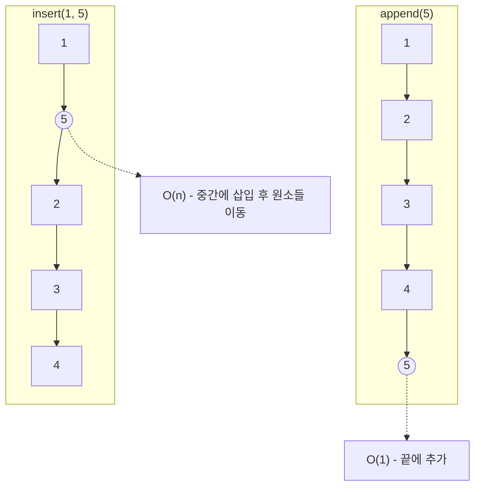

# 배열 & Python 리스트 (append, insert, 재할당)

## 1. 핵심 개념 (Core Concept)

\*\*배열(Array)\*\*은 동일한 타입의 원소들을 **연속된 메모리 공간**에 저장하는 기본적인 자료구조로, 크기가 고정되어 있고 인덱스를 통한 빠른 접근이 특징입니다. 파이썬의 \*\*리스트(List)\*\*는 이러한 배열을 기반으로 하지만, 크기가 동적으로 변할 수 있는 \*\*동적 배열(Dynamic Array)\*\*로 구현되어 있습니다. 이 동적인 특성은 내부적인 **메모리 재할당** 과정을 통해 이루어집니다.

______________________________________________________________________

## 2. 상세 설명 (Detailed Explanation)

### 2.1 배열 (Array) vs 파이썬 리스트 (List)

| 특징            | 배열 (Array)                              | 파이썬 리스트 (Python List)                      |
| :-------------- | :---------------------------------------- | :----------------------------------------------- |
| **메모리 구조** | 원소들이 메모리상에 **연속적으로** 나열됨 | 객체에 대한 **포인터(참조)가 연속적으로** 나열됨 |
| **데이터 타입** | **동일한 타입**만 저장 가능 (Homogeneous) | **다양한 타입** 저장 가능 (Heterogeneous)        |
| **크기**        | **고정 크기** (Fixed-size)                | **동적 크기** (Dynamic-size)                     |

파이썬 리스트는 실제 데이터(객체)를 직접 저장하는 것이 아니라, 객체의 메모리 주소를 가리키는 포인터를 배열 형태로 저장합니다. 이 때문에 다양한 타입의 데이터를 한 리스트에 담을 수 있습니다.

### 2.2 시간 복잡도: `append` vs `insert`

파이썬 리스트에서 원소를 추가하는 두 가지 주요 방법인 `append`와 `insert`는 성능 면에서 큰 차이를 보입니다.

#### `append(x)`: 리스트의 끝에 원소 추가

- **시간 복잡도**: **분할 상환 O(1) (Amortized O(1))**
- **동작 원리**: 대부분의 경우, 리스트 끝에 미리 할당된 여유 공간에 새로운 원소의 참조를 추가하므로 O(1)의 빠른 속도를 보입니다. 하지만 이 공간이 꽉 차면 **메모리 재할당**이 발생하여 일시적으로 O(n)의 비용이 듭니다. 이런 비싼 연산이 드물게 발생하므로, 평균적으로는 O(1)로 간주합니다.

#### `insert(i, x)`: 특정 인덱스 `i`에 원소 삽입

- **시간 복잡도**: **O(n)**
- **동작 원리**: 특정 인덱스 `i`에 원소를 삽입하  면, 그 위치부터 뒤에 있던 모든 원소들을 한 칸씩 뒤로 밀어야 합니다. 최악의 경우(인덱스 0에 삽입), 모든 원소를 이동시켜야 하므로 리스트의 길이에 비례하는 시간이 걸립니다.



### 2.3 메모리 재할당 (Memory Reallocation)

메모리 재할당은 파이썬 리스트가 동적으로 크기를 조절할 수 있게 하는 핵심 메커니즘입니다.

- **발생 시점**: `append` 등으로 원소를 추가할 때, 리스트에 할당된 메모리 공간이 가득 차면 발생합니다.
- **과정**:
  1. 기존보다 더 큰 새로운 메모리 블록을 할당합니다. (CPython에서는 약 1.125배씩 증가)
  1. 기존 메모리 블록에 있던 모든 원소(참조)들을 새로운 메모리 블록으로 **복사**합니다.
  1. 기존 메모리 블록을 해제합니다.
- **과잉 할당 (Over-allocation)**: 파이썬   이러한 비싼 재할당 연산을 최소화하기 위해, 필요할 때마다 딱 맞는 크기가 아닌 **필요한 것보다 더 큰 공간을 미리 할당**합니다. 이 여유 공간 덕분에 여러 번의 `append` 연산이 O(1) 시간 복잡도로 수행될 수 있습니다.

______________________________________________________________________

## 3. 예시 (Example)

### Python 리스트 연산 시간 비교

```python
import time

# 1. append 성능 측정
start_time = time.time()
my_list = []
for i in range(100000):
    my_list.append(i)
end_time = time.time()
print(f"append 100,000번 소요 시간: {end_time - start_time:.6f}초")

# 2. insert(0, x) 성능 측정
start_time = time.time()
my_list = []
for i in range(100000):
    my_list.insert(0, i) # 항상 맨 앞에 삽입 (최악의 경우)
end_time = time.time()
print(f"insert(0, x) 100,000번 소요 시간: {end_time - start_time:.6f}초")

# 예상 출력:
# append 100,000번 소요 시간: 0.009...초
# insert(0, x) 100,000번 소요 시간: 2.5...초
# (실행 환경에 따라 값은 달라지지만, insert가 훨씬 오래 걸림을 알 수 있음)
```

______________________________________________________________________

## 4. 예상 면접 질문 (Potential Interview Questions)

- **Q. 전통적인 배열(Array)과 파이썬의 리스트(List)는 어떤 차이가 있나요?**

  - **A.** 가장 큰 차이점은 **크기의 동적 여부**와 **저장하는 내용**입니다. 배열은 크기가 고정되어 있고 동일한 타입의 '값'을 직접 저장하는 반면, 파이썬 리스트는 크기가 동적으로 변할 수 있으며, 다양한 타입의 객체에 대한 '참조(포인터)'를 저장합니다.

- **Q. 파이썬 리스트의 `append` 메서드의 시간 복잡도가 왜 분할 상환 O(1)인지 설명해주세요.**

  - **A.** 대부분의 `append` 연산은 미리 할당된 여유 공간에 값을 추가하므로 O(1)의 시간이 걸립니다. 하지만 공간이 꽉 차면, 더 큰 메모리 공간을 새로 할당하고 기존의 모든 원소를 복사하는 O(n)의 비용이 발생하는 '메모리 재할당'이 일어납니다. 이 비싼 연산이 아주 가끔씩만 발생하고, 그 비용이 여러 번의 저렴한 O(1) 연산들에 의해 상쇄(분할 상환)되므로, 평균적인 시간 복잡도는 O(1)이 됩니다.

- **Q. 리스트의 특정 위치에 원소를 추가하는 `insert`가 `append`보다 훨씬 느린 이유는 무엇인가요?**

  - **A.** `append`는 리스트의 맨 끝에 원소를 추가하는 작업이라 추가적인 원소 이동이 필요 없습니다. 하지만 `insert(i, x)`는 인덱스 `i` 위치에 원소를 삽입해야 하므로, 기존의 `i`번째 원소부터 마지막 원소까지 모두 한 칸씩 뒤로 밀어내는 이동 작업이 필요합니다. 이 이동 작업은 리스트의 길이에 비례하는 시간(O(n))이 걸리기 때문에 `append`보다 훨씬 느립니다.

______________________________________________________________________

## 5. 더 읽어보기 (Further Reading)

- [Python Official Docs - Data Structures (Lists)](https://docs.python.org/3/tutorial/datastructures.html)
- [Python List Implementation (GeeksforGeeks)](https://www.geeksforgeeks.org/internal-working-of-list-in-python/)
- [Time Complexity of Python Operations](https://wiki.python.org/moin/TimeComplexity)
