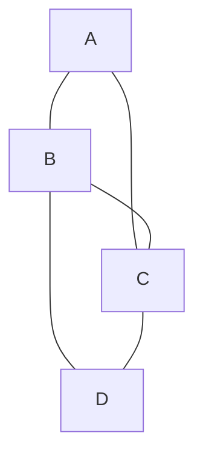

# 그래프 표현 (인접 리스트/행렬)

## 1. 핵심 개념 (Core Concept)

**그래프(Graph)**는 정점(Vertex)과 그 정점들을 연결하는 간선(Edge)의 집합으로, 데이터 사이의 관계를 표현하는 자료구조입니다. 그래프를 컴퓨터 프로그램에서 처리하기 위해서는 이를 메모리에 표현해야 하는데, 가장 대표적인 두 가지 방식이 **인접 행렬(Adjacency Matrix)**과 **인접 리스트(Adjacency List)**입니다. 두 방식은 메모리 사용량과 특정 연산의 속도 측면에서 뚜렷한 장단점을 가집니다.

---

## 2. 상세 설명 (Detailed Explanation)

### 2.1 인접 행렬 (Adjacency Matrix)

인접 행렬은 정점 간의 연결 관계를 **2차원 배열**로 나타내는 방식입니다. V개의 정점이 있는 그래프를 V x V 크기의 행렬로 표현하며, 행렬의 원소 `matrix[i][j]`는 정점 i에서 정점 j로 가는 간선의 존재 여부를 나타냅니다.

*   **표현**:
    *   간선 존재: `matrix[i][j] = 1` (가중치가 있다면 가중치 값)
    *   간선 부재: `matrix[i][j] = 0`
*   **특징**: 무방향 그래프의 경우, 행렬은 주대각선을 기준으로 대칭적인 형태를 가집니다.

#### 장점
*   **빠른 간선 조회**: 두 정점 i와 j의 연결 여부를 확인하는 데 **O(1)**의 시간 복잡도를 가집니다.
*   **구현의 용이성**: 2차원 배열을 사용하여 직관적이고 간단하게 구현할 수 있습니다.

#### 단점
*   **메모리 비효율성**: 간선의 수와 무관하게 항상 **O(V²)**의 공간이 필요합니다. 따라서 정점의 개수는 많지만 간선이 적은 **희소 그래프(Sparse Graph)**의 경우 메모리 낭비가 심합니다.
*   **인접 정점 탐색**: 특정 정점과 연결된 모든 정점을 찾으려면 행 전체를 순회해야 하므로 **O(V)**의 시간이 소요됩니다.

### 2.2 인접 리스트 (Adjacency List)

인접 리스트는 각 정점에 연결된 인접 정점들의 목록을 **연결 리스트(Linked List)나 동적 배열** 형태로 저장하는 방식입니다. 즉, V개의 리스트 배열이 있고, `list[i]`는 정점 i에 인접한 모든 정점들의 정보를 담고 있습니다.

*   **표현**: `list[i]`는 정점 i와 간선으로 직접 연결된 모든 정점들의 리스트를 가집니다.
*   **특징**: 가중치가 있는 그래프의 경우, 리스트의 각 원소는 `(연결된 정점, 가중치)` 형태의 쌍으로 저장될 수 있습니다.

#### 장점
*   **메모리 효율성**: 실제로 존재하는 간선에 대한 정보만 저장하므로, 공간 복잡도는 **O(V + E)**입니다. 특히 희소 그래프에서 매우 효율적입니다. (V: 정점 수, E: 간선 수)
*   **인접 정점 탐색**: 특정 정점 i와 연결된 모든 정점을 탐색할 때, 해당 정점의 차수(degree)만큼의 시간, 즉 **O(degree(i))**가 걸려 효율적입니다.

#### 단점
*   **상대적으로 느린 간선 조회**: 두 정점 i와 j의 연결 여부를 확인하려면, 정점 i의 인접 리스트를 처음부터 순회해야 하므로 최악의 경우 **O(degree(i))**의 시간이 걸립니다.
*   **구현의 복잡성**: 2차원 배열을 사용하는 인접 행렬에 비해 구현이 다소 복잡할 수 있습니다.

---

## 3. 예시 (Example)

### 그래프 표현 예시


#### 인접 행렬 표현
| | A | B | C | D |
| :---: | :---: | :---: | :---: | :---: |
| **A** | 0 | 1 | 1 | 0 |
| **B** | 1 | 0 | 1 | 1 |
| **C** | 1 | 1 | 0 | 1 |
| **D** | 0 | 1 | 1 | 0 |

#### 인접 리스트 표현
*   A: [B, C]
*   B: [A, C, D]
*   C: [A, B, D]
*   D: [B, C]

### Python 코드 예시
```python
# 인접 행렬 (Adjacency Matrix)
matrix = [
    [0, 1, 1, 0],
    [1, 0, 1, 1],
    [1, 1, 0, 1],
    [0, 1, 1, 0]
]
print(f"A와 B는 연결되어 있는가? {'Yes' if matrix[0][1] == 1 else 'No'}")

# 인접 리스트 (Adjacency List)
adj_list = {
    'A': ['B', 'C'],
    'B': ['A', 'C', 'D'],
    'C': ['A', 'B', 'D'],
    'D': ['B', 'C']
}
print(f"A와 연결된 정점들: {adj_list['A']}")
```

---

## 4. 예상 면접 질문 (Potential Interview Questions)

*   **Q. 인접 행렬과 인접 리스트의 가장 큰 차이점은 무엇인가요?**
    *   **A.** 가장 큰 차이점은 **메모리 사용 방식**과 **성능 특성**입니다. 인접 행렬은 V²의 고정된 메모리를 사용하여 두 정점 간의 연결 여부를 O(1)에 빠르게 확인할 수 있지만, 간선이 적은 희소 그래프에서는 메모리 낭비가 심합니다. 반면, 인접 리스트는 O(V+E)의 공간만 사용하여 메모리가 효율적이고 특정 정점의 모든 이웃을 찾는 데 빠르지만, 두 정점의 연결 여부를 확인하는 데는 상대적으로 시간이 더 걸릴 수 있습니다.

*   **Q. 어떤 경우에 인접 행렬을 사용하는 것이 유리하고, 어떤 경우에 인접 리스트를 사용하는 것이 유리한가요?**
    *   **A.** 그래프에 간선이 많이 존재하는 **밀집 그래프(Dense Graph)**이고, 두 정점 사이의 연결 여부를 자주 확인해야 하는 경우 **인접 행렬**이 유리합니다. 반면, 정점의 수는 많지만 간선이 적은 **희소 그래프(Sparse Graph)**이고, 특정 정점의 모든 이웃을 탐색하는 작업(예: DFS, BFS)이 주를 이루는 경우 **인접 리스트**가 메모리와 시간 효율성 측면에서 훨씬 유리합니다.

*   **Q. 인접 리스트의 공간 복잡도가 왜 O(V+E)인가요?**
    *   **A.** 인접 리스트는 V개의 정점에 대한 리스트(또는 포인터)를 저장하기 위한 공간 O(V)가 기본적으로 필요합니다. 그리고 각 간선은 두 정점을 연결하므로, 무방향 그래프의 경우 각 간선이 두 정점의 인접 리스트에 한 번씩, 총 두 번 기록됩니다. 따라서 모든 간선의 수(E)에 비례하는 2*E 만큼의 저장 공간이 추가로 필요합니다. 이를 종합하면 총 공간 복잡도는 O(V + 2E)가 되며, 빅오 표기법에 따라 O(V+E)로 표현합니다.

---

## 5. 더 읽어보기 (Further Reading)

*   [Graph and its representations (GeeksforGeeks)](https://www.geeksforgeeks.org/graph-and-its-representations/)
*   [Adjacency Matrix vs. Adjacency List (Baeldung)](https://www.baeldung.com/cs/adjacency-matrix-vs-adjacency-list)
*   [Representing graphs (Khan Academy)](https://www.khanacademy.org/computing/computer-science/algorithms/graph-representation/a/representing-graphs)