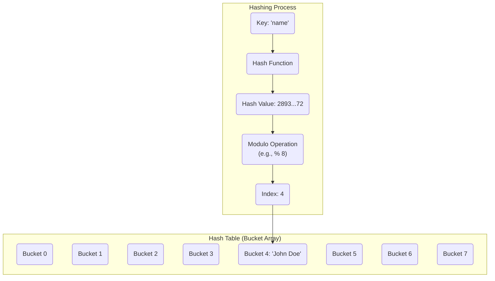

# 해시 테이블 & Python 딕셔너리 내부 구조

## 1. 핵심 개념 (Core Concept)

**해시 테이블(Hash Table)**은 키(Key)와 값(Value)을 한 쌍으로 저장하는 자료구조로, **해시 함수(Hash Function)**를 사용하여 키를 배열의 인덱스(해시 값)로 변환하여 데이터에 **평균 O(1)**의 매우 빠른 속도로 접근합니다. 파이썬의 **딕셔너리(Dictionary)**는 이러한 해시 테이블을 기반으로 구현된 대표적인 자료구조입니다. 해시 테이블의 핵심은 **해시 충돌(Hash Collision)**을 어떻게 효율적으로 해결하는지에 있습니다.

---

## 2. 상세 설명 (Detailed Explanation)

### 2.1 해시 테이블의 동작 원리

1.  **해싱(Hashing)**: 키(Key)를 **해시 함수**에 입력하여 고정된 길이의 숫자 값인 **해시 값(Hash Value)**을 얻습니다.
2.  **인덱스 변환**: 해    값을 내부적으로 사용하는 배열(버킷 배열)의 크기로 나눈 나머지 값을 구하여, 데이터가 저장될 **배열의 인덱스**를 결정합니다.
3.  **데이터 저장/조회**: 해당 인덱스를 통해 값(Value)을 저장하거나 조회합니다.



### 2.2 해시 충돌 (Hash Collision)과 해결 방법

**해시 충돌**이란 서로 다른 키가 해시 함수를 통해 같은 인덱스로 변환되는 현상입니다. 해시 테이블의 성능은 이 충돌을 어떻게 해결하는지에 따라 크게 달라집니다.

#### 가. 체이닝 (Chaining) 또는 분리 연결법 (Separate Chaining)
*   **원리**: 동일한 인덱스로 해싱되는 데이터들을 **연결 리스트(Linked List)**나 **트리(Tree)**    같은 자료구조로 연결하여 저장하는 방식입니다.
*   **장점**: 구현이 비교적 간단하고, 데이터가 많아져도 유연하게 대처할 수 있습니다.
*   **단점**: 하나의 버킷에 데이터가 집중되면(최악의 경우), 해당 버킷의 연결 리스트를 순차 탐색해야 하므로 검색 성능이 O(n)까지 저하될 수 있습니다.

#### 나. 개방 주소법 (Open Addressing)
*   **원리**: 해시 충돌이 발생하면 다른 비어있는 버킷을 찾아 데이터를 저장하는 방식입니다.
    *   **선형 탐사 (Linear Probing)**: 현재 버킷에서부터 순차적으로 다음 빈 버킷을 찾습니다.
    *   **제곱 탐사 (Quadratic Probing)**: 현재 버킷에서부터 제곱수만큼 떨어진 버킷을 순차적으로 찾습니다.
    *   **이중 해싱 (Double Hashing)**: 또 다른 해시 함수를 사용하여 다음 탐사할 위치를 결정합니다.
*   **장점**: 추가적인 자료구조를 사용하지 않아 메모리 효율이 좋습니다.
*   **단점**: 데이터가 특정 영역에 몰리는 **클러스터링(Clustering)** 현상이 발생할 수 있으며, 데이터 삭제가 복잡합니다.

### 2.3 파이썬 딕셔너리(Dictionary)의 내부 구조

파이썬의 딕셔너리(`dict`)는 **개방 주소법(Open Addressing)**을 사용하는 고도로 최적화된 해시 테이블입니다.

*   **해시 충돌 해결**: 기본적으로 개방 주소법을 사용하며, 해시 값의 일부 비트를 사용하여 다음 탐사 위치를 결정하는 복잡한 방식을 통해 클러스터링 문제를 최소화합니다.
*   **동적 크기 조정 (Dynamic Resizing)**: 딕셔너리에 데이터가 일정 수준 이상으로 채워지면(Load Factor가 2/3를 넘으면), 더 큰 크기(보통 2배 또는 4배)의 새로운 해시 테이블을 생성하고 기존 데이터를 옮기는(Rehashing) 방식으로 동적으로 크기를 조정합니다.
*   **순서 보장 (Python 3.7+ 이후)**: 과거의 딕셔너리는 순서가 보장되지 않았지만, Python 3.7부터는 **데이터가 삽입된 순서를 보장**합니다. 이는 내부적으로 데이터가 삽입된 순서를 기억하는 별도의 조밀한 배열(compact array)을 유지하기 때문입니다.

---

## 3. 예시 (Example)

### 해시 충돌 시나리오 (체이닝 방식)

1.  `key='John'`, `value='A+'`를 저장. `hash('John') % 8 = 2`. -> 2번 버킷에 저장.
2.  `key='Jane'`, `value='B+'`를 저장. `hash('Jane') % 8 = 5`. -> 5번 버킷에 저장.
3.  `key='Doe'`, `value='C+'`를 저장. `hash('Doe') % 8 = 2`. -> **해시 충돌 발생!**
4.  2번 버킷에 이미 'John'이 있으므로, 'John'이 가리키는 다음 노드로 'Doe'를 연결합니다.

```
Bucket Array
[0] -
[1] -
[2] - [ 'John', 'A+' ] -> [ 'Doe', 'C+' ] -> null
[3] -
[4] -
[5] - [ 'Jane', 'B+' ] -> null
[6] -
[7] -
```

### Python 딕셔너리 사용
```python
# 딕셔너리 생성
student_grades = {'John': 'A+', 'Jane': 'B+'}

# 데이터 추가
student_grades['Doe'] = 'C+'

# 데이터 조회 (평균 O(1))
print(f"John's grade: {student_grades['John']}")

# 데이터 삭제
del student_grades['Jane']

# 키 존재 여부 확인 (평균 O(1))
if 'Doe' in student_grades:
    print("Doe is in the dictionary.")

print(student_grades)
```

---

## 4. 예상 면접 질문 (Potential Interview Questions)

*   **Q. 해시 테이블의 시간 복잡도가 평균적으로 O(1)인 이유는 무엇인가요?**
    *   **A.** 해시 테이블은 키(Key)를 해시 함수를 통해 배열의 인덱스로 직접 변환하기 때문입니다. 이상적으로는 해시 충돌이 없다면, 키를 통해 계산된 인덱스로 배열의 특정 위치에 한 번에 접근하여 데이터를 읽거나 쓸 수 있습니다. 따라서 데이터의 양과 상관없이 거의 일정한 시간이 걸리므로 평균 시간 복잡도는 O(1)이 됩니다.

*   **Q. 해시 충돌이란 무엇이며, 대표적인 해결 방법 두 가지를 설명해주세요.**
    *   **A.** 해시 충돌은 서로 다른 키가 해시 함수를 통해 같은 인덱스로 변환되는 현상입니다. 대표적인 해결 방법으로는 **체이닝**과 **개방 주소법**이 있습니다. **체이닝**은 충돌이 발생한 버킷에 연결 리스트를 두어 데이터를 연결하는 방식이고, **개방 주소법**은 해당 버킷 대신 다른 비어있는 버킷을 찾아 데이터를 저장하는 방식입니다.

*   **Q. 파이썬 딕셔너리의 키(Key)로 리스트(List)를 사용할 수 없는 이유는 무엇인가요?**
    *   **A.** 파이썬 딕셔너리의 키는 **해시 가능(hashable)**해야 하기 때문입니다. 해시 가능하다는 것은 객체의 생명주기 동안 변하지 않는 해시 값을 가져야 한다는 의미입니다. 리스트는 내용이 변경될 수 있는 **가변(mutable)** 객체이므로, 내용이 바뀔 때마다 해시 값도 달라질 수 있습니다. 이렇게 되면 동일한 객체임에도 불구하고 다른 인덱스를 가리키게 되어 해시 테이블의 기본 원칙을 위배하므로 키로 사용할 수 없습니다. 반면, 튜플(Tuple)과 같은 **불변(immutable)** 객체는 키로 사용할 수 있습니다.

---

## 5. 더 읽어보기 (Further Reading)

*   [Hash table (Wikipedia)](https://en.wikipedia.org/wiki/Hash_table)
*   [How are Python's Dictionaries Implemented? (Real Python)](https://realpython.com/how-are-pythons-dictionaries-implemented/)
*   [Python Dictionaries and Hashmaps (YouTube - CS Dojo)](https://www.youtube.com/watch?v=sfWyugl4JWA)