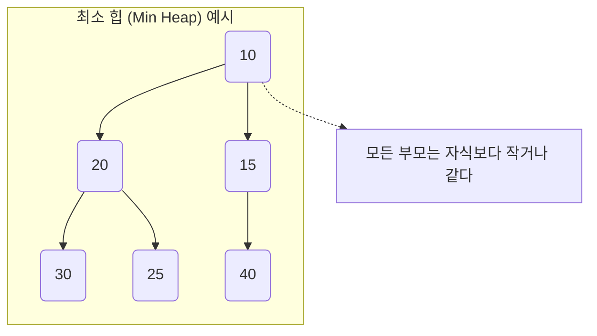

# 힙 & 우선순위 큐 (Python heapq)

## 1. 핵심 개념 (Core Concept)

\*\*우선순위 큐(Priority Queue)\*\*는 들어온 순서가 아닌 **우선순위가 높은 데이터가 먼저 나가는** 추상적인 자료형(ADT)입니다. \*\*힙(Heap)\*\*은 이러한 우선순위 큐를 구현하는 데 사용되는 가장 효율적인 자료구조 중 하나로, **완전 이진 트리**를 기반으로 하며 최댓값이나 최솟값을 빠르게 찾기 위해 고안되었습니다. 파이썬에서는 `heapq` 모듈을 통해 효율적인 힙 기능을 제공합니다.

______________________________________________________________________

## 2. 상세 설명 (Detailed Explanation)

### 2.1 힙 (Heap) 자료구조

힙은 '느슨하게 정렬된' 완전 이진 트리로, 부모-자식 노드 간에 특정 대소 관계 규칙이 항상 유지됩니다.

- **최소 힙 (Min Heap)**: **부모 노드의 키 값이 자식 노드의 키 값보다 항상 작거나 같다.** 즉, 루트 노드에는 항상 전체 데이터 중 최솟값이 위치합니다.
- **최대 힙 (Max Heap)**: **부모 노드의 키 값이 자식 노드의 키 값보다 항상 크거나 같다.** 즉, 루트 노드에는 항상 최댓값이 위치합니다.

힙은 완전 이진 트리의 특성상 배열을 사용하여 효율적으로 구현할 수 있으며, 데이터의 삽입과 삭제(가장 우선순위 높은 값)가 모두 \*\*O(log n)\*\*의 시간 복잡도를 가집니다.



### 2.2 우선순위 큐 (Priority Queue)

우선순위 큐는 응급실 시스템과 유사합니다. 환자가 도착한 순서대로 치료받는 것이 아니라, 위급한 환자(우선순위가 높은)를 먼저 치료하는 것과 같습니다.

- **주요 연산**:
  - **Enqueue (삽입)**: 우선순위 큐에 새로운 데이터를 추가합니다. (힙에서는 O(log n))
  - **Dequeue (삭제)**: 가장 높은 우선순위를 가진 데이터를 제거하고 반환합니다. (힙에서는 O(log n))
- **구현**: 배열, 연결 리스트로도 구현할 수 있지만, 이 경우 삽입 또는 삭제 연산이 O(n)의 시간이 걸려 비효율적입니다. 따라서 **힙으로 구현하는 것이 가장 일반적이고 효율적**입니다.

결론적으로, **우선순위 큐는 '개념(ADT)'이고, 힙은 그 개념을 구현하는 '실체(자료구조)'** 중 가장 효율적인 도구입니다.

### 2.3 파이썬 `heapq` 모듈

파이썬은 `heapq`라는 내장 모듈을 통해 **최소 힙(Min Heap)** 자료구조를 제공합니다. `heapq`는 별도의 클래스가 아닌 **일반 파이썬 리스트**를 최소 힙처럼 다룰 수 있게 해주는 함수들의 모음입니다.

- **주요 함수**:
  - `heapq.heappush(heap, item)`: 리스트 `heap`에 `item`을 힙 속성을 유지하며 추가합니다. (O(log n))
  - `heapq.heappop(heap)`: 리스트 `heap`에서 가장 작은 원소(루트)를 제거하고 반환합니다. (O(log n))
  - `heapq.heapify(x)`: 리스트 `x`를 그 자리에서 힙으로 변환합니다. (O(n))

______________________________________________________________________

## 3. 예시 (Example)

### Python `heapq` 사용법

#### 최소 힙 (기본)

```python
import heapq

# 빈 리스트를 힙으로 사용
min_heap = []

# 힙에 원소 추가 (heappush)
heapq.heappush(min_heap, 4)
heapq.heappush(min_heap, 1)
heapq.heappush(min_heap, 7)

print(f"현재 힙 상태: {min_heap}") # 출력: [1, 4, 7] (힙 속성을 만족하는 리스트)

# 힙에서 가장 작은 원소 삭제 (heappop)
smallest = heapq.heappop(min_heap)
print(f"꺼낸 가장 작은 값: {smallest}") # 출력: 1
print(f"pop 이후 힙 상태: {min_heap}") # 출력: [4, 7]
```

#### 최대 힙 구현 (음수 부호 트릭)

`heapq`는 최소 힙만 지원하므로, 최대 힙을 구현하려면 값에 \*\*음수 부호(-)\*\*를 붙여서 힙에 저장하고, 꺼낼 때 다시 부호를 바꾸는 트릭을 사용합니다.

```python
import heapq

nums = [4, 1, 7, 3, 8, 5]
max_heap = []

for num in nums:
  heapq.heappush(max_heap, (-num, num))  # (우선순위, 값) 튜플로 저장

print(f"최대 힙 상태: {max_heap}")

# 힙에서 가장 큰 원소 삭제
largest = heapq.heappop(max_heap)[1]
print(f"꺼낸 가장 큰 값: {largest}") # 출력: 8
```

### 사용 사례 (Use Case)

- **다익스트라(Dijkstra) 알고리즘**: 최단 경로를 찾을 때, 현재까지의 거리가 가장 짧은 노드를 우선적으로 탐색해야 하므로 우선순위 큐가 필수적으로 사용됩니다.
- **작업 스케줄링**: 여러 작업 중 중요도가 높은 작업을 먼저 처리해야 하는 시스템에서 사용됩니다.
- **Top-K 문제**: 데이터 스트림에서 가장 큰(또는 작은) K개의 원소를 유지해야 할 때 효율적입니다.

______________________________________________________________________

## 4. 예상 면접 질문 (Potential Interview Questions)

- **Q. 힙(Heap)과 이진 탐색 트리(BST)의 차이점은 무엇인가요?**

  - **A.** 가장 큰 차이점은 **정렬의 정도**와 **목적**입니다. 이진 탐색 트리는 '왼쪽 자식 \< 부모 \< 오른쪽 자식' 규칙에 따라 모든 원소가 엄격하게 정렬되어 있어 **탐색**에 최적화되어 있습니다. 반면, 힙은 '부모 \< 자식' (최소 힙 기준)이라는 느슨한 정렬 상태를 유지하며, 오직 **최솟값 또는 최댓값을 빠르게 찾는 것**에 목적을 둔 자료구조입니다.

- **Q. 우선순위 큐를 배열이나 리스트 대신 힙으로 구현하면 어떤 이점이 있나요?**

  - **A.** 우선순위 큐의 핵심 연산은 '데이터 삽입'과 '우선순위가 가장 높은 데이터 삭제'입니다. 만약 정렬되지 않은 배열/리스트로 구현하면, 삽입은 O(1)이지만 가장 우선순위 높은 값을 찾기 위해 매번 전체를 탐색해야 하므로 삭제가 O(n)이 걸립니다. 반대로 정렬된 배열/리스트로 구현하면 삭제는 O(1)이지만, 삽입 시 정렬을 유지하기 위해 O(n)이 걸립니다. 하지만 **힙으로 구현하면, 삽입과 삭제 연산 모두 O(log n)의 시간 복잡도**를 보장하므로 훨씬 효율적입니다.

- **Q. 파이썬의 `heapq` 모듈로 최대 힙을 구현하는 방법을 설명해주세요.**

  - **A.** `heapq`는 최소 힙을 기준으로 동작하기 때문에, 최대 힙을 구현하려면 약간의 트릭이 필요합니다. 저장하려는 값에 음수 부호를 붙여서 힙에 `push`합니다. 이렇게 하면 원래 값이 클수록 음수 값은 작아지므로, 최소 힙의 루트에는 항상 원래 값의 최댓값에 해당하는 음수 값이 오게 됩니다. 값을 `pop`할 때는 다시 부호를 바꾸어 원래의 최댓값을 얻을 수 있습니다.

______________________________________________________________________

## 5. 더 읽어보기 (Further Reading)

- [Python `heapq` — Heap queue algorithm (Official Docs)](https://docs.python.org/3/library/heapq.html)
- [Priority Queue (Wikipedia)](https://en.wikipedia.org/wiki/Priority_queue)
- [Heap Data Structure (GeeksforGeeks)](https://www.geeksforgeeks.org/heap-data-structure/)
