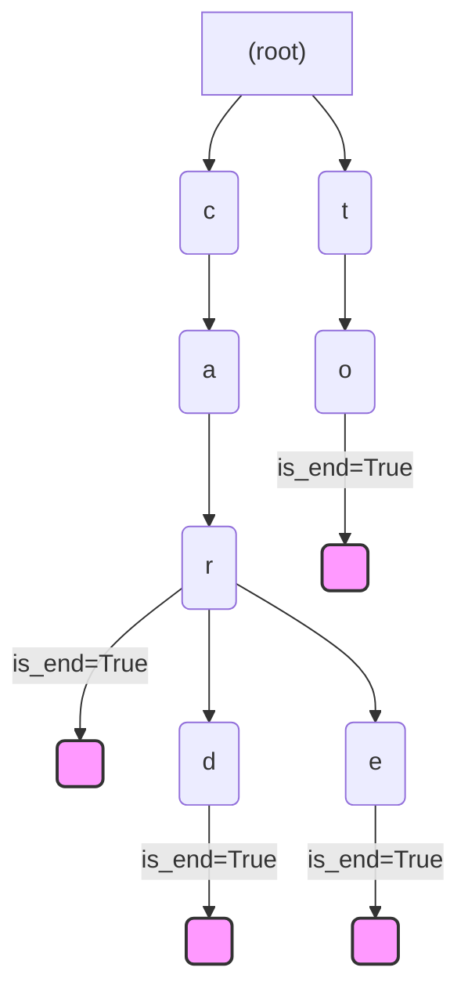

# 트라이, 유니온-파인드

## 1. 핵심 개념 (Core Concept)

\*\*트라이(Trie)\*\*와 \*\*유니온-파인드(Union-Find)\*\*는 특정 문제 상황을 효율적으로 해결하기 위해 사용되는 특수한 목적의 자료구조입니다. **트라이**는 문자열 집합을 저장하고 빠르게 검색하기 위한 **문자열 특화 트리 자료구조**입니다. **유니온-파인드**는 서로소 집합(Disjoint Sets)을 표현하고, 원소들이 **같은 집합에 속해 있는지 판별**하거나 집합을 합치는 연산을 매우 빠르게 수행하는 자료구조입니다.

______________________________________________________________________

## 2. 상세 설명 (Detailed Explanation)

### 2.1 트라이 (Trie, 접두사 트리)

트라이는 문자열을 효율적으로 저장하고 검색하기 위한 트리 형태로, '접두사 트리(Prefix Tree)'라고도 불립니다.

#### 원리

- **구조**: 각 노드는 문자 하나를 나타내며, 루트 노드에서부터 특정 노드까지의 경로는 하나의 문자열(의 접두사)을 의미합니다.
- **공통 접두사 공유**: "car", "card", "care"라는 단어를 저장하면 "car"라는 공통 접두사 부분은 하나의 경로로 공유됩니다. 이 구조 덕분에 메모리를 효율적으로 사용하면서 빠른 검색이 가능합니다.
- **종료 표시**: 각 단어의 끝을 나타내는 노드에는 종료 여부를 표시하는 플래그(e.g., `is_end`)를 둡니다.



#### 시간 복잡도

- **삽입 및 검색**: 찾고자 하는 문자열의 길이를 `m`이라고 할 때, 시간 복잡도는 \*\*O(m)\*\*입니다. 이는 트라이에 저장된 전체 문자열의 개수와는 무관하게, 검색하려는 문자열의 길이에만 영향을 받습니다.

#### 사용 사례

- **자동 완성 기능**: 검색 엔진이나 코드 편집기에서 사용자가 입력한 접  사를 기반으로 다음에 올 단어들을 추천하는 기능.
- **사전 검색**: 사전에 있는 단어를 검색하거나, 특정 접두사로 시작하는 모든 단어를 찾는 데 효율적.

### 2.2 유니온-파인드 (Union-Find, 서로소 집합)

유니온-파인드는 여러 노드가 있을 때, 특정 두 노드가 같은 집합에 속해 있는지 판별하는 데 효과적인 자료구조입니다.

#### 원리

- **구조**: 주로 배열을 사용하여 트리 구조를 표현합니다. 배열의 인덱스는 각 노드를, 값은 해당 노드의 부모 노드를 가리킵니다. 루트 노드는 자기 자신을 부모로 가리킵니다.
- **핵심 연산**:
  - **`find(x)`**: 원소 `x`가 속한 집합의 대표(루트) 노드를 찾습니다. 재귀적으로 부모를 따라 올라가 루트를 찾습니다.
  - **`union(x, y)`**: 원소 `x`와 `y`가 속한 두 집합을 하나로 합칩니다. 각 원소의 루트를 찾아, 한쪽 루트가 다른 쪽 루트를 가리키도록 만듭니다.

#### 최적화 기법

- **경로 압축 (Path Compression)**: `find` 연산을 수행할 때, 경로상에 있는 모든 노드가 직접 루트 노드를 가리키도록 만들어 트리의 높이를 줄입니다. 이는 이후의 `find` 연산 속도를 크게 향상시킵니다.
- **랭크에 의한 합치기 (Union by Rank/Height)**: 두 집합을 합칠 때, 높이가 낮은 트리를 높이가 높은 트리 밑에 붙여 전체 트리의 높이가 불필요하게 커지는 것을 방지합니다.

#### 시간 복잡도

- 경로 압축과 랭크에 의한 합치기 최적화 기법을 모두 적용했을 때, 유니온-파인드의 시간 복잡도는 거의 상수 시간에 가까운 \*\*O(α(N))\*\*입니다. 여기서 α(N)은 아커만 함수의 역함수로, 매우 느리게 증가하기 때문에 사실상 \*\*상수 시간(O(1))\*\*으로 간주할 수 있습니다.

______________________________________________________________________

## 3. 예시 (Example)

### 유니온-파인드 코드 예시 (Python)

```python
# 각 노드의 부모를 저장하는 배열
parent = {}
# 각 집합의 랭크(트리 높이)를 저장하는 딕셔너리
rank = {}

def make_set(v):
    parent[v] = v
    rank[v] = 0

def find(v):
    # 경로 압축 (Path Compression)
    if parent[v] != v:
        parent[v] = find(parent[v])
    return parent[v]

def union(v, u):
    root1 = find(v)
    root2 = find(u)

    if root1 != root2:
        # 랭크에 의한 합치기 (Union by Rank)
        if rank[root1] > rank[root2]:
            parent[root2] = root1
        else:
            parent[root1] = root2
            if rank[root1] == rank[root2]:
                rank[root2] += 1

# 예시 실  
vertices = ['A', 'B', 'C', 'D', 'E']
for v in vertices:
    make_set(v)

union('A', 'B')
union('B', 'C')

print(f"A와 C는 같은 집합인가? {find('A') == find('C')}") # True
print(f"A와 D는 같은 집합인가? {find('A') == find('D')}") # False
```

### 사용 사례

- **유니온-파인드**:
  - **그래프의 사이클 판별**: 무방향 그래프에서 두 정점을 연결할 때, 두 정점이 이미 같은 집합에 속해 있다면 사이클이 형성된다고 판단할 수 있습니다. (최소 신장 트리를 만드는 크루스칼 알고리즘에서 활용)
  - **네트워크 연결 문제**: 네트워크상의 컴퓨터들이 서로 연결되어 있는지, 즉 같은 네트워크에 속해 있는지 확인할 때 사용됩니다.

______________________________________________________________________

## 4. 예상 면접 질문 (Potential Interview Questions)

- **Q. 트라이 자료구조는 어떤 경우에 사용하며, 해시 테이블과 비교했을 때의 장점은 무엇인가요?**

  - **A.** 트라이는 **문자열 검색**, 특히 **접두사 기반 검색**이 필요할 때 매우 유용합니다. 예를 들어, 검색어 자동 완성 기능에 사용됩니다. 해시 테이블과 비교했을 때, 트라이는 공통된 접두사를 공유하여 메모리를 효율적으로 사용할 수 있고, 접두사가 같은 모든 문자열을 쉽게 찾거나 정렬된 순서로 키를 순회하는 등의 추가적인 기능을 제공할 수 있다는 장점이 있습니다.

- **Q. 유니온-파인드 자료구조의 `find` 연산에서 '경로 압축' 최적화는 왜 중요한가요?**

  - **A.** 경로 압축이 없다면, `find` 연산 시 최악의 경우 트리의 높이만큼 시간이 걸릴 수 있습니다. 트리가 한쪽으로 치우쳐진 형태라면 시간 복잡도는 O(N)이 될 수 있습니다. 경로 압축은 `find`를 실행하면서 거쳐 가는 모든 노드들이 직접 루트를 가리키도록 구조를 변경합니다. 이 과정을 통해 트리의 높이를 효과적으로 낮추어, 이후의 `find` 연산들이 거의 상수 시간(O(1))에 가깝게 동작하도록 만들어주기 때문에 매우 중요합니다.

- **Q. 크루스칼(Kruskal) 알고리즘에서 유니온-파인드가 어떻게 사용되는지 설명해주세요.**

  - **A.** 크루스칼 알고리즘은 최소 비용 신장 트리(MST)를 만들기 위해 가중치가 가장 작은 간선부터 순서대로 선택합니다. 이때, 새로 선택한 간선이 기존에 만들어진 트리와 **사이클(Cycle)을 형성하는지 확인**해야 합니다. 유니온-파인드는 이 사이클 판별을 위해 사용됩니다. 간선으로 연결할 두 정점의 `find` 연산을 수행하여, 만약 두 정점이 이미 같은 집합(같은 루트)에 속해 있다면 그 간선을 추가할 경우 사이클이 되므로 선택하지 않습니다. 만약 다른 집합에 속해 있다면, 사이클을 형성하지 않으므로 `union` 연산을 통해 두 집합을 합치고 간선을 트리에 추가합니다.

______________________________________________________________________

## 5. 더 읽어보기 (Further Reading)

- [Trie (Prefix Tree) (GeeksforGeeks)](https://www.geeksforgeeks.org/trie-insert-and-search/)
- [Disjoint Set Union (Union-Find) (CP-Algorithms)](https://cp-algorithms.com/data_structures/disjoint_set_union.html)
- [Union-Find: A Data Structure for Disjoint Sets (YouTube - WilliamFiset)](https://www.youtube.com/watch?v=0jNmHPfA_yE)
