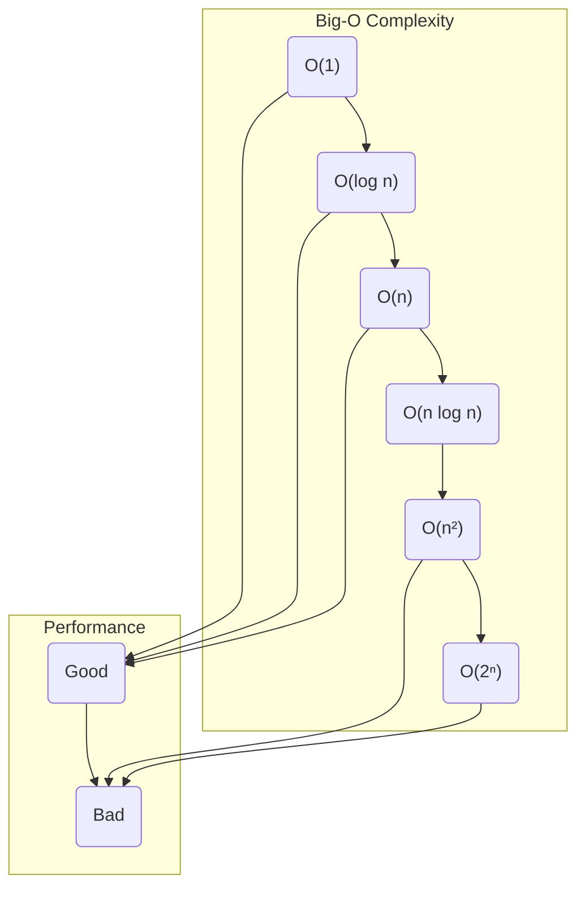

# 복잡도 분석 & Big-O 치트시트

## 1. 핵심 개념 (Core Concept)

**알고리즘 복잡도 분석(Complexity Analysis)**은 특정 알고리즘의 효율성을 평가하는 척도입니다. 입력 데이터의 크기(n)가 커질수록 알고리즘이 얼마나 많은 **시간**과 **공간(메모리)**을 사용하는지를 분석하며, 각각 **시간 복잡도**와 **공간 복잡도**라고 부릅니다. **빅오(Big-O) 표기법**은 이러한 복잡도를 나타내는 가장 일반적인 방법으로, 입력 크기가 무한대로 커질 때의 **최악의 경우(worst-case)** 성능 상한선을 나타냅니다.

---

## 2. 상세 설명 (Detailed Explanation)

### 2.1 빅오(Big-O) 표기법

빅오 표기법은 알고리즘의 성능을 간결하게 표현하기 위해 사용되며, 두 가지 주요 원칙을 따릅니다.

1.  **최고차항만 고려**: 함수의 성장률에 가장 큰 영향을 미치는 항, 즉   고차항만을 남깁니다. 예를 들어, `4n² + 3n + 4`와 같은 연산 횟수가 있다면 `n²`이 가장 큰 영향을 주므로 `O(n²)`로 표기합니다.
2.  **상수 무시**: 최고차항의 계수와 같은 상수 값은 무시합니다. `4n²`에서 상수 `4`를 제거하고 `O(n²)`로 단순화합니다.

### 2.2 시간 복잡도 (Time Complexity)

알고리즘을 실행하는 데 필요한 연산의 횟수를 나타냅니다.

*   **O(1) - 상수 시간 (Constant Time)**: 입력 크기와 상관없이 항상 일정한 실행 시간을 가집니다.
    *   예: 배열의 특정 인덱스 접근 `arr[i]`, 해시 테이블 조회.
*   **O(log n) - 로그 시간 (Logarithmic Time)**: 입력 크기가 커져도 실행 시간은 약간만 증가합니다. 한 번의 연산으로 탐색해야 할 데이터의 양이 절반씩 줄어드는 알고리즘이 대표적입니다.
    *   예: 정렬된 배열에서의 이진 탐색(Binary Search).
*   **O(n) - 선형 시간 (Linear Time)**: 입력 크기에 비례하여 실행 시간이 증가합니다.
    *   예: 배열의 모든 요소를 한 번씩 순회하는 `for` 루프.
*   **O(n log n) - 선형 로그 시간 (Linearithmic Time)**: 선형 시간과 로그 시간이 결합된 형태로, 효율적인 정렬 알고리즘에서 주로 나타납니다.
    *   예: 병합 정렬(Merge Sort), 퀵 정렬(Quick Sort)의 평균 경우.
*   **O(n²) - 이차 시간 (Quadratic Time)**: 입력 크기의 제곱에 비례하여 실행 시간이 증가합니다.
    *   예: 이중 `for` 루프를 사용하여 모든 요소의 쌍을 비교하는 경우. (버블 정렬, 삽입 정렬)
*   **O(2ⁿ) - 지수 시간 (Exponential Time)**: 입력 크기가 증가함에 따라 실행 시간이 기하급수적으로 늘어납니다.
    *   예: 재귀적으로 피보나치 수열을 계산하는 경우.

**성능 비교**: `O(1) < O(log n) < O(n) < O(n log n) < O(n²) < O(2ⁿ)`



### 2.3 공간 복잡도 (Space Complexity)

알고리즘을 실행하는 데 필요한 메모리의 양을 의미하며, 주로 추가적으로 사용되는 메모리 공간을 측정합니다.

*   **O(1) 공간 복잡도**: 입력 크기와 상관없이 일정한 추가 메모리만 사용하는 경우입니다.
    *   예: 주어진 배열 내에서 최댓값을 찾는 알고리즘 (몇 개의 변수만 추가로 사용).
*   **O(n) 공간 복잡도**: 입력 크기에 비례하여 추가 메모리 사용량이 증가하는 경우입니다.
    *   예: 입력 배열과 동일한 크기의 새로운 배열을 만들어 결과를 저장하는 경우, 재귀 호출이 n번 일어나는 경우.

---

## 3. 예시 (Example)

### 코드 예시별 복잡도 분석

```python
# O(1) 시간, O(1) 공간
def get_first(arr):
    return arr[0]

# O(n) 시간, O(1) 공간
def find_max(arr):
    max_val = arr[0]
    for val in arr:
        if val > max_val:
            max_val = val
    return max_val

# O(n²) 시간, O(1) 공간
def has_duplicates(arr):
    for i in range(len(arr)):
        for j in range(i + 1, len(arr)):
            if arr[i] == arr[j]:
                return True
    return False

# O(log n) 시간, O(1) 공간
def binary_search(arr, target):
    low, high = 0, len(arr) - 1
    while low <= high:
        mid = (low + high) // 2
        if arr[mid] == target:
            return True
        elif arr[mid] < target:
            low = mid + 1
        else:
            high = mid - 1
    return False
```

---

## 4. 예상 면접 질문 (Potential Interview Questions)

*   **Q. 시간 복잡도와 공간 복잡도는 어떤 관계에 있나요?**
    *   **A.** 시간 복잡도와 공간 복잡도는 종종 **반비례(trade-off)** 관계에 있습니다. 시간을 단축시키기 위해 추가적인 메모리를 사용하여 계산된 값을 저장(메모이제이션, 캐싱)하면 공간 복잡도가 늘어날 수 있습니다. 반대로, 공간을 절약하기 위해 값을 저장하지 않고 필요할 때마다 다시 계산하면 시간 복잡도가 늘어날 수 있습니다.

*   **Q. 알고리즘의 복잡도를 분석할 때 최선, 평균, 최악의 경우 중 최악의 경우(Big-O)를 주로 사용하는 이유는 무엇인가요?**
    *   **A.** 최악의 경우를 기준으로 알고리즘의 성능을 평가하면, 어떤 상황에서도 알고리즘의 성능이 **최소한 특정 수준 이상임을 보장**할 수 있기 때문입니다. 최선의 경우는 거의 발생하지 않고, 평균적인 경우는 분석하기 매우 복잡할 수 있습니다. 따라서 가장 예측 가능하고 신뢰할 수 있는 척도인 최악의 경우를 기준으로 알고리즘의 효율성을 판단하는 것이 일반적입니다.

*   **Q. O(n)과 O(n log n) 중 어느 것이 더 빠른 알고리즘이며, 그 이유는 무엇인가요?**
    *   **A.** O(n)이 더 빠른 알고리즘입니다. 입력 크기 n이 커질수록 log n 값도 증가하기 때문에, n에 log n을 곱한 O(n log n)은 O(n)보다 항상 더 큰 값을 가집니다. 따라서 알고리즘의 실행 시간이 더 오래 걸리게 됩니다.

---

## 5. 더 읽어보기 (Further Reading)

*   [Big O notation (Wikipedia)](https://en.wikipedia.org/wiki/Big_O_notation)
*   [A beginner's guide to Big O notation (Rob Bell)](https://rob-bell.net/2009/06/a-beginners-guide-to-big-o-notation/)
*   [Big-O Cheat Sheet](https://www.bigocheatsheet.com/)