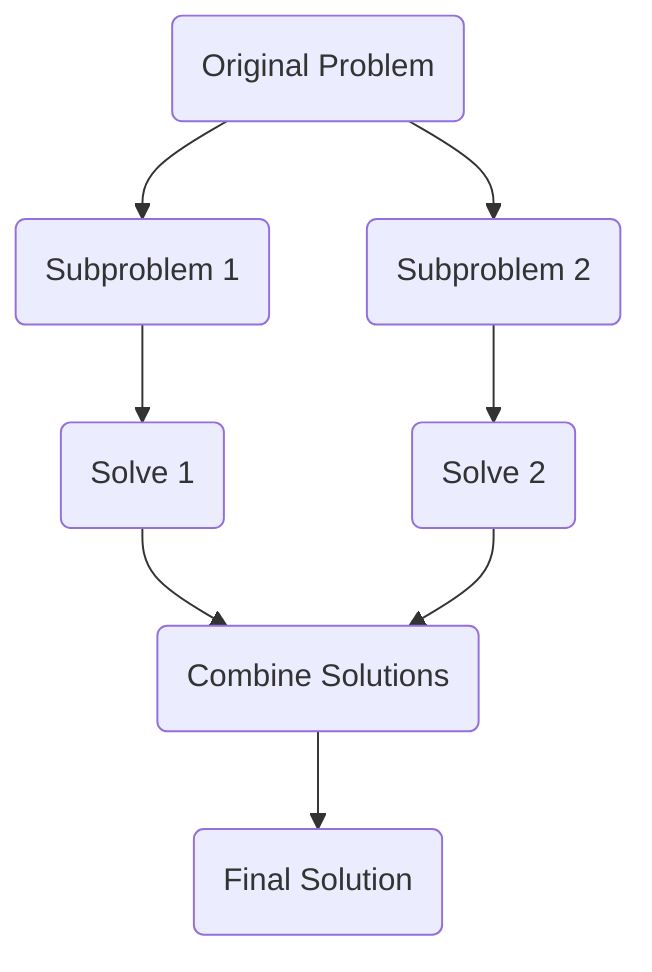

# 분할 정복 (스트라센, FFT)

## 1. 핵심 개념 (Core Concept)

**분할 정복(Divide and Conquer)**은 복잡한 문제를 여러 개의 작은 하위 문제로 나눈 뒤, 각 하위 문제의 답을 구하고, 이를 다시 합쳐 원래 문제의 답을 도출하는 강력한 알고리즘 설계 기법입니다. 이 방식은 **재귀(Recursion)**를 사용하여 문제를 효율적으로 해결하며, 병합 정렬, 퀵 정렬 등 여러 기본 알고리즘의 바탕이 됩니다.

---

## 2. 상세 설명 (Detailed Explanation)

### 2.1 분할 정복의 3단계

분할 정복 알고리즘은 일반적으로 다음 세 가지 단계를 거칩니다.

1.  **분할 (Divide)**: 주어진 문제를 더 이상 나눌 수 없을 때까지 비슷한 유형의 더 작은 여러 하위 문제로 나눕니다.
2.  **정복 (Conquer)**: 나누어진 하위 문제를 재귀적으로 해결합니다. 만약 하위 문제가 충분히 작아져서 직접 해결이 가능하다면 바로 해결합니다.
3.  **결합 (Combine)**: 해결된 하위 문제들의 답을 합쳐서 원래 문제의 답을 구합니다.



### 2.2 분할 정복의 장단점

*   **장점**:
    *   복잡한 문제를 단순화하여 해결할 수 있습니다.
    *   하위 문제들을 병렬적으로 처리하여 알고리즘의 속도를 높일 수 있습니다.
    *   재귀적인 구조로 인해 코드가 직관적이고 간결할 수 있습니다.
*   **단점**:
    *   재귀 함수 호출로 인한 오버헤드가 발생할 수 있습니다.
    *   스택에 데이터가 쌓이면서 스택 오버플로우나 과도한 메모리 사용 문제가 발생할 수 있습니다.

### 2.3 고급 분할 정복 알고리즘

#### 가. 스트라센 행렬 곱셈 (Strassen's Matrix Multiplication)

스트라센 알고리즘은 기존의 O(n³) 시간 복잡도를 갖는 행렬 곱셈을 개선한 분할 정복 알고리즘입니다.

*   **분할**: 곱하려는 두 개의 n x n 행렬을 각각 4개의 n/2 x n/2 부분 행렬로 나눕니다.
*   **정복**: 기존 방식은 8번의 곱셈이 필요하지만, 스트라센은 7개의 새로운 행렬을 정의하고 **7번의 곱셈**과 덧셈/뺄셈을 재귀적으로 계산하여 부분 행렬의 곱을 구합니다.
*   **결합**: 계산된 7개의 결과 행렬들을 조합하여 최종적인 행렬 곱셈 결과를 얻습니다.

이 알고리즘은 곱셈 연산을 한 번 줄인 덕분에, 약 **O(n^2.81)**의 시간 복잡도를 가져 큰 행렬을 곱할 때 매우 효율적입니다.

#### 나. 고속 푸리에 변환 (Fast Fourier Transform, FFT)

FFT는 이산 푸리에 변환(DFT)을 빠르게 계산하는 알고리즘으로, 분할 정복 기법을 핵심적으로 사용합니다. 신호 처리, 이미지 처리, 다항식 곱셈 등 다양한 분야에서 활용됩니다.

*   **분할**: N개의 입력 신호(또는 다항식의 계수)를 짝수 번째와 홀수 번째의 두 그룹으로 나눕니다.
*   **정복**: 각 그룹에 대해 재귀적으로 FFT를 적용하여 DFT를 계산합니다.
*   **결합**: "나비 연산(Butterfly operation)"이라는 과정을 통해 두 그룹의 DFT 결과를 효율적으로 결합하여 원래 신호의 DFT를 얻습니다.

FFT는 DFT의 시간 복잡도 O(n²)를 **O(n log n)**으로 획기적으로 줄여줍니다.

---

## 3. 예시 (Example)

### 병합 정렬 (Merge Sort) 코드 예시 (Python)

병합 정렬은 분할 정복의 개념을 가장 잘 보여주는 대표적인 예시입니다.

```python
def merge_sort(arr):
    # 분할: 더 이상 나눌 수 없을 때까지 (원소가 1개일 때)
    if len(arr) <= 1:
        return arr

    mid = len(arr) // 2
    left_half = arr[:mid]
    right_half = arr[mid:]

    # 정복: 각 부분을 재귀적으로 정렬
    left_half = merge_sort(left_half)
    right_half = merge_sort(right_half)

    # 결합: 정렬된 두 부분을 병합
    return merge(left_half, right_half)

def merge(left, right):
    merged = []
    left_idx, right_idx = 0, 0

    while left_idx < len(left) and right_idx < len(right):
        if left[left_idx] < right[right_idx]:
            merged.append(left[left_idx])
            left_idx += 1
        else:
            merged.append(right[right_idx])
            right_idx += 1
    
    # 남은 원소들 추가
    merged.extend(left[left_idx:])
    merged.extend(right[right_idx:])
    
    return merged

# 예시 실행
my_array = [38, 27, 43, 3, 9, 82, 10]
sorted_array = merge_sort(my_array)
print(f"정렬된 배열: {sorted_array}")
```

---

## 4. 예상 면접 질문 (Potential Interview Questions)

*   **Q. 분할 정복과 동적 계획법(Dynamic Programming)의 차이점은 무엇인가요?**
    *   **A.** 두 기법 모두 큰 문제를 작은 하위 문제로 나누어 해결한다는 공통점이 있습니다. 하지만 가장 큰 차이점은 **하위 문제의 중복 여부**입니다. 분할 정복은 하위 문제들이 서로 **독립적**이어서 중복되지 않는 반면, 동적 계획법은 하위 문제들이 서로 **중복**되는 경우가 많습니다. 따라서 동적 계획법은 한 번 계산한 하위 문제의 결과를 **메모이제이션(Memoization)**이나 **타뷸레이션(Tabulation)**을 통해 저장해두고 재사용하여 중복 계산을 피합니다.

*   **Q. 퀵 정렬도 분할 정복 알고리즘인데, 왜 최악의 경우 시간 복잡도가 O(n²)이 되나요?**
    *   **A.** 퀵 정렬의 성능은 **피벗(pivot) 선택**에 크게 의존하기 때문입니다. 만약 매번 피벗으로 배열의 최솟값이나 최댓값을 선택하게 되면, 배열이 n-1과 0개의 원소로 불균등하게 분할됩니다. 이 과정이 반복되면 트리의 높이가 n에 가까워져, 전체 시간 복잡도가 O(n²)이 됩니다. 이는 이미 정렬된 배열에서 항상 첫 번째 원소를 피벗으로 선택하는 경우에 발생할 수 있습니다.

*   **Q. 스트라센 알고리즘이 기존 행렬 곱셈보다 빠른 원리는 무엇인가요?**
    *   **A.** 기존의 n x n 행렬 곱셈은 n/2 x n/2 크기의 부분 행렬 곱셈이 8번 필요하여 O(n³)의 시간 복잡도를 가집니다. 스트라센 알고리즘은 분할 정복을 사용하되, 덧셈과 뺄셈을 더 많이 사용하는 대신 부분 행렬 곱셈의 횟수를 8번에서 **7번**으로 줄였습니다. 이 작은 차이가 재귀적으로 반복되면서 전체 시간 복잡도를 O(n³)에서 O(n^log₂7) ≈ O(n^2.81)으로 크게 개선하는 핵심 원리가 됩니다.

---

## 5. 더 읽어보기 (Further Reading)

*   [Divide and Conquer Algorithm (GeeksforGeeks)](https://www.geeksforgeeks.org/divide-and-conquer-algorithm-introduction/)
*   [Strassen's Algorithm for Matrix Multiplication (Brilliant.org)](https://brilliant.org/wiki/strassen-algorithm/)
*   [Fast Fourier Transform (Wikipedia)](https://en.wikipedia.org/wiki/Fast_Fourier_transform)