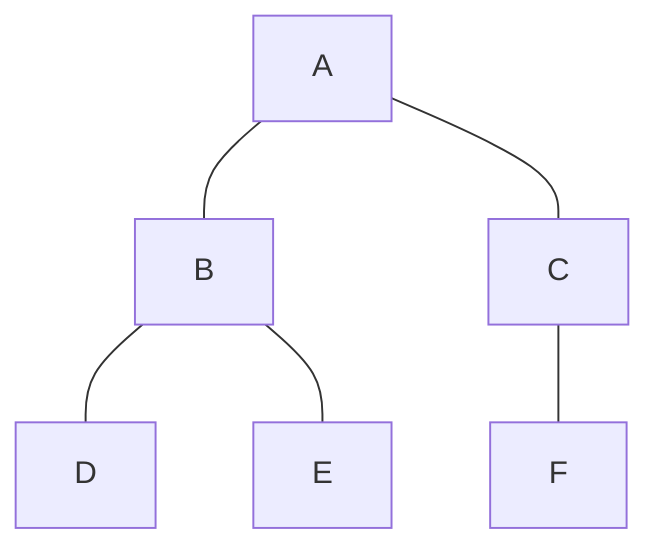

# 그래프 알고리즘 (BFS, DFS, 다익스트라, A*, 위상 정렬)

## 1. 핵심 개념 (Core Concept)

그래프 알고리즘은 정점(Vertex)과 간선(Edge)으로 구성된 데이터 관계를 탐색하고 분석하는 데 사용되는 필수적인 도구입니다. **BFS**와 **DFS**는 모든 정점을 방문하는 기본적인 탐색 기법이며, **다익스트라**와 **A***는 가중치가 있는 그래프에서 최단 경로를 찾는 알고리즘입니다. **위상 정렬**은 방향성이 있는 비순환 그래프(DAG)에서 작업의 순서를 결정하는 데 사용됩니다.

---

## 2. 상세 설명 (Detailed Explanation)

### 2.1 너비 우선 탐색 (BFS, Breadth-First Search)

*   **개념**: 시작 정점에서 가장 가까운 노드부터 차례대로 탐색하는 알고리즘. 마치 물결이 퍼져나가는 것처럼, 현재 정점의 모든 이웃을 먼저 방문한 후 다음 레벨의 이웃으로 나아갑니다.
*   **자료구조**: **큐(Queue)**를 사용하여 선입선출(FIFO) 방식으로 탐색합니다.
*   **시간 복잡도**: O(V + E) (V: 정점 수, E: 간선 수)
*   **특징**: 가중치가 없는 그래프에서 **최단 경로**를 찾는 데 효과적입니다.

### 2.2 깊이 우선 탐색 (DFS, Depth-First Search)

*   **개념**: 하나의 경로를 따라 최대한 깊이 들어가면서 탐색하고, 더 이상 갈 곳이 없으면 이전 분기점으로 돌아가(백트래킹) 다른 경로를 탐색하는 방식입니다.
*   **자료구조**: **스택(Stack)**이나 **재귀 함수**를 이용하여 후입선출(LIFO) 방식으로 구현됩니다.
*   **시간 복잡도**: O(V + E)
*   **특징**: 경로의 존재 여부를 확인하거나, 사이클을 탐지하는 데 유용합니다.

### 2.3 다익스트라 알고리즘 (Dijkstra's Algorithm)

*   **개념**: **가중치가 양수인** 그래프에서, 특정 시작 정점에서 다른 모든 정점까지의 **최단 경로**를 찾는 알고리즘입니다.
*   **자료구조**: **우선순위 큐(Priority Queue)**를 사용하여, 현재까지의 거리가 가장 짧은 정점을 우선적으로 탐색합니다. (탐욕적 접근법)
*   **시간 복잡도**: O((V + E) log V) 또는 O(E log V) (우선순위 큐 사용 시)
*   **특징**: 음수 가중치가 있는 그래프에서는 사용할 수 없습니다. 내비게이션 시스템, 네트워크 라우팅 등에 활용됩니다.

### 2.4 A* (에이스타) 알고리즘

*   **개념**: 다익스트라 알고리즘을 확장한 것으로, 목표 지점까지의 **예상 거리(휴리스틱)**를 추가로 고려하여 불필요한 탐색을 줄이고 효율적으로 최단 경로를 찾는 알고리즘입니다.
*   **동작 원리**: 각 정점의 우선순위를 **f(n) = g(n) + h(n)** 공식으로 계산합니다.
    *   `g(n)`: 시작 정점부터 현재 정점까지의 실제 이동 비용 (다익스트라와 동일)
    *   `h(n)`: 현재 정점부터 목표 정점까지의 예상 비용 (휴리스틱 함수)
*   **시간 복잡도**: 그래프 구조와 휴리스틱 함수의 정확도에 따라 달라집니다.
*   **특징**: 게임 개발에서의 길 찾기, 로봇 공학 등 실제 세계의 경로 탐색 문제에 널리 사용됩니다.

### 2.5 위상 정렬 (Topological Sort)

*   **개념**: **사이클이 없는 방향 그래프(DAG, Directed Acyclic Graph)**의 모든 노드를 방향성에 거스르지 않도록 순서대로 나열하는 알고리즘입니다.
*   **동작 원리**: **진입 차수(Indegree)**, 즉 특정 노드로 들어오는 간선의 개수를 활용합니다.
    1.  진입 차수가 0인 모든 정점을 큐에 넣습니다.
    2.  큐에서 정점을 꺼내 결과에 추가하고, 해당 정점에서 나가는 모든 간선을 제거합니다.
    3.  간선 제거로 인해 진입 차수가 0이 된 새로운 정점을 큐에 넣는 과정을 반복합니다.
*   **시간 복잡도**: O(V + E)
*   **특징**: 작업의 선후 관계를 결정하는 데 사용됩니다. (예: 선수 과목 이수 순서, 프로젝트 빌드 순서)

---

## 3. 예시 (Example)

### 그래프 탐색 시나리오

*   **BFS (시작: A)**: A -> B -> C -> D -> E -> F (레벨 순서)
*   **DFS (시작: A)**: A -> B -> D -> E -> C -> F (한 경로를 끝까지)

### Python 코드 예시 (BFS)
```python
from collections import deque

def bfs(graph, start_node):
    visited = set()
    queue = deque([start_node])
    visited.add(start_node)
    
    traversal_order = []
    
    while queue:
        node = queue.popleft()
        traversal_order.append(node)
        
        for neighbor in graph.get(node, []):
            if neighbor not in visited:
                visited.add(neighbor)
                queue.append(neighbor)
                
    return traversal_order

# 예시 그래프
graph = {'A': ['B', 'C'], 'B': ['A', 'D', 'E'], 'C': ['A', 'F'], 'D': ['B'], 'E': ['B'], 'F': ['C']}
print(f"BFS 탐색 순서: {bfs(graph, 'A')}")
```

---

## 4. 예상 면접 질문 (Potential Interview Questions)

*   **Q. BFS와 DFS의 가장 큰 차이점은 무엇이며, 각각 어떤 경우에 사용되나요?**
    *   **A.** 가장 큰 차이점은 **탐색 방식**과 사용하는 **자료구조**입니다. BFS는 큐를 사용하여 시작점과 가까운 노드부터 넓게 탐색하므로, 가중치 없는 그래프의 최단 경로를 찾는 데 적합합니다. 반면, DFS는 스택이나 재귀를 사용하여 한 경로를 깊게 탐색하므로, 경로의 존재 여부를 확인하거나 모든 노드를 방문해야 하는 경우에 주로 사용됩니다.

*   **Q. 다익스트라 알고리즘이 음수 가중치를 가진 그래프에서 동작하지 않는 이유는 무엇인가요?**
    *   **A.** 다익스트라 알고리즘은 '지금까지의 최단 경로가 앞으로도 최단 경로일 것이다'라는 탐욕적(Greedy) 가정에 기반합니다. 즉, 한 번 방문한 정점은 최단 거리가 확정되었다고 보고 다시 방문하지 않습니다. 하지만 음수 가중치 간선이 존재하면, 나중에 음수 가중치를 거쳐 돌아오는 경로가 이전에 확정된 최단 경로보다 더 짧아질 수 있습니다. 다익스트라 알고리즘은 이러한 가능성을 고려하지 않기 때문에 정확한 답을 찾을 수 없습니다.

*   **Q. A* 알고리즘이 다익스트라 알고리즘보다 효율적일 수 있는 이유는 무엇인가요?**
    *   **A.** A* 알고리즘은 다익스트라처럼 시작점부터의 실제 거리(`g(n)`)뿐만 아니라, 현재 위치에서 목표점까지의 **예상 거리(휴리스틱, `h(n)`)**를 함께 고려하기 때문입니다. 이 휴리스틱 정보 덕분에 목표와 관련 없는 방향의 노드는 탐색 우선순위가 낮아져, 불필요한 탐색을 크게 줄이고 목표 방향으로 더 빠르게 경로를 찾아갈 수 있습니다.

---

## 5. 더 읽어보기 (Further Reading)

*   [Graph Traversal (Wikipedia)](https://en.wikipedia.org/wiki/Graph_traversal)
*   [Dijkstra's Algorithm (GeeksforGeeks)](https://www.geeksforgeeks.org/dijkstras-shortest-path-algorithm-greedy-algo-7/)
*   [A* Search Algorithm (GeeksforGeeks)](https://www.geeksforgeeks.org/a-search-algorithm/)