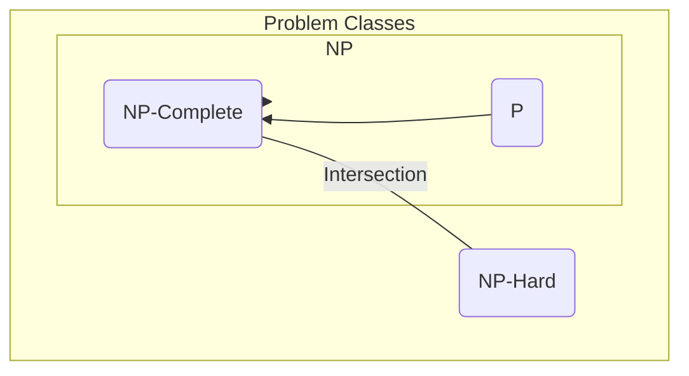

# NP-완전 & 근사 알고리즘

## 1. 핵심 개념 (Core Concept)

컴퓨터 과학에서 문제의 난이도를 분류할 때 **P, NP, NP-완전, NP-난해**라는 개념이 사용됩니다. **P**는 다항 시간 내에 풀 수 있는 문제, **NP**는 다항 시간 내에 정답을 검증할 수 있는 문제입니다. **NP-완전(NP-Complete)**은 NP 문제들 중에서 가장 어려운 문제들의 집합으로, 이 중 하나라도 다항 시간 내에 풀리면 모든 NP 문제를 다항 시간 내에 풀 수 있게 됩니다(P=NP). 이러한 NP-완전 문제들은 현실적으로 최적해를 찾기 매우 어렵기 때문에, **근사 알고리즘(Approximation Algorithm)**을 사용하여 최적해에 가까운 해를 다항 시간 내에 찾는 접근법을 사용합니다.

---

## 2. 상세 설명 (Detailed Explanation)

### 2.1 문제 클래스: P, NP, NP-Hard, NP-Complete

*   **P (Polynomial time)**
    *   **정의**: **다항 시간 내에 해결**할 수 있는 결정 문제(답이 '예' 또는 '아니오')들의 집합.
    *   **특징**: 효율적으로 해결 가능한 문제들입니다. (예: 정렬, 최단 경로 찾기)
    *   **시간 복잡도**: O(n^k) (k는 상수)

*   **NP (Non-deterministic Polynomial time)**
    *   **정의**: 답이 주어졌을 때, 그 답이 정답인지 아닌지를 **다항 시간 내에 검증**할 수 있는 결정 문제들의 집합.
    *   **특징**: 답을 찾는 것은 어려울 수 있지만, 검증은 쉽습니다. 모든 P 문제는 NP에 속합니다 (P ⊆ NP).
    *   **핵심 질문**: **P=NP인가?** (아직 증명되지 않은 컴퓨터 과학계의 가장 큰 난제)

*   **NP-난해 (NP-Hard)**
    *   **정의**: **모든 NP 문제를 다항 시간 내에 이 문제로 환원(Reduction)할 수 있는** 문제.
    *   **특징**: NP 문제들 중 적어도 가장   려운 문제만큼 어렵습니다. NP-난해 문제는 결정 문제일 필요는 없으며, NP에 속하지 않을 수도 있습니다.

*   **NP-완전 (NP-Complete, NPC)**
    *   **정의**: 다음 두 조건을 모두 만족하는 문제.
        1.  **NP에 속하는 문제** (다항 시간 내에 검증 가능)
        2.  **NP-난해인 문제** (모든 NP 문제를 이 문제로 환원 가능)
    *   **특징**: NP 문제들 중에서 **가장 어려운 문제**들의 집합입니다. NP-완전 문제 중 하나라도 다항 시간에 풀리면, 모든 NP 문제가 다항 시간에 풀리게 됩니다 (P=NP).
    *   **대표 예시**: 외판원 문제(TSP), 충족 가능성 문제(SAT), 부분 집합 합 문제(Subset Sum Problem).

### 2.2 근사 알고리즘 (Approximation Algorithm)

NP-완전 문제와 같이 최적의 해를 다항 시간 내에 찾는 것이 사실상 불가능한 문제들을 현실적으로 해결하기 위해 사용됩니다.

*   **개념**: 최적해를 찾는 것을 포기하는 대신, **다항 시간 내에 최적해에 가까운 '근사해'**를 찾는 알고리즘입니다.
*   **목표**: 빠른 시간 안에 만족할 만한 수준의 해를 얻는 것입니다.
*   **성능 평가**: **근사 비율(Approximation Ratio)**로 평가됩니다. 이 값은 항상 1 이상이며, 1에 가까울수록 더 정확한 알고리즘입니다.
    *   `근사 비율 = (근사 알고리즘이 찾은 해의 비용) / (최적해의 비용)`

---

## 3. 예시 (Example)

### 외판원 문제 (Traveling Salesman Problem, TSP)

여러 도시를 한 번씩만 방문하고 처음으로 돌아오는 가장 짧은 경로를 찾는 문제입니다. 이는 대표적인 NP-완전 문제입니다.

*   **최적해**: 모든 가능한 경로를 다 탐색해야 하므로 도시의 수가 늘어나면 계산량이 기하급수적으로 증가하여 사실상 불가능합니다.
*   **근사 알고리즘 적용**:
    1.  **탐욕적 접근 (Greedy)**: 현재 도시에서 가장 가까운, 아직 방문하지 않은 도시를 계속해서 선택합니다.
    2.  **결과**: 이 방법은 매우 빠르지만(다항 시간), 항상 최적의 경로를 보장하지는 않습니다. 하지만 대부분의 경우 꽤 괜찮은 '근사해'를 제공합니다.

예를 들어, 4개의 도시 A, B, C, D가 있고 최단 경로는 `A -> C -> D -> B -> A` (총 거리 20)라고 가정해봅시다.
그리디 알고리즘으로 A에서 출발하여 가장 가까운 B를 선택(`A->B`), 그 다음 D를 선택(`A->B->D`), 그 다음 C를 선택(`A->B->D->C->A`)한 경로의 총 거리가 22라면, 이 알고리즘   근사 비율은 22/20 = 1.1이 됩니다.

---

## 4. 예상 면접 질문 (Potential Interview Questions)

*   **Q. P 문제와 NP 문제의 차이점을 설명해주세요.**
    *   **A.** P 문제는 **다항 시간 내에 답을 '풀 수 있는'** 문제들의 집합이고, NP 문제는 **다항 시간 내에 주어진 답을 '검증할 수 있는'** 문제들의 집합입니다. 모든 P 문제는 NP 문제에 포함되지만, 모든 NP 문제가 P 문제인지는 아직 증명되지 않았습니다. 이것이 바로 P-NP 문제입니다.

*   **Q. NP-완전(NP-Complete)이 무엇인지, 그리고 왜 중요한지 설명해주세요.**
    *   **A.** NP-완전은 NP 문제들 중에서 가장 어려운 문제들의 집합입니다. NP-완전 문제가 중요한 이유는, 만약 이 중 단 하나의 문제라도 다항 시간 내에 풀 수 있는 알고리즘이 발견된다면, 그 알고리즘을 이용해 다른 모든 NP 문제들도 다항 시간 내에 풀 수 있게 되기 때문입니다. 이는 P=NP임을 증명하는 것과 같으며, 암호학을 포함한 컴퓨터 과학 전반에 엄청난 파급 효과를 가져올 것입니다.

*   **Q. 어떤 문제에 대해 최적의 알고리즘을 찾을 수 없을 때, 현실적으로 어떻게 접근할 수 있을까요?**
    *   **A.** 그 문제가 NP-완전 문제와 같이 최적해를 다항 시간 내에 찾기 어려운 경우, **근사 알고리즘**을 사용하는 것이 현실적인 접근법입니다. 근사 알고리즘은 최적해를 보장하지는 않지만, 다항 시간 내에 최적해에 충분히 가까운 해를 찾아줍니다. 이를 통해 시간적 제약 내에서 실용적으로 사용할 수 있는 만족스러운 결과를 얻을 수 있습니다.

---

## 5. 더 읽어보기 (Further Reading)

*   [P versus NP problem (Wikipedia)](https://en.wikipedia.org/wiki/P_versus_NP_problem)
*   [NP-Completeness (GeeksforGeeks)](https://www.geeksforgeeks.org/np-completeness-in-analysis-of-algorithms/)
*   [Approximation Algorithms (Topcoder)](https://www.topcoder.com/thrive/articles/approximation-algorithms)