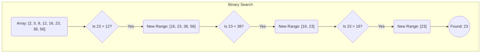

# 탐색 (이진 탐색, 해시 조회)

## 1. 핵심 개념 (Core Concept)

**탐색(Search)**은 대량의 데이터 집합에서 특정 값을 찾아내는 알고리즘입니다. **이진 탐색(Binary Search)**은 **정렬된** 데이터에서 탐색 범위를 절반씩 줄여나가며 효율적으로 값을 찾는 방법입니다. **해시 조회(Hash Lookup)**는 키(Key)를 해시 함수를 통해 배열의 인덱스로 변환하여, 평균적으로 **O(1)**의 매우 빠른 속도로 데이터에 직접 접근하는 방식입니다.

---

## 2. 상세 설명 (Detailed Explanation)

### 2.1 이진 탐색 (Binary Search)

이진 탐색은 **반드시 데이터가 정렬되어 있어야 한다**는 전제 조건을 가집니다.

*   **동작 원리**:
    1.  탐색 범위의 시작(low), 끝(high), 중간(mid) 인덱스를 설정합니다.
    2.  중간 위치의 값과 찾고자 하는 값을 비교합니다.
    3.  찾    값이 중간 값보다 작으면, 탐색 범위를 왼쪽 절반(low ~ mid-1)으로 줄입니다.
    4.  찾는 값이 중간 값보다 크면, 탐색 범위를 오른쪽 절반(mid+1 ~ high)으로 줄입니다.
    5.  찾을 때까지 또는 탐색 범위가 없어질 때까지 이 과정을 반복합니다.
*   **시간 복잡도**: **O(log n)**. 한 번 비교할 때마다 탐색 범위가 절반으로 줄어들기 때문에 매우 효율적입니다.
*   **공간 복잡도**: **O(1)** (재귀로 구현 시 O(log n)).



### 2.2 해시 조회 (Hash Lookup)

해시 조회는 **해시 테이블(Hash Table)**이라는 자료구조를 사용하여 데이터를 찾습니다. 파이썬의 딕셔너리(`dict`)가 대표적인 예입니다.

*   **동작 원리**:
    1.  키(Key)를 **해시 함수**에 입력하여 고정된 길이의 숫자 값인 **해시 값**을 얻습니다.
    2.  해시 값   배열의 인덱스로 변환하여 해당 위치에 값을 저장하거나 조회합니다.
*   **시간 복잡도**:
    *   **평균**: **O(1)**. 데이터 양과 상관없이 거의 즉시 값을 찾을 수 있습니다.
    *   **최악**: **O(n)**. **해시 충돌(Hash Collision)**이 많이 발생하여, 하나의 인덱스에 여러 데이터가 연결된 경우 순차 탐색이 필요할 수 있습니다.
*   **공간 복잡도**: **O(n)**. 데이터를 저장하기 위한 추가적인 배열 공간이 필요합니다.

### 2.3 비교 요약

| 구분 | 이진 탐색 (Binary Search) | 해시 조회 (Hash Lookup) |
| :--- | :--- | :--- |
| **시간 복잡도 (평균)** | **O(log n)** | **O(1)** |
| **시간 복잡도 (최악)** | O(log n) | O(n) |
| **데이터 정렬** | **필수** | 불필요 |
| **데이터 구조** | 배열, 리스트 | 해시 테이블 (딕셔너리, 해시맵) |
| **주요 연산** | 비교 (Comparison) | 해시 함수 계산 |
| **범위 검색** | **효율적** | 비효율적 |

---

## 3. 예시 (Example)

### Python 코드 예시

```python
import time

# 데이터 준비
sorted_data = list(range(10_000_000))
hash_data = {i: i for i in range(10_000_000)}
target = 9_999_999

# 1. 이진 탐색 성능 측정
def binary_search(arr, target):
    low, high = 0, len(arr) - 1
    while low <= high:
        mid = (low + high) // 2
        if arr[mid] == target:
            return True
        elif arr[mid] < target:
            low = mid + 1
        else:
            high = mid - 1
    return False

start_time = time.time()
binary_search(sorted_data, target)
end_time = time.time()
print(f"이진 탐색 소요 시간: {end_time - start_time:.8f}초")

# 2. 해시 조회 성능 측정
start_time = time.time()
_ = target in hash_data
end_time = time.time()
print(f"해시 조회 소요 시간: {end_time - start_time:.8f}초")

# 예상 출력:
# 이진 탐색 소요 시간: 0.00003...초
# 해시 조회 소요 시간: 0.00000...초
# (해시 조회가 훨씬 빠름을 알 수 있음)
```

### 사용 사례
*   **이진 탐색**:
    *   데이터 변경이 거의 없고, 검색이 빈번하게 일어나는 경우 (예: 사전, 데이터베이스 인덱스)
    *   특정 범위 내의 데이터를 검색해야 하는 경우 (`x`보다 크고 `y`보다 작은 모든 데이터 찾기)
*   **해시 조회**:
    *   매우 빠른 데이터 검색, 삽입, 삭제가 필요한 경우 (예: 실시간 시스템, 캐시 구현)
    *   데이터의 순서가 중요하지 않고, 키를 통해 값에 빠르게 접근하는 것이 중요한 경우 (예: 사용자 정보 관리)

---

## 4. 예상 면접 질   (Potential Interview Questions)

*   **Q. 이진 탐색을 사용하기 위한 필수 조건은 무엇인가요?**
    *   **A.** 데이터가 **반드시 정렬**되어 있어야 합니다. 이진 탐색은 중간 값과의 비교를 통해 탐색 범위를 절반씩 줄여나가는 원리로 동작하기 때문에, 정렬되어 있지 않으면 이 원리가 성립하지 않습니다.

*   **Q. 평균적으로 해시 조회가 이진 탐색보다 훨씬 빠름에도 불구하고, 항상 해시 조회를 사용하지 않는 이유는 무엇인가요?**
    *   **A.** 두 가지 주요 이유가 있습니다. 첫째, 해시 테이블은 데이터를 저장하기 위해 **추가적인 메모리 공간(O(n))**을 필요로 하지만, 이진 탐색은 그렇지 않습니다(O(1)). 둘째, 해시 테이블은 데이터의 순서를 보장하지 않으므로 **범위 검색이 비효율적**입니다. '50점 이상 80점 이하인 학생 찾기'와 같은 범위 기반의 쿼리가 필요할 때는 정렬된 데이터에서 이진 탐색을 활용하는 것이 훨씬 효율적입니다.

*   **Q. 해시 조회의 시간 복잡도가 최악의 경우 O(n)이 될 수 있는 이유는 무엇인가요?**
    *   **A.** **해시 충돌(Hash Collision)** 때문입니다. 해시 충돌은 서로 다른 키가 해시 함수를 통해 같은 인덱스로 변환되는 현상입니다. 만약 모든 데이터가 우연히 동일한 인덱스로 충돌한다면, 해당 인덱스에 연결된 데이터들을 처음부터 끝까지 순차적으로 탐색해야 합니다. 이 경우 시간 복잡도는 데이터의 개수(n)에 비례하는 O(n)이 됩니다.

---

## 5. 더 읽어보기 (Further Reading)

*   [Binary Search Algorithm (GeeksforGeeks)](https://www.geeksforgeeks.org/binary-search/)
*   [Hashing | Introduction (GeeksforGeeks)](https://www.geeksforgeeks.org/hashing-data-structure/)
*   [Binary Search vs. Hash Table (Baeldung)](https://www.baeldung.com/cs/binary-search-vs-hash-table)