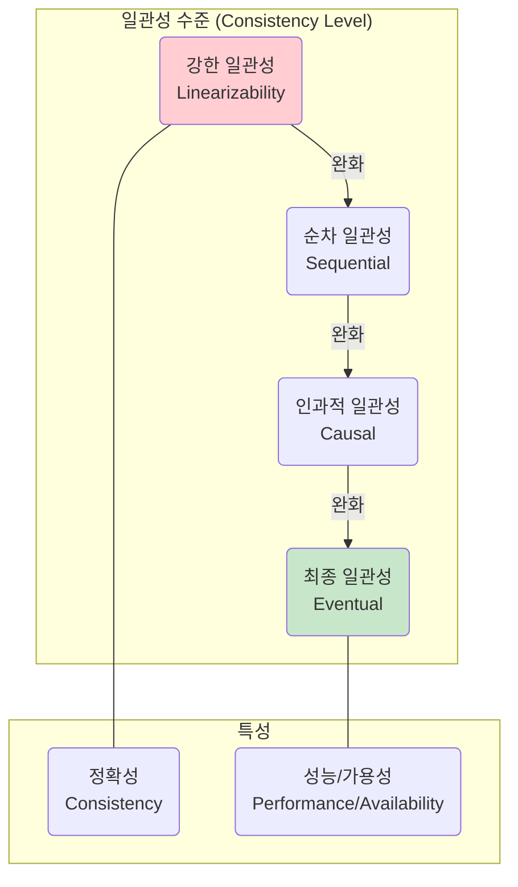

# 일관성 모델 (Consistency Models)

## 1. 핵심 개념 (Core Concept)

**일관성 모델(Consistency Model)**은 분산 시스템에서 여러 노드에 복제된 데이터의 일관성을 어떻게 유지할 것인지를 정의하는 규칙입니다. 즉, 어떤 노드에서 데이터 쓰기 작업이 발생했을 때, 다른 노드들이 그 변경 사항을 언제, 어떻게 보게 될지를 명시하는 계약입니다. 일관성 모델은 데이터의 **정확성(일관성)**과 시스템의 **성능(가용성, 지연 시간)** 사이의 트레이드오프 관계를 결정하는 중요한 요소입니다.

---

## 2. 상세 설명 (Detailed Explanation)

일관성 모델은 보장하는 수준에 따라 크게 **강한 일관성(Strong Consistency)**과 **약한 일관성(Weak Consistency)**으로 나눌 수 있습니다.

### 2.1 강한 일관성 (Strong Consistency)

가장 엄격한 일관성 모  로, 어떤 노드에서 데이터 쓰기 작업이 완료되면, 이후의 모든 읽기 요청은 **반드시 가장 최근에 쓰인 값을 반환**해야 합니다. 이는 마치 시스템에 데이터 복사본이 하나만 존재하는 것처럼 동작하게 하여, 사용자에게 항상 최신 데이터를 보장합니다.

*   **특징**: 데이터 정확성이 매우 높고 프로그래밍 모델이 직관적입니다.
*   **단점**: 모든 노드에 데이터 변경이 전파되고 확인될 때까지 기다려야 하므로 응답 시간이 길어지고(높은 지연 시간), 네트워크 분할이나 노드 장애 시 일관성을 위해 시스템 전체가 일시적으로 중단될 수 있습니다(낮은 가용성).
*   **대표 모델**: **선형성 (Linearizability)**

### 2.2 약한 일관성 (Weak Consistency)

강한 일관성의 제약을 완화하여 **가용성과 성능을 높이는 데** 초점을 맞춘 모델입니다. 쓰기 작업 이후 즉시 모든 노드에서 변경 사항이 보이지 않을 수 있습니다. 다양한 수준의 약한 일관성 모델이 존재합니다.

#### 가. 순차 일관성 (Sequential Consistency)
*   **정의**: 강한 일관성보다는 약하지만, **모든 프로세스(사용자)가 동일한 순서로 작업(읽기/쓰기)을 관찰**하는 것을 보장합니다. 실제 작업 처리 순서와는 무관하게, 모든 노드가 동의하는 '하나의' 가상적인 작업 순서가 있는 것처럼 보입니다.
*   **특징**: 프로그램의 논리를 이해하기 쉽지만, 모든 노드가 하나의 순서에 동의해야 하므로 통신 오버헤드로 인한 성능 저하가 발생할 수 있습니다.

#### 나. 인과적 일관성 (Causal Consistency)
*   **정의**: 순차 일관성보다 완화된 모델로, **인과 관계가 있는 작업들의 순서만 보장**합니다.
*   **예시**: A가 글을 쓰고 B가 그 글에 댓글을 다는 경우(인과 관계 발생), 다른 사용자들은 반드시 '글쓰기' 이후에 '댓글 달기'를 관찰해야 합니다. 하지만 이와 관련 없는 C의 다른 글쓰기 작업과의 순서는 보장되지 않습니다.
*   **특징**: 인과 관계가 없는 작업들은 병렬로 처리될 수 있어, 순차 일관성보다 높은 성능과 가용성을 제공합니다.

#### 다. 최종 일관성 (Eventual Consistency)
*   **정의**: 가장 널리 알려진 약한 일관성 모델로, 데이터 변경이 발생했을 때 즉시 모든 노드에 반영되지 않을 수 있지만, **시간이 지나고 새로운 업데이트가 없다면, 결국 모든 노드의 데이터가 같아지는 것**을 보장합니다.
*   **특징**: 쓰기 작업이 매우 빠르고, 네트워크 장애에도 높은 가용성을 유지할 수 있습니다. 하지만 특정 시점에는 오래된 데이터를 읽을 수 있다는 단점이 있습니다.
*   **사용처**: 대부분의 NoSQL 데이터베이스(DynamoDB, Cassandra 등)가 채택한 모델로, 소셜 미디어 피드처럼 실시간 정확성보다 빠른 응답과 가용성이 더 중요한 서비스에 적합합니다.

### 2.3 일관성 모델 비교

| 구분 | 강한 일관성 (Strong) | 순차 일관성 (Sequential) | 인과적 일관성 (Causal) | 최종 일관성 (Eventual) |
| :--- | :--- | :--- | :--- | :--- |
| **보장 수준** | 실시간 순서, 최신 값 | 모든 노드에서 동일한 순서 | 인과 관계 순서만 보장 | 언젠가는 같아짐 |
| **장점** | 데이터 정확성, 직관성 | 전역적 순서 보장 | 높은 효율성, 인과 관계 보존 | **높은 가용성, 낮은 지연 시간** |
| **단점** | **높은 지연 시간, 낮은 가용성** | 성능 저하 가능성 | 인과 관계 없는 순서는 보장 안됨 | 일시적 데이터 불일치 |
| **주요 사용처** | 금융 시스템, 실시간 재고 | 멀티플레이어 게임 | 스레드형 메시징 | 소셜 미디어 피드, NoSQL |

---

## 3. 예시 (Example)

### 온라인 쇼핑몰 장바구니 시나리오

*   **강한 일관성**: 사용자가 장바구니에 상품을 담으면, 어떤 기기에서 접속하든 즉시 담긴 상품이 보여야 합니다. 재고 시스템과 연동될 경우 필수적입니다.
*   **최종 일관성**: 사용자가 상품을 담았을 때, PC에서는 보이지만 모바일 앱에서는 몇 초 뒤에 보일 수 있습니다. 사용자 경험에 큰 영향을 주지 않으면서 서버 부하를 줄일 수 있습니다.
*   **인과적 일관성**: 사용자가 상품을 담고(A), 그 다음 결제(B)를 시도하는 경우, 시스템은 반드시 A->B 순서를 지켜야 합니다. 하지만 다른 사용자가 다른 상품을 담는 행위(C)와는 순서가 섞여도 상관없습니다.

---

## 4. 예상 면접 질문 (Potential Interview Questions)

*   **Q. 강한 일관성과 최종 일관성의 가장 큰 차이점은 무엇이며, 각각 어떤 서비스에 적합한가요?**
    *   **A.** 가장 큰 차이점은 **데이터 변경 사항이 언제 모든 사용자에게 보이느냐**입니다. 강한 일관성은 쓰기 작업이 완료된 직후 모든 사용자가 최신 데이터를 볼 수 있도록 보장하여 **데이터 정확성**이 매우 높지만, 성능과 가용성에서 손해를 봅니다. 따라서 은행 거래나 실시간 재고 관리처럼 데이터의 정합성이 최우선인 서비스에 적합합니다. 반면, 최종 일관성은 약간의 지연을 허용하더라도 결국에는 데이터가 일관된 상태에 도달하는 것을 보장하여 **가용성과 성능**을 극대화합니다. 따라서 소셜 미디어 피드나 DNS처럼 일시적인 데이터 불일치보다 빠른 응답이 더 중요한 서비스에 적합합니다.

*   **Q. CAP 이론의 관점에서 일관성 모델을 설명해주세요.**
    *   **A.** CAP 이론은 분산 시스템이 일관성(C), 가용성(A), 분할 허용성(P) 중 최대 두 가지만을 동시에 만족시킬 수 있다는 이론입니다. 네트워크 분할(P)은 피할 수 없는 문제이므로, 시스템 설계자는 일관성(C)과 가용성(A) 사이에서 트레이드오프를 해야 합니다. **강한 일관성** 모델은 **CP(Consistency, Partition Tolerance)** 시스템에 해당하며, 데이터 일관성을 위해 네트워크 분할 시 가용성을 희생할 수 있습니다. 반면, **최종 일관성**과 같은 약한 일관성 모델들은 **AP(Availability, Partition Tolerance)** 시스템에 해당하며, 네트워크 분할 시에도 요청에 응답하기 위해(가용성) 일시적인 데이터 불일치를 허용합니다.

*   **Q. 순차적 일관성과 인과적 일관성의 차이를 설명해주세요.**
    *   **A.** 순차적 일관성은 모든 노드가 **모든 작업**에 대해 동일한 순서를 보는 것을 보장합니다. 마치 모든 작업이 하나의 전역적인 큐를 통해 처리되는 것처럼 보입니다. 반면, 인과적 일관성은 이보다 완화된 모델로, **원인과 결과 관계에 있는 작업들**의 순서만 보장합니다. 서로 관련 없는 작업들은 순서가 다르게 보일 수 있습니다. 이 덕분에 인과적 일관성은 순차적 일관성보다 더 높은 병렬성을 허용하여 성능상 이점을 가집니다.

---

## 5. 더 읽어보기 (Further Reading)

*   [Consistency model (Wikipedia)](https://en.wikipedia.org/wiki/Consistency_model)
*   [Jepsen - Consistency Models](https://jepsen.io/consistency)
*   [CAP Twelve Years Later: How the "Rules" Have Changed (InfoQ)](https://www.infoq.com/articles/cap-twelve-years-later-how-the-rules-have-changed/)