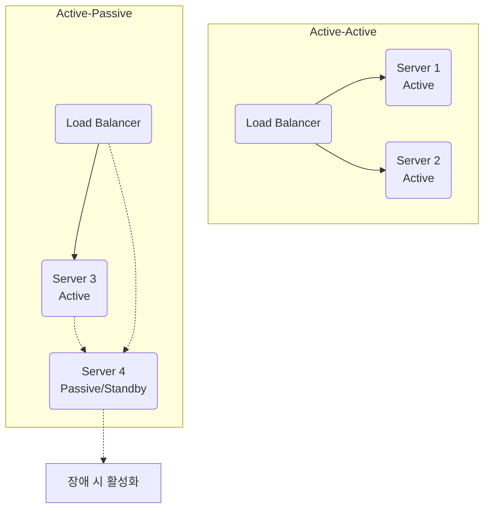

# 다중 지역 & 장애 허용 (Active-Active/Passive)

## 1. 핵심 개념 (Core Concept)

\*\*장애 허용(Fault Tolerance)\*\*은 시스템의 일부 구성 요소에 결함이나 고장이 발생하더라도, 전체 시스템은 중단 없이 정상적으로 기능을 계속 수행할 수 있는 능력을 의미합니다. **다중 지역(Multi-Region) 아키텍처**는 이러한 장애 허용을 극대화하기 위해 시스템을 지리적으로 떨어진 여러 지역(Region)에 분산하여 구축하는 방식입니다. 이중화(Redundancy)를 구현하는 대표적인 방식으로는 **Active-Active**와 **Active-Passive**가 있습니다.

______________________________________________________________________

## 2. 상세 설명 (Detailed Explanation)

### 2.1 장애 허용 (Fault Tolerance)

장애 허용은 시스템의 신뢰성을 높이는 핵심적인 개념으로, 장애가 발생할 것을 미리 예상하고 대비하는 데 중점을 둡니다.

- **목표**: 서비스 중단을 최소화하고 비즈니스 연속성을 보장하는 것.
- **핵심 기술**:
  - **중복성 (Redundancy)**: 동일한 기능을 하는 구성 요소를 여러 개 준비하여 하나에 문제가 생겨도 다른 것이 대체할 수 있도록 합니다. (예: 서버, 데이터베이스, 네트워크 장비 이중화)
  - **장애 감지 (Failure Detection)**: 시스템은 스스로 장애를 감지하고(예: Health Check), 발생한 문제를 해결하여 정상 상태로 복구하는 메커니즘을 갖추고 있습니다.
  - **장애 조치 (Failover)**: 장애 발생 시, 예비 시스템으로 서비스가 자동으로 전환되는 과정입니다.

### 2.2 다중 지역 (Multi-Region) 아키텍처

단일 지역(Single-Region)의 데이터 센터에서 발생하는 자연재해, 정전, 대규모 네트워크 장애 등으로부터 서비스를 보호하기 위해, 지리적으로 떨어진 여러 지역에 시스템을 분산하여 구축하는 방식입니다.

- **장점**:
  - **높은 가용성 및 재해 복구**: 한 지역 전체에 장애가 발생해도 다른 지역에서 서비스를 계속할 수 있습니다.
  - **낮은 지연 시간 (Latency)**: 전 세계 사용자와 가까운 지역에 서버를 배치하여 데이터 접근 속도를 높이고 더 나은    용자 경험을 제공합니다.
- **고려사항**:
  - **비용 증가**: 여러 지역에 인프라를 구축하고 운영해야 하므로 비용이 증가합니다.
  - **데이터 동기화의 복잡성**: 여러 지역 간에 데이터를 일관성 있게 유지하는 것은 기술적으로 어려운 과제입니다.

### 2.3 Active-Active vs. Active-Passive

서버 이중화는 장애 허용을 구현하는 대표적인 방법으로, 크게 Active-Active와 Active-Passive 방식으로 나뉩니다.

| 구분                     | Active-Active                                                                      | Active-Passive (Active-Standby)                                                                               |
| :----------------------- | :--------------------------------------------------------------------------------- | :------------------------------------------------------------------------------------------------------------ |
| **개념**                 | 두 개 이상의 서버가 \*\*모두 활성 상태(Active)\*\*로 동시에 요청을 처리.           | 하나의 주 서버(Active)가 요청을 처리하고, 다른 서버(Passive)는 **대기 상태**로 있다가 주 서버 장애 시 활성화. |
| **부하 분산**            | **가능**. 로드 밸런서를 통해 여러 서버에 트래픽을 분산.                            | **불가능**. 모든 요청은 주 서버에서만 처리.                                                                   |
| **자원 활용**            | **높음**. 모든 서버 자원을 동시에 활용.                                            | **낮음**. 대기 서버는 평상시에 유휴 상태.                                                                     |
| **장애 조치 (Failover)** | **매우 빠름**. 한 서버 장애 시 다른 활성 서버가 즉시 처리 (서비스 중단 거의 없음). | **전환 시간 필요**. 주 서버 장애 감지 후 대기 서버가 활성화되는 데 약간의 시간(Downtime) 발생.                |
| **구성 복잡도**          | 높음. 여러 서버가 동시에 작동하므로 데이터 동기화 등 구성이 더 복잡.               | 비교적 단순.                                                                                                  |
| **적합한 환경**          | 높은 처리량과 상시 부하 분산이 필요한 대규모 서비스 (예: 웹 서버)                  | 즉각적인 장애 복구가 중요하지만, 평상시 트래픽이 하나의 서버로 감당 가능한 시스템 (예: 데이터베이스)          |

______________________________________________________________________

## 3. 예시 (Example)

### 글로벌 동영상 스트리밍 서비스

- **다중 지역**: 미국, 유럽, 아시아에 각각 데이터 센터(Region)를 구축합니다.
- **Active-Active**: 각 지역의 웹 서버들은 Active-Active로 구성되어 로드 밸런서를 통해 전 세계 사용자들의 트래픽을 분산 처리합니다. 미국 사용자는 미국 서버로, 유럽 사용자는 유럽 서버로 접속하여 빠른 응답 속도를 경험합니다.
- **Active-Passive**: 각 지역의 **메인 데이터베이스**는 Active-Passive로 구성될 수 있습니다. 평소에는 Active DB가 모든 쓰기 작업을 처리하고, 실시간으로 Passive DB에 데이터를 복제합니다. 만약 Active DB에 장애가 발생하면, 즉시 Passive DB가 Active로 전환되어 데이터 유실 없이 서비스를 계속 이어나갑니다.

______________________________________________________________________

## 4. 예상 면접 질문 (Potential Interview Questions)

- **Q. Active-Active와 Active-Passive 구성의 가장 큰 차이점은 무엇이며, 어떤 기준으로 선택해야 하나요?**

  - **A.** 가장 큰 차이점은 **모든 서버가 동시에 요청을 처리하는지 여부**와 그에 따른 **자원 효율성**입니다. Active-Active는 모든 서버가 활성 상태로 부하를 분산 처리하여 자원 효율이 높고 장애 시 서비스 중단이 거의 없습니다. Active-Passive는 하나의 서버만 요청을 처리하고 나머지는 대기하므로 자원 효율은 낮지만 구성이 단순합니다. 선택 기준은 **비용, 성능, 요구되는 가용성 수준**입니다. 높은 처리량과 무중단 서비스가 필수적이라면 비용이 더 들더라도 Active-Active를, 비용 효율적이면서 빠른 장애 복구가 필요하다면 Active-Passive를 선택할 수 있습니다.

- **Q. 다중 지역(Multi-Region) 아키텍처를 구성할 때 기술적으로 가장 어려운 점은 무엇일까요?**

  - **A.** **데이터 동기화와 일관성 유지**가 가장 어렵습니다. 지리적으로 멀리 떨어진 지역 간에는 네트워크 지연이 필연적으로 발생합니다. 모든 지역에서 데이터를 강한 일관성(Strong Consistency)으로 동기화하려면 쓰기 작업의 응답 시간이 매우 길어질 수 있습니다. 반면, 최종 일관성(Eventual Consistency)을 허용하면 응답 시간은 빠르지만, 지역 간에 일시적인 데이터 불일치가 발생할 수 있습니다. 따라서 서비스의 특성에 맞는 데이터 복제 전략과 일관성 수준을 신중하게 설계하는 것이 가장 큰 도전 과제입니다.

- **Q. 장애 허용(Fault Tolerance)과 고가용성(High Availability)은 어떻게 다른가요?**

  - **A.** 두 용어는 비슷하지만 미묘한 차이가 있습니다. **장애 허용**은 시스템에 장애가 발생하더라도 **기능을 올바르게 계속 수행할 수 있는 능력** 자체에 초점을 맞춥니다. 반면, **고가용성**은 시스템이 **정상적으로 사용 가능한 시간의 비율**을 나타내는 척도입니다. 즉, 장애 허용은 고가용성을 달성하기 위한 '방법' 또는 '속성'이라고 볼 수 있습니다. 장애 허용 시스템은 장애가 발생해도 서비스 중단을 최소화하여 높은 가용성을 유지하게 됩니다.

______________________________________________________________________

## 5. 더 읽어보기 (Further Reading)

- [Fault Tolerance (Wikipedia)](https://en.wikipedia.org/wiki/Fault_tolerance)
- [What is High Availability? (Red Hat)](https://www.redhat.com/en/topics/high-availability/what-is-high-availability)
- [Active-Active vs. Active-Passive Clusters (N-able)](https://www.n-able.com/blog/active-active-vs-active-passive-clusters)
