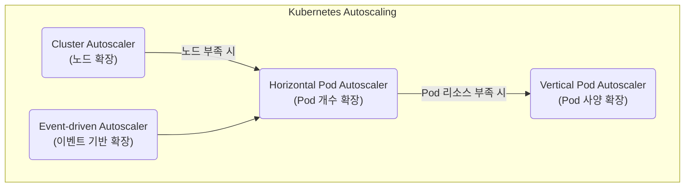

# Autoscaling, GPU 오케스트레이션(K8s, KEDA)

## 1. 핵심 개념 (Core Concept)

\*\*오토스케일링(Autoscaling)\*\*은 시스템의 부하와 수요에 따라 컴퓨팅 자원을 자동으로 조절하는 기술로, 클라우드 환경에서 안정성과 비용 효율성을 동시에 달성하기 위한 핵심 전략입니다. **GPU 오케스트레이션**은 이러한 오토스케일링 개념을 AI/ML 워크로드의 핵심 자원인 GPU에 적용하여, 고가의 GPU 리소스를 효율적으로 할당하고 관리하는 것을 의미합니다. \*\*쿠버네티스(Kubernetes)\*\*는 이러한 오토스케일링과 GPU 오케스트레이션을 구현하는 사실상의 표준 플랫폼으로 자리 잡았습니다.

______________________________________________________________________

## 2. 상세 설명 (Detailed Explanation)

### 2.1 쿠버네티스 오토스케일링의 종류

쿠버네티스는 다양한 차원에서 오토스케일링을 지원하여 유연하고 효율적인 자원 관리를 가능하게 합니다.

- **HPA (Horizontal Pod Autoscaler)**:

  - **역할**: 파드(Pod)의 CPU나 메모리 사용량과 같은 메트릭을 기준으로 파드의 복제본(replica) 수를 자동으로 늘리거나 줄입니다.
  - **동작**: CPU 사용량이 설정된 임계값(예: 75%)을 넘으면 파드의 개수를 늘려 부하를 분산시키고, 사용량이 낮아지면 다시 줄입니다.
  - **사용처**: 웹 서버, API 서버 등 수평적 확장이 용이한 stateless 애플리케이션에 적합합니다.

- **VPA (Vertical Pod Autoscaler)**:

  - **역할**: 파드가 요청(request)하고 사용하는 리소스(CPU, 메모리)의 양을 자동으로 조절합니다.
  - **동작**: 파드의 과거 리소스 사용량을 분석하여, 파드를 재시작하고 더 적합한 리소스를 할당합니다.
  - **사용처**: 데이터베이스와 같이 상태를 유지해야 하거나(Stateful), 수평적 확장이 어려운 애플리케이션에 유용합니다. (단, 파드 재시작이 필요하다는 단점 존재)

- **CA (Cluster Autoscaler)**:

  - **역할**: 클러스터 전체의 워커 노드(Worker Node) 수를 자동으로 조절합니다.
  - **동작**: 리소스 부족으로 더 이상 파드를 스케줄링할 수 없을 때, 클라우드 제공업체(AWS, GCP 등)와 연동하여 새로운 노드를 클러스터에 추가합니다. 반대로 노드가 오랫동안 사용되지 않으면 노드를 제거하여 비용을 최적화합니다.

- **KEDA (Kubernetes-based Event-driven Autoscaler)**:

  - **역할**: CPU/메모리 외에, **다양한 외부 이벤트 소스**를 기반으로 파드의 수를 0개부터 n개까지 조절합니다.
  - **동작**: RabbitMQ 큐의 메시지 수, Kafka 토픽의 lag, Prometheus 메트릭 등 특정 이벤트 소스를 모니터링하다가, 이벤트가 발생하면 HPA를 활성화시켜 파드를 확장합니다. 이벤트가 없으면 파드를 0개로 줄여 유휴 자원을 최소화합니다.
  - **사용처**: 비동기 작업 처리, 이벤트 기반 아키텍처, 서버리스(Serverless) 워크로드에 매우 유용합니다.

### 2.2 GPU 오케스트레이션 (GPU Orchestration)

AI/ML 워크로드의 증가로 인해 고가의 GPU 자원을 효율적으로 관리하는 것    중요해졌습니다. GPU 오케스트레이션은 쿠버네티스 클러스터에서 GPU 리소스를 효율적으로 할당, 스케줄링, 모니터링하는 것을 의미합니다.

#### NVIDIA K8s Device Plugin

쿠버네티스가 GPU를 인식하고 관리할 수 있도록 하기 위해서는 각 하드웨어 벤더가 제공하는 \*\*장치 플러그인(Device Plugin)\*\*이 필요합니다.

- **역할**: NVIDIA에서 제공하는 공식 플러그인으로, 클러스터 내의 NVIDIA GPU를 쿠버네티스가 인식하고 컨테이너에 할당할 수 있도록 해줍니다.
- **동작**:
  1. **탐지 및 등록**: 각 노드의 GPU를 감지하여 kubelet에 등록합니다.
  1. **리소스 할당**: 사용자가 Pod Spec에 `nvidia.com/gpu: 1`과 같이 GPU 리소스를 요청하면, 쿠버네티스 스케줄러는 가용한 GPU가 있는 노드에 해당 파드를 배치합니다.
  1. **환경 설정**: Device Plugin은 컨테이너가 GPU를 사용할 수 있도록 필요한 드라이버 라이브러리와 장치 파일들을 컨테이너 내부에 마운트합니다.
  1. **상태 모니터링**: GPU의 상태(온도, 사용률 등)를 모니터링하고 메트릭을 제공하여, GPU 워크로드의 모니터링 및 스케일링을 지원합니다.

______________________________________________________________________

## 3. 예시 (Example)

### ML 모델 서빙 시스템 디자인

실시간으로 트래픽이 변동하는 ML 모델 서빙 API를 구축하는 시나리오입니다.

1. **기본 배포**: ML 모델을 서빙하는 애플리케이션을 컨테이너화하여 쿠버네티스에 배포합니다. 이때 Pod Spec에 GPU 리소스를 요청합니다. (`nvidia.com/gpu: 1`)
1. **GPU 할당**: **NVIDIA Device Plugin**이 GPU가 장착된 노드를 찾아 해당 파드를 스케줄링하고 GPU를 할당합니다.
1. **오토스케일링 설정**:
   - **HPA**: API 요청량(RPS)이나 CPU 사용률을 기준으로 파드의 수를 1개에서 10개까지 자동으로 조절하도록 설정합니다.
   - **CA**: HPA가 파드를 10개까지 늘렸음에도 GPU 노드의 리소스가 부족해지면, CA가 자동으로 새로운 GPU 노드를 클러스터에 추가합니다.
1. **동작 시나리오**:
   - **평상시**: 최소한의 파드(1개)만 실행하여 비용을 절감합니다.
   - **트래픽 급증**: 갑자기 API 요청이 몰리면 HPA가 동작하여 파드 수를 점차 늘려(Scale-out) 안정적으로 요청을 처리합니다.
   - **노드 포화**: 파드가 계속 늘어나 기존 노드의 GPU를 모두 사용하게 되면, CA가 새로운 GPU 노드를 프로비저닝하여 클러스터의 전체 용량을 늘립니다.
   - **트래픽 감소**: 트래픽이 줄어들면 HPA와 CA가 역으로 동작하여 파드와 노드 수를 줄여 다시 비용을 최적화합니다.

______________________________________________________________________

## 4. 예상 면접 질문 (Potential Interview Questions)

- **Q. 쿠버네티스의 HPA와 CA의 역할과 차이점은 무엇인가요?**

  - **A.** HPA(Horizontal Pod Autoscaler)는 **파드(Pod) 레벨**의 오토스케일러로, CPU나 메모리 사용량 같은 메트릭에 따라 파드의 개수를 조절합니다. 반면, CA(Cluster Autoscaler)는 **노드(Node) 레벨**의 오토스케일러로, 클러스터 전체의 리소스가 부족하여 파드를 더 이상 스케줄링할 수 없을 때 노드의 개수 자체를 늘리거나 줄입니다. 즉, HPA는 마이크로 레벨의 부하 조절을, CA는 인프라 자체의 용량 조절을 담당합니다.

- **Q. KEDA는 어떤 상황에서 유용하며, 기존 HPA와 어떻게 다른가요?**

  - **A.** KEDA는 **이벤트 기반 워크로드**를 처리할 때 매우 유용합니다. 기존 HPA는 CPU/메모리 사용량 기반으로 동작하여, 메시지 큐에 작업이 쌓여도 실제 CPU 사용량이 늘기 전까지는 스케일 아웃이 지연될 수 있습니다. KEDA는 메시지 큐의 길이, 스트림 데이터의 양 등 외부 시스템의 이벤트를 직접 트리거로 사용하여, 실제 부하가 발생하기 전에 선제적으로 파드를 확장할 수 있습니다. 또한, 이벤트가 없을 때는 파드를 0개로 줄이는 'Scale-to-Zero' 기능으로 유휴 비용을 크게 절감할 수 있다는 차이점이 있습니다.

- **Q. 쿠버네티스에서 GPU를 사용하는 애플리케이션을 어떻게 배포하고 관리할 수 있나요?**

  - **A.** 먼저, 클러스터의 각 GPU 노드에 **NVIDIA Device Plugin**을 설치하여 쿠버네티스가 GPU 하드웨어를 인식하고 관리할 수 있도록 해야 합니다. 그 다음, 애플리케이션의 Pod Spec 파일에서 리소스 요청/제한 필드에 `nvidia.com/gpu: <개수>`를 명시하여 필요한 GPU 수를 요청합니다. 이렇게 하면 쿠버네티스 스케줄러가 가용한 GPU가 있는 노드에 자동으로 파드를 배치해주며, Device Plugin이 컨테이너 내에서 GPU를 사용할 수 있도록 필요한 드라이버와 라이브러리를 설정해줍니다.

______________________________________________________________________

## 5. 더 읽어보기 (Further Reading)

- [Kubernetes Autoscaling (Official Docs)](https://kubernetes.io/docs/tasks/run-application/horizontal-pod-autoscale/)
- [KEDA (Kubernetes-based Event-driven Autoscaling) Official Docs](https://keda.sh/docs/2.13/concepts/)
- [NVIDIA Device Plugin for Kubernetes (GitHub)](https://github.com/NVIDIA/k8s-device-plugin)
