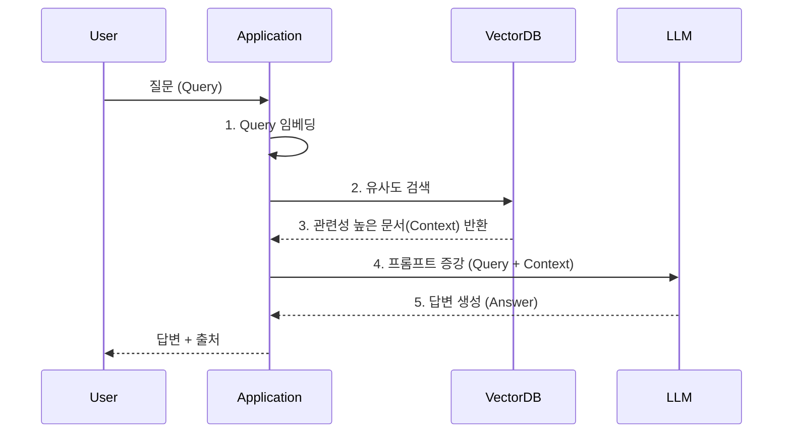

# 데이터 중심 LLM 서비스 디자인 (Vector DB + LLM 캐시)

## 1. 핵심 개념 (Core Concept)

**데이터 중심 LLM 서비스 디자인**은 모델 자체의 개선보다 서비스에 사용되는 **데이터의 품질과 관리**의 중요성을 강조하는 접근 방식입니다. 이는 LLM이 가진 한계점(환각, 최신성 부족)을 보완하고, 특정 도메인에 특화된 정확하고 신뢰도 높은 답변을 생성하기 위함입니다. 이 디자인의 핵심 요소로 **RAG(Retrieval-Augmented Generation)** 아키텍처가 있으며, 이는 **Vector DB**를 이용한 정보 검색과 **LLM 캐시**를 통한 성능 및 비용 최적화를 포함합니다.

______________________________________________________________________

## 2. 상세 설명 (Detailed Explanation)

### 2.1 RAG (Retrieval-Augmented Generation) 아키텍처

RAG는 LLM이 답변을 생성할 때, 외부의 신뢰할 수 있는 지식 소스를 **실시간으로 참조**하여 답변의 정확성과 신뢰도를 높이는 아키텍처입니다.

- **목표**:

  - **환각(Hallucination) 현상 감소**: LLM이 잘못되거나 존재하지 않는 정보를 생성하는 것을 방지합니다.
  - **최신 정보 반영**: LLM을 재학습시키지 않고도 외부 데이터 소스를 최신 상태로 유지하여 시의성 있는 답변을 제공합니다.
  - **출처 제공**: 답변의 근거가 된 외부 데이터 소스의 출처를 함께 제시하여 사용자가 정보의 신뢰도를 직접 확인할 수 있도록 합니다.

- **동작 방식**:

  1. **검색 (Retrieval)**: 사용자의 질문이 들어오면, 먼저 **Vector DB**와 같은 외부 데이터 소스에서 관련성이 높은 정보를 검색합니다.
  1. **증강 (Augmentation)**: 검색된 정보를 사용자의 원래 질문과 함께 프롬프트에 포함하여, LLM에 풍부하고 정확한 컨텍스트를 제공합니다.
  1. **생성 (Generation)**: LLM은 증강된 정보를 바탕으로 최종 답변을 생성합니다.

### 2.2 Vector DB (벡터 데이터베이스)

Vector DB는 텍스트, 이미지 등 비정형 데이터를 고차원의 \*\*벡터(Vector Embedding)\*\*로 변환하여 저장하고, 벡터 간의 유사도를 측정하여 빠르고 효율적으로 검색할 수 있도록 설계된 데이터베이스입니다.

- **역할**: RAG 아키텍처에서 '검색(Retrieval)' 단계를 담당하는 핵심 요소입니다.
- **동작 원리**:
  1. **데이터 저장**: 문서를 임베딩 모델(Embedding Model)을 통해 벡터로 변환한 후, Vector DB에 저장합니다.
  1. **유사도 검색**: 사용자 질문 또한 같은 임베딩 모델로 벡터화한 뒤, DB에 저장된 벡터들과의 유사도(코사인 유사도 등)를 계산하여 가장 관련성 높은 문서 벡터를 찾습니다.
- **장점**: 단순한 키워드 매칭이 아닌, 문장의 **의미적 유사도**를 기반으로 관련 정보를 검색할 수 있습니다.
- **대표 DB**: Pinecone, Weaviate, Chroma, Faiss

### 2.3 LLM 캐시 (LLM Cache)

LLM 캐시는 반복적으로 들어오는 동일하거나 유사한 질문에 대해 LLM을 다시 호출하지 않고, 이전에 생성된 답변을 저장해 두었다가 즉시 반환하는 기술입니다.

- **목표**: LLM API 호출 비용 절감 및 응답 속도 향상.
- **구현 방식**:
  - **Semantic Cache**: 단순한 질문-답변 쌍을 저장하는 것을 넘어, 질문의 **의미적 유사도**를 기반으로 캐시를 조회합니다. 사용자 질문을 임베딩하여, 캐시에 저장된 질문 벡터들과 유사도를 비교하고, 일정 임계값 이상으로 유사하면 캐시된 답변을 반환합니다.
  - **저장소**: 빠른 조회를 위해 Redis와 같은 인메모리 DB나 Vector DB를 캐시 저장소로 사용할 수 있습니다.

______________________________________________________________________

## 3. 예시 (Example)

### 데이터 중심 사내 Q&A 챗봇 디자인

- **목표**: 사내 기술 문서, 규정 등을 기반으로 직원들의 질문에 정확하게 답변하는 챗봇.
- **아키텍처**:
  1. **데이터 준비**: 모든 사내 문서를 잘게 쪼개(Chunking)고, 임베딩 모델을 통해 벡터로 변환하여 **Vector DB**에 저장합니다.
  1. **RAG 파이프라인**:
     - 사용자가 "올해 여름 휴가 규정이 어떻게 돼?"라고 질문합니다.
     - 애플리케이션은 이 질문을 벡터로 변환하여 Vector DB에서 가장 관련성 높은 휴가 규정 문서 조각들을 검색합니다.
     - 검색   문서 내용과 원래 질문을 합쳐 LLM에 프롬프트로 전달합니다: `"다음 내용을 참고하여 질문에 답해줘. [내용: ...휴가 규정 문서...] 질문: 올해 여름 휴가 규정이 어떻게 돼?"`
  1. **LLM 캐시 적용**:
     - LLM에 프롬프트를 보내기 전, **LLM 캐시**에서 유사한 질문이 있었는지 먼저 확인합니다.
     - 만약 다른 직원이 최근에 동일한 질문을 했다면, LLM을 호출하지 않고 캐시된 답변을 즉시 반환하여 비용과 시간을 절약합니다.
  1. **답변 생성 및 출처 제공**: LLM은 제공된 내용을 바탕으로 정확한 답변을 생성하고, 애플리케이션은 답변과 함께 참고한 사내 문서의 링크를 출처로 제공합니다.

______________________________________________________________________

## 4. 예상 면접 질문 (Potential Interview Questions)

- **Q. LLM 기반 서비스를 개발할 때 RAG 아키텍처를 사용하는 이유는 무엇인가요?**

  - **A.** 크게 세 가지 이유가 있습니다. 첫째, LLM이 학습하지 않은 최신 정보나 내부 데이터를 참조하게 하여 **답변의 정확성과 최신성을 높일 수 있습니다.** 둘째, 사실에 기반하지 않은 정보를 만들어내는 **환각(Hallucination) 현상을 크게 줄일 수 있습니다.** 셋째, 답변의 근거가 된 문서의 출처를 함께 제공하여 **답변의 신뢰도를 높일 수 있습니다.**

- **Q. Vector DB는 기존의 관계형 데이터베이스와 어떤 점에서 다른가요?**

  - **A.** 가장 큰 차이점은 **데이터 저장 및 검색 방식**입니다. 관계형 데이터베이스는 정형화된 데이터를 테이블에 저장하고 SQL을 통해 정확한 값으로 검색하는 반면, Vector DB는 텍스트나 이미지 같은 비정형 데이터를 고차원 벡터로 변환하여 저장하고, **의미적 유사도**를 기반으로 데이터를 검색합니다. 따라서 '정확한 일치'가 아닌 '관련성 높은 정보'를 찾는 데 특화되어 있습니다.

- **Q. LLM 서비스에서 캐싱을 구현할 때, 일반적인 키-값 캐시 대신 시맨틱 캐시(Semantic Cache)를 사용하는 이유는 무엇인가요?**

  - **A.** 사용자의 질문은 표현이 조금씩 다르더라도 의미는 같은 경우가 많기 때문입니다. 일반적인 키-값 캐시는 질문이 글자 하나라도 다르면 캐시를 활용할 수 없습니다. 하지만 **시맨틱 캐시**는 질문을 벡터로 변환하여 의미적 유사도를 비교하므로, "오늘 날씨 어때?"와 "오늘 날씨 알려줘"처럼 표현은 다르지만 의미가 같은 질문에 대해 동일한 캐시된 답변을 반환할 수 있습니다. 이를 통해 캐시 히트율을 크게 높여 비용 절감과 응답 속도 향상 효과를 극대화할 수 있습니다.

______________________________________________________________________

## 5. 더 읽어보기 (Further Reading)

- [What is Retrieval-Augmented Generation (RAG)? (Pinecone)](https://www.pinecone.io/learn/retrieval-augmented-generation/)
- [Vector Databases (AWS Blog)](https://aws.amazon.com/what-is/vector-databases/)
- [Building LLM applications with a semantic cache (Zilliz blog)](https://zilliz.com/blog/building-llm-applications-with-a-semantic-cache)
