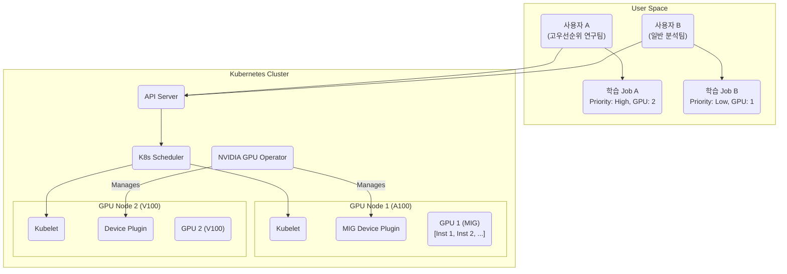

# GPU Job Scheduler 디자인 (NVIDIA K8s Operator)

## 1. 핵심 개념 (Core Concept)

**GPU 잡 스케줄러(Job Scheduler)**는 한정된 GPU 자원을 여러 AI/ML 작업(Job)에 효율적으로 할당하고 관리하는 시스템입니다. 스케줄러의 주요 목표는 GPU 활용도 극대화, 작업 완료 시간 최소화, 공정한 자원 분배 등입니다. **쿠버네티스(Kubernetes)**는 컨테이너화된 워크로드를 관리하는 표준 플랫폼이며, **NVIDIA GPU Operator**와 같은 도구를 통해 복잡한 GPU 워크로드의 스케줄링과 오케스트레이션을 자동화하고 단순화할 수 있습니다.

---

## 2. 상세 설명 (Detailed Explanation)

### 2.1 GPU 스케줄링의 주요 고려사항

효율적인 GPU 스케줄러를 디자인하기 위해서는 다음과 같은 요소들을 고려해야 합니다.

*   **큐 관리 (Queue Management)**: 작업을 관리하기 위해 단일 큐 또는 다중 큐를 사용합니다. 다중 큐는 작업의 우선순위, 사용자 그룹, 필요한 GPU 종    등에 따라 작업을 분리하여 관리하는 데 유용합니다.
*   **선점 (Preemption)**: 높은 우선순위의 작업이 도착했을 때, 현재 실행 중인 낮은 우선순위의 작업을 중단하고 자원을 할당하는 기능입니다. 이를 통해 중요한 작업을 더 빠르게 처리할 수 있습니다.
*   **GPU 토폴로지 및 선호도 (Topology & Affinity)**: 여러 GPU가 노드 내에서 고속 인터커넥트(예: NVLink)로 연결된 경우, 통신이 잦은 분산 훈련 작업들을 동일한 인터커넥트에 연결된 GPU에 함께 배치하여 성능을 향상시키는 것이 중요합니다.
*   **자원 공유 및 분할**: 단일 GPU를 여러 작업이 공유하여 활용도를 높이는 기술입니다.
    *   **MIG (Multi-Instance GPU)**: NVIDIA Ampere 아키텍처 이상에서 지원하는 기술로, 단일 GPU를 하드웨어 수준에서 완벽하게 격리된 여러 개의 작은 GPU 인스턴스로 분할합니다. 각 인스턴스는 독립적인 컴퓨팅 및 메모리 자원을 가져 서비스 품질(QoS)을 보장합니다.
    *   **시간 분할 (Time-Slicing)**: GPU의 처리 시간을 잘게 쪼개어 여러 컨테이너에 시분할로 할당하는 방식입니다. MIG를 지원하지 않는 구형 GPU에서도 사용할 수 있지만, 완벽한 성능 격리는 보장되지 않습  다.

### 2.2 쿠버네티스 기반 GPU 스케줄링

쿠버네티스는 GPU와 같은 특수 하드웨어를 관리하기 위한 **디바이스 플러그인(Device Plugin) 프레임워크**를 제공합니다.

*   **동작 방식**:
    1.  **디바이스 플러그인 배포**: 각 노드에 NVIDIA 디바이스 플러그인이 데몬셋(DaemonSet) 형태로 배포됩니다. 이 플러그인은 노드의 GPU를 감지하고 쿠버네티스 API 서버에 해당 정보를 등록합니다.
    2.  **GPU 자원 요청**: 사용자는 파드(Pod) 정의 파일의 `resources` 섹션에 `nvidia.com/gpu: 1`과 같은 형태로 필요한 GPU 개수를 명시하여 자원을 요청합니다.
    3.  **스케줄링**: 쿠버네티스 스케줄러는 GPU를 요청한 파드를 해당 자원이 가용한 노드에 배치합니다.

### 2.3 NVIDIA GPU Operator

NVIDIA GPU Operator는 쿠버네티스에서 NVIDIA GPU를 프로비저닝하는 데 필요한 모든 소프트웨어 구성 요소의 관리를 **자동화**하는 도구입니다.

*   **주요 기능**:
    *   **드라이버 자동 설치**: 노드의 운영체제 및 커널 버전에 맞는 NVIDIA 드라이버를 자동으로 설치하고 관리합니다.
    *   **컨테이너 툴킷 및 플러그인 배포**: 컨테이너 환경에서 GPU를 사용하기 위한 NVIDIA 컨테이너 툴  과 디바이스 플러그인을 자동으로 배포합니다.
    *   **노드 피처 디스커버리 (NFD)**: 노드의 GPU 모델, 메모리 크기, MIG 지원 여부 등 하드웨어 사양을 자동으로 감지하여 레이블을 생성해 줍니다. 이를 통해 사용자는 특정 종류의 GPU를 장착한 노드에만 작업을 스케줄링할 수 있습니다.
    *   **모니터링**: DCGM(Data Center GPU Manager)을 기반으로 GPU의 상태 및 성능 지표를 수집하고 모니터링하는 기능을 제공합니다.

GPU Operator를 사용하면 여러 클라우드 제공업체나 온프레미스 환경에 걸쳐 일관된 방식으로 GPU 자원을 관리할 수 있으며, GPU 노드 설정의 복잡성을 크게 줄일 수 있습니다.

---

## 3. 예시 (Example)

### 쿠버네티스 기반 GPU 잡 스케줄링 시스템 디자인

**목표**: 여러 사용자가 제출하는 다양한 종류의 ML 학습 작업을 효율적으로 처리하는 GPU 클러스터 구축.

**아키텍처**:

**동작 시나리오**:
1.  **인프라 설정**: **NVIDIA GPU Operator**를 사용하여 클러스터의 모든 GPU 노드에 필요한 드라이버와 플러그인을 자동으로 설치합니다. A100 GPU가 장착된 노드에는 **MIG**를 활성화하여 여러 개의 작은 GPU 인스턴스를 생성합니다.
2.  **작업 제출**:
    *   사용자 A는 높은 우선순위로 2개의 GPU를 사용하는 분산 학습 작업(Job A)을 제출합니다.
    *   사용자 B는 낮은 우선순위로 1개의 GPU를 사용하는 단일 학습 작업(Job B)을 제출합니다.
3.  **스케줄링**:
    *   쿠버네티스 스케줄러는 우선순위에 따라 Job A를 먼저 스케줄링합니다.
    *   **GPU 선호도(Affinity)**를 고려하여, Job A의 파드들을 NVLink로 연결된 GPU가 있는 Node 2에 함께 배치합니다.
    *   Job B는 남은 GPU 자원(예: Node 1의 MIG 인스턴스)에 스케줄링됩니다.
4.  **선점**: 만약 가용한 GPU가 없는 상태에서 더 높은 우선순위의 작업이 들어오면, 스케줄러는 현재 실행 중인 Job B를 잠시 중단(선점)하고 자원을 재할당할 수 있습니다.

---

## 4. 예상 면접 질문 (Potential Interview Questions)

*   **Q. 쿠버네티스 환경에서 GPU 자원을 관리하기 위해 NVIDIA GPU Operator를 사용하는 이유는 무엇인가요?**
    *   **A.** 쿠버네티스에서 GPU를 사용하려면 노드별로 NVIDIA 드라이버, 컨테이너 툴킷, 디바이스 플러그인 등 여러 구성 요소를 수동으로 설치하고 버전을 관리해야 하는데, 이는 매우 복잡하고 오류가 발생하기 쉽습니다. GPU Operator는 이 모든 과정을 자동화하여 클러스터 관리자가 GPU 노드를 손쉽게 프로비저닝하고 일관되게 관리할 수 있도록 해주기 때문에 생산성과 안정성을 크게 높일 수 있습니다.

*   **Q. NVIDIA의 MIG(Multi-Instance GPU) 기술은 어떤 문제를 해결하며, 시간 분할(Time-Slicing) 방식과 어떻게 다른가요?**
    *   **A.** MIG는 단일 GPU를 여러 개의 작은 워크로드가 동시에 사용하려고 할 때 발생하는 **자원 낭비 문제**를 해결합니다. 특히 추론(Inference) 작업처럼 GPU 전체 성능이 필요하지 않은 여러 작업을 단일 GPU에서 동시에 실행하여 활용률을 극대화할 수 있습니다. 시간 분할 방식과의 가장 큰 차이점은 **격리 수준**입니다. MIG는 GPU의 컴퓨팅 코어와 메모리를 **하드웨어 수준에서 완벽하게 격리**하여 각 작업의 성능(QoS)과 보안을 보장하지만, 시간 분할은 단순히 처리 시간을 나누어 쓰는 방식이라 한 작업이 다른 작업의 성능에 영향을 줄 수 있습니다.

*   **Q. 여러 개의 GPU를 사용하는 분산 딥러닝 학습 작업을 스케줄링할 때, 어떤 점을 중요하게 고려해야 하나요?**
    *   **A.** **GPU 토폴로지(Topology)**와 **선호도(Affinity)**를 가장 중요하게 고려해야 합니다. 분산 학습은 여러 GPU 간에 대량의 데이터를 주고받기 때문에, GPU들이 어떤 방식으로 연결되어 있는지가 전체 성능에 큰 영향을 미칩니다. 따라서 스케줄러는 NVLink와 같이 고속 인터커넥트로 연결된 GPU들을 하나의 그룹으로 묶어, 통신이 잦은 작업의 파드들을 가급적 같은 그룹 내의 GPU에 함께 배치해야 통신 병목 현상을 최소화하고 학습 효율을 높일 수 있습니다.

---

## 5. 더 읽어보기 (Further Reading)

*   [NVIDIA GPU Operator (Official Docs)](https://docs.nvidia.com/datacenter/cloud-native/gpu-operator/overview.html)
*   [Kubernetes Scheduling (Official Docs)](https://kubernetes.io/docs/concepts/scheduling-eviction/)
*   [NVIDIA Multi-Instance GPU (MIG) User Guide](https://docs.nvidia.com/datacenter/tesla/mig-user-guide/index.html)