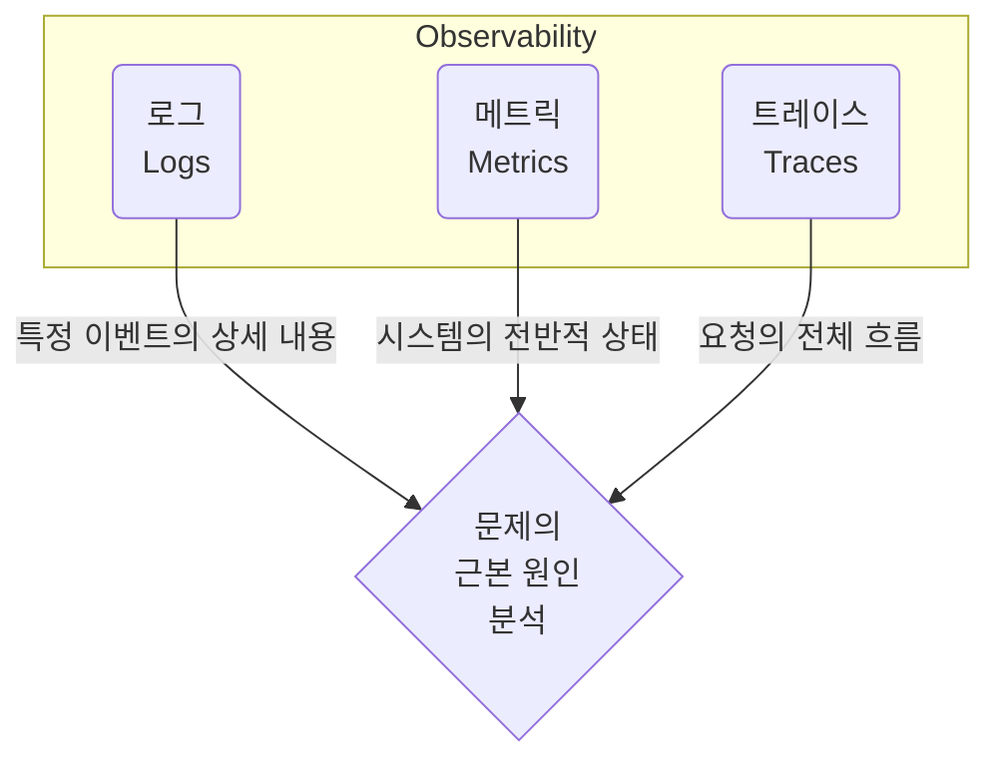

# 관찰 가능성 (로그, 메트릭, 트레이싱)

## 1. 핵심 개념 (Core Concept)

**관찰 가능성(Observability)**은 시스템의 내부 상태를 외부에서 얼마나 잘 추론하고 이해할 수 있는지를 나타내는 시스템의 속성입니다. 복잡한 분산 시스템 환경에서, 단순히 "시스템이 동작하는가?"를 넘어 "왜 이렇게 동작하는가?"에 대한 답을 찾기 위해 필요합니다. 관찰 가능성은 **로그(Logs), 메트릭(Metrics), 트레이스(Traces)** 라는 세 가지 핵심 요소를 통해 확보할 수 있으며, 이들은 시스템의 문제를 진단하고 해결하는 데 필수적인 단서를 제공합니다.

---

## 2. 상세 설명 (Detailed Explanation)

### 2.1 관찰 가능성의 세 가지 기둥 (The Three Pillars)

로그, 메트릭, 트레이스는 각각 다른 관점에서 시스템에 대한 정보를 제공하며, 상호 보완적인 관계를 가집니다.

#### 가. 로그 (Logs): "무슨 일이 있었는가?"
*   **정의**: 시스템에서 발생하는 모든 이산적인 **이벤트**를 시간 순서대로 기록한 것입니다.
*   **목적**: 특정 이벤트에 대한 상세 정보 기록, 디버깅 및 근본 원인 분석.
*   **데이터 형태**: 타임스탬프가 찍힌 텍스트, 구조화된(JSON 등) 또는 비구조화된 데이터.
*   **장점**: 풍부한 컨텍스트 정보를 제공하여 문제의 상세 원인을 파악하는 데 결정적입니다.
*   **단점**: 방대한 양으로 인한 저장 및 분석 비용이 높고, 분산 시스템 환경에서 개별 로그만으로 전체 흐름을 파악하기 어렵습니다.
*   **주요 도구**: ELK Stack (Elasticsearch, Logstash, Kibana), Fluentd, Loki.

#### 나. 메트릭 (Metrics): "시스템은 어떤    태인가?"
*   **정의**: 특정 시간 간격으로 수집된 시스템의 성능 및 상태에 대한 **정량적인 측정값**입니다.
*   **목적**: 시스템 상태 모니터링, 성능 추세 분석, 임계치 기반 알림 설정.
*   **데이터 형태**: 타임스탬프와 숫자 값의 조합 (예: CPU 사용률, 메모리 사용량, 응답 시간).
*   **장점**: 데이터 크기가 작고 집계가 용이하여 저장 및 쿼리 비용이 낮으며, 시스템의 전반적인 상태를 빠르게 파악할 수 있습니다.
*   **단점**: 개별 이벤트에 대한 상세 정보가 부족하여, "왜" 이런 상태가 되었는지 근본 원인을 파악하기 어렵습니다.
*   **주요 도구**: Prometheus, Grafana, InfluxDB, Datadog.

#### 다. 트레이스 (Traces): "요청은 어떤 경로를 거쳤는가?"
*   **정의**: 단일 요청이 분산된 시스템의 여러 서비스를 거치는 **전체 여정**을 추적하고 시각화한 것입니다.
*   **목적**: 분산 환경에서 요청의 전체 흐름 추적, 병목 구간 및 장애 지점 식별, 성능 최적화.
*   **데이터 형태**: 요청의 시작부터 끝까지 각 단계를 연결한 구조화된 이벤트 데이터 (Span들의 집합).
*   **장점**: 요청의 전체 컨텍스트를 제공하여, 서비스 간의 상호 작용 및 의존   을 파악하고 성능 병목을 찾아내는 데 매우 효과적입니다.
*   **단점**: 모든 요청을 추적할 경우 오버헤드가 클 수 있어 샘플링 기법을 사용하기도 하며, 코드 레벨의 상세한 정보는 부족할 수 있습니다.
*   **주요 도구**: Jaeger, Zipkin, OpenTelemetry, Datadog APM.

### 2.2 상호 보완적인 관계

로그, 메트릭, 트레이스는 각각 독립적으로도 유용하지만, 진정한 관찰 가능성은 이 세 가지 요소를 함께 활용할 때 발휘됩니다.

**"메트릭으로 감지하고, 트레이스로 추적하며, 로그로 확인한다."**

1.  **감지 (Detect)**: **메트릭** 대시보드를 통해 특정 서비스의 에러율이 급증하거나 응답 시간이 길어지는 이상 징후를 감지합니다.
2.  **추적 (Trace)**: 해당 시간대의 **트레이스**를 분석하여, 어떤 내부 API 호출에서 병목이 발생하거나 에러가 시작되었는지 특정합니다.
3.  **확인 (Verify)**: 병목이 발생한 서비스의 해당 시간대 **로그**를 확인하여, 구체적인 에러 메시지나 예외 상황, 파라미터 값 등을 통해 문제의 근본 원인을 정확히 찾아 해결합니다.

---

## 3. 예시 (Example)

### 온라인 쇼핑몰 주문 실패 시나리오

1.  **메트릭**: 모니터링 시스템(Grafana)에서 '결제 서비스'의 5xx 에러율이 5%를 넘었다는 **알림**이 발생합니다.
2.  **트레이스**: APM 도구(Jaeger)에서 해당 시간대의 실패한 요청들의 **트레이스**를 확인합니다. 확인 결과, '주문 서비스' -> '결제 서비스' -> 'PG(결제 대행사) 서비스'로 이어지는 호출 중, 'PG 서비스'에서 유독 긴 지연 시간과 타임아웃 에러가 발생하는 것을 발견합니다.
3.  **로그**: '결제 서비스'의 로그를 검색하여 해당 트레이스 ID를 필터링합니다. 로그에는 "PG Service connection timeout"이라는 구체적인 **에러 메시지**와 함께, 요청에 사용된 주문 ID, 금액 등의 상세 정보가 기록되어 있습니다.
4.  **결론**: PG사의 API 장애가 주문 실패의 원인임을 명확히 파악하고, 사용자에게 상황을 공지하거나 대체 결제 수단을 안내하는 등의 조치를 취할 수 있습니다.

---

## 4. 예상 면접 질문 (Potential Interview Questions)

*   **Q. 모니터링과 관찰 가능성(Observability)의 차이점은 무엇인가요?**
    *   **A.** **모니터링**은 미리 정의된 메트릭이나 로그를 통해 시스템의 상태를 확인하고, 알려진 문제에 대해 경고하는 **수동적인 활동**입니다. 반면, **관찰 가능성은** 시스템의 내부 상태를 외부의 출력(로그, 메트릭, 트레이스)을 통해 얼마나 잘 추론할 수 있는지를 나타내는 **시스템의 속성**입니다. 즉, 모니터링이 "지금 시스템이 다운되었는가?"를 알려준다면, 관찰 가능성은 "왜 시스템이 다운되었는가?"라는, 예측하지 못했던 문제의 근본 원인을 파악할 수 있게 해주는 보다 **능동적인 개념**입니다.

*   **Q. 마이크로서비스 아키텍처(MSA)에서 트레이싱이 특히 중요한 이유는 무엇인가요?**
    *   **A.** MSA 환경에서는 하나의 사용자 요청을 처리하기 위해 수많은 마이크로서비스 간의 복잡한 연쇄 호출이 발생합니다. 이런 환경에서 문제가 발생했을 때, 로그나 메트릭만으로는 전체 요청의 흐름 중 어느 서비스에서 병목이나 에러가 발생했는지 파악하기 매우 어렵습니다. 트레이싱은 이 모든 연쇄 호출을 하나의 타임라인으로 묶어 시각화해주므로, 전체 요청의 흐름을 한눈에 파악하고 문제의 원인이 되는 특정 서비스를 신속하게 찾아낼 수 있기 때문에 매우 중요합니다.

*   **Q. 로그, 메트릭, 트레이스의 관계를 설명하고, 어떻게 함께 사용하여 문제를 해결할 수 있는지 예시를 들어 설명해주세요.**
    *   **A.** 세 가지는 상호 보완적인 관계입니다. 예를 들어, **메트릭**을 통해 CPU 사용률이 90% 이상이라는 알림을 받습니다. 이것만으로는 원인을 알 수 없습니다. 그래서 **트레이스**를 확인하여 해당 시간에 어떤 요청들이 비정상적으로 오래 걸렸는지, 특정 서비스에 병목이 있는지 확인합니다. 병목이 되는 서비스를 찾았다면, 해당 서비스의 **로그**를 분석하여 어떤 코드 라인에서 무한 루프가 돌고 있는지, 또는 어떤 쿼리가 비효율적으로 실행되고 있는지 등 구체적인 원인을 찾아 해결할 수 있습니다.

---

## 5. 더 읽어보기 (Further Reading)

*   [The 3 Pillars of Observability: Logs, Metrics, and Traces (New Relic)](https://newrelic.com/blog/best-practices/3-pillars-of-observability)
*   [What is Observability? (AWS)](https://aws.amazon.com/what-is/observability/)
*   [OpenTelemetry - Observability 101](https://opentelemetry.io/docs/concepts/observability-primer/)