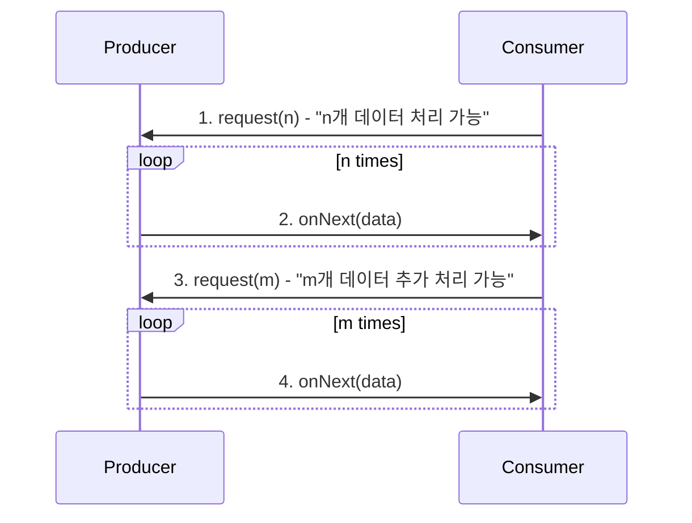

# 큐잉 시스템 & 백프레셔

## 1. 핵심 개념 (Core Concept)

\*\*큐잉 시스템(Queuing System)\*\*은 요청(작업)이 도착하여 대기하고, 서비스를 받은 뒤 시스템을 떠나는 일련의 과정을 처리하는 시스템을 의미하며, \*\*메시지 큐(Message Queue)\*\*는 이러한 큐잉 시스템을 구현한 대표적인 기술입니다. \*\*백프레셔(Backpressure, 배압)\*\*는 데이터 스트림 처리 시스템에서 데이터 생산자의 처리 속도가 소비자의 처리 속도보다 빠를 때, 소비자가 처리할 수 있는 만큼만 데이터를 받도록 생산자에게 역으로 압력을 가하여 시스템의 과부하를 막는 메커니즘입니다.

______________________________________________________________________

## 2. 상세 설명 (Detailed Explanation)

### 2.1 큐잉 시스템과 메시지 큐

큐잉 시스템은 분산 시스템에서 서비스 간의 결합도를 낮추고, 비동기 처리를 가능하게 하며, 시스템의 안정성과 확장성을 높이는 핵심적인 역할을 합니다.

- **주요 구성 요소**:

  - **생산자 (Producer)**: 처리   데이터를 담은 메시지를 생성하여 메시지 큐에 전송(publish)합니다.
  - **메시지 큐 (Message Queue / Broker)**: 생산자로부터 받은 메시지를 임시로 저장하고 관리합니다.
  - **소비자 (Consumer)**: 큐에서 메시지를 가져와(consume) 작업을 수행합니다.

- **장점**:

  - **비동기 처리**: 이메일 발송, 파일 변환 등 시간이 오래 걸리는 작업을 큐에 넣어두고 즉시 사용자에게 응답을 반환하여 시스템의 응답성을 향상시킬 수 있습니다.
  - **서비스 간 결합도 감소 (Decoupling)**: 생산자와 소비자는 서로의 처리 속도나 상태에 영향을 받지 않고 독립적으로 동작할 수 있어, 한 서비스의 장애가 다른 서비스로 전파되는 것을 막아줍니다.
  - **트래픽 버퍼링**: 일시적으로 급증하는 트래픽이나 요청을 큐에 저장해두고 시스템이 처리할 수 있는 속도에 맞춰 순차적으로 처리함으로써 시스템 과부하를 방지합니다.
  - **확장성 (Scalability)**: 작업량이 많아지면 소비자의 수를 늘려 병렬로 메시지를 처리함으로써 시스템의 처리량을 쉽게 확장할 수 있습니다.

- **대표적인 메시지 큐 시스템**: RabbitMQ, Apache Kafka, Amazon SQS

### 2.2 백프레   (Backpressure)

백프레셔는 데이터의 흐름을 제어하는 메커니즘으로, 데이터 소비자(Subscriber)가 데이터 생산자(Publisher)에게 자신이 처리할 수 있는 데이터의 양을 요청(request)하는 방식으로 동작합니다.

- **동작 원리**:

  1. **소비자 요청**: 소비자는 자신이 처리할 수 있는 데이터의 개수(n)를 생산자에게 알립니다.
  1. **생산자 전송**: 생산자는 요청받은 개수(n)만큼만 데이터를 소비자에게 보냅니다.
  1. **처리 후 추가 요청**: 소비자는 데이터를 모두 처리한 후, 다시 처리할 수 있는 만큼의 데이터를 생산자에게 요청합니다.

- **목표**: 데이터가 처리되지 않고 버퍼에 무한정 쌓이는 것을 방지하여 메모리 오버플로우나 시스템 다운과 같은 문제를 예방하고, 시스템 전체의 안정성을 확보합니다.

- **주요 사용처**:
  - **리액티브 프로그래밍**: 리액티브 스트림(Reactive Streams)을 사용하는 시스템(예: Project Reactor, RxJava)에서 핵심적인 기능으로 사용됩니다.
  - **스트리밍 데이터 처리**: 실시간으로 대량의 데이터가 유입되는 스트리밍 환경(예: Kafka Streams)에서 소비자가 과부하에 걸리지 않도록 데이터 흐름을 조절하는 데 필수적입니다.

______________________________________________________________________

## 3. 예시 (Example)

### 동영상 인코딩 서비스 디자인

사용자가 업로드한 원본 동영상을 다양한 해상도(1080p, 720p, 480p)로 변환하는 서비스입니다.

1. **비동기 처리**: 웹 서버는 사용자로부터 동영상 업로드 요청을 받으면, 원본 동영상을 스토리지에 저장하고 \*\*메시지 큐(RabbitMQ)\*\*에 "인코딩 작업" 메시지를 넣습니다. 그리고 사용자에게는 "업로드가 완료되었으며, 인코딩이 끝나면 알려드리겠습니다"라고 즉시 응답합니다.
1. **작업 분산**: 여러 대의 \*\*인코딩 서버(소비자)\*\*들은 이 메시지 큐를 구독하고 있다가, 새로운 작업 메시지가 들어오면 하나씩 가져가서 동영상 인코딩을 수행합니다. 작업량이 많아지면 인코딩 서버의 수만 늘려 쉽게 확장할 수 있습니다.
1. **백프레셔 적용**: 만약 특정 인코딩 서버가 매우 큰 동영상 파일을 처리하느라 바쁜 상태라면, **백프레셔** 메커니즘을 통해 메시지 큐로부터 새로운 작업을 받아오지 않도록 조절합니다. 이를 통해 특정 서버에 작업이 몰려 시스템이 다운되는 것을 방지하고 안정적으로 작업을 처리할 수 있습니다.

______________________________________________________________________

## 4. 예상 면접 질문 (Potential Interview Questions)

- **Q. 메시지 큐를 사용하면 시스템에 어떤 이점이 있나요?**

  - **A.** 크게 세 가지 이점이 있습니다. 첫째, **비동기 처리**를 통해 시간이 오래 걸리는 작업을 백그라운드에서 처리하고 사용자에게 빠른 응답을 줄 수 있습니다. 둘째, 서비스 간의 직접적인 의존성을 제거하여 **결합도를 낮춤**으로써, 한 서비스의 장애가 다른 서비스로 전파되는 것을 막아 시스템 전체의 안정성을 높입니다. 셋째, 트래픽이 급증할 때 요청을 큐에 쌓아두고 순차적으로 처리하는 **버퍼 역할**을 하여 시스템 과부하를 방지할 수 있습니다.

- **Q. 백프레셔(Backpressure)는 어떤 문제를 해결하기 위해 사용되나요?**

  - **A.** 백프레셔는 데이터 생산 속도가 소비 속도보다 빨라서 **소비자에게 과부하가 걸리는 문제**를 해결하기 위해 사용됩니다. 소비자가 처리할 수 있는 양을 초과하는 데이터가 계속해서 밀려 들어오면, 결국 버퍼가 가득 차 메모리 부족(OOM)으로 시스템이 다운될 수 있습니다. 백프레셔는 소비자가 자신의 처리 능력에 맞춰 생산자에게 데이터 요청량을 조절하도록 함으로써, 데이터 스트림을 안정적으로 유지하고 시스템이 다운되는 것을 방지합니다.

- **Q. 메시지 큐의 '메시지 유실' 가능성에 대해 어떻게 대비할 수 있을까요?**

  - **A.** 메시지 유실을 방지하기 위해 여러 전략을 사용할 수 있습니다. 첫째, **메시지 지속성(Durability)** 옵션을 활성화하여 메시지를 디스크에 저장함으로써 메시지 큐 서버가 재시작되어도 메시지가 보존되도록 할 수 있습니다. 둘째, 소비자가 메시지를 처리한 후 명시적으로 \*\*확인 응답(Acknowledgement)\*\*을 브로커에게 보내는 방식을 사용합니다. 만약 소비자가 처리 중 실패하여 확인 응답을 보내지 못하면, 브로커는 해당 메시지를 다른 소비자에게 다시 전달하여 처리의 신뢰성을 보장합니다.

______________________________________________________________________

## 5. 더 읽어보기 (Further Reading)

- [What is a Message Queue? (IBM)](https://www.ibm.com/topics/message-queues)
- [Backpressure Explained (Akka Documentation)](https://doc.akka.io/docs/akka/current/stream/stream-backpressure.html)
- [Reactive Streams Specification](https://www.reactive-streams.org/)
