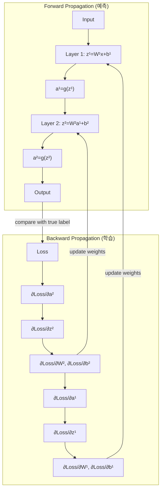

# 순전파와 역전파 (Forward & Backward Propagation)

## 1. 핵심 개념 (Core Concept)

신경망 학습은 \*\*순전파(Forward Propagation)\*\*와 \*\*역전파(Backward Propagation)\*\*라는 두 가지 핵심 과정의 반복으로 이루어짐. 순전파는 입력 데이터로부터 예측값을 계산하는 과정이며, 역전파는 그 예측값의 오차를 기반으로 모델의 가중치를 업데이트하여 성능을 개선하는 과정임. 이 두 단계를 통해 신경망은 점진적으로 정답에 가까운 예측을 하도록 학습됨.

______________________________________________________________________

## 2. 상세 설명 (Detailed Explanation)

### 2.1 순전파 (Forward Propagation)

순전파는 입력 데이터가 신경망의 입력층에서부터 출력층까지 순차적으로 전달되는 과정임. 각 층(Layer)에서는 이전 층의 출력값을 입력으로 받아 선형 변환과 비선형 활성화 함수를 거쳐 다음 층으로 전달함.

- **과정**: `입력층 -> 은닉층 1 -> 은닉층 2 -> ... -> 출력층`

- **l번째 층의 연산**:

  1. **선형 변환 (Weighted Sum)**: `z^(l) = W^(l) * a^(l-1) + b^(l)`
  1. **활성화 (Activation)**: `a^(l) = g(z^(l))`

- **용어 설명**:

  - `a^(l-1)`: `l-1`번째 층의 활성화(출력) 벡터
  - `W^(l)`, `b^(l)`: `l`번째 층의 가중치 행렬과 편향 벡터
  - `g`: 활성화 함수 (예: ReLU, Sigmoid)

이 과정의 최종 결과물은 모델의 \*\*예측값(Prediction)\*\*이며, 이 예측값과 실제 정답을 비교하여 \*\*손실(Loss)\*\*을 계산함.

### 2.2 역전파 (Backward Propagation)

역전파는 계산된 손실을 최소화하기 위해 \*\*연쇄 법칙(Chain Rule)\*\*을 사용하여 각 가중치와 편향에 대한 손실 함수의 그래디언트(gradient, 기울기)를 계산하는 과정임. 이 그래디언트는 손실을 가장 빠르게 증가시키는 방향을 의미하므로, 이 반대 방향으로 가중치를 업데이트하여 손실을 줄여나감.

- **과정**: `출력층 -> ... -> 은닉층 2 -> 은닉층 1 -> 입력층`
- **핵심 원리**: 연쇄 법칙을 이용하여 출력층에서부터 입력층 방향으로 오차를 전파하며 각 층의 가중치와 편향에 대한 그래디언트를 계산함.

1. **출력층의 오차 계산 (δ^L)**: 손실 함수를 마지막 층의 선형 결과 `z^(L)`로 미분하여 계산.
1. **은닉층의 오차 계산 (δ^l)**: `l+1`번째 층의 오차를 이용하여 `l`번째 층의 오차를 순차적으로 계산.
1. **그래디언트 계산**: 계산된 오차를 사용하여 각 가중치와 편향에 대한 그래디언트 `∂J/∂W^(l)`와 `∂J/∂b^(l)`를 구함.

### 2.3 가중치 업데이트 (Weight Update)

계산된 그래디언트를 사용하여 경사 하강법(Gradient Descent)과 같은 최적화 알고리즘으로 가중치와 편향을 업데이트함.

- **업데이트 규칙**:

  - `W^(l) = W^(l) - η * ∂J/∂W^(l)`
  - `b^(l) = b^(l) - η * ∂J/∂b^(l)`

- **η (에타)**: 학습률(Learning Rate)로, 한 번의 업데이트에서 얼마나 많이 가중치를 수정할지 결정하는 하이퍼파라미터임.

______________________________________________________________________

## 3. 예시 (Example)

### 다이어그램 예시 (Mermaid)

신경망의 학습 과정을 순전파와 역전파로 나누어 시각적으로 표현하면 다음과 같음.

______________________________________________________________________

## 4. 예상 면접 질문 (Potential Interview Questions)

- **Q. 순전파와 역전파에 대해 간단히 설명해주세요.**

  - **A.** 순전파는 입력 데이터로부터 모델의 예측값을 계산하는 과정입니다. 입력층에서 시작하여 각 은닉층을 순서대로 거쳐 출력층까지 계산을 진행합니다. 역전파는 순전파의 결과로 나온 예측값과 실제값의 차이, 즉 오차를 줄이기 위해 가중치를 업데이트하는 과정입니다. 출력층에서부터 시작하여 연쇄 법칙을 이용해 각 가중치에 대한 오차의 기울기(그래디언트)를 계산하고, 이 기울기의 반대 방향으로 가중치를 수정합니다.

- **Q. 역전파에서 연쇄 법칙(Chain Rule)이 왜 중요한가요?**

  - **A.** 신경망은 여러 함수가 중첩된 복잡한 합성 함수 구조를 가지고 있습니다. 연쇄 법칙은 이러한 합성 함수의 미분을 효율적으로 계산할 수 있게 해주는 핵심 원리입니다. 역전파에서는 손실 함수에 대한 각 층의 가중치와 편향의 영향을 계산해야 하는데, 연쇄 법칙을 통해 출력층의 오차로부터 시작하여 각 층의 그래디언트를 체계적으로, 그리고 계산적으로 효율적이게 구할 수 있습니다.

- **Q. 학습률(Learning Rate)이 너무 크거나 작으면 어떤 문제가 발생하나요?**

  - **A.** 학습률이 너무 크면 가중치 업데이트 폭이 너무 커져 최적의 지점을 지나쳐 버리고, 손실 값이 수렴하지 않고 발산(diverge)할 수 있습니다. 반대로 학습률이 너무 작으면 가중치 업데이트 폭이 너무 작아 학습 속도가 매우 느려지고, 전역 최적점(global minimum)이 아닌 지역 최적점(local minimum)에 수렴하여 학습이 조기에 멈출 위험이 있습니다.

______________________________________________________________________

## 5. 더 읽어보기 (Further Reading)

- [CS231n: Backpropagation, Intuitions](https://cs231n.github.io/optimization-2/)
- [neuralnetworksanddeeplearning.com: How the backpropagation algorithm works](http://neuralnetworksanddeeplearning.com/chap2.html)
- [Deep Learning Book: Chapter 6.5 Back-Propagation and other Differentiation Algorithms](https://www.deeplearningbook.org/contents/mlp.html)
