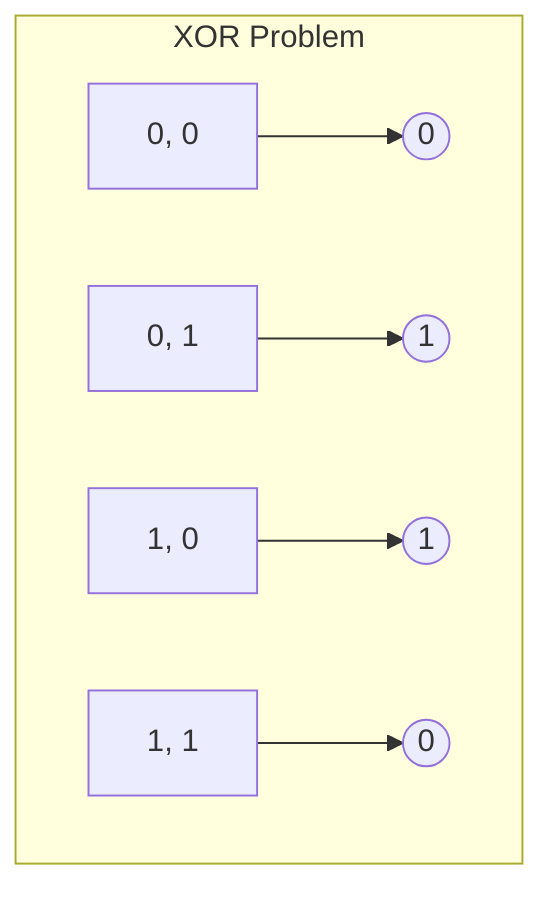
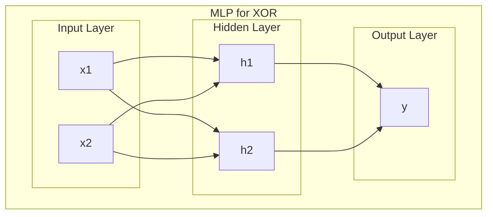

# 퍼셉트론과 다층 퍼셉트론 (Perceptron & MLP)

## 1. 핵심 개념 (Core Concept)

\*\*퍼셉트론(Perceptron)\*\*은 초기 형태의 인공 신경망으로, 다수의 입력을 받아 하나의 출력을 내보내는 간단한 선형 분류기임. 하지만 단층 구조의 한계로 비선형 문제는 해결할 수 없었음. 이를 극복하기 위해 퍼셉트론을 여러 겹으로 쌓고 비선형 활성화 함수를 추가한 \*\*다층 퍼셉트론(Multi-Layer Perceptron, MLP)\*\*이 등장했으며, 이는 현대 딥러닝의 기초가 됨.

______________________________________________________________________

## 2. 상세 설명 (Detailed Explanation)

### 2.1 퍼셉트론 (Perceptron)

퍼셉트론은 1957년 프랑크 로젠블랫(Frank Rosenblatt)에 의해 고안된 알고리즘으로, 여러 개의 입력을 받아 각각의 가중치(weight)를 곱하고, 그 합이 특정 임계값(threshold)을 넘으면 1을, 넘지 않으면 0(또는 -1)을 출력함.

- **구조**: 입력층(Input Layer)과 출력층(Output Layer)으로만 구성된 단층 신경망.
- **수식**: `y = f(Σ(w_i * x_i) + b)` (여기서 f는 계단 함수(Step Function))
- **한계**: **선형 분리(Linearly Separable)** 가능한 문제만 해결할 수 있음. 대표적으로, AND나 OR 게이트는 학습할 수 있지만, **XOR 게이트**와 같은 비선형 문제는 해결하지 못함.

### 2.2 다층 퍼셉트론 (Multi-Layer Perceptron, MLP)

MLP는 퍼셉트론의 한계를 극복하기 위해 입력층과 출력층 사이에 하나 이상의 \*\*은닉층(Hidden Layer)\*\*을 추가한 신경망 구조임. 각 층은 여러 개의 뉴런(퍼셉트론)으로 구성되며, 층과 층 사이는 완전 연결(fully-connected)됨.

- **구조**: 입력층 - 하나 이상의 은닉층 - 출력층

- **핵심 요소**:

  1. **은닉층 (Hidden Layers)**: 입력 데이터를 내부적으로 처리하여 더 복잡하고 추상적인 특징(feature)을 추출하는 역할을 함. 은닉층의 존재 덕분에 비선형 데이터 패턴을 학습할 수 있음.
  1. **비선형 활성화 함수 (Non-linear Activation Function)**: 계단 함수 대신 시그모이드(Sigmoid), ReLU, tanh와 같은 비선형 함수를 사용하여 모델의 표현력을 극대화함. 만약 활성화 함수가 선형이면, 층을 아무리 깊게 쌓아도 결국 하나의 선형 모델과 같아져 층을 쌓는 의미가 없어짐.
  1. **역전파 알고리즘 (Backpropagation)**: MLP는 역전파 알고리즘을 통해 학습됨. 출력층에서 계산된 오차를 입력층 방향으로 전파하며 각 층의 가중치를 효율적으로 업데이트함.

- **의의**: MLP는 XOR 문제를 해결할 수 있으며, 충분한 수의 은닉 뉴런이 있다면 거의 모든 종류의 복잡한 함수를 근사할 수 있음(**보편적 근사 정리, Universal Approximation Theorem**). 이는 딥러닝 발전의 이론적 토대가 됨.

______________________________________________________________________

## 3. 예시 (Example)

### XOR 문제 해결 (Mermaid 다이어그램)

단층 퍼셉트론은 아래와 같이 XOR 연산의 네 점을 하나의 직선으로 나눌 수 없음.

MLP는 은닉층을 통해 입력 공간을 비선형적으로 변환하여 XOR 문제를 해결함.

______________________________________________________________________

## 4. 예상 면접 질문 (Potential Interview Questions)

- **Q. 단층 퍼셉트론과 다층 퍼셉트론(MLP)의 가장 큰 차이점은 무엇인가요?**

  - **A.** 가장 큰 차이점은 **은닉층의 유무**와 **비선형 활성화 함수의 사용**입니다. 단층 퍼셉트론은 은닉층 없이 입력과 출력을 바로 연결하고 계단 함수를 사용하여 선형 문제만 해결할 수 있습니다. 반면, MLP는 하나 이상의 은닉층과 ReLU나 시그모이드 같은 비선형 활성화 함수를 사용하여 XOR 문제와 같은 비선형 문제를 해결할 수 있는 표현력을 가집니다.

- **Q. MLP에서 활성화 함수로 비선형 함수를 사용해야만 하는 이유는 무엇인가요?**

  - **A.** 만약 MLP의 모든 활성화 함수가 선형 함수라면, 여러 층을 쌓더라도 전체 네트워크는 결국 하나의 선형 변환으로 표현될 수 있습니다. 이는 층을 깊게 쌓는 것의 이점을 완전히 상실하게 만들며, 결과적으로 단층 퍼셉트론과 동일한 표현력, 즉 선형 문제밖에 풀지 못하게 됩니다. 따라서 비선형 활성화 함수는 입력 데이터를 비선형적인 공간으로 매핑하여 복잡한 패턴을 학습하는 데 필수적입니다.

- **Q. MLP가 '보편적 근사 정리'와 어떤 관련이 있는지 설명해주세요.**

  - **A.** 보편적 근사 정리는 하나의 은닉층을 가진 MLP가 충분히 많은 뉴런을 가지고 있다면, 어떤 연속 함수라도 원하는 정확도로 근사할 수 있다는 것을 의미합니다. 이는 MLP가 단지 특정 문제들만 푸는 것이 아니라, 매우 넓은 범위의 함수를 표현할 수 있는 일반적인 함수 근사기(universal function approximator)임을 이론적으로 보장해 줍니다. 이 정리가 MLP와 딥러닝이 다양한 분야에서 성공적으로 사용될 수 있는 이론적 기반이 됩니다.

______________________________________________________________________

## 5. 더 읽어보기 (Further Reading)

- [Wikipedia: Perceptron](https://en.wikipedia.org/wiki/Perceptron)
- [Wikipedia: Multilayer Perceptron](https://en.wikipedia.org/wiki/Multilayer_perceptron)
- [neuralnetworksanddeeplearning.com: A visual proof that neural nets can compute any function](http://neuralnetworksanddeeplearning.com/chap4.html)
