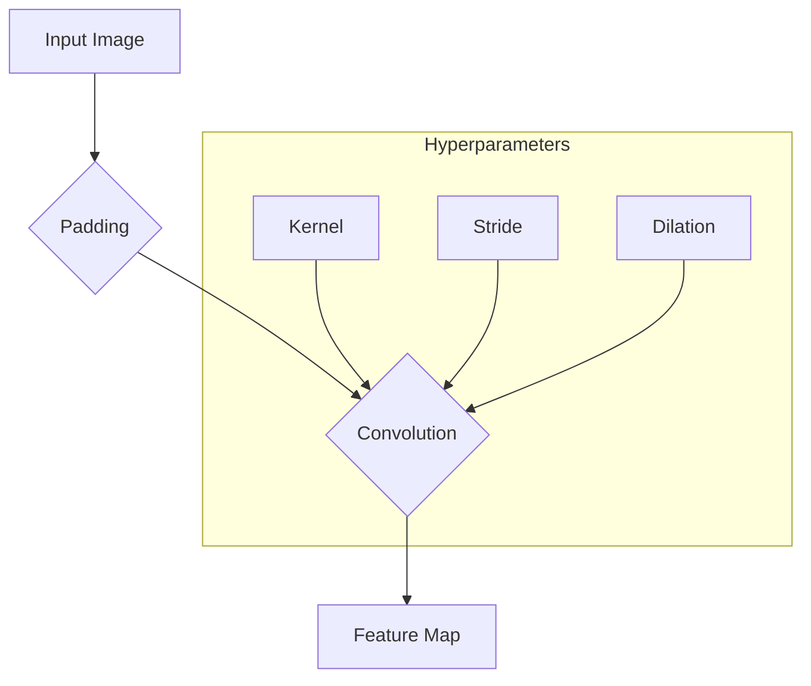

# 합성곱 연산 (커널, 스트라이드, 패딩, 딜레이션)

## 1. 핵심 개념 (Core Concept)

합성곱 연산(Convolution Operation)은 합성곱 신경망(CNN)의 핵심 구성 요소로, 입력 데이터(주로 이미지)에서 특징(feature)을 추출하는 역할을 함. \*\*커널(Kernel)\*\*이라는 작은 필터를 입력 데이터 위에서 움직여가며, 각 위치에서 \*\*합성곱(element-wise product의 합)\*\*을 계산하여 \*\*특징 맵(Feature Map)\*\*을 생성함. 이 과정은 **스트라이드(Stride)**, **패딩(Padding)**, \*\*딜레이션(Dilation)\*\*과 같은 하이퍼파라미터에 의해 제어됨.

______________________________________________________________________

## 2. 상세 설명 (Detailed Explanation)

### 2.1 커널 (Kernel / Filter)

커널은 학습 가능한 가중치를 담고 있는 작은 행렬로, 필터(Filter)라고도 불림. 이 커널이 이미지의 특정 패턴(예: 수직선, 수평선, 특정 색상 조합, 질감 등)을 감지하는 역할을 함. 학습 과정에서 역전파를 통해 이러한 패턴을 가장 잘 감지할 수 있는 값으로 업데이트됨.

- **역할**: 이미지의 지역적 특징(local feature)을 추출함.
- **채널**: 입력 데이터의 채널 수와 동일한 깊이(channel depth)를 가짐. 예를 들어, 컬러 이미지는 R, G, B 3개의 채널을 가지므로 커널의 깊이도 3이 됨.

### 2.2 스트라이드 (Stride)

스트라이드는 커널이 입력 데이터 위를 한 번에 얼마나 이동할지를 결정하는 값임. 즉, 커널의 이동 보폭을 의미함.

- **`Stride = 1`**: 커널이 한 픽셀씩 겹치며 촘촘하게 이동함. 더 많은 특징을 추출하고 공간적 정보를 많이 보존함.
- **`Stride > 1`**: 커널이 여러 픽셀씩 건너뛰며 이동함. 출력 특징 맵의 크기가 작아지며(다운샘플링 효과), 계산량을 줄일 수 있음.

### 2.3 패딩 (Padding)

패딩은 합성곱 연산을 수행하기 전에 입력 데이터의 가장자리에 특정 값(주로 0)을 채워 넣는 과정임. 두 가지 주요 목적을 가짐.

1. **출력 크기 조절**: 패딩을 사용하지 않으면 합성곱 연산 후 특징 맵의 크기가 계속 작아져 정보가 손실됨. 패딩을 통해 출력 특징 맵의 크기를 입력과 동일하게 유지할 수 있음 (`Same Padding`).
1. **가장자리 정보 보존**: 패딩이 없으면 이미지의 중앙부 픽셀에 비해 가장자리 픽셀은 커널 연산에 참여하는 횟수가 적음. 패딩은 가장자리 픽셀도 동등하게 연산에 참여하도록 도와 정보 손실을 방지함.

### 2.4 딜레이션 (Dilation / Atrous Convolution)

딜레이션은 커널 내부에 간격을 추가하여 동일한 파라미터 수를 유지하면서도 더 넓은 영역(receptive field)을 보도록 만드는 기법임. 딜레이션 비율(dilation rate)로 간격을 조절함.

- **`Dilation = 1`**: 표준적인 합성곱 연산과 동일함.
- **`Dilation > 1`**: 커널의 요소들 사이에 (Dilation - 1)개의 공간을 추가하여, 더 넓은 범위의 문맥 정보를 효율적으로 수집함. 이는 특히 고해상도 이미지를 다루거나 세밀한 분할(segmentation)이 필요한 작업에 유용함.

______________________________________________________________________

## 3. 예시 (Example)

### 출력 크기 계산 공식

입력 크기 `(H, W)`, 커널 크기 `(KH, KW)`, 패딩 `P`, 스트라이드 `S`, 딜레이션 `D`가 주어졌을 때, 출력 특징 맵의 크기 `(OH, OW)`는 다음과 같이 계산됨.

`OH = floor(((H + 2P - D * (KH - 1) - 1) / S) + 1)`
`OW = floor(((W + 2P - D * (KW - 1) - 1) / S) + 1)`

### 시각적 예시 (Mermaid)

______________________________________________________________________

## 4. 예상 면접 질문 (Potential Interview Questions)

- **Q. 합성곱 연산에서 패딩(Padding)을 사용하는 두 가지 주요 이유는 무엇인가요?**

  - **A.** 첫째, 합성곱 층을 통과할 때마다 특징 맵의 크기가 줄어드는 것을 방지하여 네트워크를 더 깊게 쌓을 수 있도록 합니다. 둘째, 이미지의 가장자리 부분에 있는 픽셀들이 중앙 픽셀들과 동등하게 연산에 참여하도록 하여 가장자리 정보의 손실을 막기 위함입니다.

- **Q. 스트라이드(Stride) 값을 1보다 크게 설정하면 어떤 효과가 있나요?**

  - **A.** 스트라이드를 1보다 크게 하면 커널이 입력 위를 건너뛰며 이동하므로 출력 특징 맵의 공간적 차원이 줄어드는 다운샘플링 효과가 있습니다. 이는 모델의 계산량을 줄이고 파라미터 수를 감소시키는 장점이 있지만, 너무 크게 설정하면 중요한 정보를 놓칠 수 있는 단점도 있습니다.

- **Q. 딜레이션 합성곱(Dilated Convolution)은 일반적인 합성곱과 비교하여 어떤 장점이 있나요?**

  - **A.** 딜레이션 합성곱은 추가적인 파라미터나 계산 비용 없이 커널의 수용 영역(receptive field)을 효과적으로 확장할 수 있는 장점이 있습니다. 이는 커널 내부에 간격을 주어 더 넓은 범위의 컨텍스트를 포착하게 해주므로, 특히 의미론적 분할(semantic segmentation)과 같이 픽셀 단위의 조밀한 예측이 필요하면서도 넓은 시야가 중요한 태스크에 매우 유용합니다.

______________________________________________________________________

## 5. 더 읽어보기 (Further Reading)

- [CS231n: Convolutional Neural Networks](https://cs231n.github.io/convolutional-networks/)
- [A guide to convolution arithmetic for deep learning (Dumoulin & Visin, 2016)](https://arxiv.org/abs/1603.07285)
- [Dilated Residual Networks (Yu et al., 2017)](https://arxiv.org/abs/1705.09914)
