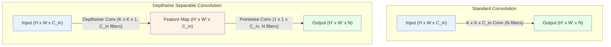

# Depthwise Separable Convolution (MobileNet, Xception)

## 1. 핵심 개념 (Core Concept)

Depthwise Separable Convolution(깊이별 분리 합성곱)은 표준 합성곱(Standard Convolution) 연산을 **Depthwise Convolution**과 **Pointwise Convolution**의 두 단계로 분리하여, 연산량과 파라미터 수를 획기적으로 줄인 효율적인 합성곱 방식임. 이는 공간적 특징과 채널 간 특징을 독립적으로 학습하는 아이디어에 기반하며, MobileNet, Xception과 같이 모바일 환경이나 경량화가 중요한 모델의 핵심 구성 요소로 사용됨.

______________________________________________________________________

## 2. 상세 설명 (Detailed Explanation)

### 2.1 표준 합성곱 (Standard Convolution)의 문제점

표준 합성곱 필터는 입력의 모든 채널에 대해 공간적 특징(spatial feature)과 채널 간 특징(cross-channel feature)을 동시에 추출함. 이로 인해 입력 및 출력 채널 수가 많아질수록 계산 비용이 매우 커지는 단점이 있음.

- **연산량**: `Kernel_H × Kernel_W × Input_C × Output_C × FeatureMap_H × FeatureMap_W`

### 2.2 Depthwise Separable Convolution의 두 단계

이 방식은 표준 합성곱의 연산을 두 단계로 분해하여 효율성을 극대화함.

#### **1단계: Depthwise Convolution (깊이별 합성곱)**

이 단계에서는 입력 채널들을 서로 분리하여, 각 채널에 대해 독립적으로 **공간적 특징**을 추출함.

- **연산**: 입력의 각 채널(`C_in`개)에 대해 개별적인 2D 필터(`K×K×1`)를 적용함. 즉, `C_in`개의 채널을 가진 입력이 들어오면, `C_in`개의 필터를 사용해 `C_in`개의 특징 맵을 생성함.
- **특징**: 채널 간의 관계는 전혀 고려하지 않고, 오직 각 채널 내의 공간 정보만 처리함.

#### **2단계: Pointwise Convolution (점별 합성곱)**

이 단계에서는 Depthwise Convolution을 통해 나온 특징 맵들의 **채널 간 관계**를 학습함. 이는 1x1 합성곱을 통해 이루어짐.

- **연산**: `1×1` 크기의 필터를 사용하여 Depthwise Convolution의 출력(`H×W×C_in`)을 새로운 채널 공간(`H×W×C_out`)으로 투영(projection)함. `C_out`개의 출력 채널을 원한다면 `1×1×C_in` 크기의 필터를 `C_out`개 사용함.
- **특징**: 공간적인 정보는 고려하지 않고, 오직 채널 방향의 정보만을 조합하여 새로운 특징을 생성함.

### 2.3 연산량 비교

Depthwise Separable Convolution의 총 연산량은 두 단계의 합으로, 표준 합성곱 대비 약 `1/Output_C + 1/(Kernel_H × Kernel_W)` 배로 감소함. 예를 들어, 3x3 커널을 사용하는 경우 연산량은 표준 합성곱 대비 약 **8~9배 감소**하여 모델의 크기가 작아지고 추론 속도가 빨라짐.

______________________________________________________________________

## 3. 예시 (Example)

### 다이어그램 예시 (Mermaid)

### 3.1 MobileNet

MobileNet은 모바일 및 임베디드 기기를 위해 설계된 경량화 모델로, Depthwise Separable Convolution을 핵심 빌딩 블록으로 사용함.

- **구조**: 표준 합성곱을 Depthwise Separable Convolution으로 대체하여 모델의 파라미터 수와 연산량을 크게 줄임.
- **특징**: Depthwise Convolution과 Pointwise Convolution 사이에 배치 정규화(Batch Normalization)와 ReLU 활성화 함수를 각각 적용함.

### 3.2 Xception (Extreme Inception)

Xception은 Inception 모듈의 아이디어를 "극단적으로" 발전시킨 모델로, Inception 모듈을 Depthwise Separable Convolution으로 완전히 대체함.

- **가설**: "채널 간 상관관계와 공간적 상관관계는 완전히 분리되어 매핑될 수 있다"는 가설에서 출발하며, 이는 Depthwise Separable Convolution의 철학과 정확히 일치함.
- **차이점**: MobileNet과 달리, Xception은 Pointwise Convolution을 먼저 수행하는 변형된 형태를 사용하며, 두 연산 사이에 비선형 활성화 함수(ReLU)를 사용하지 않는 경우가 많음. 또한 ResNet과 같이 잔차 연결(residual connections)을 적극적으로 사용함.

______________________________________________________________________

## 4. 예상 면접 질문 (Potential Interview Questions)

- **Q. Depthwise Separable Convolution이 표준 컨볼루션에 비해 가지는 장점은 무엇인가요?**

  - **A.** 가장 큰 장점은 연산량과 파라미터 수를 크게 줄여 모델을 경량화하고 추론 속도를 높일 수 있다는 점입니다. 이는 공간적 특징과 채널 간 특징을 분리하여 계산하기 때문에 가능하며, 모바일과 같이 리소스가 제한된 환경에 모델을 배포하는 데 매우 유리합니다.

- **Q. Depthwise Separable Convolution의 단점이나 한계는 무엇인가요?**

  - **A.** 채널과 공간 정보를 분리하여 처리하므로, 표준 컨볼루션에 비해 특징 추출 능력이 저하될 수 있습니다. 이로 인해 모델의 표현력이 감소하여 정확도가 약간 낮아질 수 있습니다. 또한, 채널 수가 적을 때는 연산량 감소 효과가 크지 않을 수 있으며, 특정 하드웨어(GPU 등)에서는 최적화되지 않은 연산으로 인해 이론적인 속도 향상만큼 실제 속도가 빠르지 않을 수도 있습니다.

- **Q. Xception 아키텍처는 Inception과 어떤 관계가 있으며, 어떻게 Depthwise Separable Convolution으로 이어지나요?**

  - **A.** Xception은 Inception 모듈의 아이디어를 극단까지 밀어붙인 것입니다. Inception 모듈은 1x1, 3x3, 5x5 등 다양한 필터를 병렬로 사용하는데, 이를 먼저 1x1 컨볼루션으로 채널을 분리하고, 각 채널 그룹에 대해 독립적인 공간 컨볼루션을 적용하는 것으로 재해석할 수 있습니다. Xception은 여기서 한 걸음 더 나아가, 각 채널을 완전히 독립적으로 분리하여 공간 컨볼루션을 적용하고(Depthwise Convolution), 그 결과를 1x1 컨볼루션으로 합치는(Pointwise Convolution) 구조를 채택했습니다. 이는 결국 Depthwise Separable Convolution과 동일한 아이디어로 귀결됩니다.

______________________________________________________________________

## 5. 더 읽어보기 (Further Reading)

- [MobileNets: Efficient Convolutional Neural Networks for Mobile Vision Applications (Howard et al., 2017)](https://arxiv.org/abs/1704.04861)
- [Xception: Deep Learning with Depthwise Separable Convolutions (Chollet, 2017)](https://arxiv.org/abs/1610.02357)
- [A Basic Introduction to Separable Convolutions (Towards Data Science)](https://towardsdatascience.com/a-basic-introduction-to-separable-convolutions-b99ec3102728)
