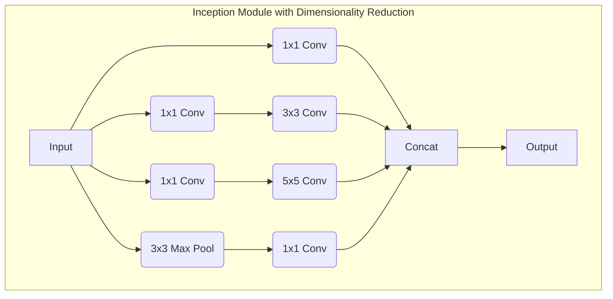

# Inception & GoogLeNet (1x1 Convolution)

## 1. 핵심 개념 (Core Concept)

GoogLeNet(또는 Inception v1)은 2014년 ILSVRC에서 우승한 모델로, **Inception 모듈**이라는 혁신적인 블록을 사용하여 네트워크의 깊이와 너비를 동시에 증가시키면서도 계산 효율성을 유지함. Inception 모듈의 핵심 아이디어는 **1x1 Convolution**을 활용한 **차원 축소(Dimension Reduction)**를 통해, 다양한 크기의 필터를 효율적으로 병렬 처리하여 여러 스케일의 특징을 한 번에 추출하는 것임.

---

## 2. 상세 설명 (Detailed Explanation)

### 2.1 1x1 Convolution의 역할

1x1 Convolution은 커널 크기가 1x1인 합성곱 연산으로, 두 가지 중요한 역할을 수행함.

1.  **채널 수 조절 (차원 축소 및 확장)**: 1x1 Convolution의 가장 중요한 기능은 채널(channel)의 수를 조절하는 것임. 예를 들어, 256개의 채널을 가진 특징 맵에 64개의 1x1 필터를 적용하면, 공간적 크기는 유지되면서 채널 수가 64개로 줄어듦. 이는 이후에 적용될 3x3이나 5x5 같은 큰 필터의 연산량을 획기적으로 감소시키는 **병목(bottleneck) 구조**를 가능하게 함.
2.  **비선형성 추가**: 컨볼루션 연산 후에는 ReLU와 같은 활성화 함수가 적용되므로, 1x1 Convolution은 추가적인 비선형성을 부여하여 모델의 표현력을 높이는 역할을 함.

### 2.2 Inception 모듈

Inception 모듈의 기본 아이디어는 하나의 입력에 대해 다양한 크기의 필터(1x1, 3x3, 5x5)와 풀링(Max Pooling)을 동시에 적용하여 여러 스케일의 특징을 한 번에 추출하고, 그 결과를 채널 방향으로 합치는(concatenate) 것임.

*   **문제점**: 3x3, 5x5와 같은 큰 필터는 채널 수가 많을수록 연산량이 기하급수적으로 증가함.
*   **해결책 (Bottleneck Design)**: 3x3 및 5x5 컨볼루션을 수행하기 **전에** 1x1 컨볼루션을 추가하여 입력 채널의 수를 줄임. 이를 통해 연산량을 크게 감소시키면서도 다양한 특징을 효율적으로 추출할 수 있게 됨.

### 2.3 GoogLeNet 아키텍처

GoogLeNet은 9개의 Inception 모듈을 여러 개 쌓아 만든 22층 깊이의 CNN 아키텍처임.

*   **효율성**: Inception 모듈 덕분에 AlexNet(6,000만 개)보다 12배나 적은 약 500만 개의 파라미터를 가지면서도 더 높은 성능을 달성함.
*   **전역 평균 풀링 (Global Average Pooling, GAP)**: 네트워크 마지막 단에서 전통적인 완전 연결 계층(Fully Connected Layer) 대신 GAP를 사용함. 이는 각 특징 맵의 평균을 구해 벡터를 만드는 방식으로, 파라미터 수를 크게 줄여 과적합을 방지하는 데 효과적임.
*   **보조 분류기 (Auxiliary Classifiers)**: 네트워크 중간층에 두 개의 보조 분류기를 두어 학습 과정에서 추가적인 그래디언트를 주입함. 이는 깊은 네트워크에서 발생할 수 있는 **기울기 소실 문제(vanishing gradient problem)**를 완화하고 정규화 효과를 줌. (단, 추론 시에는 제거됨)

---

## 3. 예시 (Example)

### 1x1 Convolution 연산량 감소 효과

*   **입력**: 28x28x192
*   **3x3 Conv (출력 채널 256)**: (3 * 3 * 192) * (28 * 28) * 256 ≈ 3억 5천만
*   **1x1 Conv (채널 64로 축소) + 3x3 Conv (출력 채널 256)**:
    1.  1x1 Conv: (1 * 1 * 192) * (28 * 28) * 64 ≈ 960만
    2.  3x3 Conv: (3 * 3 * 64) * (28 * 28) * 256 ≈ 1억 2천만
    3.  총합: 약 1억 3천만 (연산량이 **약 1/3**로 감소)

---

## 4. 예상 면접 질문 (Potential Interview Questions)

*   **Q. GoogLeNet의 Inception 모듈에서 1x1 컨볼루션은 어떤 중요한 역할을 하나요?**
    *   **A.** 1x1 컨볼루션은 두 가지 핵심 역할을 합니다. 첫째, 3x3이나 5x5 같은 연산량이 많은 컨볼루션 이전에 채널 수를 줄이는 '병목(bottleneck)' 역할을 하여 전체 계산 비용을 크게 감소시킵니다. 둘째, 활성화 함수와 함께 사용되어 모델에 추가적인 비선형성을 부여함으로써 표현력을 높여줍니다. 이 덕분에 Inception 모듈은 계산적으로 효율적이면서도 다양한 특징을 학습할 수 있습니다.

*   **Q. GoogLeNet이 AlexNet보다 훨씬 깊은데도 파라미터 수가 더 적은 이유는 무엇인가요?**
    *   **A.** 주된 이유는 두 가지입니다. 첫째, Inception 모듈 내에서 1x1 컨볼루션을 사용하여 채널 수를 적극적으로 줄였기 때문에 전체적인 연산량과 파라미터 수가 크게 감소했습니다. 둘째, 네트워크 마지막 단에서 파라미터가 매우 많은 완전 연결 계층(Fully Connected Layer)을 제거하고, 파라미터가 없는 전역 평균 풀링(Global Average Pooling)으로 대체했기 때문입니다. 이 두 가지 전략 덕분에 깊이를 늘리면서도 모델의 크기를 효율적으로 관리할 수 있었습니다.

*   **Q. GoogLeNet의 보조 분류기(Auxiliary Classifier)는 왜 사용되었으며, 어떤 효과가 있나요?**
    *   **A.** 보조 분류기는 네트워크 중간 부분에 연결되어 추가적인 손실(loss)을 계산하고, 여기서 발생한 그래디언트를 네트워크의 하위 계층까지 직접 전달하는 역할을 합니다. 이는 네트워크가 매우 깊어짐에 따라 발생할 수 있는 기울기 소실(vanishing gradient) 문제를 완화하여 하위 계층의 학습을 돕는 효과가 있습니다. 또한, 일종의 정규화(regularization) 역할을 수행하여 모델의 일반화 성능을 높이는 데도 기여합니다. 이 보조 분류기들은 학습 과정에서만 사용되고, 실제 추론 시에는 제거됩니다.

---

## 5. 더 읽어보기 (Further Reading)

*   [Going Deeper with Convolutions (Szegedy et al., 2014)](https://arxiv.org/abs/1409.4842) - GoogLeNet 원 논문
*   [A Simple Guide to the Versions of the Inception Network (Towards Data Science)](https://towardsdatascience.com/a-simple-guide-to-the-versions-of-the-inception-network-7fc52b863202)
*   [The 1x1 Convolution: A Modern Classic](https://www.machinelearningnuggets.com/1x1-convolution/)