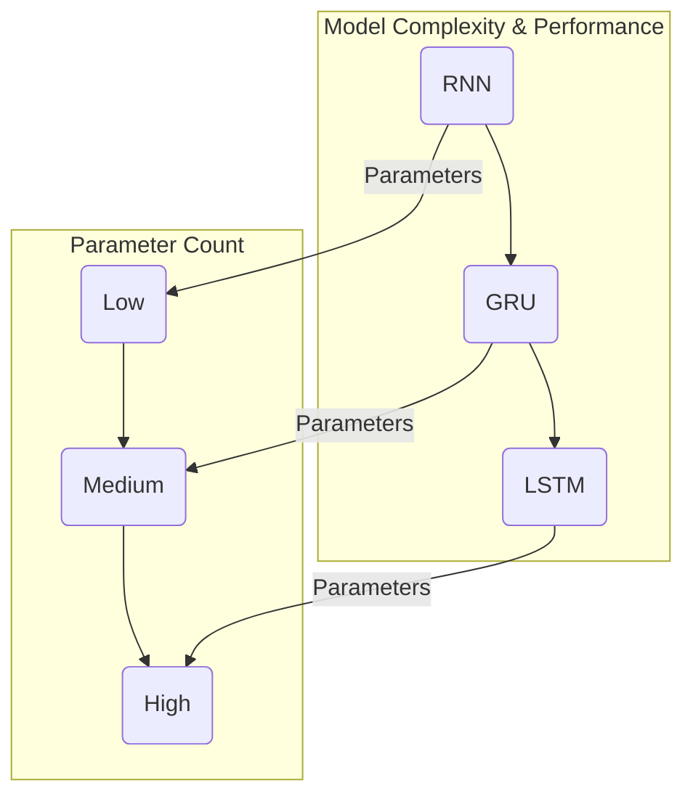

# RNN, LSTM, GRU의 구조와 한계

## 1. 핵심 개념 (Core Concept)

RNN(Recurrent Neural Network)은 순서가 있는 데이터, 즉 시퀀스(sequence) 데이터를 처리하기 위해 고안된 신경망임. 이전 스텝의 정보를 기억하여 현재 스텝의 출력에 반영하는 순환 구조를 가짐. 하지만 기본적인 RNN은 **장기 의존성 문제(Long-Term Dependency Problem)**에 취약하며, 이를 해결하기 위해 LSTM(Long Short-Term Memory)과 GRU(Gated Recurrent Unit)라는 개선된 모델이 등장함.

---

## 2. 상세 설명 (Detailed Explanation)

### 2.1 RNN (Recurrent Neural Network)

*   **구조**: RNN 셀은 이전 타임 스텝의 은닉 상태(hidden state) `h_(t-1)`와 현재 타임 스텝의 입력 `x_t`를 받아 새로운 은닉 상태 `h_t`를 만들고, 이를 출력 `y_t`로 내보냄. 이 `h_t`는 다음 타임 스텝으로 전달되어 정보가 순환됨.
*   **수식**: `h_t = tanh(W_hh * h_(t-1) + W_xh * x_t + b_h)`
*   **한계 (장기 의존성 문제)**: 시퀀스가 길어질수록, 역전파 과정에서 그래디언트가 계속해서 곱해지면서 너무 작아지거나(**기울기 소실, Vanishing Gradient**) 너무 커지는(**기울기 폭주, Exploding Gradient**) 문제가 발생함. 이로 인해 먼 과거의 중요한 정보를 현재까지 전달하기 어려움.

### 2.2 LSTM (Long Short-Term Memory)

LSTM은 RNN의 장기 의존성 문제를 해결하기 위해 **셀 상태(Cell State)**와 3개의 **게이트(Gate)**를 도입한 모델임.

*   **셀 상태 (Cell State)**: 컨베이어 벨트처럼 중요한 정보를 장기간에 걸쳐 전달하는 역할을 하는 핵심적인 통로.
*   **게이트 (Gates)**: 시그모이드 함수를 통해 0과 1 사이의 값을 출력하여, 정보의 흐름을 제어함.
    1.  **망각 게이트 (Forget Gate)**: 과거 정보(이전 셀 상태) 중 어떤 것을 잊을지 결정.
    2.  **입력 게이트 (Input Gate)**: 현재 입력 정보 중 어떤 것을 셀 상태에 새로 저장할지 결정.
    3.  **출력 게이트 (Output Gate)**: 셀 상태의 정보 중 어떤 것을 현재 시점의 출력(은닉 상태)으로 내보낼지 결정.
*   **장점**: 게이트 구조를 통해 중요한 정보는 오래 기억하고, 불필요한 정보는 잊어버리면서 장기 의존성 문제를 효과적으로 해결함.
*   **단점**: 구조가 복잡하고 파라미터가 많아 계산 비용이 높음.

### 2.3 GRU (Gated Recurrent Unit)

GRU는 LSTM의 성능은 유지하면서 구조를 단순화하여 계산 효율성을 높인 모델임. 셀 상태 없이 은닉 상태만으로 정보를 전달하며, 게이트 수를 2개로 줄임.

*   **게이트 (Gates)**:
    1.  **리셋 게이트 (Reset Gate)**: 과거 정보(이전 은닉 상태)를 얼마나 무시할지 결정.
    2.  **업데이트 게이트 (Update Gate)**: LSTM의 망각 게이트와 입력 게이트의 역할을 합친 것으로, 과거 정보와 현재 정보의 반영 비율을 결정함.
*   **장점**: LSTM보다 파라미터 수가 적어 계산 효율성이 높고 학습 속도가 빠름.
*   **특징**: 일반적으로 LSTM과 유사한 성능을 보이며, 데이터셋의 크기가 작을 때 과적합 방지에 더 유리할 수 있음.

---

## 3. 비교 요약 (Comparison Table)

| 특징 | RNN | LSTM | GRU |
| :--- | :--- | :--- | :--- |
| **장기 의존성** | 처리 어려움 (기울기 소실/폭주) | 게이트로 효과적 처리 | 게이트로 효과적 처리 |
| **핵심 구성** | 은닉 상태 | 셀 상태, 은닉 상태 | 은닉 상태 |
| **게이트 수** | 0개 | 3개 (입력, 망각, 출력) | 2개 (리셋, 업데이트) |
| **파라미터 수** | 적음 | 많음 | 중간 |
| **계산 속도** | 빠름 | 느림 | 비교적 빠름 |

### 다이어그램 예시 (Mermaid)

---

## 4. 예상 면접 질문 (Potential Interview Questions)

*   **Q. RNN의 장기 의존성 문제(Long-Term Dependency Problem)란 무엇이며, 왜 발생하나요?**
    *   **A.** 장기 의존성 문제란 입력 시퀀스가 길어질 때, 모델이 초반의 중요한 정보를 마지막까지 기억하지 못하는 현상을 말합니다. 이는 RNN의 구조적 한계 때문에 발생합니다. 역전파 과정에서 동일한 가중치 행렬이 반복적으로 곱해지면서, 그래디언트가 0에 가깝게 사라지거나(기울기 소실) 무한대로 발산하는(기울기 폭주) 문제가 생겨, 먼 과거의 정보에 대한 학습이 제대로 이루어지지 않습니다.

*   **Q. LSTM은 어떤 방식으로 장기 의존성 문제를 해결하나요?**
    *   **A.** LSTM은 '셀 상태'라는 별도의 정보 전달 통로와 3개의 게이트(망각, 입력, 출력)를 통해 이 문제를 해결합니다. 셀 상태는 그래디언트가 비교적 잘 보존되는 통로 역할을 하고, 게이트들은 어떤 정보를 셀 상태에서 지울지, 새로 추가할지, 그리고 출력할지를 동적으로 제어합니다. 이 덕분에 중요한 정보는 오래 유지하고 불필요한 정보는 제거하면서 장기적인 의존성을 학습할 수 있습니다.

*   **Q. LSTM과 GRU의 가장 큰 차이점은 무엇이며, 어떤 상황에서 GRU를 사용하는 것이 더 유리할 수 있나요?**
    *   **A.** 가장 큰 차이점은 구조의 복잡성입니다. LSTM은 별도의 셀 상태와 3개의 게이트를 사용하지만, GRU는 셀 상태 없이 은닉 상태만 사용하고 게이트도 2개로 더 적습니다. 이로 인해 GRU는 LSTM보다 파라미터 수가 적고 계산적으로 더 효율적입니다. 따라서, 계산 리소스가 제한적이거나 학습 속도가 중요할 때, 또는 데이터셋의 크기가 크지 않아 과적합의 위험이 있을 때 GRU를 사용하는 것이 더 유리할 수 있습니다.

---

## 5. 더 읽어보기 (Further Reading)

*   [Understanding LSTM Networks (colah's blog)](https://colah.github.io/posts/2015-08-Understanding-LSTMs/)
*   [Learning Phrase Representations using RNN Encoder-Decoder for Statistical Machine Translation (Cho et al., 2014)](https://arxiv.org/abs/1406.1078) - GRU 제안 논문
*   [Illustrated Guide to LSTM’s and GRU’s: A step by step explanation](https://towardsdatascience.com/illustrated-guide-to-lstms-and-gru-s-a-step-by-step-explanation-44e9eb85bf21)