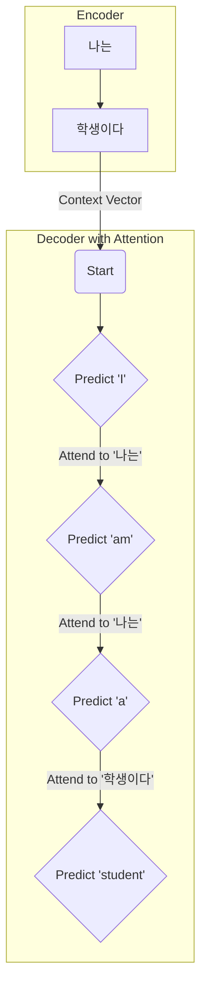

# Seq2Seq와 어텐션 메커니즘

## 1. 핵심 개념 (Core Concept)

Seq2Seq(Sequence-to-Sequence)는 하나의 시퀀스를 다른 시퀀스로 변환하는 모델 구조로, 주로 \*\*인코더(Encoder)\*\*와 \*\*디코더(Decoder)\*\*로 구성됨. 하지만 인코더가 입력 시퀀스의 모든 정보를 고정된 크기의 벡터 하나로 압축하면서 발생하는 **정보 손실 문제**라는 한계를 가짐. **어텐션(Attention) 메커니즘**은 이 한계를 극복하기 위해, 디코더가 매 타임 스텝마다 입력 시퀀스의 특정 부분에 "집중(attend)"하여 관련성 높은 정보만을 선택적으로 활용하도록 돕는 기법임.

______________________________________________________________________

## 2. 상세 설명 (Detailed Explanation)

### 2.1 Seq2Seq (Encoder-Decoder) 모델

Seq2Seq 모델은 주로 기계 번역, 텍스트 요약, 챗봇과 같은 자연어 처리 태스크에 사용됨.

- **인코더 (Encoder)**: 입력 시퀀스(예: "나는 학생이다")를 순차적으로 받아, 전체 문맥을 압축한 하나의 \*\*컨텍스트 벡터(Context Vector)\*\*로 만듦. 주로 RNN, LSTM, GRU가 사용됨.
- **디코더 (Decoder)**: 인코더가 생성한 컨텍스트 벡터를 입력으로 받아, 출력 시퀀스(예: "I am a student")를 한 단어씩 순차적으로 생성함.

### 2.2 Seq2Seq의 한계: 고정 크기 컨텍스트 벡터

- **정보 병목 (Information Bottleneck)**: 입력 시퀀스의 길이에 상관없이 항상 고정된 크기의 벡터에 모든 정보를 압축해야 함. 이로 인해 입력 문장이 길어지면 초반의 중요한 정보가 손실될 가능성이 큼.
- **장기 의존성 문제**: RNN 기반 모델의 고질적인 문제로, 시퀀스가 길어질수록 앞부분의 정보가 뒤로 제대로 전달되지 않음.

### 2.3 어텐션 (Attention) 메커니즘의 도입

어텐션은 디코더가 출력 단어를 생성할 때마다, 인코더의 \*\*모든 타임 스텝의 은닉 상태(hidden states)\*\*를 다시 참조하여 현재 예측과 가장 관련 있는 입력 단어에 "집중"하도록 함.

- **작동 방식**:

  1. **어텐션 점수(Attention Score) 계산**: 디코더의 현재 은닉 상태와 인코더의 모든 은닉 상태를 비교하여 유사도 점수를 계산함. (예: Dot-Product, Scaled Dot-Product)
  1. **어텐션 가중치(Attention Weight) 계산**: 이 점수들에 소프트맥스(Softmax) 함수를 적용하여 확률 분포 형태의 가중치를 구함. 이 가중치의 합은 1이며, 각 입력 단어의 중요도를 나타냄.
  1. **동적 컨텍스트 벡터(Dynamic Context Vector) 생성**: 어텐션 가중치를 인코더의 각 은닉 상태에 곱한 후 모두 더하여, 현재 디코딩 스텝에 최적화된 새로운 컨텍스트 벡터를 만듦.
  1. **출력 생성**: 이 동적 컨텍스트 벡터와 디코더의 이전 스텝 출력을 함께 사용하여 다음 단어를 예측함.

- **장점**:

  - **정보 병목 현상 해결**: 더 이상 모든 정보를 고정된 크기의 벡터 하나에 압축할 필요 없이, 필요할 때마다 입력 시퀀스의 모든 정보에 접근할 수 있음.
  - **성능 향상**: 입력 시퀀스가 길어져도 중요한 정보를 놓치지 않고 처리할 수 있어 기계 번역 등의 태스크에서 성능이 획기적으로 향상됨.
  - **해석 가능성(Interpretability) 제공**: 어텐션 가중치를 시각화하면 모델이 어떤 출력 단어를 생성할 때 어떤 입력 단어에 집중했는지 확인할 수 있어 모델의 결정 과정을 이해하는 데 도움이 됨.

______________________________________________________________________

## 3. 예시 (Example)

### 기계 번역에서의 어텐션

"나는 학생이다" -> "I am a student" 번역 과정에서, 디코더가 "student"를 예측하는 시점에는 어텐션 가중치가 입력 문장의 "학생이다" 부분에 높게 나타남.

______________________________________________________________________

## 4. 예상 면접 질문 (Potential Interview Questions)

- **Q. 기본적인 Seq2Seq 모델의 한계점은 무엇이며, 어텐션은 이를 어떻게 해결하나요?**

  - **A.** Seq2Seq 모델의 한계는 입력 시퀀스의 모든 정보를 고정된 크기의 컨텍스트 벡터 하나에 압축해야 한다는 것입니다. 이로 인해 문장이 길어지면 정보 손실이 발생합니다. 어텐션은 이 문제를 해결하기 위해, 디코더가 매번 출력을 생성할 때마다 인코더의 모든 은닉 상태를 다시 살펴보고, 현재 예측에 가장 관련 있는 정보에 높은 가중치를 부여하여 동적으로 새로운 컨텍스트 벡터를 만들어 사용합니다. 이를 통해 정보 병목 현상을 해결하고 긴 시퀀스에 대한 성능을 크게 향상시킵니다.

- **Q. 어텐션 메커니즘의 장점 중 하나로 '해석 가능성'을 드는 이유는 무엇인가요?**

  - **A.** 어텐션 가중치를 시각화할 수 있기 때문입니다. 예를 들어, 기계 번역에서 출력 단어를 생성할 때, 입력 문장의 어떤 단어에 높은 어텐션 가중치가 부여되었는지를 히트맵 등으로 확인할 수 있습니다. 이는 모델이 어떤 근거로 특정 단어를 번역했는지 직관적으로 이해할 수 있게 해주어, 모델의 내부 동작을 분석하고 디버깅하는 데 도움을 줍니다.

- **Q. 어텐션의 아이디어가 어떻게 트랜스포머(Transformer) 모델로 이어졌나요?**

  - **A.** 어텐션은 처음에는 RNN의 성능을 보조하는 역할로 사용되었습니다. 하지만 연구자들은 "RNN의 순차적인 구조 없이, 어텐션만으로도 시퀀스 내의 관계를 충분히 학습할 수 있지 않을까?"라는 질문을 던졌습니다. 그 결과 탄생한 것이 트랜스포머입니다. 트랜스포머는 RNN 구조를 완전히 배제하고, 셀프 어텐션(Self-Attention)이라는 메커니즘을 사용하여 입력 시퀀스 내의 단어들 간의 관계, 출력 시퀀스 내의 단어들 간의 관계, 그리고 입력과 출력 시퀀스 간의 관계를 모두 모델링합니다. 즉, 어텐션을 보조 수단이 아닌 모델의 핵심적인 연산 단위로 격상시킨 것입니다.

______________________________________________________________________

## 5. 더 읽어보기 (Further Reading)

- [Neural Machine Translation by Jointly Learning to Align and Translate (Bahdanau et al., 2014)](https://arxiv.org/abs/1409.0473) - 어텐션 메커니즘을 처음 제안한 논문
- [Effective Approaches to Attention-based Neural Machine Translation (Luong et al., 2015)](https://arxiv.org/abs/1508.04025)
- [The Illustrated Transformer (Jay Alammar)](https://jalammar.github.io/illustrated-transformer/)
