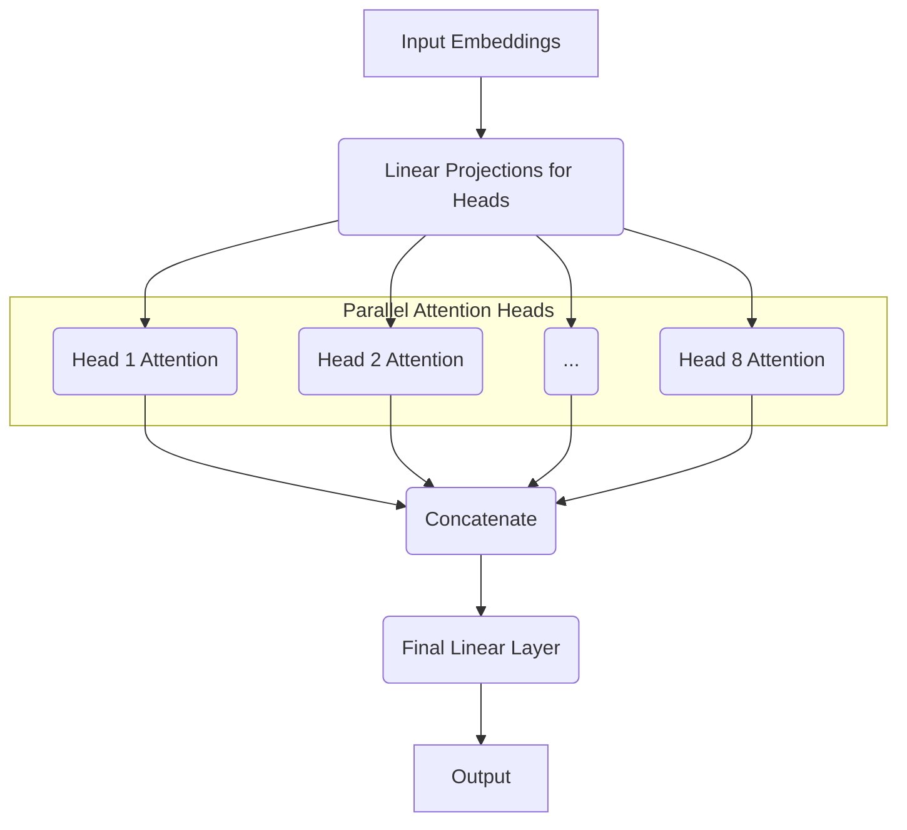

# 멀티-헤드 어텐션과 위치 인코딩

## 1. 핵심 개념 (Core Concept)

트랜스포머는 RNN을 사용하지 않고 어텐션 메커니즘만으로 시퀀스 데이터의 관계를 파악하는 모델임. 이 과정에서 두 가지 핵심적인 장치가 사용되는데, **멀티-헤드 어텐션(Multi-Head Attention)**은 단어 간의 다양한 관계(예: 문법적, 의미적 관계)를 여러 관점에서 동시에 학습하는 역할을 하며, **위치 인코딩(Positional Encoding)**은 순서 정보가 없는 트랜스포머에 단어의 절대적, 상대적 위치 정보를 제공하는 역할을 함.

---

## 2. 상세 설명 (Detailed Explanation)

### 2.1 멀티-헤드 어텐션 (Multi-Head Attention)

단일 어텐션(Single Attention)이 한 가지 관점에서만 단어 간의 관계를 보는 것과 달리, 멀티-헤드 어텐션은 여러 개의 "헤드(head)"를 두어 여러 관점에서 관계를 병렬적으로 학습함. 이는 마치 한 문장을 읽을 때, 어떤 전문가는 문법적 구조를 보고 다른 전문가는 비유적 의미를 파악하는 것과 같음.

*   **작동 방식**:
    1.  **입력 임베딩 분할**: `d_model` 차원의 입력 임베딩을 `h`개의 헤드로 나눔. 각 헤드는 `d_k = d_model / h` 차원을 가짐.
    2.  **독립적인 어텐션 수행**: 각 헤드는 독립적인 가중치 행렬(Wq, Wk, Wv)을 가지고, 자신만의 Q, K, V 벡터를 생성하여 스케일드 닷-프로덕트 어텐션(Scaled Dot-Product Attention)을 수행함. 이를 통해 각 헤드는 서로 다른 종류의 관계에 집중하게 됨.
    3.  **결과 연결 및 선형 변환**: 각 헤드에서 계산된 어텐션 결과(Z0, Z1, ... Zh)들을 모두 연결(concatenate)한 후, 최종적으로 하나의 선형 레이어(Wo)를 통과시켜 원래의 차원으로 복원함.

*   **장점**: 각 헤드가 서로 다른 부분 공간(subspace)에서 정보의 다른 측면을 학습할 수 있어, 모델이 더 풍부하고 다각적인 문맥을 이해할 수 있게 됨.

### 2.2 위치 인코딩 (Positional Encoding)

트랜스포머는 RNN과 달리 단어를 순차적으로 처리하지 않고 한 번에 병렬로 처리하기 때문에, 모델 자체에는 단어의 순서 정보가 없음. "나는 너를 좋아해"와 "너는 나를 좋아해"는 의미가 완전히 다르지만, 트랜스포머는 이 둘을 구분하지 못함. 위치 인코딩은 이 문제를 해결하기 위해 각 단어의 위치 정보를 모델에 명시적으로 주입하는 역할을 함.

*   **작동 방식**: 단어의 임베딩 벡터에 각 위치별로 고유한 값을 가진 **위치 벡터(positional vector)**를 더해줌. 이 위치 벡터는 주로 사인(sine)과 코사인(cosine) 함수를 사용하여 생성됨.

*   **사인/코사인 함수를 사용하는 이유**:
    1.  **고유한 위치 값**: 각 위치마다 고유한 벡터 값을 생성할 수 있음.
    2.  **상대적 위치 정보 학습**: 특정 주기 함수를 사용하므로, 모델이 단어 간의 상대적인 위치 관계를 쉽게 학습할 수 있음. 예를 들어, 4칸 떨어진 단어들 간의 관계 패턴을 학습하기 용이함.
    3.  **일관성**: 학습 데이터보다 긴 시퀀스가 들어오더라도 일관된 위치 값을 생성할 수 있음.

*   **수식**: `PE(pos, 2i) = sin(pos / 10000^(2i/d_model))`, `PE(pos, 2i+1) = cos(pos / 10000^(2i/d_model))`
    *   `pos`: 시퀀스 내의 단어 위치
    *   `i`: 벡터 내의 차원 인덱스

---

## 3. 예시 (Example)

### 멀티-헤드 어텐션 시각화

문장: "The animal didn't cross the street because it was too tired."

*   **Head 1**: 'it'과 'animal'의 주어-대명사 관계에 높은 어텐션 점수를 부여.
*   **Head 2**: 'tired'와 'animal'의 상태-주체 관계에 높은 어텐션 점수를 부여.
*   **Head 3**: 문장 전체의 전반적인 문맥에 넓게 어텐션 점수를 분산.

---

## 4. 예상 면접 질문 (Potential Interview Questions)

*   **Q. 트랜스포머에서 멀티-헤드 어텐션을 사용하는 이유는 무엇인가요? 단일 헤드로 차원만 늘리는 것과 비교해서 어떤 장점이 있나요?**
    *   **A.** 단일 헤드로 차원만 늘리면, 모델이 한 가지 종류의 관계에만 과도하게 집중하게 될 수 있습니다. 멀티-헤드 어텐션은 어텐션을 여러 헤드로 나누어 병렬로 수행함으로써, 각 헤드가 서로 다른 관점(예: 문법적 관계, 의미적 관계, 장거리 의존성 등)에서 단어 간의 관계를 학습하도록 유도합니다. 이는 마치 여러 전문가가 각자의 전문 분야에서 의견을 내는 것과 같아서, 모델이 더 풍부하고 다각적인 문맥을 파악하여 종합적인 결정을 내릴 수 있게 해줍니다.

*   **Q. 트랜스포머는 RNN과 달리 순서 정보가 없는데, 이를 어떻게 처리하나요?**
    *   **A.** 트랜스포머는 위치 인코딩(Positional Encoding)이라는 방법을 사용하여 단어의 순서 정보를 처리합니다. 입력 단어의 임베딩 벡터에 각 위치마다 고유한 값을 가지는 위치 벡터를 더해주는 방식입니다. 이 위치 벡터는 주로 사인과 코사인 함수로 만들어지는데, 이를 통해 모델은 각 단어의 절대적인 위치와 단어들 간의 상대적인 위치 관계를 학습할 수 있게 됩니다.

*   **Q. 위치 인코딩으로 학습 가능한 파라미터(learnable parameters) 대신 사인/코사인 함수를 사용하는 이유는 무엇인가요?**
    *   **A.** 사인/코사인 함수를 사용하면 몇 가지 이점이 있습니다. 첫째, 학습 데이터에 없었던 더 긴 시퀀스가 입력으로 들어오더라도 일관된 위치 값을 생성할 수 있어 모델의 일반화에 유리합니다. 둘째, 주기 함수의 특성 덕분에 모델이 단어 간의 상대적인 위치 관계를 더 쉽게 학습할 수 있습니다. 학습 가능한 파라미터를 사용할 수도 있지만, 이 경우 학습 데이터의 최대 길이보다 긴 시퀀스에 대한 일반화 성능이 떨어질 수 있습니다.

---

## 5. 더 읽어보기 (Further Reading)

*   [Attention Is All You Need (Vaswani et al., 2017)](https://arxiv.org/abs/1706.03762)
*   [The Illustrated Transformer (Jay Alammar)](http://jalammar.github.io/illustrated-transformer/)
*   [Transformer Architecture: The Positional Encoding (Amirhossein Kazemnejad's Blog)](https://kazemnejad.com/blog/transformer_architecture_positional_encoding/)