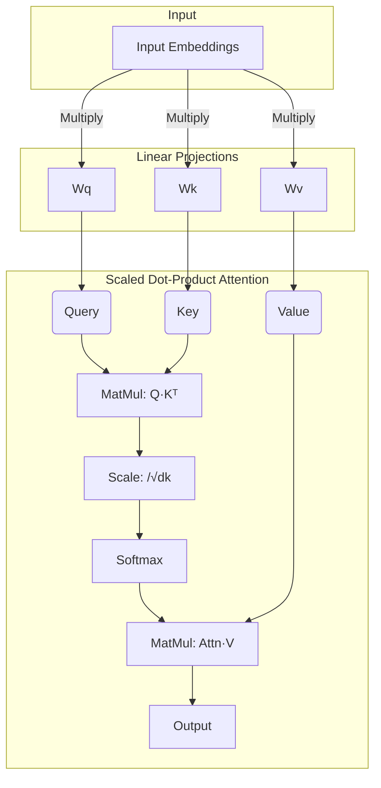

# 셀프 어텐션과 스케일드 닷-프로덕트 어텐션

## 1. 핵심 개념 (Core Concept)

**셀프 어텐션(Self-Attention)**은 하나의 시퀀스 내에서, 각 단어가 다른 모든 단어와 어떤 관계를 맺고 있는지 그 중요도를 계산하는 메커니즘임. 이를 통해 모델은 문장 전체의 문맥을 효과적으로 파악할 수 있음. 트랜스포머에서는 이 셀프 어텐션을 **스케일드 닷-프로덕트 어텐션(Scaled Dot-Product Attention)**이라는 구체적인 수식으로 구현함.

---

## 2. 상세 설명 (Detailed Explanation)

### 2.1 셀프 어텐션 (Self-Attention)의 직관적 이해

문장 "그 동물은 길을 건너지 않았다. 왜냐하면 그것은 너무 피곤했기 때문이다." 에서, 우리는 '그것(it)'이 '길(street)'이 아니라 '동물(animal)'을 가리킨다는 것을 쉽게 암. 셀프 어텐션은 모델이 이와 같이 문장 내 단어들 간의 의존 관계를 직접적으로 학습하도록 돕는 역할을 함. 즉, 문장 스스로가 각 단어의 의미를 더 명확히 하기 위해 다른 단어들을 "참조"하고 "집중"하는 과정임.

### 2.2 스케일드 닷-프로덕트 어텐션 (Scaled Dot-Product Attention)

트랜스포머는 셀프 어텐션을 구현하기 위해 Q(Query), K(Key), V(Value)라는 세 가지 벡터를 사용함. 이들은 모두 입력된 단어의 임베딩 벡터로부터 생성됨.

*   **Query (Q)**: 현재 분석하려는 단어의 벡터. 다른 단어들과의 관련성을 "질의"하는 주체.
*   **Key (K)**: 문장 내 모든 단어의 벡터. 쿼리와의 관련성을 측정당하는 "꼬리표" 역할.
*   **Value (V)**: 문장 내 모든 단어의 벡터. 실제 의미를 담고 있으며, 어텐션 가중치에 따라 조합될 정보의 원천.

#### **계산 과정**

1.  **점수(Score) 계산**: 특정 단어의 Q 벡터와 문장 내 모든 단어의 K 벡터를 내적(Dot-Product)하여 유사도 점수를 계산함. 이 점수가 높을수록 두 단어의 관련성이 높다는 의미.
    `Score = Q · Kᵀ`

2.  **스케일링(Scaling)**: 계산된 점수를 K 벡터 차원(`d_k`)의 제곱근(`√d_k`)으로 나누어 줌. 이는 `d_k`가 클 경우 내적 값이 너무 커져 소프트맥스 함수의 그래디언트가 매우 작아지는 문제를 방지하기 위함임 (기울기 소실 방지).
    `Scaled Score = (Q · Kᵀ) / √d_k`

3.  **어텐션 가중치(Attention Weight) 계산**: 스케일링된 점수에 소프트맥스(Softmax) 함수를 적용하여 합이 1인 확률 분포 형태의 가중치를 만듦. 이 가중치가 바로 각 단어에 얼마나 "집중"할지를 나타내는 값임.
    `Attention Weight = Softmax(Scaled Score)`

4.  **최종 출력(Output) 계산**: 계산된 어텐션 가중치를 각 단어의 V 벡터에 곱한 후, 모두 더하여 최종 결과 벡터를 생성함. 이는 문장 내 모든 단어의 의미가 관련성에 따라 가중 평균된, 문맥이 풍부하게 반영된 새로운 벡터임.
    `Output = Attention Weight · V`

*   **전체 수식**: `Attention(Q, K, V) = softmax((Q · Kᵀ) / √d_k) · V`

---

## 3. 예시 (Example)

### Q, K, V 생성 과정

입력 문장 "I am a student"가 있고, 각 단어의 임베딩 벡터가 `d_model` 차원이라고 가정.

1.  학습 가능한 가중치 행렬 `Wq`, `Wk`, `Wv`를 준비함.
2.  "I"의 임베딩 벡터에 `Wq`, `Wk`, `Wv`를 각각 곱하여 "I"에 대한 Q, K, V 벡터를 생성함.
3.  "am", "a", "student"에 대해서도 동일한 과정을 반복하여 모든 단어의 Q, K, V 벡터를 얻음.

### 다이어그램 예시 (Mermaid)

---

## 4. 예상 면접 질문 (Potential Interview Questions)

*   **Q. 셀프 어텐션에서 Q, K, V는 각각 어떤 역할을 하나요?**
    *   **A.** Q(Query), K(Key), V(Value)는 검색 시스템의 개념에서 유추할 수 있습니다. Q는 현재 내가 찾고 싶은 정보(질의)입니다. K는 검색 대상이 되는 항목들의 꼬리표(키)이고, V는 그 항목들이 가진 실제 값(내용)입니다. 셀프 어텐션에서는 현재 단어(Q)가 문장 내 다른 모든 단어(K)들과의 관련성을 계산하고, 그 관련성(어텐션 가중치)에 따라 다른 단어들의 의미(V)를 조합하여 현재 단어의 문맥적 의미를 풍부하게 만듭니다.

*   **Q. 스케일드 닷-프로덕트 어텐션에서 스케일링(Scaling)을 하는 이유는 무엇인가요?**
    *   **A.** 스케일링은 K 벡터의 차원 `d_k`가 클 때, Q와 K의 내적 값이 너무 커지는 것을 방지하기 위함입니다. 내적 값이 너무 커지면 소프트맥스 함수를 통과했을 때 출력이 0과 1에 가깝게 치우치게 됩니다. 이 경우, 그래디언트(기울기)가 거의 0에 가까워져 역전파 시 학습이 제대로 이루어지지 않는 기울기 소실(Vanishing Gradient) 문제가 발생할 수 있습니다. 따라서 점수 값을 `√d_k`로 나누어 줌으로써 안정적인 학습을 가능하게 합니다.

*   **Q. 셀프 어텐션이 RNN에 비해 갖는 장점은 무엇인가요?**
    *   **A.** 두 가지 주요 장점이 있습니다. 첫째, **계산 효율성**입니다. RNN은 단어를 순차적으로 처리해야 하지만, 셀프 어텐션은 행렬 연산을 통해 문장 내 모든 단어 간의 관계를 한 번에 병렬적으로 계산할 수 있습니다. 둘째, **장기 의존성 문제 해결**입니다. RNN은 시퀀스가 길어질수록 앞부분의 정보가 소실될 수 있지만, 셀프 어텐션은 거리에 상관없이 어떤 단어 쌍이든 직접적으로 연결하여 관계를 모델링하므로 장거리 의존성을 효과적으로 학습할 수 있습니다.

---

## 5. 더 읽어보기 (Further Reading)

*   [Attention Is All You Need (Vaswani et al., 2017)](https://arxiv.org/abs/1706.03762)
*   [The Illustrated Transformer (Jay Alammar)](http://jalammar.github.io/illustrated-transformer/)
*   [What is Self-Attention in Natural Language Processing? (H2O.ai)](https://h2o.ai/wiki/self-attention/)