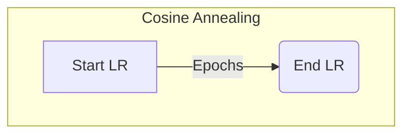

# 학습률 스케줄링 (Learning Rate Scheduling)

## 1. 핵심 개념 (Core Concept)

학습률 스케줄링은 딥러닝 모델 학습 과정에서 미리 정해진 규칙에 따라 학습률(Learning Rate)을 동적으로 조절하는 기법임. 학습 초기에는 큰 학습률로 빠르게 최적점에 접근하고, 학습이 진행됨에 따라 학습률을 줄여 모델이 안정적으로 수렴하도록 돕는 것이 주된 목적임. 이를 통해 모델의 최종 성능을 향상시키고 학습을 안정화할 수 있음.

______________________________________________________________________

## 2. 상세 설명 (Detailed Explanation)

### 2.1 왜 학습률 스케줄링이 필요한가?

고정된 학습률을 사용하면 다음과 같은 문제가 발생할 수 있음.

- **너무 높은 학습률**: Loss가 발산하거나 최적점 주변에서 진동하여 수렴하지 못함.
- **너무 낮은 학습률**: 학습 속도가 매우 느리고, 좋지 않은 local minima에 빠질 위험이 있음.

학습률 스케줄링은 이러한 문제를 해결하기 위해 학습 단계에 따라 학습률을 변화시켜, 빠르고 안정적인 수렴을 유도함.

### 2.2 대표적인 스케줄링 전략

#### 2.2.1 워밍업 (Warmup)

- **개념**: 학습 시작 후 처음 몇 에폭(epoch) 동안 학습률을 0 또는 매우 작은 값에서 점차적으로 목표 학습률까지 선형적으로 증가시키는 방법.
- **목적**: 학습 초기에 모델 파라미터가 무작위로 초기화된 상태에서 너무 큰 학습률로 인해 학습이 불안정해지는 것을 방지함. 특히 모델 구조가 크거나 데이터 분포가 불안정할 때 효과적임.

#### 2.2.2 코사인 어닐링 (Cosine Annealing)

- **개념**: 학습률을 코사인(cosine) 함수의 형태로 최대치에서 최소치(보통 0)까지 부드럽게 감소시키는 방법.
- **특징**: 학습률이 천천히 감소하다가 중간에 빠르게 감소하고, 마지막에 다시 천천히 감소하는 형태를 띰. 이를 통해 모델이 넓은 local minima에 도달하도록 유도하여 일반화 성능을 높이는 효과가 있음. `CosineAnnealingLR` (PyTorch), `CosineDecay` (TensorFlow) 등으로 구현됨.



*위 그래프는 코사인 함수의 형태를 단순화하여 표현한 것임.*

#### 2.2.3 One-Cycle Policy

- **개념**: Leslie N. Smith가 제안한 방법으로, 하나의 학습 사이클(cycle) 내에서 학습률과 모멘텀(momentum)을 함께 조절함.
- **동작 방식**:
  1. **Warmup Phase**: 학습률을 낮은 값에서 최대값까지 점진적으로 증가시킴. (모멘텀은 높은 값에서 낮은 값으로 감소)
  1. **Cooldown Phase**: 학습률을 최대값에서 다시 낮은 값(거의 0에 가깝게)으로 점진적으로 감소시킴. (모멘텀은 다시 높은 값으로 증가)
- **장점**: 더 높은 학습률을 사용할 수 있게 하여 학습 시간을 단축시키고, 규제(regularization) 효과를 통해 모델의 일반화 성능을 향상시킴.

______________________________________________________________________

## 3. 예시 (Example)

### 코드 예시 (PyTorch)

PyTorch의 `optim.lr_scheduler`를 사용한 워밍업과 코사인 어닐링 스케줄러 조합 예시.

```python
import torch
import torch.nn as nn
import torch.optim as optim
from torch.optim.lr_scheduler import CosineAnnealingLR, LambdaLR

# 모델, 옵티마이저 정의
model = nn.Linear(10, 1)
optimizer = optim.Adam(model.parameters(), lr=0.001) # 초기 LR은 중요하지 않음

# 워밍업 스케줄러 (LambdaLR 사용)
warmup_epochs = 5
warmup_scheduler = LambdaLR(
    optimizer,
    lr_lambda=lambda epoch: (epoch + 1) / warmup_epochs if epoch < warmup_epochs else 1
)

# 메인 스케줄러 (코사인 어닐링)
total_epochs = 50
main_scheduler = CosineAnnealingLR(optimizer, T_max=total_epochs - warmup_epochs)

# 학습 루프
for epoch in range(total_epochs):
    # train...

    # 스케줄러 업데이트
    if epoch < warmup_epochs:
        warmup_scheduler.step()
    else:
        main_scheduler.step()

    current_lr = optimizer.param_groups[0]['lr']
    print(f"Epoch {epoch+1}, Current LR: {current_lr}")

```

*참고: PyTorch 1.10.0 이상에서는 `ChainedScheduler`를 사용하여 두 스케줄러를 더 쉽게 연결할 수 있음.*

______________________________________________________________________

## 4. 예상 면접 질문 (Potential Interview Questions)

- **Q. 학습률 워밍업(Warmup)은 왜 사용하며, 어떤 경우에 특히 효과적인가요?**
  - **A.** 워밍업은 학습 초기에 학습률을 점진적으로 증가시켜 학습의 불안정성을 줄이기 위해 사용됩니다. 모델 파라미터가 무작위로 초기화된 상태에서 갑자기 큰 그래디언트가 발생하여 파라미터가 크게 변하는 것을 막아줍니다. 특히, 배치 정규화(Batch Normalization)가 없는 모델, Residual connection이 깊은 모델(ResNet), 또는 트랜스포머(Transformer)와 같이 학습 초기에 불안정한 모델에서 효과적입니다.
- **Q. 코사인 어닐링 스케줄러가 Step Decay (특정 epoch마다 학습률을 일정 비율로 감소) 방식에 비해 갖는 장점은 무엇인가요?**
  - **A.** Step Decay는 학습률이 계단식으로 급격히 변하는 반면, 코사인 어닐링은 학습률을 부드럽게 감소시킵니다. 이 부드러운 변화는 모델이 최적점을 지나치지 않고 안정적으로 수렴하도록 돕습니다. 또한, 학습률이 0에 가까워졌다가 다시 커지는 `CosineAnnealingWarmRestarts`와 같은 변형을 통해, 모델이 안장점(saddle point)이나 좁은 local minima에서 탈출하여 더 좋은 최적점을 찾도록 유도할 수 있습니다.
- **Q. One-Cycle Policy의 핵심 아이디어는 무엇이며, 모멘텀은 어떻게 조절되나요?**
  - **A.** One-Cycle Policy의 핵심은 하나의 학습 사이클 동안 학습률을 낮은 값에서 최대치까지 올렸다가 다시 낮은 값으로 내리는 것입니다. 이는 모델이 더 넓은 파라미터 공간을 탐색하게 하여 규제 효과를 낳고, 더 빠른 수렴을 가능하게 합니다. 이때 모멘텀은 학습률과 반대로 움직입니다. 학습률이 증가하는 구간에서는 모멘텀을 높은 값에서 낮은 값으로 줄여 파라미터가 안정적으로 업데이트되도록 하고, 학습률이 감소하는 구간에서는 모멘텀을 다시 높여 수렴을 가속화합니다.

______________________________________________________________________

## 5. 더 읽어보기 (Further Reading)

- [Cyclical Learning Rates for Training Neural Networks (Leslie N. Smith, 2017)](https://arxiv.org/abs/1506.01186)
- [A disciplined approach to neural network hyper-parameters: Part 1 -- learning rate, batch size, momentum, and weight decay (Leslie N. Smith, 2018)](https://arxiv.org/abs/1803.09820)
- [PyTorch `lr_scheduler` 공식 문서](https://pytorch.org/docs/stable/optim.html#how-to-adjust-learning-rate)
