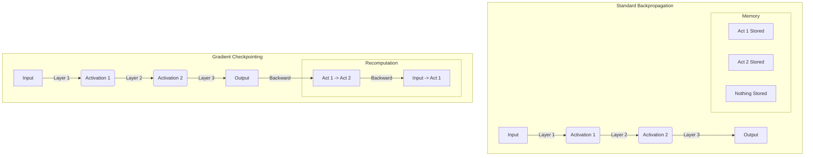

# 혼합 정밀도 & 그라디언트 체크포인팅

## 1. 핵심 개념 (Core Concept)

혼합 정밀도(Mixed Precision) 학습과 그라디언트 체크포인팅(Gradient Checkpointing)은 대규모 딥러닝 모델을 학습할 때 GPU 메모리 사용량을 줄이고 학습 속도를 높이기 위한 핵심적인 최적화 기법임. 혼합 정밀도는 연산에 필요한 데이터 타입을 단정밀도(FP32)와 반정밀도(FP16)를 함께 사용하여 메모리와 연산 속도를 최적화하며, 그라디언트 체크포인팅은 역전파 과정에서 필요한 중간 활성화(activation) 값을 모두 저장하는 대신 재계산하여 메모리를 절약함.

---

## 2. 상세 설명 (Detailed Explanation)

### 2.1 혼합 정밀도 (Mixed Precision)

#### 2.1.1 원리

NVIDIA의 Tensor Core와 같은 최신 GPU 하드웨어는 반정밀도(FP16/BF16) 연산에서 단정밀도(FP32)보다 훨씬 높은 처리량(throughput)을 제공함. 혼합 정밀도 학습은 이러한 하드웨어 가속을 최대한 활용하는 기법임.

*   **Forward/Backward Pass**: 대부분의 연산(예: 행렬 곱, 합성곱)은 속도 향상을 위해 FP16으로 수행함.
*   **Weight/Gradient 저장**: 모델의 가중치(weight)와 그래디언트(gradient)는 정밀도 유지를 위해 FP32로 저장함.
*   **Loss Scaling**: FP16은 표현 범위가 좁아 그래디언트가 0이 되는 언더플로우(underflow) 문제가 발생할 수 있음. 이를 방지하기 위해 Loss에 큰 값(scaling factor)을 곱해 그래디언트의 전체적인 크기를 키운 뒤, 가중치 업데이트 전에 다시 원래 스케일로 되돌리는 **Loss Scaling** 기법을 사용함.

| 데이터 타입 | 표현 범위 | 정밀도 | 장점 | 단점 |
| :--- | :--- | :--- | :--- | :--- |
| **FP32** | 넓음 | 높음 | 안정적 | 메모리/계산 비용 높음 |
| **FP16** | 좁음 | 낮음 | 메모리/계산 비용 낮음 | 오버플로우/언더플로우 위험 |
| **BF16** | FP32와 동일 | FP16보다 낮음 | 넓은 표현 범위, 안정적 | FP16보다 정밀도 낮음 |

#### 2.1.2 PyTorch `torch.cuda.amp`

PyTorch는 `torch.cuda.amp` (Automatic Mixed Precision) 모듈을 통해 혼합 정밀도 학습을 쉽게 적용할 수 있도록 지원함. `autocast` 컨텍스트 매니저와 `GradScaler`를 사용하여 위 과정을 자동화함.

### 2.2 그라디언트 체크포인팅 (Gradient Checkpointing)

#### 2.2.1 원리

딥러닝 모델의 역전파(backpropagation) 과정에서는 그래디언트를 계산하기 위해 순전파(forward pass) 과정에서 계산된 중간 활성화 값들이 필요함. 모델이 깊어질수록 이 활성화 값들을 저장하는 데 막대한 메모리가 소모됨.

그라디언트 체크포인팅은 이러한 활성화 값들을 모두 저장하는 대신, 역전파 시점에 필요한 만큼만 **재계산(recomputation)**하는 방식으로 메모리 사용량을 크게 줄임. 이는 계산 시간을 약간 희생하여 메모리 사용량을 얻는 전형적인 **시간-메모리 트레이드오프(time-memory trade-off)** 기법임.

#### 2.2.2 적용 대상

보통 모델의 특정 부분(예: 트랜스포머의 각 레이어)을 체크포인트로 지정함. 순전파 시에는 해당 부분의 입력만 저장하고, 역전파 시에 해당 부분의 순전파를 다시 실행하여 필요한 활성화 값을 얻음.

---

## 3. 예시 (Example)

### 코드 예시 (PyTorch)

혼합 정밀도와 그라디언트 체크포인팅을 함께 적용하는 예시.

'''python
import torch
import torch.nn as nn
from torch.utils.checkpoint import checkpoint # 그라디언트 체크포인팅
from torch.cuda.amp import autocast, GradScaler # 혼합 정밀도

# 1. 체크포인팅을 적용할 모델 레이어 정의
class CheckpointedLayer(nn.Module):
    def __init__(self, sub_layer):
        super().__init__()
        self.sub_layer = sub_layer

    def forward(self, x):
        # checkpoint 함수로 sub_layer를 감쌈
        return checkpoint(self.sub_layer, x)

# 모델 정의 (일부 레이어에 체크포인팅 적용)
model = nn.Sequential(
    nn.Linear(1024, 4096),
    nn.ReLU(),
    CheckpointedLayer(nn.Linear(4096, 4096)), # 이 레이어의 활성화는 저장되지 않음
    nn.ReLU(),
    nn.Linear(4096, 1024)
).cuda()

optimizer = torch.optim.Adam(model.parameters(), lr=1e-3)
scaler = GradScaler() # Loss Scaler 초기화

# 학습 데이터
data = torch.randn(2, 1024).cuda()
target = torch.randn(2, 1024).cuda()

# 2. 학습 루프 (혼합 정밀도 적용)
for epoch in range(5):
    optimizer.zero_grad()

    # autocast 컨텍스트 내에서 순전파 실행
    with autocast():
        output = model(data)
        loss = nn.MSELoss()(output, target)

    # scaler를 사용하여 스케일된 loss로 역전파
    scaler.scale(loss).backward()

    # scaler를 사용하여 옵티마이저 스텝 실행 및 스케일 업데이트
    scaler.step(optimizer)
    scaler.update()

    print(f"Epoch {epoch+1}, Loss: {loss.item()}")
'''

---

## 4. 예상 면접 질문 (Potential Interview Questions)

*   **Q. 혼합 정밀도 학습에서 Loss Scaling이 왜 필수적인가요?**
    *   **A.** FP16은 FP32에 비해 표현할 수 있는 수의 범위가 훨씬 좁습니다. 이로 인해 역전파 과정에서 계산되는 그래디언트 값이 매우 작아져 0으로 처리되는 언더플로우 문제가 발생할 수 있습니다. Loss Scaling은 순전파 마지막에 계산된 Loss 값에 큰 스케일링 팩터를 곱해 인위적으로 그래디언트의 전체 크기를 키워줌으로써, FP16으로 표현 불가능했던 작은 그래디언트 값들을 보존하는 역할을 합니다. 가중치 업데이트 직전에 다시 스케일링 팩터로 나누어 원래 크기로 되돌립니다.
*   **Q. 그라디언트 체크포인팅의 비용(단점)은 무엇이며, 어떤 상황에서 사용하는 것이 가장 효과적인가요?**
    *   **A.** 가장 큰 비용은 계산 시간의 증가입니다. 중간 활성화 값을 저장하는 대신 재계산해야 하므로, 표준적인 역전파 방식에 비해 순전파 계산이 추가로 발생합니다. 따라서, GPU 메모리가 부족하여 배치 크기를 줄여야 하거나 모델 크기 자체를 줄여야 하는 상황에서, 약간의 학습 시간 증가를 감수하더라도 더 큰 모델이나 더 큰 배치 크기로 학습시키기 위해 사용하는 것이 효과적입니다.
*   **Q. 혼합 정밀도와 그라디언트 체크포인팅을 함께 사용했을 때 얻을 수 있는 시너지 효과는 무엇인가요?**
    *   **A.** 혼합 정밀도는 연산 속도를 높이고 메모리 대역폭 사용량을 줄여주며, 그라디언트 체크포인팅은 활성화 값 저장에 필요한 메모리를 크게 줄여줍니다. 이 둘을 함께 사용하면, 메모리 제약이 극심한 대규모 모델 학습 환경에서 시너지를 낼 수 있습니다. 체크포인팅으로 확보한 메모리 공간 덕분에 더 큰 배치 크기를 사용할 수 있게 되고, 혼합 정밀도로 인해 증가된 배치 크기의 연산 속도 저하를 완화하고 전체적인 학습 처리량을 높일 수 있습니다.

---

## 5. 더 읽어보기 (Further Reading)

*   [PyTorch AMP(Automatic Mixed Precision) 예제](https://pytorch.org/docs/stable/notes/amp_examples.html)
*   [PyTorch `torch.utils.checkpoint` 공식 문서](https://pytorch.org/docs/stable/checkpoint.html)
*   [Mixed Precision Training (NVIDIA Deep Learning Performance Guide)](https://docs.nvidia.com/deeplearning/performance/dl-performance-gpu-background/index.html#mixed-precision-training)