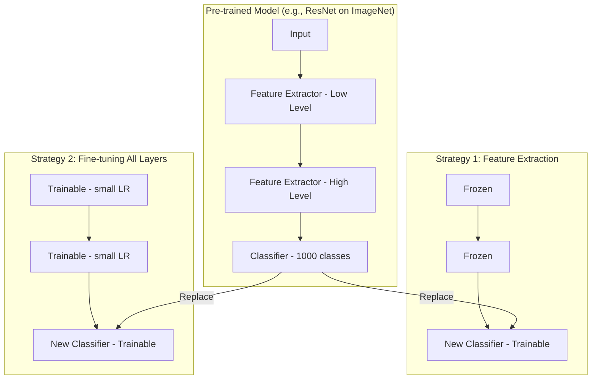

# 전이 학습 & 파인튜닝 (Transfer Learning & Fine-tuning)

## 1. 핵심 개념 (Core Concept)

전이 학습(Transfer Learning)은 대규모 데이터셋으로 미리 학습된 모델(Pre-trained Model)을 가져와, 새로운 (하지만 관련된) 태스크를 해결하는 데 활용하는 머신러닝 기법임. 파인튜닝(Fine-tuning)은 이러한 전이 학습의 가장 일반적인 방법 중 하나로, 미리 학습된 모델의 가중치를 새로운 데이터셋에 맞게 미세하게 조정하는 과정을 의미함. 이를 통해 적은 데이터로도 높은 성능의 모델을 빠르고 효율적으로 구축할 수 있음.

______________________________________________________________________

## 2. 상세 설명 (Detailed Explanation)

### 2.1 왜 전이 학습을 사용하는가?

1. **데이터 부족 문제 해결**: 처음부터 모델을 학습시키려면 매우 큰 데이터셋이 필요하지만, 대부분의 실제 문제에서는 이러한 데이터를 구하기 어려움. 전이 학습은 대규모 데이터(예: ImageNet, 위키피디아)로 학습된 모델의 "지식"을 이전받아 적은 데이터로도 좋은 성능을 낼 수 있게 함.
1. **학습 시간 단축**: 이미 좋은 가중치에서 학습을 시작하므로, 무작위 초기화 상태에서 시작하는 것보다 훨씬 빠르게 모델이 수렴함.
1. **성능 향상**: 미리 학습된 모델은 데이터의 저수준 특징(low-level features, 예: 이미지의 선, 질감)부터 고수준 특징(high-level features, 예: 객체의 형태)까지 풍부하게 학습한 상태임. 이 지식은 새로운 태스크의 일반화 성능을 높이는 데 기여함.

### 2.2 파인튜닝 전략

파인튜닝의 핵심은 미리 학습된 모델의 어느 부분까지 "얼리고(freeze)" 어느 부분까지 "학습(train)"시킬지 결정하는 것임. 이는 새로운 데이터셋의 크기와 성격에 따라 달라짐.



1. **전체 모델 파인튜닝 (Fine-tuning the entire model)**:

   - **방법**: 미리 학습된 모델의 모든 레이어를 학습시킴. 보통 뒷단 레이어(task-specific)는 큰 학습률을, 앞단 레이어(general features)는 작은 학습률을 적용하는 \*\*차등 학습률(discriminative learning rates)\*\*을 사용함.
   - **상황**: 새로운 데이터셋이 충분히 크고, 원래 데이터셋과 유사할 때 효과적임.

1. **일부 레이어만 파인튜닝 (Freezing some layers)**:

   - **방법**: 모델의 앞부분(주로 컨볼루션 기반의 특징 추출기)은 가중치를 고정(freeze)하고, 뒷부분의 분류기(classifier) 또는 일부 상위 레이어만 학습시킴.
   - **상황**: 새로운 데이터셋의 크기가 작을 때, 과적합(overfitting)을 방지하기 위해 사용됨. 특징 추출기로서의 역할만 수행하도록 하는 것.

1. **특징 추출기로서만 사용 (Using as a fixed feature extractor)**:

   - **방법**: 모델의 분류기를 제외한 모든 레이어를 고정하고, 이 모델을 통과시켜 얻은 특징 벡터(feature vector)를 사용하여 별도의 간단한 모델(예: SVM, 로지스틱 회귀)을 학습시킴.
   - **상황**: 데이터셋이 매우 작고, 원래 태스크와 유사성이 높을 때 사용됨.

______________________________________________________________________

## 3. 예시 (Example)

### 코드 예시 (PyTorch - 이미지 분류)

ImageNet으로 미리 학습된 ResNet18 모델을 가져와, 새로운 분류 태스크에 맞게 파인튜닝하는 예시.

```python
import torch
import torch.nn as nn
import torch.optim as optim
from torchvision import models

# 1. 미리 학습된 모델 로드
# weights='IMAGENET1K_V1'는 ImageNet으로 학습된 가중치를 가져옴을 의미
model = models.resnet18(weights='IMAGENET1K_V1')

# 2. (선택) 일부 레이어 고정 (Freeze)
# 처음 몇 개의 레이어는 일반적인 특징을 학습하므로 고정하여 과적합 방지
for name, param in model.named_parameters():
    if "layer4" not in name and "fc" not in name: # layer4와 fc를 제외한 모든 파라미터 고정
        param.requires_grad = False

# 3. 새로운 태스크에 맞게 마지막 레이어(분류기) 교체
num_features = model.fc.in_features
num_classes = 10 # 새로운 태스크의 클래스 수 (예: 10개)
model.fc = nn.Linear(num_features, num_classes)

# 4. 모델을 디바이스로 이동
device = "cuda" if torch.cuda.is_available() else "cpu"
model = model.to(device)

# 5. 옵티마이저 정의
# 학습시킬 파라미터만 옵티마이저에 전달
params_to_update = [p for p in model.parameters() if p.requires_grad]
optimizer = optim.Adam(params_to_update, lr=0.001)

# 이후 학습 코드는 일반적인 PyTorch 학습 루프와 동일
# ... (데이터 로더, 학습 루프 등)
```

______________________________________________________________________

## 4. 예상 면접 질문 (Potential Interview Questions)

- **Q. 전이 학습과 파인튜닝의 차이점은 무엇인가요?**
  - **A.** 전이 학습은 미리 학습된 모델을 새로운 문제 해결에 사용하는 광범위한 개념입니다. 파인튜닝은 전이 학습을 구현하는 구체적인 방법 중 하나로, 미리 학습된 모델의 가중치를 새로운 데이터에 맞게 '미세 조정'하는 과정을 의미합니다. 즉, 파인튜닝은 전이 학습의 한 종류라고 할 수 있습니다.
- **Q. 새로운 데이터셋의 크기와 원래 데이터셋과의 유사도에 따라 어떤 파인튜닝 전략을 선택해야 할까요?**
  - **A.**
    - **데이터가 많고, 유사도도 높은 경우**: 전체 모델을 파인튜닝하는 것이 가장 좋습니다. 데이터가 충분하므로 과적합 위험이 적고, 모델 전체를 새로운 데이터에 적응시켜 최고의 성능을 기대할 수 있습니다.
    - **데이터가 많고, 유사도가 낮은 경우**: 전체 모델을 파인튜닝하되, 더 많은 에폭 동안 더 높은 학습률로 학습시켜야 할 수 있습니다. 모델의 고수준 특징이 새로운 데이터와 맞지 않을 수 있기 때문입니다.
    - **데이터가 적고, 유사도가 높은 경우**: 모델의 앞부분(특징 추출기)은 고정하고 뒷부분(분류기)만 학습시키는 것이 좋습니다. 데이터가 적어 과적합 위험이 크므로, 일반적인 특징은 그대로 사용하고 태스크에 특화된 부분만 학습시킵니다.
    - **데이터가 적고, 유사도가 낮은 경우**: 가장 어려운 상황입니다. 전이 학습의 효과를 보기 어려울 수 있으며, 데이터를 더 수집하거나, 모델의 일부만 조심스럽게 파인튜닝하거나, 아예 더 간단한 모델을 처음부터 학습시키는 것을 고려해야 합니다.
- **Q. LLM(대규모 언어 모델)의 파인튜닝과 컴퓨터 비전 모델의 파인튜닝은 어떤 차이점이 있나요?**
  - **A.** 기본적인 원리는 유사하지만 몇 가지 차이가 있습니다. 1) **규모와 비용**: LLM은 파라미터 수가 훨씬 크기 때문에 파인튜닝에 막대한 계산 자원과 비용이 필요합니다. 2) **파인튜닝 기법**: LLM에서는 전체 파라미터를 파인튜닝하는 대신, LoRA(Low-Rank Adaptation)나 Prefix-tuning과 같이 일부 파라미터나 어댑터만 추가하여 학습하는 PEFT(Parameter-Efficient Fine-Tuning) 기법이 널리 사용됩니다. 이는 계산 효율성을 크게 높여줍니다. 3) **데이터 형식**: 비전 모델은 주로 이미지와 레이블 쌍으로 파인튜닝되지만, LLM은 명령어-응답 쌍, 대화 기록 등 더 다양한 형식의 텍스트 데이터로 파인튜닝됩니다.

______________________________________________________________________

## 5. 더 읽어보기 (Further Reading)

- [CS231n Transfer Learning 노트](https://cs231n.github.io/transfer-learning/)
- [A Survey on Transfer Learning (Pan & Yang, 2010)](https://www.cse.ust.hk/~qyang/Docs/2009/tkde_transfer_learning.pdf)
- [PyTorch Transfer Learning Tutorial](https://pytorch.org/tutorials/beginner/transfer_learning_tutorial.html)
