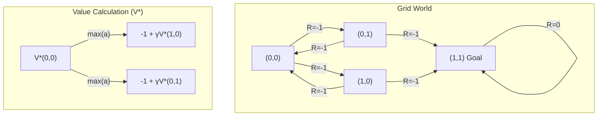

# MDP와 벨만 방정식 (MDP & Bellman Equations)

## 1. 핵심 개념 (Core Concept)

MDP(Markov Decision Process, 마르코프 결정 과정)는 강화학습(Reinforcement Learning)의 근간을 이루는 수학적 프레임워크입니다. 에이전트가 특정 환경과 상호작용하며 순차적인 결정을 내리는 과정을 모델링하며, '마르코프 속성'을 만족하는 환경을 가정합니다. 벨만 방정식(Bellman Equation)은 이 MDP 내에서 현재 상태의 가치와 다음 상태의 가치 사이의 관계를 정의하는 재귀식으로, 최적의 정책을 찾는 데 핵심적인 역할을 합니다.

______________________________________________________________________

## 2. 상세 설명 (Detailed Explanation)

### 2.1 MDP의 구성 요소 (Components of MDP)

MDP는 다음 5가지 요소로 정의됩니다.

- **상태 (States, S)**: 에이전트가 존재할 수 있는 모든 가능한 상태의 집합입니다. (예: 체스 게임에서 말들의 현재 위치)
- **행동 (Actions, A)**: 각 상태에서 에이전트가 취할 수 있는 모든 가능한 행동의 집합입니다. (예: 특정 말을 다음 위치로 이동)
- **상태 전환 확률 (State Transition Probability, P)**: 상태 `s`에서 행동 `a`를 취했을 때, 다음 상태 `s'`로 전환될 확률 `P(s' | s, a)`입니다. 이는 환경의 동역학(dynamics)을 나타냅니다.
- **보상 (Reward, R)**: 상태 `s`에서 행동 `a`를 취해 다음 상태 `s'`로 전환되었을 때 에이전트가 받는 즉각적인 보상 `R(s, a, s')`입니다. 강화학습의 목표는 이 누적 보상을 최대화하는 것입니다.
- **할인율 (Discount Factor, γ)**: 0과 1 사이의 값( `0 ≤ γ ≤ 1` )으로, 미래 보상의 현재 가치를 계산하는 데 사용됩니다. 즉각적인 보상을 더 중요하게 생각할지, 미래의 보상까지 고려할지를 결정하는 요소입니다.

**마르코프 속성(Markov Property)** 이란, 미래 상태의 확률이 오직 현재 상태와 행동에만 의존하고, 과거의 상태나 행동과는 무관하다는 가정입니다. `P(s_{t+1} | s_t, a_t) = P(s_{t+1} | s_t, a_t, s_{t-1}, a_{t-1}, ...)`

### 2.2 가치 함수 (Value Function)

가치 함수는 특정 상태 또는 특정 상태-행동 쌍이 장기적으로 얼마나 좋은지를 나타내는 기댓값입니다.

- **상태 가치 함수 (State-Value Function, Vπ(s))**: 정책 `π`를 따를 때, 상태 `s`에서부터 시작하여 얻게 될 미래 누적 보상의 기댓값입니다.
- **행동 가치 함수 (Action-Value Function, Qπ(s, a))**: 정책 `π`를 따를 때, 상태 `s`에서 행동 `a`를 취한 후 얻게 될 미래 누적 보상의 기댓값입니다.

### 2.3 벨만 방정식 (Bellman Equation)

벨만 방정식은 가치 함수들을 재귀적으로 정의하여 현재와 미래의 관계를 나타냅니다.

- **벨만 기대 방정식 (Bellman Expectation Equation)**: 특정 정책 `π`에 대한 가치 함수를 계산합니다. 현재 상태 `s`의 가치는 즉각적인 보상과 다음 상태의 가치(할인율 적용)의 합으로 표현됩니다.
  ```
  Vπ(s) = E[R_{t+1} + γVπ(s_{t+1}) | S_t=s]
  Qπ(s, a) = E[R_{t+1} + γQπ(s_{t+1}, a_{t+1}) | S_t=s, A_t=a]
  ```
- **벨만 최적 방정식 (Bellman Optimality Equation)**: 최적 정책 `π*`에 대한 가치 함수를 계산합니다. 최적 가치 함수는 가능한 모든 행동 중 가장 높은 Q값을 선택하는 방식으로 표현됩니다. 이 방정식을 푸는 것은 최적의 정책을 찾는 것과 같습니다.
  ```
  V*(s) = max_a E[R_{t+1} + γV*(s_{t+1}) | S_t=s, A_t=a]
  Q*(s, a) = E[R_{t+1} + γ max_{a'} Q*(s_{t+1}, a') | S_t=s, A_t=a]
  ```

______________________________________________________________________

## 3. 예시 (Example)

### 그리드 월드 (Grid World)

간단한 2x2 그리드 월드에서 MDP와 벨만 방정식을 생각해볼 수 있습니다.



- **상태**: 각 셀 (0,0), (0,1), (1,0), (1,1)
- **행동**: 상, 하, 좌, 우 이동
- **보상**: 목표 지점 (1,1)에 도달하면 0, 그 외 모든 움직임은 -1
- **목표**: (0,0)에서 시작하여 (1,1)에 도달하는 최적 정책 찾기
- **벨만 최적 방정식 적용**: 각 상태의 최적 가치 `V*(s)`는 가능한 행동(상,하,좌,우)을 했을 때의 `(보상 + 할인된 다음 상태의 가치)` 중 최댓값이 됩니다. 예를 들어, `V*(0,0)`은 `max(-1 + γV*(1,0), -1 + γV*(0,1))` 로 계산될 수 있습니다.

______________________________________________________________________

## 4. 예상 면접 질문 (Potential Interview Questions)

- **Q. MDP가 '마르코프 속성'을 갖는다는 것의 의미는 무엇이며, 왜 중요한가요?**
  - **A.** 마르코프 속성은 다음 상태가 오직 현재 상태와 행동에 의해서만 결정된다는 가정입니다. 이는 과거의 모든 이력을 기억할 필요 없이 현재 정보만으로 최적의 의사결정을 내릴 수 있게 해주므로, 문제를 단순화하고 강화학습 알고리즘을 적용하는 것을 가능하게 합니다.
- **Q. 벨만 기대 방정식과 최적 방정식의 차이점은 무엇인가요?**
  - **A.** 벨만 기대 방정식은 '주어진' 정책 `π`에 대한 가치 함수를 계산하는 데 사용됩니다. 즉, 현재 정책이 얼마나 좋은지 '평가'하는 데 쓰입니다. 반면, 벨만 최적 방정식은 '최적' 정책 `π*`의 가치 함수를 나타내며, 가능한 모든 정책 중에서 최고의 가치를 제공하는 정책을 찾는 데 사용됩니다. 이 방정식을 푸는 것이 강화학습의 목표입니다.
- **Q. 할인율(gamma)의 역할은 무엇이며, 이 값이 0 또는 1에 가까워질 때 어떤 의미를 갖나요?**
  - **A.** 할인율(γ)은 미래 보상의 가치를 현재 시점에서 얼마나 할인할지를 결정하는 요소입니다. γ가 0에 가까우면 에이전트는 즉각적인 보상만을 중요하게 생각하는 '근시안적(myopic)'인 결정을 내리게 됩니다. 반대로 γ가 1에 가까우면 미래의 보상을 현재의 보상만큼 중요하게 생각하는 '원시안적(far-sighted)'인 결정을 내리게 됩니다.

______________________________________________________________________

## 5. 더 읽어보기 (Further Reading)

- [Reinforcement Learning: An Introduction (Sutton and Barto)](http://incompleteideas.net/book/the-book-2nd.html)
- [DeepMind's Introduction to Reinforcement Learning (YouTube)](https://www.youtube.com/watch?v=2-z_b5T2b-I)
