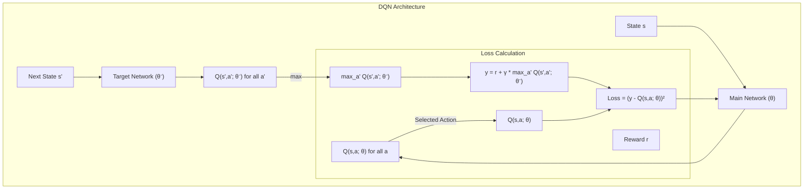

# Q-러닝과 DQN (Q-Learning & DQN)

## 1. 핵심 개념 (Core Concept)

Q-러닝(Q-Learning)은 환경에 대한 사전 정보 없이(model-free), 특정 상태(state)에서 특정 행동(action)을 했을 때의 가치(Q-value)를 반복적으로 학습하여 최적의 정책을 찾아가는 강화학습 알고리즘입니다. DQN(Deep Q-Network)은 이러한 Q-러닝에 심층 신경망(Deep Neural Network)을 결합한 것으로, Q-값을 테이블 형태가 아닌 신경망으로 근사(approximation)하여 이미지와 같이 매우 큰 상태 공간을 가진 문제도 해결할 수 있게 만든 획기적인 방법입니다.

---

## 2. 상세 설명 (Detailed Explanation)

### 2.1 Q-러닝 (Q-Learning)

Q-러닝의 핵심은 **행동 가치 함수(Action-Value Function)** `Q(s, a)`를 학습하는 것입니다. `Q(s, a)`는 상태 `s`에서 행동 `a`를 취했을 때, 그 이후부터 얻을 수 있는 누적 보상의 기댓값을 의미합니다.

알고리즘은 모든 `(s, a)` 쌍에 대한 Q값을 저장하는 Q-테이블을 유지하며, 다음 **업데이트 규칙(벨만 최적 방정식에 기반)**을 통해 Q-테이블을 점진적으로 개선합니다.

`Q(s, a) ← Q(s, a) + α * [R + γ * max_{a'} Q(s', a') - Q(s, a)]`

*   `α` (학습률, learning rate): 업데이트의 강도를 조절합니다.
*   `γ` (할인율, discount factor): 미래 보상의 가치를 조절합니다.
*   `R + γ * max_{a'} Q(s', a')`: **시간차 목표(Temporal Difference Target)**. 현재 얻은 보상 `R`과 다음 상태 `s'`에서 얻을 수 있는 최대의 미래 가치를 합한 것입니다.
*   `[ ... ]` 부분: **시간차 에러(Temporal Difference Error)**. 현재 Q값과 이상적인 목표값의 차이를 의미합니다.

Q-러닝은 에이전트가 실제로 따르는 정책(예: ε-greedy)과 Q값을 업데이트하는 데 사용하는 정책(greedy)이 다른 **오프-폴리시(Off-policy)** 알고리즘입니다. 이 덕분에 탐험(exploration)을 하면서도 최적의 정책을 학습할 수 있습니다.

### 2.2 DQN (Deep Q-Network)의 등장

Q-러닝은 상태와 행동의 개수가 적을 때는 효과적이지만, 상태 공간이 매우 커지면(예: 아타리 게임의 화면 픽셀) 모든 Q값을 저장할 Q-테이블을 만드는 것이 불가능합니다. 이를 **차원의 저주(curse of dimensionality)**라고 합니다.

DQN은 이 문제를 해결하기 위해 Q-테이블 대신, 상태 `s`를 입력받아 각 행동 `a`에 대한 Q값을 출력하는 심층 신경망 `Q(s, a; θ)`를 사용합니다. 즉, Q-함수를 신경망으로 근사하는 것입니다.

### 2.3 DQN의 핵심 아이디어

단순히 Q-러닝에 신경망을 적용하면 학습이 매우 불안정해집니다. DQN은 안정적인 학습을 위해 두 가지 핵심 기법을 도입했습니다.

1.  **경험 리플레이 (Experience Replay)**: 에이전트의 경험 `(s, a, r, s')`을 리플레이 버퍼(replay buffer)라는 메모리에 저장해두고, 학습 시에 여기서 무작위로 미니배치(mini-batch)를 샘플링하여 사용합니다. 이는 데이터 간의 시간적 상관관계(temporal correlation)를 깨뜨려 학습을 안정화하고, 데이터 효율성을 높입니다.

2.  **고정 타겟 네트워크 (Fixed Target Network)**: Q-러닝 업데이트 시, TD 타겟 `R + γ * max_{a'} Q(s', a')`을 계산하는 네트워크(타겟 네트워크)와 Q(s, a)를 업데이트하는 네트워크(메인 네트워크)를 분리합니다. 타겟 네트워크의 가중치는 일정 기간 동안 고정되고, 주기적으로 메인 네트워크의 가중치로 복사됩니다. 이는 TD 타겟 값이 매 스텝마다 흔들리는 것을 막아주어 학습 목표를 안정시켜주는 역할을 합니다.



---

## 3. 예시 (Example)

### 코드 예시 (Q-Learning)

```python
import numpy as np

# 하이퍼파라미터
alpha = 0.1
gamma = 0.9
epsilon = 0.1
num_episodes = 1000

# Q-테이블 초기화 (상태 수 x 행동 수)
q_table = np.zeros([state_space_size, action_space_size])

for i in range(num_episodes):
    state = env.reset()
    done = False
    while not done:
        # Epsilon-greedy 정책으로 행동 선택
        if np.random.uniform(0, 1) < epsilon:
            action = env.action_space.sample() # 탐험
        else:
            action = np.argmax(q_table[state]) # 활용

        next_state, reward, done, _ = env.step(action)
        
        # Q-테이블 업데이트
        old_value = q_table[state, action]
        next_max = np.max(q_table[next_state])
        
        new_value = old_value + alpha * (reward + gamma * next_max - old_value)
        q_table[state, action] = new_value
        
        state = next_state
```

### 사용 사례 (Use Case)

*   **아타리(Atari) 게임**: DQN이 처음으로 인간 수준을 뛰어넘는 성능을 보여준 분야입니다. 벽돌깨기(Breakout), 퐁(Pong) 등 다양한 고전 게임의 화면 픽셀만 보고 게임을 학습했습니다.
*   **자원 관리**: 데이터 센터의 냉각 시스템 에너지 효율을 최적화하는 데 사용되었습니다.
*   **추천 시스템**: 사용자의 행동에 따라 개인화된 추천을 제공하는 정책을 학습할 수 있습니다.

---

## 4. 예상 면접 질문 (Potential Interview Questions)

*   **Q. Q-러닝이 '오프-폴리시(Off-policy)'인 이유는 무엇인가요?**
    *   **A.** Q-러닝은 행동을 선택하는 정책(behavior policy, 예: ε-greedy)과 업데이트할 목표 Q값을 만드는 정책(target policy, 예: greedy)이 다르기 때문입니다. 즉, 실제로 탐험을 포함한 다양한 행동을 하면서도, 항상 최적의 가치(max Q)를 가정하고 학습을 진행하기 때문에 오프-폴리시입니다.
*   **Q. DQN에서 경험 리플레이(Experience Replay)와 고정 타겟 네트워크(Fixed Target Network)를 사용하는 이유는 무엇인가요?**
    *   **A.** **경험 리플레이**는 (1) 데이터 샘플 간의 시간적 상관관계를 제거하여 학습을 안정화하고, (2) 한 번의 경험을 여러 번 학습에 재사용하여 데이터 효율성을 높입니다. **고정 타겟 네트워크**는 업데이트 목표가 되는 Q-value가 매 스텝마다 흔들리는 것을 방지하여 학습 목표를 안정시켜줍니다. 이 두 가지 기법이 없으면 DQN의 학습은 매우 불안정하고 발산하기 쉽습니다.
*   **Q. DQN의 한계점은 무엇이고, 이를 개선한 알고리즘에는 어떤 것들이 있나요?**
    *   **A.** DQN은 Q-value를 과대평가(Overestimation)하는 경향이 있습니다. 이를 해결하기 위해 **더블 DQN(Double DQN)**이 제안되었습니다. 또한, 상태 가치와 행동의 어드밴티지를 분리하여 학습 효율을 높인 **듀얼링 DQN(Dueling DQN)**, 경험의 중요도에 따라 샘플링 우선순위를 둔 **우선순위 경험 리플레이(Prioritized Experience Replay)** 등이 있습니다.

---

## 5. 더 읽어보기 (Further Reading)

*   [Playing Atari with Deep Reinforcement Learning (DeepMind, 2013) - 원 논문](https://arxiv.org/abs/1312.5602)
*   [Hugging Face Deep RL Course: DQN](https://huggingface.co/learn/deep-rl-course/unit3/introduction)
*   [A Gentle Introduction to Deep Q-Learning](https://www.freecodecamp.org/news/an-introduction-to-deep-q-learning-lets-play-doom-54d02d8017d8/)