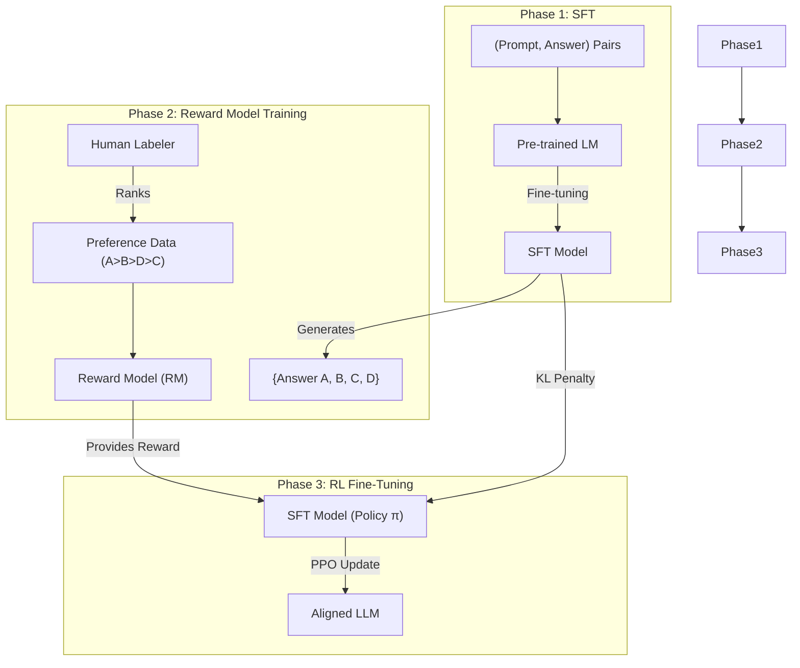

# RLHF와 DPO (RLHF & DPO)

## 1. 핵심 개념 (Core Concept)

RLHF(Reinforcement Learning from Human Feedback)는 인간의 선호도(preference) 데이터를 보상 신호로 활용하여 언어 모델을 인간의 가치와 의도에 맞게 정렬(align)하는 강력한 파인튜닝 기법입니다. DPO(Direct Preference Optimization)는 RLHF의 복잡한 다단계 프로세스를 단순화하면서도 유사하거나 더 나은 성능을 달성하는 최신 알고리즘으로, 인간 선호도 데이터를 사용하여 직접적으로 언어 모델을 최적화합니다. 이 두 기술은 ChatGPT와 같은 현대적 LLM의 성능과 안전성을 높이는 데 핵심적인 역할을 합니다.

______________________________________________________________________

## 2. 상세 설명 (Detailed Explanation)

### 2.1 RLHF (Reinforcement Learning from Human Feedback)

RLHF는 일반적으로 3단계의 파이프라인으로 구성됩니다.

**1단계: 지도 파인튜닝 (Supervised Fine-Tuning, SFT)**

- 먼저, 소수의 고품질 데이터셋(예: 사람이 작성한 질문과 답변 쌍)을 사용하여 사전 학습된 언어 모델(Pre-trained LM)을 파인튜닝합니다.
- 이 단계의 목표는 모델이 특정 도메인이나 스타일에 대한 기본적인 응답 능력을 갖추도록 하는 것입니다. 이 모델을 SFT 모델이라고 부릅니다.

**2단계: 보상 모델 학습 (Reward Model Training)**

- SFT 모델에게 동일한 프롬프트(prompt)를 여러 번 입력하여 다양한 답변을 생성하게 합니다.
- 인간 레이블러가 이 답변들을 보고 어떤 답변이 더 나은지(선호되는지) 순위를 매깁니다. (예: 답변 A > 답변 B > 답변 D > 답변 C)
- 이러한 인간 선호도 데이터를 사용하여, "좋은 답변"에 높은 점수를, "나쁜 답변"에 낮은 점수를 주는 \*\*보상 모델(Reward Model, RM)\*\*을 학습시킵니다.

**3단계: 강화학습을 통한 파인튜닝 (RL Fine-Tuning)**

- SFT 모델을 PPO(Proximal Policy Optimization)와 같은 강화학습 알고리즘으로 추가 파인튜닝합니다.
- 여기서 \*\*정책(Policy)\*\*은 언어 모델 자체이고, \*\*행동(Action)\*\*은 다음 토큰을 생성하는 것이며, \*\*환경(Environment)\*\*은 사용자 프롬프트입니다.
- 언어 모델이 생성한 답변을 2단계에서 학습한 \*\*보상 모델(RM)\*\*이 평가하여 **보상(Reward)** 점수를 계산하고, 이 보상을 최대화하는 방향으로 언어 모델의 정책을 업데이트합니다.
- 이때, 원래 SFT 모델의 분포에서 너무 멀어지지 않도록 KL 발산(KL-divergence) 페널티를 추가하여 답변의 다양성과 품질 저하를 방지합니다.

### 2.2 DPO (Direct Preference Optimization)

RLHF는 강력하지만, 보상 모델을 별도로 학습시키고 강화학습을 적용하는 과정이 복잡하고 불안정하며 많은 컴퓨팅 자원을 필요로 합니다. DPO는 이 문제를 해결하기 위해 등장했습니다.

DPO의 핵심 아이디어는 RLHF의 목표(보상 최대화)를 선호도 데이터에 대한 간단한 **분류(classification) 문제**로 변환할 수 있다는 것을 수학적으로 보인 것입니다.

- DPO는 별도의 보상 모델을 학습하거나 강화학습을 사용할 필요가 없습니다.
- 인간 선호도 데이터(`prompt`, `chosen_answer`, `rejected_answer`)를 직접 사용하여 SFT 모델을 파인튜닝합니다.
- 목적 함수는 모델이 선택된(chosen) 답변을 생성할 확률은 높이고, 거부된(rejected) 답변을 생성할 확률은 낮추도록 직접적으로 최적화합니다.
- 이는 RLHF와 동일한 최적화 목표를 가지면서도 훨씬 간단하고 안정적인 학습 과정을 제공합니다.

결과적으로 DPO는 RLHF보다 구현이 훨씬 간단하고, 하이퍼파라미터 튜닝이 쉬우며, 더 적은 자원으로도 유사하거나 더 나은 성능을 달성할 수 있어 최근 많이 채택되고 있습니다.

______________________________________________________________________

## 3. 예시 (Example)

### 사용 사례 (Use Case)

- **챗봇 및 가상 비서**: "유용하고(Helpful), 정직하며(Honest), 무해한(Harmless)" 답변을 생성하도록 모델을 정렬하는 데 사용됩니다. (예: ChatGPT, Claude, Gemini)
- **콘텐츠 생성**: 모델이 특정 스타일이나 톤(예: 전문적, 유머러스)에 맞는 글을 생성하도록 유도합니다.
- **요약 및 번역**: 인간이 더 선호하는 품질의 요약문이나 번역문을 생성하도록 모델을 개선합니다.

______________________________________________________________________

## 4. 예상 면접 질문 (Potential Interview Questions)

- **Q. RLHF가 왜 필요한가요? SFT(지도 파인튜닝)만으로는 부족한 점은 무엇인가요?**
  - **A.** SFT는 모델이 특정 작업을 수행하는 방법을 배우게 하지만, 인간이 원하는 미묘한 뉘앙스(예: 창의성, 무해성, 적절한 유머)를 가르치기 어렵습니다. 인간은 좋은 답변을 직접 쓰는 것보다 두 답변 중 어느 것이 더 나은지 비교하는 것을 훨씬 쉽고 일관성 있게 할 수 있습니다. RLHF는 이러한 인간의 비교/선호 판단을 활용하여 모델을 인간의 가치에 더 잘 부합하도록 정렬(align)할 수 있습니다.
- **Q. RLHF의 3단계에서 KL 페널티는 어떤 역할을 하나요?**
  - **A.** KL 페널티는 강화학습으로 업데이트되는 정책(언어 모델)이 원래의 SFT 모델 분포에서 너무 멀리 벗어나지 않도록 규제하는 역할을 합니다. 만약 이 페널티가 없다면, 모델은 보상 모델의 허점을 파고들어 보상 점수만 높고 실제로는 의미 없거나 이상한 텍스트(reward hacking)를 생성할 수 있습니다. KL 페널티는 답변의 다양성과 언어적 품질을 유지하는 데 필수적입니다.
- **Q. DPO가 RLHF에 비해 갖는 장점은 무엇이며, 어떤 원리로 가능한가요?**
  - **A.** DPO의 가장 큰 장점은 **단순성**과 **안정성**입니다. RLHF의 복잡한 3단계 파이프라인을 하나의 간단한 파인튜닝 단계로 통합하여 구현이 쉽고 학습이 안정적입니다. 이는 DPO가 RLHF의 보상 최대화 문제를 인간 선호도 데이터에 대한 직접적인 분류 문제로 재구성했기 때문에 가능합니다. 즉, 보상 모델 학습과 강화학습이라는 두 단계를 거치지 않고, "선택된 답변의 확률을 높이고 거부된 답변의 확률을 낮추는" 방향으로 모델을 직접 최적화하여 동일한 목표를 달성합니다.

______________________________________________________________________

## 5. 더 읽어보기 (Further Reading)

- [Direct Preference Optimization: Your Language Model is Secretly a Reward Model (DPO 원 논문)](https://arxiv.org/abs/2305.18290)
- [Hugging Face Blog: RLHF and DPO](https://huggingface.co/blog/rlhf)
- [Illustrating Reinforcement Learning from Human Feedback (Hugging Face Blog)](https://huggingface.co/blog/illustrating-rlhf)
