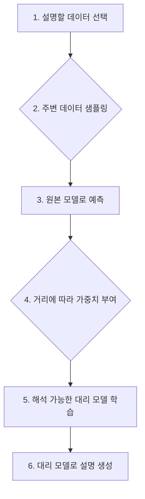

# SHAP, LIME, Grad-CAM: 대표적인 XAI 기법

## 1. 핵심 개념 (Core Concept)

SHAP, LIME, Grad-CAM은 복잡한 인공지능 모델의 예측 결과를 인간이 이해할 수 있도록 설명하는 대표적인 XAI(eXplainable AI, 설명 가능한 인공지능) 기술입니다. LIME은 특정 예측 주변을 탐색해 지역적으로 설명을 생성하고, SHAP은 게임 이론을 적용해 각 특성의 기여도를 정량적으로 계산하며, Grad-CAM은 CNN 모델이 이미지의 어떤 부분을 보고 판단했는지 시각적으로 보여줍니다. 이들은 모델의 투명성을 높여 신뢰도를 확보하고 디버깅을 용이하게 하는 데 핵심적인 역할을 합니다.

______________________________________________________________________

## 2. 상세 설명 (Detailed Explanation)

### 2.1 LIME (Local Interpretable Model-agnostic Explanations)

LIME은 어떤 블랙박스 모델이든 특정 예측 하나에 대한 이유를 "국소적(Local)"으로 설명하는 기법입니다.

- **작동 원리**: 설명하려는 데이터 포인트 주변에 여러 가상의 데이터 샘플을 생성합니다. 이 샘플들을 원래 모델로 예측한 뒤, 원본 데이터와의 거리에 따라 가중치를 부여합니다. 마지막으로, 이 가중치가 적용된 데이터셋을 사용해 단순하고 해석 가능한 모델(예: 선형 회귀)을 학습시켜, 어떤 특성이 예측에 영향을 미쳤는지 설명합니다.
- **특징**: 모델의 종류에 상관없이 적용 가능한 '모델 불특정성(Model-agnostic)'이 가장 큰 장점이지만, 샘플링 방식에 따라 설명이 달라질 수 있어 '불안정성'이라는 단점이 있습니다.

### 2.2 SHAP (SHapley Additive exPlanations)

SHAP은 협력 게임 이론의 '섀플리 값(Shapley Value)'을 사용하여 각 특성(feature)이 모델의 예측에 얼마나 기여했는지를 정확하게 측정하는 방법입니다.

- **작동 원리**: 특정 특성이 있을 때와 없을 때의 예측값 차이를 모든 가능한 특성 조합에 대해 계산하고, 그 평균적인 변화량을 해당 특성의 기여도(SHAP 값)로 산출합니다. 이를 통해 예측을 높이는(긍정적) 특성과 낮추는(부정적) 특성을 정량적으로 파악할 수 있습니다.
- **특징**: LIME보다 이론적 기반이 탄탄하여 결과의 '일관성'과 '정확성'을 보장합니다. 개별 예측에 대한 지역적 설명과 모델 전체에 대한 전역적 설명을 모두 제공할 수 있습니다.

### 2.3 Grad-CAM (Gradient-weighted Class Activation Mapping)

Grad-CAM은 CNN(합성곱 신경망)이 이미지 분류와 같은 작업을 수행할 때, 이미지의 어느 영역을 근거로 판단했는지 시각화하는 데 특화된 기술입니다.

- **작동 원리**: 모델의 마지막 합성곱 레이어에서 특정 클래스 예측에 대한 그래디언트(gradient)를 계산합니다. 이 그래디언트는 각 채널(feature map)의 중요도를 의미하며, 이를 가중치로 사용하여 채널들을 합친 뒤 히트맵(heatmap)을 생성합니다. 이 히트맵을 원본 이미지에 겹쳐 모델이 주목한 영역을 보여줍니다.
- **특징**: 모델 구조를 변경할 필요 없이 다양한 CNN 아키텍처에 적용 가능합니다. 모델의 판단 근거를 시각적으로 직접 확인할 수 있어 매우 직관적입니다.

______________________________________________________________________

## 3. 비교 (Comparison)

| 특징              | LIME                                       | SHAP                             | Grad-CAM                                |
| :---------------- | :----------------------------------------- | :------------------------------- | :-------------------------------------- |
| **주요 아이디어** | 지역적 대리 모델 (Local Surrogate Model)   | 섀플리 값 (Shapley Values)       | 클래스 활성화 맵 (Class Activation Map) |
| **적용 대상**     | 모든 모델 (Model-Agnostic)                 | 모든 모델 (Model-Agnostic)       | CNN 기반 모델                           |
| **설명 범위**     | 지역적 (Local)                             | 지역적 (Local) & 전역적 (Global) | 지역적 (Local)                          |
| **결과 일관성**   | 낮음 (샘플링에 따라 변동)                  | 높음 (이론적 보장)               | 높음                                    |
| **주요 사용처**   | 표, 텍스트, 이미지 데이터의 개별 예측 설명 | 특성 중요도 분석, 모델 전체 설명 | 이미지 분류 모델의 판단 근거 시각화     |

______________________________________________________________________

## 4. 예상 면접 질문 (Potential Interview Questions)

- **Q. LIME과 SHAP의 가장 큰 차이점은 무엇인가요?**

  - **A.** 가장 큰 차이는 이론적 기반과 결과의 일관성입니다. LIME은 데이터 주변을 샘플링하여 지역적인 선형 모델로 근사하는 휴리스틱한 접근 방식인 반면, SHAP은 게임 이론의 섀플리 값에 기반하여 각 특성의 기여도를 계산하므로 이론적으로 더 탄탄하며 결과의 일관성을 보장합니다.

- **Q. CNN 모델의 예측을 시각적으로 설명해야 할 때 어떤 기법을 사용하겠습니까? 그 이유는 무엇인가요?**

  - **A.** Grad-CAM을 사용하겠습니다. Grad-CAM은 CNN 모델이 이미지의 어떤 영역에 주목하여 예측을 내렸는지 히트맵 형태로 직접 시각화해주기 때문에, 모델의 판단 근거를 가장 직관적으로 이해할 수 있습니다. 특히 모델이 잘못된 판단을 했을 때, 어떤 부분을 보고 오해했는지 디버깅하는 데 매우 유용합니다.

- **Q. 모델의 종류에 상관없이 모든 특성의 중요도를 정량적으로 파악하고 싶을 때 가장 적합한 XAI 기법은 무엇인가요?**

  - **A.** SHAP이 가장 적합합니다. SHAP은 모델 불특정성을 가지면서도, 섀플리 값이라는 강력한 이론적 배경을 바탕으로 각 특성이 예측에 미치는 영향을 정량적인 값으로 정확하게 계산해줍니다. 또한, 개별 예측뿐만 아니라 모델 전체의 특성 중요도를 일관되게 분석할 수 있는 장점이 있습니다.

______________________________________________________________________

## 5. 더 읽어보기 (Further Reading)

- [LIME 원 논문: "Why Should I Trust You?"](https://arxiv.org/abs/1602.04938)
- [SHAP 원 논문: A Unified Approach to Interpreting Model Predictions](https://arxiv.org/abs/1705.07874)
- [Grad-CAM 원 논문: Visual Explanations from Deep Networks via Gradient-based Localization](https://arxiv.org/abs/1610.02391)
