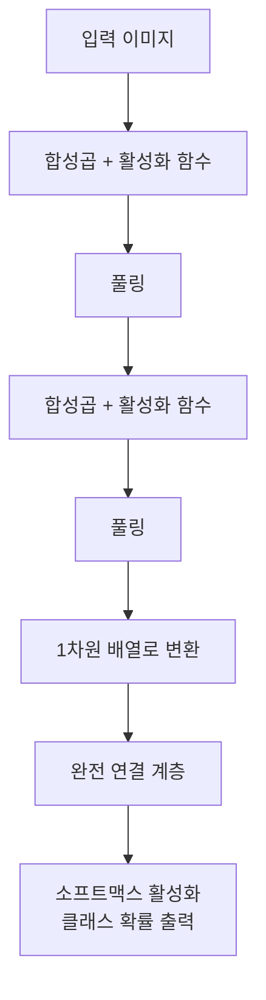

# 이미지 분류 (Image Classification)

## 1. 핵심 개념 (Core Concept)

이미지 분류는 주어진 이미지를 미리 정의된 카테고리 중 하나로 할당하는 컴퓨터 비전의 핵심 작업입니다. 예를 들어, 시스템은 이미지를 보고 '고양이', '개', 또는 '자동차'와 같은 레이블을 붙입니다. 이 기술은 이미지의 시각적 내용을 이해하고 해석하는 모델의 능력을 기반으로 합니다.

---

## 2. 상세 설명 (Detailed Explanation)

이미지 분류의 목표는 컴퓨터가 픽셀 데이터의 원시 배열에서 의미 있는 패턴을 인식하도록 학습시키는 것입니다. 이 프로세스는 일반적으로 합성곱 신경망(CNN)을 사용하여 수행됩니다. CNN은 이미지의 계층적 특징을 자동으로 학습하도록 설계된 특수한 유형의 딥러닝 모델입니다.

### 2.1 합성곱 신경망 (CNN) 아키텍처

CNN은 일반적으로 여러 유형의 레이어를 순차적으로 쌓아 구성됩니다.

1.  **합성곱 계층 (Convolutional Layer)**: 필터(커널)를 사용하여 입력 이미지에서 에지, 질감, 색상과 같은 저수준 특징을 감지합니다. 이 필터는 이미지 전체에 적용되어 특징 맵(Feature Map)을 생성합니다.

2.  **풀링 계층 (Pooling Layer)**: 특징 맵의 공간적 차원을 줄여 계산 복잡성을 낮추고, 모델이 위치 변화에 대해 좀 더 강건해지도록 만듭니다. 가장 일반적인 유형은 최대 풀링(Max Pooling)입니다.

3.  **완전 연결 계층 (Fully Connected Layer)**: 이전 레이어에서 학습된 특징을 기반으로 최종 분류를 수행합니다. 이 계층의 출력은 각 클래스에 대한 확률 분포입니다.



---

## 3. 예시 (Example)

### 코드 예시 (Python with TensorFlow/Keras)

다음은 TensorFlow Keras를 사용하여 Fashion MNIST 데이터셋으로 간단한 CNN 모델을 훈련시키는 예제입니다.

```python
import tensorflow as tf
from tensorflow.keras import datasets, layers, models

# 데이터셋 로드 및 전처리
(train_images, train_labels), (test_images, test_labels) = datasets.fashion_mnist.load_data()
train_images, test_images = train_images / 255.0, test_images / 255.0
train_images = train_images[..., tf.newaxis]
test_images = test_images[..., tf.newaxis]

# CNN 모델 구축
model = models.Sequential([
    layers.Conv2D(32, (3, 3), activation='relu', input_shape=(28, 28, 1)),
    layers.MaxPooling2D((2, 2)),
    layers.Conv2D(64, (3, 3), activation='relu'),
    layers.MaxPooling2D((2, 2)),
    layers.Conv2D(64, (3, 3), activation='relu'),
    layers.Flatten(),
    layers.Dense(64, activation='relu'),
    layers.Dense(10)
])

# 모델 컴파일 및 훈련
model.compile(optimizer='adam',
              loss=tf.keras.losses.SparseCategoricalCrossentropy(from_logits=True),
              metrics=['accuracy'])

model.fit(train_images, train_labels, epochs=10, 
          validation_data=(test_images, test_labels))

# 모델 평가
test_loss, test_acc = model.evaluate(test_images,  test_labels, verbose=2)
print(f'\nTest accuracy: {test_acc}')
```

### 사용 사례 (Use Case)

*   **의료 영상 분석**: MRI 또는 X-ray 스캔에서 질병을 탐지합니다.
*   **자율 주행 자동차**: 교통 표지판과 보행자를 인식합니다.
*   **콘텐츠 필터링**: 소셜 미디어에서 부적절한 콘텐츠를 자동으로 식별합니다.
*   **농업**: 위성 이미지를 기반으로 작물 질병을 식별합니다.

---

## 4. 예상 면접 질문 (Potential Interview Questions)

*   **Q. 이미지 분류와 객체 탐지의 주요 차이점은 무엇인가요?**
    *   **A.** 이미지 분류는 전체 이미지에 단일 레이블을 할당하는 것을 목표로 합니다(예: '이것은 고양이 사진입니다'). 반면, 객체 탐지는 이미지 내의 여러 객체의 위치를 찾고 각각에 레이블을 지정합니다(예: '여기 고양이가 있고, 저기 개가 있습니다').

*   **Q. CNN에서 풀링 레이어의 목적은 무엇인가요?**
    *   **A.** 풀링 레이어는 특징 맵의 공간적 크기를 점진적으로 줄여 모델의 파라미터 수와 계산량을 줄이는 역할을 합니다. 또한, 객체의 위치에 약간의 변화가 있어도 모델이 동일한 특징을 감지할 수 있도록 도와 과적합을 제어하는 데 기여합니다.

*   **Q. 데이터 증강(Data Augmentation)이란 무엇이며 이미지 분류에서 왜 중요한가요?**
    *   **A.** 데이터 증강은 회전, 크기 조절, 자르기, 뒤집기 등과 같은 변환을 적용하여 기존 학습 이미지를 인위적으로 늘리는 기술입니다. 이는 모델이 더 다양한 데이터에 노출되도록 하여 일반화 성능을 향상시키고 과적합을 줄이는 데 도움이 되기 때문에, 특히 학습 데이터가 제한적일 때 중요합니다.

---

## 5. 더 읽어보기 (Further Reading)

*   [TensorFlow 이미지 분류 튜토리얼](https://www.tensorflow.org/tutorials/images/classification)
*   [CS231n: Convolutional Neural Networks for Visual Recognition](http://cs231n.github.io/convolutional-networks/)
*   [Keras Documentation: CNNs](https://keras.io/guides/convolutional_neural_network_guides/)